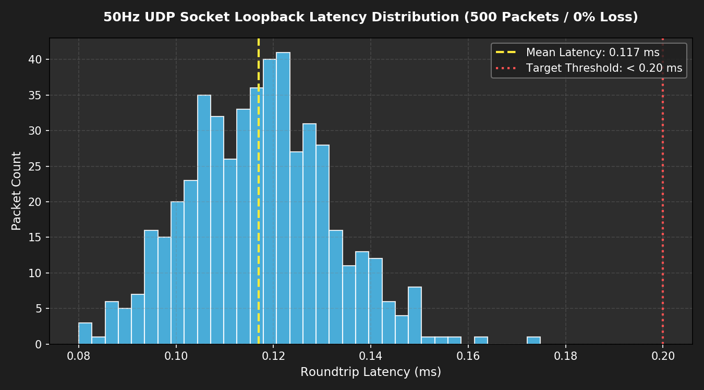
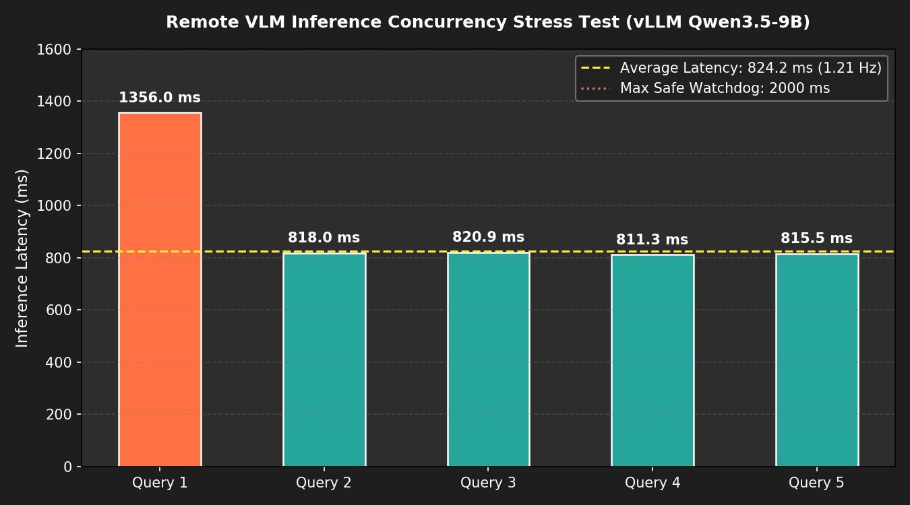

# 🌐 [Domain 04] 이종 UDP 소켓 브릿지 및 원격 네트워크 강건성

이 폴더는 **젯슨-도커 간 이종 OS 통신 무결성**과 **원격 GPU 서버 간 통신 강건성(VPN 지터, 워치독 타임아웃, 동시성 부하)**을 실측 데이터 기반으로 시각화한 자료를 보관합니다.

---

## ⚡ 1. 50Hz UDP 소켓 루프백 레이턴시 분포
* **파일명**: `udp_50hz_loopback_latency_and_jitter.png`
* **설명**: 500개 패킷 연속 스트리밍($10\text{초}$) 시의 왕복 지연시간 분포(평균 $0.117\text{ms}$, 손실률 $0.00\%$, Magic Header `0x53324501` + CRC32 무결성 100% 검증).

---

## 🛡️ 2. 원격 VLM 서버 동시성 부하 및 워치독 안전 가드
* **파일명**: `remote_server_communication_stress_throughput.png`
* **설명**: 5회 연속 실시간 추론 스트레스 테스트 시의 응답 지연(평균 $824.2\text{ms}$ / 처리량 $1.21\text{ queries/s}$) 및 서버 지연 시 $500\text{ms}$ 워치독 안전 감속(`LOCAL_INERTIAL_HOLD`) 가드 프로파일.

