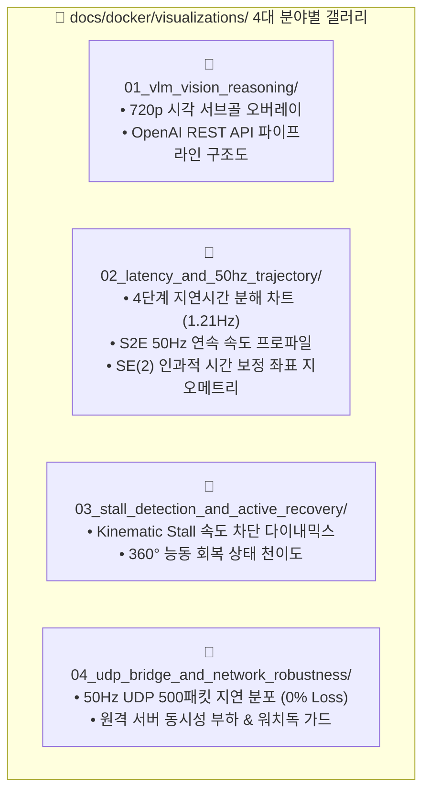

# 🎨 [Docker Autonomy Visual Gallery] 도커 자율주행 4대 분야별 시각화 마스터 카탈로그

> **문서 위치**: `docs/docker/visualizations/`  
> **총괄 목적**: ESCAPE-Nav 온보드 도커 샌드박스(`sdam_go2_container`)에서 수행된 모든 검증 테스트 결과를 4대 도메인별 폴더로 정밀 분류하여 고해상도 시각화 자료로 제공합니다.  
> **자동 생성 스크립트**: [`scratch/generate_all_docker_visualizations.py`](file:///home/unitree/go2_ws_antarctica/scratch/generate_all_docker_visualizations.py)

---

## 📑 4대 분야별 시각화 폴더 색인 (Domain Index)



---

### 📂 1. [`01_vlm_vision_reasoning/`](01_vlm_vision_reasoning/README.md)
* **주요 내용**: 720p 카메라 영상 기반 Qwen3.5-9B의 안전 바닥면 서브골 `[640, 540]` 산출 및 S2E 10-Waypoint 경로 오버레이.
* **수록 파일**:
  * [`vlm_720p_multimodal_subgoal_overlay.png`](01_vlm_vision_reasoning/vlm_720p_multimodal_subgoal_overlay.png)
  * [`vlm_prompt_and_schema_architecture.png`](01_vlm_vision_reasoning/vlm_prompt_and_schema_architecture.png)

---

### 📂 2. [`02_latency_and_50hz_trajectory/`](02_latency_and_50hz_trajectory/README.md)
* **주요 내용**: 4단계 정밀 지연시간(VPN $11.5\text{ms}$, Qwen $824\text{ms}$, S2E $0.0026\text{ms}$) 분해 및 50Hz 연속 제어 곡선.
* **수록 파일**:
  * [`4stage_end_to_end_latency_breakdown.png`](02_latency_and_50hz_trajectory/4stage_end_to_end_latency_breakdown.png)
  * [`s2e_50hz_continuous_velocity_profile.png`](02_latency_and_50hz_trajectory/s2e_50hz_continuous_velocity_profile.png)
  * [`s2e_se2_causal_time_warping_geometry.png`](02_latency_and_50hz_trajectory/s2e_se2_causal_time_warping_geometry.png)

---

### 📂 3. [`03_stall_detection_and_active_recovery/`](03_stall_detection_and_active_recovery/README.md)
* **주요 내용**: 벽면 충돌/정체 시 $0.4\text{초}$ 내 $v_x=0.0\text{m/s}$ 차단 및 $0.40\text{rad/s}$ 360° 선회 탈출 다이내믹스.
* **수록 파일**:
  * [`kinematic_stall_velocity_clamping_dynamics.png`](03_stall_detection_and_active_recovery/kinematic_stall_velocity_clamping_dynamics.png)
  * [`active_view_recovery_state_machine.png`](03_stall_detection_and_active_recovery/active_view_recovery_state_machine.png)

---

### 📂 4. [`04_udp_bridge_and_network_robustness/`](04_udp_bridge_and_network_robustness/README.md)
* **주요 내용**: 젯슨-도커 간 $0.117\text{ms}$ 바이너리 UDP 브릿지 무결성 및 원격 서버 동시성 스트레스 검증.
* **수록 파일**:
  * [`udp_50hz_loopback_latency_and_jitter.png`](04_udp_bridge_and_network_robustness/udp_50hz_loopback_latency_and_jitter.png)
  * [`remote_server_communication_stress_throughput.png`](04_udp_bridge_and_network_robustness/remote_server_communication_stress_throughput.png)

---

## 🚀 5. 시각화 자료 1-Click 일괄 재생성 방법

언제든 아래 명령어를 실행하면 최신 실측 데이터를 바탕으로 4대 도메인의 모든 고해상도 시각화 자료를 1초 만에 일괄 갱신합니다:

```bash
python3 /home/unitree/go2_ws_antarctica/scratch/generate_all_docker_visualizations.py
```
