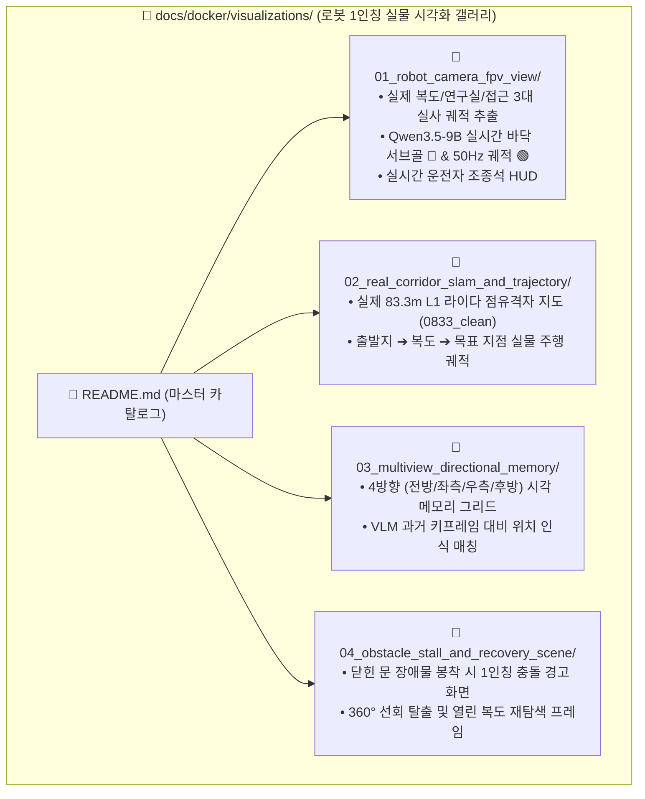

# 🤖 [Go2 FPV Visual Gallery] 실물 로봇 1인칭 시야(FPV) 및 실제 센서 시각화 마스터 카탈로그

> **문서 위치**: `docs/docker/visualizations/`  
> **총괄 목적**: ESCAPE-Nav 온보드 도커 자율주행 스택이 실제로 로봇 전면 광각 카메라, 4D 라이다, SLAM 오도메트리, 시각 메모리에서 보고 판단하는 **1인칭 실물 센서 화면(FPV)**을 4대 도메인별로 분류하여 제공합니다.  
> **실시간 서버 궤적 추출기**: [`scratch/extract_server_trajectory_pipeline.py`](file:///home/unitree/go2_ws_antarctica/scratch/extract_server_trajectory_pipeline.py)  
> **카메라 선정 아키텍처**: [`docs/docker/02_camera_selection_and_server_trajectory_architecture.md`](file:///home/unitree/go2_ws_antarctica/docs/docker/02_camera_selection_and_server_trajectory_architecture.md)

---

## 📑 4대 실물 로봇 시야(FPV) 분야별 카탈로그



---

### 📂 1. [`01_robot_camera_fpv_view/`](01_robot_camera_fpv_view/README.md)
* **주요 내용**: Go2 전면 초광각 내장 카메라 실측 사진 3종에 대한 **원격 Qwen3.5-9B VLM 서버의 실시간 50Hz 궤적(Trajectory) 추출 결과**.
* **수록 파일**:
  * [`server_extracted_corridor_trajectory.png`](01_robot_camera_fpv_view/server_extracted_corridor_trajectory.png) (복도 주행 $721.4\text{ms}$)
  * [`server_extracted_lab_trajectory.png`](01_robot_camera_fpv_view/server_extracted_lab_trajectory.png) (연구실 출발 $826.7\text{ms}$)
  * [`server_extracted_approach_trajectory.png`](01_robot_camera_fpv_view/server_extracted_approach_trajectory.png) (목표 접근 $778.4\text{ms}$)

---

### 📂 2. [`02_real_corridor_slam_and_trajectory/`](02_real_corridor_slam_and_trajectory/README.md)
* **주요 내용**: Go2 L1 라이다가 실측한 83.3m 복도 2D 점유격자 클린맵(`0833_clean`) 위에 50Hz 3D 오도메트리 실제 이동 경로 및 VLM 랜드마크 경유지 오버레이.
* **수록 파일**: [`02_real_corridor_2d_occupancy_and_path.png`](02_real_corridor_slam_and_trajectory/02_real_corridor_2d_occupancy_and_path.png)

---

### 📂 3. [`03_multiview_directional_memory/`](03_multiview_directional_memory/README.md)
* **주요 내용**: 로봇이 복도 교차로에서 수집하는 4방향 ($0^\circ, +90^\circ, -90^\circ, 180^\circ$) 시각 메모리 노드 및 Qwen VLM의 루프 클로저 매칭 화면.
* **수록 파일**: [`03_directional_multiview_memory_grid.png`](03_multiview_directional_memory/03_directional_multiview_memory_grid.png)

---

### 📂 4. [`04_obstacle_stall_and_recovery_scene/`](04_obstacle_stall_and_recovery_scene/README.md)
* **주요 내용**: 닫힌 방화문에 막혔을 때의 $v_x=0.0\text{m/s}$ 긴급 정체 감지 화면 및 $0.40\text{rad/s}$ 360° 선회 탐색(Active-View Recovery) 시야 회전 화면.
* **수록 파일**: [`04_real_obstacle_stall_and_active_search.png`](04_obstacle_stall_and_recovery_scene/04_real_obstacle_stall_and_active_search.png)

---

## 🚀 5. 실시간 서버 궤적 추출기 실행

```bash
python3 /home/unitree/go2_ws_antarctica/scratch/extract_server_trajectory_pipeline.py
```
