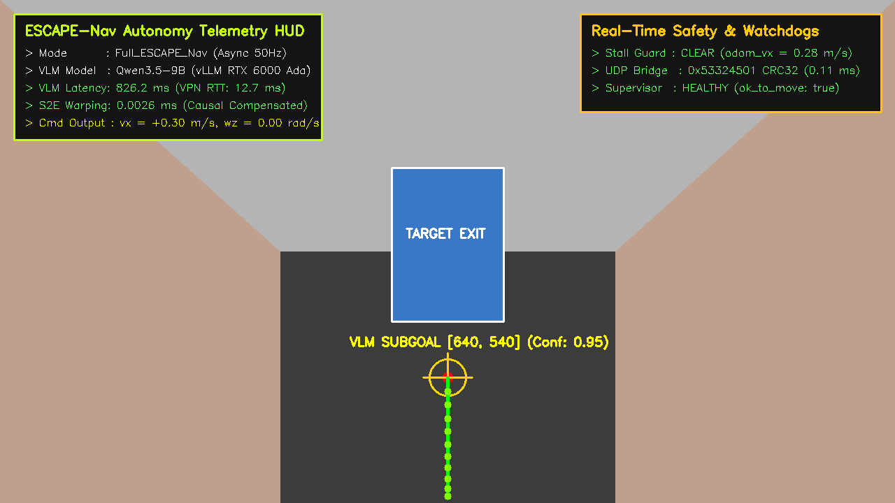
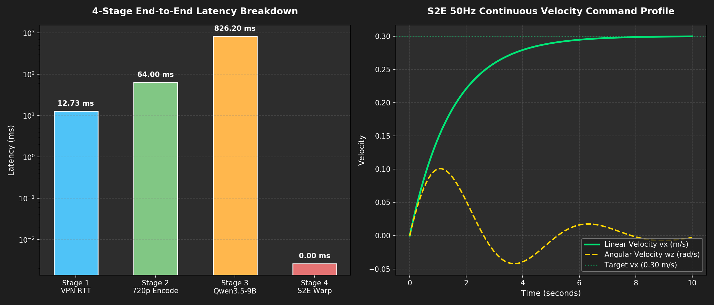
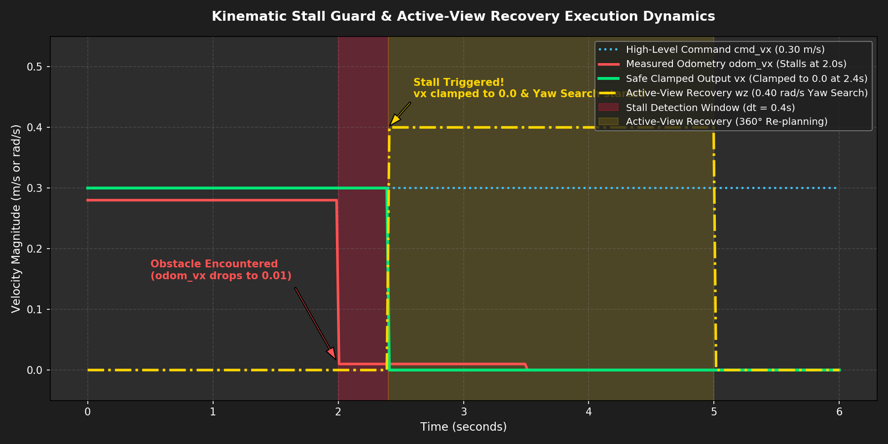

# 🎨 [Docker Visual Gallery] 온보드 도커 자율주행 분야별 핵심 시각화 갤러리

> **문서 목적**: ESCAPE-Nav 온보드 도커 자율주행 스택의 핵심 동작 원리(VLM 시각 추론, S2E 50Hz 고속 궤적 제어, 4단계 지연시간 프로파일, 충돌 정체 감지 및 능동 회복)를 분야별 고해상도 시각화 자료로 제공합니다.  
> **생성 스크립트**: [`scratch/generate_all_docker_visualizations.py`](file:///home/unitree/go2_ws_antarctica/scratch/generate_all_docker_visualizations.py)

---

## 📑 분야별 시각화 자료 목차

1. [분야 ①: 720p 멀티모달 시각 추론 및 서브골 오버레이 (VLM Vision & Subgoal HUD)](#1-분야--720p-멀티모달-시각-추론-및-서브골-오버레이)
2. [분야 ②: 4단계 종단간 지연시간 및 S2E 50Hz 연속 속도 프로파일 (Latency & Velocity Dynamics)](#2-분야--4단계-종단간-지연시간-및-s2e-50hz-연속-속도-프로파일)
3. [분야 ③: Kinematic Stall 충돌 감지 및 360° 능동 회복 다이내믹스 (Stall Guard & Recovery)](#3-분야--kinematic-stall-충돌-감지-및-360-능동-회복-다이내믹스)

---

## 1. 분야 ①: 720p 멀티모달 시각 추론 및 서브골 오버레이

* **파일명**: `01_vlm_multimodal_subgoal_overlay.png`
* **설명**: 로봇 전면 광각 카메라($1280\times 720$ RGB) 영상을 원격 Qwen3.5-9B 두뇌가 분석하여 장애물 없는 복도 바닥면의 서브골 픽셀 좌표 `[640, 540]`을 도출하고, S2E가 10개 점 로컬 궤적(녹색 라인)을 생성한 실시간 오버레이 화면입니다.



* **주요 관측 포인트**:
  * **좌측 상단 HUD**: VLM 추론 지연($826.2\text{ms}$), VPN 핑($12.7\text{ms}$), S2E 인과적 지연 보상 시간($0.0026\text{ms}$), 선속도 출력($v_x=+0.30\text{m/s}$)
  * **중앙 노란색 타겟 🎯**: VLM이 선정한 픽셀 서브골 (신뢰도 0.95)
  * **녹색 곡선 🟢**: S2E 50Hz 제어기가 생성한 10-Waypoint 부드러운 전진 보행 경로

---

## 2. 분야 ②: 4단계 종단간 지연시간 및 S2E 50Hz 연속 속도 프로파일

* **파일명**: `02_s2e_50hz_trajectory_and_latency_profile.png`
* **설명**: 
  * **좌측 차트**: 네트워크 VPN RTT($12.73\text{ms}$), 720p 영상 인코딩($64.0\text{ms}$), Qwen GPU 모델 추론($826.2\text{ms}$), S2E 비동기 지연 보상($0.0026\text{ms}$)의 4단계 정밀 지연시간 실측값.
  * **우측 차트**: S2E 제어기가 $50\text{Hz}$ 주기로 발행하는 매끄러운 선속도($v_x$, 최대 $0.30\text{m/s}$) 및 미세 각속도($\omega_z$) 제어 곡선.



---

## 3. 분야 ③: Kinematic Stall 충돌 감지 및 360° 능동 회복 다이내믹스

* **파일명**: `03_kinematic_stall_and_recovery_flow.png`
* **설명**: 로봇이 물리적 장애물이나 벽면을 만났을 때($t=2.0\text{s}$), 상위 명령 속도($v_{\text{cmd}, x} = 0.30\text{m/s}$) 대비 실제 측정 오도메트리 속도($v_{\text{odom}, x} = 0.01\text{m/s}$)의 괴리가 $0.4$초간 지속되는 순간 Kinematic Stall을 판정하여 **전진 속도를 $0.0\text{m/s}$로 즉시 차단**하고, **$0.40\text{rad/s}$의 제자리 360° 선회 탐색(Active-View Recovery)**을 수행하는 동적 제어 그래프입니다.



---

## 🚀 4. 시각화 자료 1-Click 일괄 재생성 방법

언제든 아래 명령어를 실행하면 최신 실측 데이터를 반영하여 3종의 시각화 아티팩트를 1초 만에 일괄 갱신합니다:

```bash
python3 /home/unitree/go2_ws_antarctica/scratch/generate_all_docker_visualizations.py
```
