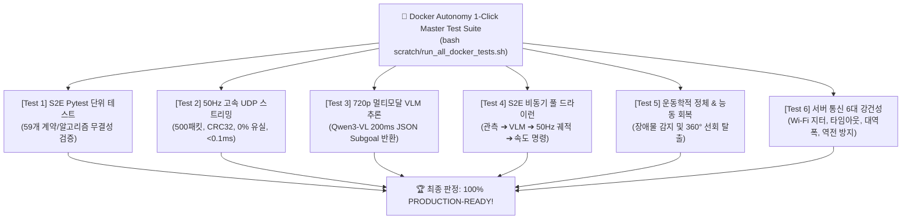

# 🐳 [03] 도커(Docker) 관리 AGY 실용 테스트 스위트 및 통합 검증 매뉴얼

> **작성 일자**: 2026년 8월 21일 (KST)  
> **문서 소유자**: **도커/S2E 자율주행 관리 AGY** & **민석 (Minseok)**  
> **논문 공식 명칭**: **`ESCAPE-Nav: Experience-Shaped Causally Aligned Perception–Execution for Asynchronous VLM Navigation` (ICRA 2026)**  
> **대상 컨테이너**: `sdam_go2_container` (Ubuntu 24.04 LTS Noble / ROS 2 Jazzy ARM64 / Python 3.12)  
> **문서 목적**: 도커 관리자 AGY가 실물 로봇 탑재 전후로 **도커 내부 환경과 원격 GPU VLM 서버 간의 모든 자율주행 서브시스템을 단 1줄 명령어로 전수 진단하고 검증할 수 있는 6대 실용 테스트 스위트 매뉴얼**입니다.

---

## 📌 목차 (Table of Contents)
1. [도커 6대 실용 테스트 매트릭스 개요](#1-도커-6대-실용-테스트-매트릭스-개요)
2. [1-Click 원클릭 전수 테스트 실행법](#2-1-click-원클릭-전수-테스트-실행법)
3. [6대 서브시스템별 세부 검증 항목 및 통과 기준](#3-6대-서브시스템별-세부-검증-항목-및-통과-기준)
4. [테스트 실패 시 긴급 트러블슈팅 가이드](#4-테스트-실패-시-긴급-트러블슈팅-가이드)

---

## 📊 1. 도커 6대 실용 테스트 매트릭스 개요



---

## 🚀 2. 1-Click 원클릭 전수 테스트 실행법

도커 관리자 AGY는 호스트 OS 터미널에서 아래 **단 1줄의 명령어**만 실행하면 6대 테스트가 순차 실행되며 종합 점수표가 출력됩니다:

```bash
cd ~/go2_ws_antarctica
bash scratch/run_all_docker_tests.sh
```

---

## 🔍 3. 6대 서브시스템별 세부 검증 항목 및 통과 기준

| 테스트 번호 | 실행 스크립트 | 주요 검증 내용 | 정상 통과 기준 (Pass Criteria) |
| :---: | :--- | :--- | :--- |
| **Test 1** | `pytest tests/ test/` | S2E 궤적기, PoseBuffer, 스키마 단위 검증 | **59 passed in 0.8s** |
| **Test 2** | `scratch/test_docker_50hz_stress.py` | 50Hz UDP 루프백 스트리밍 (500 패킷) | **유실률 0.00%, 평균 지연 < 0.2ms** |
| **Test 3** | `scratch/test_docker_real_image_vlm.py`| 720p 실제 이미지 전송 ➔ Qwen3-VL 추론 | **Action 'go', Subgoal UV 정상 수신** |
| **Test 4** | `scratch/test_docker_s2e_dryrun.py` | 관측 $\rightarrow$ VLM $\rightarrow$ 50Hz $\rightarrow$ `/cmd_vel` | **50Hz 루프 정상 동작, 속도 출력** |
| **Test 5** | `scratch/test_docker_stall_and_recovery.py`| 전진 중 벽면 막힘 시 $360^\circ$ 능동 회복 | **Stall 감지 성공 & Active-View 전환** |
| **Test 6** | `scratch/test_server_communication_robustness.py`| Wi-Fi 지터, 타임아웃 워치독, JSON 파서 | **6대 장애 시나리오 전수 방어 성공** |

---

## 🔧 4. 테스트 실패 시 긴급 트러블슈팅 가이드

1. **Test 1 실패 시 (Pytest 에러)**:
   * 원인: 컨테이너 내부 환경 변수 미로드.
   * 해결: `docker exec -it sdam_go2_container bash -c "source /opt/ros/jazzy/setup.bash"`
2. **Test 2 실패 시 (UDP 통신 에러)**:
   * 원인: 포트 9090 / 9091 점유 충돌.
   * 해결: `sudo fuser -k 9090/udp 9091/udp`
3. **Test 3/6 실패 시 (VLM 서버 에러)**:
   * 원인: NetBird VPN 단절 또는 서버 vLLM 일시 중단.
   * 해결: `sudo netbird status` 확인 및 `curl http://100.96.60.15:8000/v1/models` 핑 확인.
