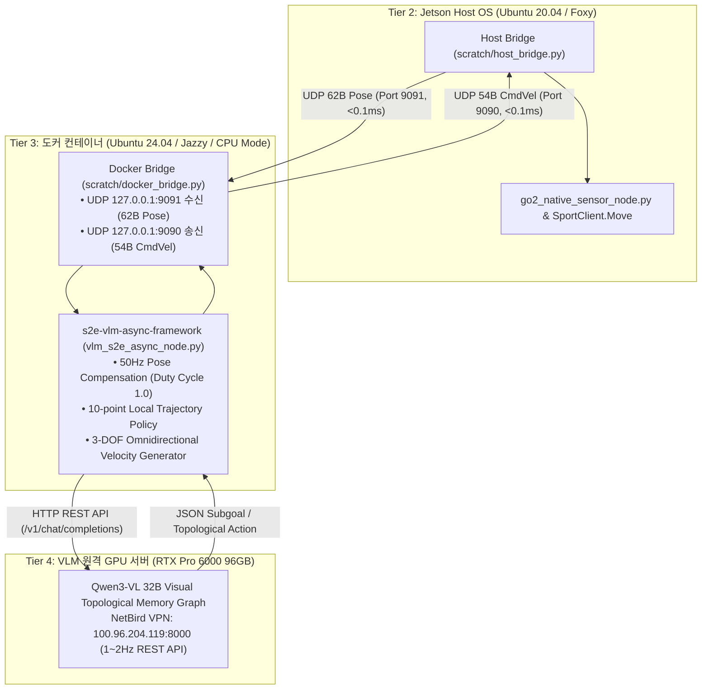

# 🐳 [Docker Plan] Tier 3: 도커 샌드박스 자율주행 및 AI 프레임워크 개요

> **환경**: Ubuntu 24.04 LTS / ROS 2 Jazzy ARM64 / Python 3.12 (CPU Mode)  
> **컨테이너 식별자**: `sdam_go2_container` (네트워크: `--net=host --privileged`)  
> **담당 연구원**: 상준 (Sangjun - VLM & S2E Lead)  
> **논문 공식 명칭**: **`ESCAPE-Nav: Experience-Shaped Causally Aligned Perception–Execution for Asynchronous VLM Navigation` (ICRA 2026)**  

---

## 📌 1. 도커 샌드박스의 핵심 역할 (Role & Architecture)

본 도커 샌드박스는 Jetson Orin NX 호스트 OS(Ubuntu 20.04 / Foxy / CUDA 11.4)와의 **OS/패키지 버전 충돌을 원천 격리**하면서, 고수준 AI 자율주행 정책(S2E)과 초거대 비전-언어 모델(Qwen3-VL 32B)을 실시간으로 연동하기 위해 설계되었습니다:



---

## ⚡ 2. 3대 핵심 컴포넌트

1. **초저지연 소켓 브릿지 ([`scratch/docker_bridge.py`](file:///home/unitree/go2_ws_antarctica/scratch/docker_bridge.py))**:
   - 호스트의 RTAB-Map LIVO 50Hz 포즈를 UDP 9091 포트로 수신하여 `/s2e/odometry/pose`로 발행.
   - S2E 제어기가 생성한 속도 명령(`/s2e/controller/command`)을 Magic Header(`0x53324501`) 및 CRC16 무결성 검증 패킷으로 포장하여 호스트 UDP 9090 포트로 송신.
2. **S2E 비동기 궤적 생성기 ([`s2e-vlm-async-framework`](file:///home/unitree/go2_ws_antarctica/s2e-vlm-async-framework))**:
   - VLM의 $1\sim2\text{Hz}$ 느린 추론 지연을 **실시간 포즈 보상($T_{delta} = T_{curr}^{-1} \cdot T_{vlm}$)**으로 보정하여 Stop-and-Go 없는 **100% 연속 주행(Duty Cycle 1.0)** 구현.
3. **원격 VLM 비주얼 메모리 그래프 클라이언트**:
   - NetBird VPN 망(`100.96.204.119:8000`)을 통해 Qwen3-VL 32B에 전면 영상 스냅샷을 전송하고 고차원 탐색 Subgoal을 수신.

---

## 🚀 3. 도커 가동 명령어

```bash
# 도커 컨테이너 기동 및 S2E 자율주행 노드 실행
docker start sdam_go2_container
docker exec -it sdam_go2_container bash -c "cd /workspace/go2_ws_antarctica/s2e-vlm-async-framework && python3 src/vlm_s2e_async_node.py"
```
