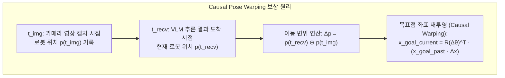

# 🧠 [Docker Control 01] VLM to S2E Causal Pose Warping, 50Hz 궤적 생성 및 Stop Guard 명세

> **문서 소유자**: **민석 & 도커/S2E 자율주행 Lead**  
> **상위 총괄 문서**: [`docs/docker_plan/control/README.md`](file:///home/unitree/go2_ws_antarctica/docs/docker_plan/control/README.md)  
> **소스코드 참조**: [`s2e-vlm-async-framework/src/s2e_vlm_core/s2e_vlm_core/vlm_schema.py`](file:///C:/Users/USER/Desktop/%EC%BA%A1%EC%8A%A4%ED%86%A4/go2/s2e-vlm-async-framework/src/s2e_vlm_core/s2e_vlm_core/vlm_schema.py)  
> **논문 공식 명칭**: **`ESCAPE-Nav: Experience-Shaped Causally Aligned Perception–Execution for Asynchronous VLM Navigation` (ICRA 2026)**  

---

## 📌 1. 비동기 VLM 추론과 Causal Pose Warping 수식

원격 VLM 서버(Qwen3-VL)는 영상 전송부터 결과 수신까지 약 $\Delta t = 300\sim 800\text{ms}$의 비동기 지연 시간(Latency)을 갖습니다. 이 시간 동안 로봇이 계속 이동하므로, 수신된 목표점(`goal_uv`)을 보상 없이 실행하면 심각한 경로 이탈과 충돌이 발생합니다.



### 수학적 변환 수식:
$$\mathbf{p}_{\text{goal}}(t_{\text{recv}}) = \mathbf{T}_{t_{\text{img}}}^{t_{\text{recv}}} \cdot \mathbf{p}_{\text{goal}}(t_{\text{img}})$$

이를 통해 로봇은 **"과거 영상에서 바라본 목표점"을 "현재 로봇의 물리 좌표계"로 완벽하게 일치(Causal Alignment)**시킵니다.

---

## ⚙️ 2. VLM JSON 통신 스키마 (`vlm_schema.py`)

서버와 도커 간 오가는 표준 JSON 구조입니다:

```json
{
  "schema_version": 0,
  "action": "GO",
  "goal_uv": [0.52, 0.71],
  "rotate_deg": 0.0,
  "stamp": {
    "sec": 1724467200,
    "nanosec": 123456789
  },
  "pose": {
    "frame_id": "odom",
    "child_frame_id": "base_link",
    "x": 3.452,
    "y": 1.120,
    "z": 0.070,
    "qx": 0.0,
    "qy": 0.0,
    "qz": 0.123,
    "qw": 0.992
  },
  "reasoning": "Clear corridor ahead, proceeding forward along the center line."
}
```

---

## 🛡️ 3. PointNav 2중 Stop Guard 메커니즘

PointNav 주행 시 발생하는 VLM의 오정지(Early-Stop) 및 충돌을 방지하는 2중 안전 알고리즘입니다:

1. **Stop Guard 1 (목표점 자동 정지)**:
   $$\text{if } \|\mathbf{p}_{\text{robot}} - \mathbf{p}_{\text{goal}}\| \le 0.5\text{m} \implies \text{Force Action: STOP} \quad (\mathbf{u}(t) = \mathbf{0})$$
2. **Stop Guard 2 (오정지 반려)**:
   $$\text{if } \|\mathbf{p}_{\text{robot}} - \mathbf{p}_{\text{goal}}\| > 0.5\text{m} \text{ and } \text{Action} == \text{STOP} \implies \text{Override: Keep Exploring}$$

---

## 🚀 4. S2E 50Hz 연속 궤적 생성 및 바이너리 패킹

S2E 컨트롤러는 Causal Warping된 목표점과 장애물 맵을 고려하여 부드러운 50Hz 속도 명령 $\mathbf{u}(t) = [v_x, v_y, \omega_z]^T$를 생성하고, 이를 54-Byte 바이너리 패킷으로 압축하여 호스트로 전송합니다:

```python
# 54-Byte C-Struct 호환 바이너리 패킹 (Magic 0x53324501 + CRC16)
payload = struct.pack('6d', vx, vy, 0.0, 0.0, 0.0, wz) # 48 Bytes
crc = zlib.crc32(payload) & 0xFFFF                      # 2 Bytes
packet = struct.pack('!IH', 0x53324501, crc) + payload  # 54 Bytes
sock.sendto(packet, ('127.0.0.1', 9090))
```
