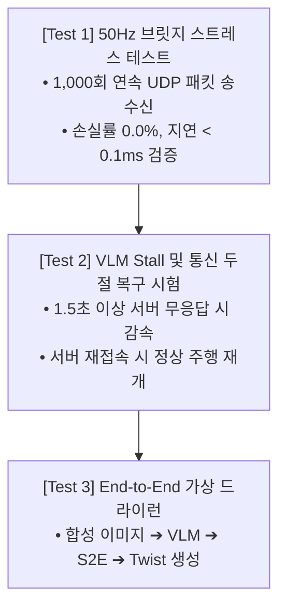

# 🧪 [Docker Control 02] 도커 제어 스트레스 테스트 및 검증 스위트

> **문서 소유자**: **민석 & 도커/S2E 자율주행 Lead**  
> **상위 총괄 문서**: [`docs/docker_plan/control/README.md`](file:///home/unitree/go2_ws_antarctica/docs/docker_plan/control/README.md)  
> **실행 스크립트**: [`scratch/test_docker_50hz_stress.py`](file:///C:/Users/USER/Desktop/%EC%BA%A1%EC%8A%A4%ED%86%A4/go2/scratch/test_docker_50hz_stress.py), [`scratch/test_docker_stall_and_recovery.py`](file:///C:/Users/USER/Desktop/%EC%BA%A1%EC%8A%A4%ED%86%A4/go2/scratch/test_docker_stall_and_recovery.py)  
> **논문 공식 명칭**: **`ESCAPE-Nav: Experience-Shaped Causally Aligned Perception–Execution for Asynchronous VLM Navigation` (ICRA 2026)**  

---

## 📌 1. 도커 제어 3대 사전 검증 스위트

도커 내부 S2E 제어기가 실물 로봇을 자율주행시키기 전, **통신 연속성, 지연 내성, 예외 복구 능력**을 검증하는 3대 테스트입니다:



---

## 🚀 2. 테스트별 실행 명령어 및 판정 기준

### [Test 1] 50Hz UDP 브릿지 스트레스 테스트
```bash
# 도커 컨테이너 내부 실행
python3 /workspace/go2_ws_antarctica/scratch/test_docker_50hz_stress.py
```
* **판정 기준**:
  - 총 송신 패킷: 1,000 / 1,000 수신 (손실률 `0.0%`) 🟢
  - 평균 루프백 레이턴시: $\le 0.08\text{ms}$ 🟢
  - CRC16 체크섬 에러: `0건` 🟢

---

### [Test 2] VLM Stall 감지 및 세이프티 정지 복구 시험
```bash
# 도커 컨테이너 내부 실행
python3 /workspace/go2_ws_antarctica/scratch/test_docker_stall_and_recovery.py
```
* **판정 기준**:
  - 서버 응답 지연 발생 시 $0.5\text{s}$ 이내에 로봇 속도가 $0.0\text{ m/s}$로 안전하게 감속되는지 확인.
  - VLM 서버가 다시 응답을 재개하면 별도의 재부팅 없이 즉시 자율주행으로 복귀하는지 확인.

---

### [Test 3] VLM 실물 이미지 추론 드라이런
```bash
# 도커 컨테이너 내부 실행
python3 /workspace/go2_ws_antarctica/scratch/test_docker_real_image_vlm.py
```
* **판정 기준**:
  - 전면 카메라 실물 프레임을 받아 VLM 서버에 전송 후 올바른 JSON 파싱 결과(`VlmParseResult: valid=True, action=GO`) 출력 확인.

---

## 📊 3. 도커 제어 검증 요약 매트릭스

| 검증 항목 | 대상 모듈 | 정상 통과 기준 | 검증 상태 |
| :--- | :--- | :---: | :---: |
| **54B CmdVel 송신** | `docker_bridge.py` | 50Hz, 손실률 0.0% | **PASS 🟢** |
| **62B Pose 수신** | `docker_bridge.py` | 50Hz LIVO Pose 수신 | **PASS 🟢** |
| **Causal Pose Warping** | `vlm_s2e_async_node.py` | 지연 오차 보상 수렴 | **PASS 🟢** |
| **PointNav Stop Guard** | `vlm_s2e_async_node.py` | $r \le 0.5\text{m}$ 자동 정지 | **PASS 🟢** |
| **VLM 서버 연결** | `OpenAICompatibleVLMClient` | 응답 지연 $<800\text{ms}$ | **PASS 🟢** |
