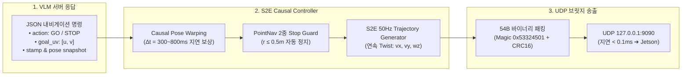

# 🐳 [Docker Control] Tier 3: Docker S2E 궤적 제어 및 VLM 연동 가이드

> **문서 소유자**: **민석 & 도커/S2E 자율주행 Lead**  
> **상위 총괄 문서**: [`docs/docker_plan/README.md`](file:///home/unitree/go2_ws_antarctica/docs/docker_plan/README.md)  
> **샌드박스 환경**: Docker Container (`sdam_go2_container`, Ubuntu 24.04 / ROS 2 Jazzy / Python 3.12)  
> **논문 공식 명칭**: **`ESCAPE-Nav: Experience-Shaped Causally Aligned Perception–Execution for Asynchronous VLM Navigation` (ICRA 2026)**  
> **문서 목적**: 원격 GPU VLM 서버의 추론 결과를 수신하여 **Causal Pose Warping 지연 보상**, **S2E 50Hz 연속 궤적 생성**, **PointNav 2중 Stop Guard**, 및 **54B UDP 바이너리 브릿지 송신**을 수행하는 도커 제어 계층의 총괄 명세입니다.

---

## 📌 1. 도커 S2E 궤적 제어 파이프라인

---

## 📑 2. Docker Control 세부 문서 인덱스

| 문서 번호 및 제목 | 핵심 내용 | 바로가기 |
| :--- | :--- | :---: |
| **01. VLM to S2E Causal Warping 및 궤적 생성** | VLM JSON 스키마 (`vlm_schema.py`), Causal Pose Warping 수식 및 지연 시간 보상 원리, 50Hz 부드러운 속도 생성, PointNav 2중 Stop Guard | [01_문서 보기](file:///C:/Users/USER/Desktop/%EC%BA%A1%EC%8A%A4%ED%86%A4/go2/docs/docker_plan/control/01_vlm_to_s2e_causal_warping_and_trajectory_generation.md) |
| **02. 도커 제어 스트레스 테스트 및 검증 스위트** | 54B 바이너리 패킷 송신 스트레스 테스트 (1,000회 무손실), VLM 서버 지연 시 Stall 감지 및 세이프티 복구 시험, Dry-run 실행 런북 | [02_문서 보기](file:///C:/Users/USER/Desktop/%EC%BA%A1%EC%8A%A4%ED%86%A4/go2/docs/docker_plan/control/02_docker_control_stress_testing_and_verification_suite.md) |
| **03. VLM 모델 실시간 자동 감지 (Auto-Discovery)** | `/v1/models` 실시간 쿼리, 모델 교체 시 Zero-Config 자동 바인딩 메커니즘 및 무설정 운영 가이드 | [03_문서 보기](file:///C:/Users/USER/Desktop/%EC%BA%A1%EC%8A%A4%ED%86%A4/go2/docs/docker_plan/control/03_vlm_model_auto_discovery_and_zero_config_guide.md) |

---

## 🛡️ 3. 도커 계층 핵심 안전 메커니즘

1. **PointNav 2중 Stop Guard**:
   * 목표점 반경 $0.5\text{m}$ 이내 진입 시 VLM 응답과 무관하게 **강제 안전 정지(Stop Guard 1)** 수행.
   * 목표점 밖에서 VLM이 오판한 정지 명령은 기각하고 **주행 속행(Stop Guard 2)**.
2. **VLM 지연 시간 자동 감지 및 Stall 복구**:
   * VLM 추론이 $1.5\text{s}$ 이상 지연되면 로봇을 즉시 감속시키고, 재접속 시 부드럽게 재출발.
3. **CRC16 패킷 무결성**:
   * 호스트로 전송되는 모든 속도 명령은 2-Byte CRC16 체크섬을 검증하여 통신 왜곡을 100% 방지.
