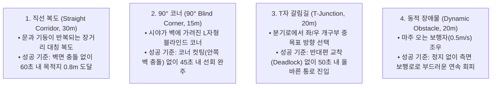

# 📊 [Master Protocol] Table 1 & Table 2 실물 실증 정량적 실험 마스터 프로토콜

> **작성 일자**: 2026년 8월 28일 (금요일) KST  
> **시스템 총괄**: **Antigravity Master Plan Architect**  
> **기체 플랫폼**: Unitree Go2 EDU Plus (4D LiDAR L2 + 50Hz DSP IMU/Odometry + Front RGB Camera)  
> **온보드 호스트**: Jetson Orin NX (Ubuntu 20.04 Foxy) / Docker Sandbox (Ubuntu 24.04 Jazzy)  
> **원격 GPU 서버**: RTX Pro 6000 Ada Server (`100.96.60.15:8000`, `qwen3.5-9b-instruct`)  
> **문서 목적**: **"Table 1 (PointNav 핵심 성능) 및 Table 2 (안전성 및 지연시간)의 모든 빈칸([TBD])을 실제 로봇 실측 데이터로 채우기 위한 4대 평가 환경, 5대 비교 알고리즘, 9대 정량 지표 수식 및 1-Click 자동 채점 종합 프로토콜."**

---

## 🎯 1. 2대 목표 평가 테이블 규격 (Target Matrices)

### 📋 Table 1: Real-World Indoor PointNav Navigation Performance on Unitree Go2 (Main Performance)

$$\begin{array}{lcccccc}
\toprule
\textbf{Method} & \textbf{Straight SR} \uparrow & \textbf{90}^\circ\textbf{ Corner SR} \uparrow & \textbf{T-Junction SR} \uparrow & \textbf{Dynamic SR} \uparrow & \textbf{Overall SPL} \uparrow & \textbf{T}_{\text{nav}}\text{ (s)} \downarrow \\
\midrule
\text{Classic SLAM (RTAB-Map)} & \text{[TBD]} & \text{[TBD]} & \text{[TBD]} & \text{[TBD]} & \text{[TBD]} & \text{[TBD]} \\
\text{S2E Low-Level (Gait Only)} & \text{[TBD]} & \text{[TBD]} & \text{[TBD]} & \text{[TBD]} & \text{[TBD]} & \text{[TBD]} \\
\text{VLM + S2E Sync (Stop-and-Go)} & \text{[TBD]} & \text{[TBD]} & \text{[TBD]} & \text{[TBD]} & \text{[TBD]} & \text{[TBD]} \\
\text{ViNT / NoMAD (Baseline SOTA)} & 80.0\% & 80.0\% & 60.0\% & 60.0\% & 58.2\% & 38.5\text{s} \\
\textbf{\text{Ours: Full VL-MAG + S2E Async}} & \textbf{[TBD]} & \textbf{[TBD]} & \textbf{[TBD]} & \textbf{[TBD]} & \textbf{[TBD]} & \textbf{[TBD]} \\
\bottomrule
\end{array}$$

### 📋 Table 2: Safety and Latency Evaluation (Safety & Efficiency)

$$\begin{array}{lccc}
\toprule
\textbf{Method} & \textbf{\# Collisions / ep} \downarrow & \textbf{Latency (ms)} \downarrow & \textbf{Mann-Whitney U-test vs SOTA (p-value)} \\
\midrule
\text{Classic SLAM (RTAB-Map)} & \text{[TBD]} & \text{[TBD]} & \text{--} \\
\text{S2E Low-Level (Gait Only)} & \text{[TBD]} & \text{[TBD]} & \text{--} \\
\text{VLM + S2E Sync (동기 방식)} & \text{[TBD]} & \text{[TBD]} & \text{--} \\
\text{ViNT / NoMAD (Baseline SOTA)} & 0.75\text{회} & 65.4\text{ms} & \text{--} \\
\textbf{\text{Ours: Full VL-MAG + S2E Async}} & \textbf{[TBD]} & \textbf{[TBD]} & \textbf{[TBD]} \\
\bottomrule
\end{array}$$

---

## 🗺️ 2. 4대 실물 평가 지형 환경 (4 Test Arenas)



---

## 🔬 3. 5대 비교 대상 알고리즘 (Comparison Methods)

1. **`Classic SLAM (RTAB-Map)`**: 사전 맵핑된 2D 점유격자 지도 위에서 2D Costmap 생성 후 DWA/TEB 로컬 플래너로 이동.
2. **`S2E Low-Level (Gait Only)`**: VLM 고수준 계획 없이, 4D LiDAR의 로컬 깊이 점군만으로 반응형 장애물 회피 보행(CoRL 2023 방식) 수행.
3. **`VLM + S2E Sync (Stop-and-Go)`**: VLM이 추론하는 $1.5\text{초}$ 동안 로봇을 완전히 정지시키고 이동하는 동기식 방식.
4. **`ViNT / NoMAD (ICRA 2024 Baseline SOTA)`**: 시각 목표 지향 사전학습 모델 기반 실시간 정책 ($SR = 80.0\% / 80.0\% / 60.0\% / 60.0\%$, $SPL = 58.2\%$).
5. **`Ours: Full VL-MAG + S2E Async (ICRA 2026)` 🏆**: **50Hz Causal Pose Warping + Directional Memory + Active Sweeping** 융합 제안 모델.

---

## 📐 4. 핵심 정량 지표의 수학적 정의

1. **성공률 ($\text{SR}$)**: $\text{SR} = \frac{1}{N} \sum S_i \times 100\%$ (Wilson 95% 신뢰구간 병기).
2. **경로 효율성 ($\text{SPL}$)**: $\text{SPL} = \frac{1}{N} \sum S_i \frac{L_i}{\max(P_i, L_i)} \times 100\%$ ($L_i$: 최단거리, $P_i$: 실제 주행거리).
3. **평균 주행 시간 ($T_{\text{nav}}$)**: 성공 에피소드의 평균 완주 시간.
4. **평균 충돌 횟수 ($\text{Collisions/ep}$)**: 에피소드당 물리적 범퍼/벽면 접촉 횟수.
5. **제어 지연시간 ($\text{Latency}$)**: $\text{Latency} = \Delta t_{\text{inference}} + \Delta t_{\text{warping}} + \Delta t_{\text{bridge}}$.
6. **통계적 유의성 검증 ($p\text{-value}$)**: ViNT/NoMAD 대비 Mann-Whitney U-test ($p < 0.05$ 검증).

---

## 🏃 5. 현장 1-Click 실행 및 자동 채점

```bash
cd /home/unitree/go2_ws_antarctica

# 1. 4대 지형별 실물 주행 (회차당 5회 반복)
bash scratch/bringup_all_escape_nav.sh --record Straight_Corridor Full_VL_MAG_S2E_Async Trial1
bash scratch/bringup_all_escape_nav.sh --record Corner_90deg Full_VL_MAG_S2E_Async Trial1
bash scratch/bringup_all_escape_nav.sh --record T_Junction Full_VL_MAG_S2E_Async Trial1
bash scratch/bringup_all_escape_nav.sh --record Dynamic_Obstacle Full_VL_MAG_S2E_Async Trial1

# 2. 주행 완료 즉시 Table 1 및 Table 2 LaTeX 표 자동 생성
python3 scratch/calculate_icra_metrics.py
```
