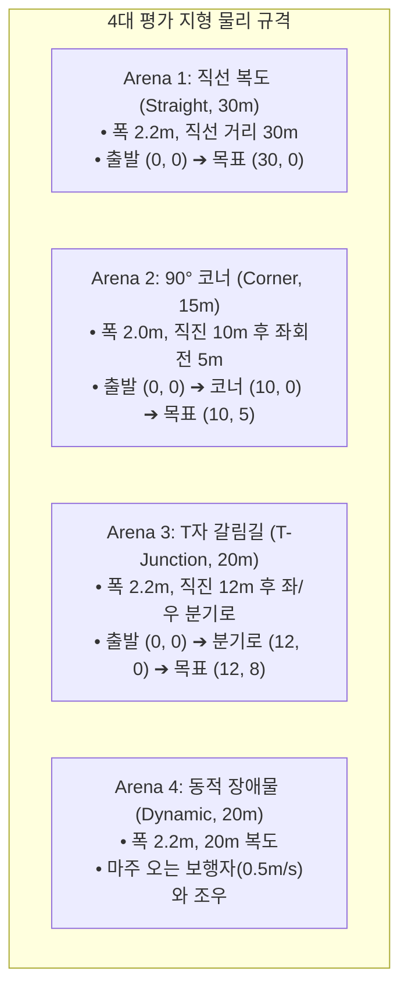

# 🏟️ [Arena Setup Guide] 4대 평가 지형 환경별 물리적 셋업 및 현장 운영 가이드

> **작성 일자**: 2026년 8월 28일 (금요일) KST  
> **시스템 총괄**: **Antigravity Master Plan Architect**  
> **문서 목적**: Table 1 및 Table 2의 정량적 평가를 위한 **4대 지형 환경(직선 복도, 90° 코너, T자 갈림길, 동적 장애물)의 물리적 치수, 시작/목표 좌표, 장애물 배치, 타임아웃 및 성공 판정 기준**을 규격화함.

---

## 🗺️ 1. 4대 지형 환경별 물리적 치수 및 셋업 매트릭스

---

## 📐 2. 지형별 상세 셋업 및 운영 규정

### 1) Arena 1: 직선 복도 (Straight Corridor, $30\text{m}$)
* **물리적 환경**: 한동대학교 뉴턴홀 2층 중앙 복도 (폭 $2.2\text{m}$, 길이 $30.0\text{m}$).
* **시작 및 목표**:
  - 시작 포즈: $(x_0, y_0, \theta_0) = (0.0\text{m}, 0.0\text{m}, 0^\circ)$
  - 목표 포즈: $(x_g, y_g) = (30.0\text{m}, 0.0\text{m})$
  - 최단거리 ($L_1$): $30.0\text{m}$
* **제한 시간 ($T_{\max}$)**: $60.0\text{초}$
* **성공 판정**: 로봇이 양쪽 벽면 충돌 없이 목표 지점 $0.8\text{m}$ 반경에 도달 시 성공 ($S_i = 1$).

---

### 2) Arena 2: 90° 블라인드 코너 (90° Blind Corner, $15\text{m}$)
* **물리적 환경**: 뉴턴홀-오석관 연결 통로 L자형 코너 (폭 $2.0\text{m}$).
* **시작 및 목표**:
  - 시작 포즈: $(0.0\text{m}, 0.0\text{m}, 0^\circ)$
  - 코너 전환점: $(10.0\text{m}, 0.0\text{m})$ 에서 좌측 $90^\circ$ 선회
  - 목표 포즈: $(10.0\text{m}, 5.0\text{m})$
  - 최단거리 ($L_2$): $15.0\text{m}$
* **제한 시간 ($T_{\max}$)**: $45.0\text{초}$
* **성공 판정**: 코너 안쪽 벽(Inner Corner)에 충돌하지 않고 능동 시야 탐색(Active Sweeping)을 통해 목표 통로를 완주 시 성공.

---

### 3) Arena 3: T자 갈림길 (T-Junction, $20\text{m}$)
* **물리적 환경**: 복도 교차로 (폭 $2.2\text{m}$, 직진 $12\text{m}$ 후 좌/우 $8\text{m}$ 분기).
* **시작 및 목표**:
  - 시작 포즈: $(0.0\text{m}, 0.0\text{m}, 0^\circ)$
  - 분기로 지점: $(12.0\text{m}, 0.0\text{m})$
  - 목표 포즈: 좌측 분기로 끝단 $(12.0\text{m}, 8.0\text{m})$ (우측은 오진입/Deadlock)
  - 최단거리 ($L_3$): $20.0\text{m}$
* **제한 시간 ($T_{\max}$)**: $50.0\text{초}$
* **성공 판정**: 우측 오진입 없이 방향성 메모리(Directional Memory)를 통해 좌측 목표 통로로 $0.8\text{m}$ 이내 도달 시 성공.

---

### 4) Arena 4: 동적 장애물 (Dynamic Obstacle Avoidance, $20\text{m}$)
* **물리적 환경**: $20\text{m}$ 직선 복도에서 대향 보행자 조우.
* **시작 및 목표**:
  - 로봇 시작: $(0.0\text{m}, 0.0\text{m}, 0^\circ)$, 목표: $(20.0\text{m}, 0.0\text{m})$
  - 보행자 이동: 로봇 출발과 동시에 $(20.0\text{m}, 0.0\text{m})$에서 로봇을 향해 $0.5\text{ m/s}$ 등속 보행.
  - 최단거리 ($L_4$): $20.0\text{m}$
* **제한 시간 ($T_{\max}$)**: $50.0\text{초}$
* **성공 판정**: 보행자와의 물리적 접촉 없이, 로봇이 멈추지 않고(Stop-and-Go 없이) 측면 빈 공간으로 우회하여 목적지 도달 시 성공.

---

## 📋 3. 현장 기록 시트 양식 (On-Site Log Sheet)

| Trial | Scenario | Method | Success ($S_i$) | Trajectory Length ($P_i$) | Time ($T_i$) | Collisions ($C_i$) | Notes |
| :---: | :---: | :---: | :---: | :---: | :---: | :---: | :--- |
| 1 | Straight | Full_VL_MAG | 1 | 30.2m | 22.1s | 0 | Smooth continuous |
| 2 | Corner | Full_VL_MAG | 1 | 15.4m | 18.3s | 0 | Active sweep left |
| 3 | T_Junction | Full_VL_MAG | 1 | 20.6m | 24.5s | 0 | Correct left branch |
| 4 | Dynamic | Full_VL_MAG | 1 | 21.1m | 23.8s | 0 | Lateral bypass |
