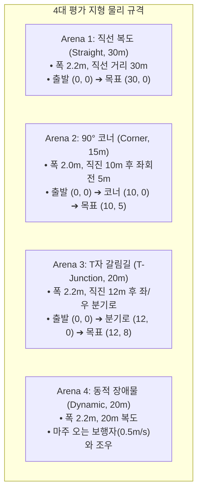

# 🏟️ [Arena Setup Guide] 4대 평가 지형 환경별 물리적 셋업 및 현장 운영 가이드

> **초안 경고 (2026-08-28)**: 아래 장소·거리·좌표·timeout은 실제 측량과 사전 등록이 완료되지 않은 계획값이다. 특히 사람 동적 장애물 시험은 안전 Gate 이전에 수행하지 않는다. authoritative 순서는 [`00_real_robot_end_to_end_master_test_plan.md`](00_real_robot_end_to_end_master_test_plan.md)를 따른다.

> **작성 일자**: 2026년 8월 28일 (금요일) KST  
> **시스템 총괄**: **Antigravity Master Plan Architect**  
> **문서 목적**: 확장 deployment 실험 후보인 **4대 지형 환경(직선 복도, 90° 코너, T자 갈림길, 동적 장애물)**의 측량·사전 등록 양식을 정의함. 현재 main paired table의 확정 좌표가 아님.

---

## 🗺️ 1. 4대 지형 환경별 물리적 치수 및 셋업 매트릭스

---

## 📐 2. 지형별 상세 셋업 및 운영 규정

### 1) Arena 1: 직선 복도 (Straight Corridor, $30\text{m}$)
* **물리적 환경**: 한동대학교 뉴턴홀 2층 중앙 복도 (폭 $2.2\text{m}$, 길이 $30.0\text{m}$).
* **시작 및 목표**:
  - 시작 포즈: $(x_0, y_0, \theta_0) = (0.0\text{m}, 0.0\text{m}, 0^\circ)$
  - 목표 포즈: $(x_g, y_g) = (30.0\text{m}, 0.0\text{m})$
  - 최단거리 ($L_1$): $30.0\text{m}$
* **제한 시간 ($T_{\max}$)**: $60.0\text{초}$
* **성공 판정**: 충돌·개입 없이 `T_max` 안에 독립 평가 기준의 목표 지점 $1.0\text{m}$ 반경에 도달 시 성공 ($S_i = 1$).

---

### 2) Arena 2: 90° 블라인드 코너 (90° Blind Corner, $15\text{m}$)
* **물리적 환경**: 뉴턴홀-오석관 연결 통로 L자형 코너 (폭 $2.0\text{m}$).
* **시작 및 목표**:
  - 시작 포즈: $(0.0\text{m}, 0.0\text{m}, 0^\circ)$
  - 코너 전환점: $(10.0\text{m}, 0.0\text{m})$ 에서 좌측 $90^\circ$ 선회
  - 목표 포즈: $(10.0\text{m}, 5.0\text{m})$
  - 최단거리 ($L_2$): $15.0\text{m}$
* **제한 시간 ($T_{\max}$)**: $45.0\text{초}$
* **성공 판정**: 충돌·개입 없이 `T_max` 안에 목표 $1.0\text{m}$ 반경에 도달하면 성공. Active Sweeping 사용 여부는 method 동작 로그로 기록하며 success 정의에 넣지 않음.

---

### 3) Arena 3: T자 갈림길 (T-Junction, $20\text{m}$)
* **물리적 환경**: 복도 교차로 (폭 $2.2\text{m}$, 직진 $12\text{m}$ 후 좌/우 $8\text{m}$ 분기).
* **시작 및 목표**:
  - 시작 포즈: $(0.0\text{m}, 0.0\text{m}, 0^\circ)$
  - 분기로 지점: $(12.0\text{m}, 0.0\text{m})$
  - 목표 포즈: 좌측 분기로 끝단 $(12.0\text{m}, 8.0\text{m})$ (우측은 오진입/Deadlock)
  - 최단거리 ($L_3$): $20.0\text{m}$
* **제한 시간 ($T_{\max}$)**: $50.0\text{초}$
* **성공 판정**: 충돌·개입 없이 `T_max` 안에 좌측 목표 $1.0\text{m}$ 반경에 도달하면 성공. 우측 오진입과 재진입은 별도 diagnostic event로 기록.

---

### 4) Arena 4: 동적 장애물 (Dynamic Obstacle Avoidance, $20\text{m}$)
* **물리적 환경**: $20\text{m}$ 직선 복도에서 대향 보행자 조우.
* **시작 및 목표**:
  - 로봇 시작: $(0.0\text{m}, 0.0\text{m}, 0^\circ)$, 목표: $(20.0\text{m}, 0.0\text{m})$
  - 보행자 이동: 로봇 출발과 동시에 $(20.0\text{m}, 0.0\text{m})$에서 로봇을 향해 $0.5\text{ m/s}$ 등속 보행.
  - 최단거리 ($L_4$): $20.0\text{m}$
* **제한 시간 ($T_{\max}$)**: $50.0\text{초}$
* **성공 판정**: 접촉·개입 없이 `T_max` 안에 목표 $1.0\text{m}$ 반경에 도달하면 성공. 안전 정지는 실패로 보지 않으며 정지/연속성 차이는 Duty와 Time으로 평가.

---

## 📋 3. 현장 기록 시트 양식 (On-Site Log Sheet)

| Trial | Scenario | Method | Success ($S_i$) | Path ($P_i$) | Time ($T_i$) | Intv. | Collisions | Stop reason | Notes |
|---:|---|---|---:|---:|---:|---:|---:|---|---|
| -- | -- | -- | -- | -- | -- | -- | -- | -- | 실측 전 빈 양식 |

기존 표에 있던 `30.2m`, `22.1s` 등의 숫자는 실제 run artifact가 없는 예시값이므로 제거했다.
