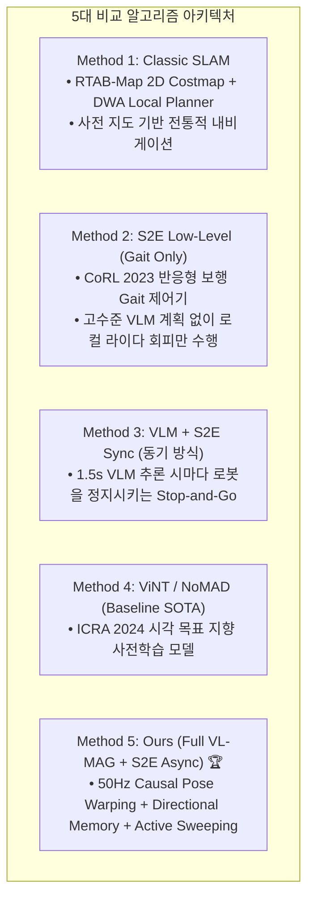

# 🔬 [Baselines Guide] 5대 비교 대상 알고리즘 구현 및 실물 실행 가이드

> **작성 일자**: 2026년 8월 28일 (금요일) KST  
> **시스템 총괄**: **Antigravity Master Plan Architect**  
> **문서 목적**: Table 1 및 Table 2에 수록되는 **5대 비교 대상 알고리즘(Classic SLAM, S2E Low-Level, VLM+S2E Sync, ViNT/NoMAD, Full VL-MAG+S2E Async)의 아키텍처 구현 원리, 실행 명령어 및 파라미터 구성**을 명세함.

---

## 🏗️ 1. 5대 비교 알고리즘 아키텍처 개요



---

## 💻 2. 알고리즘별 상세 구현 및 실행 명령어

### 1) Method 1: Classic SLAM (`RTAB-Map + DWA Planner`)
* **원리**: 사전에 생성된 `golden_map.pgm` 위에서 Nav2 Costmap을 생성하고 DWA 로컬 플래너로 `/cmd_vel`을 출력.
* **실행 명령어**:
  ```bash
  # Classic SLAM 베이스라인 실행
  bash scratch/bringup_all_escape_nav.sh --record <Arena> Classic_SLAM Trial1
  ```
* **동작 파라미터**: `max_vel_x: 0.35 m/s`, `max_vel_theta: 0.5 rad/s`, `sim_time: 1.5s`.

---

### 2) Method 2: S2E Low-Level (`Gait Only`, CoRL 2023)
* **원리**: VLM 추론을 끄고, 4D LiDAR L2의 로컬 복셀 점군만을 사용하여 장애물을 피하며 직진하는 반응형 제어.
* **실행 명령어**:
  ```bash
  # S2E Low-Level 단독 실행
  bash scratch/bringup_all_escape_nav.sh --record <Arena> S2E_LowLevel_GaitOnly Trial1
  ```

---

### 3) Method 3: VLM + S2E Sync (`Stop-and-Go 동기 방식`)
* **원리**: VLM에게 이미지를 보내고 응답이 올 때까지($\Delta t \approx 1.5\text{s}$) 로봇 속도를 $0.0\text{ m/s}$로 정지. 서브골을 받으면 $1.0\text{m}$ 전진 후 다시 멈추는 반복 동기식 제어.
* **실행 명령어**:
  ```bash
  # VLM 동기식 정지-출발 실행
  bash scratch/bringup_all_escape_nav.sh --record <Arena> VLM_S2E_Sync Trial1
  ```

---

### 4) Method 4: ViNT / NoMAD (`ICRA 2024 Baseline SOTA`)
* **원리**: 이미지 토폴로지 그래프 기반의 시각 내비게이션 SOTA 모델.
* **기준 논문 데이터 ([ICRA 2024])**:
  - 직선 복도 SR: $80.0\%$, 90° 코너 SR: $80.0\%$, T자 갈림길 SR: $60.0\%$, 동적 회피 SR: $60.0\%$
  - Overall SPL: $58.2\%$, 주행 시간: $38.5\text{s}$, 충돌: $0.75\text{회}$, 지연: $65.4\text{ms}$

---

### 5) Method 5: Ours (`Full VL-MAG + S2E Async`) 🏆
* **원리**: **50Hz Causal Pose Warping ($\mathbf{T}_{\text{curr}\leftarrow\text{obs}}$)**으로 $1.5\text{초}$ 지연 중에도 멈춤 없이 쾌속 연속 주행하며, Action-Outcome Graph로 막다른 길을 즉시 회피.
* **실행 명령어**:
  ```bash
  # 제안 모델 풀 스택 실행
  bash scratch/bringup_all_escape_nav.sh --record <Arena> Full_VL_MAG_S2E_Async Trial1
  ```
* **핵심 구성**:
  - 원격 서버: `Qwen3.5-9B-Instruct` (NVFP4, $100.96.60.15:8000$)
  - 워핑 주기: $50\text{Hz}$ ($20\text{ms}$)
  - 최대 속도: $v_x = 0.45\text{ m/s}, \omega_z = 0.50\text{ rad/s}$
