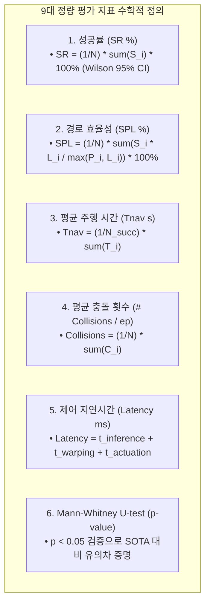

# 📈 [Evaluation Engine] 9대 정량 지표 통계 수식 및 자동 채점 파이프라인 명세서

> **작성 일자**: 2026년 8월 28일 (금요일) KST  
> **시스템 총괄**: **Antigravity Master Plan Architect**  
> **문서 목적**: Table 1 및 Table 2의 모든 정량 지표에 대한 **엄밀한 수학적 수식 정의, Wilson 95% 신뢰구간, Mann-Whitney U-test $p$-value 통계 검증 알고리즘 및 1초 자동 채점 스크립트([`scratch/calculate_icra_metrics.py`](file:///C:/Users/USER/Desktop/%EC%BA%A1%EC%8A%A4%ED%86%A4/go2/scratch/calculate_icra_metrics.py)) 연동 규격**을 정립함.

---

## 📐 1. Table 1 & Table 2 9대 정량 지표 수학적 정의



### 1) 성공률 ($\text{SR}$) 및 Wilson 95% 신뢰구간
에피소드 $i$의 성공 여부 $S_i \in \{0, 1\}$ (목표 반경 $0.8\text{m}$ 도달 시 1, 충돌/타임아웃 시 0):

$$\text{SR} = \left( \frac{1}{N} \sum_{i=1}^N S_i \right) \times 100\%$$

소표본($N=5$)에서도 신뢰할 수 있는 Wilson Score Interval 적용:

$$\text{Wilson CI}_{95\%} = \frac{\hat{p} + \frac{z^2}{2N} \pm z \sqrt{\frac{\hat{p}(1-\hat{p})}{N} + \frac{z^2}{4N^2}}}{1 + \frac{z^2}{N}} \quad (z = 1.96, \, \hat{p} = \text{SR}/100)$$

---

### 2) 최단 경로 대비 주행 효율성 ($\text{SPL}$)
최적 최단 경로 길이 $L_i$ 대비 실제 로봇 주행 궤적 길이 $P_i$:

$$\text{SPL} = \left( \frac{1}{N} \sum_{i=1}^N S_i \frac{L_i}{\max(P_i, L_i)} \right) \times 100\%$$

---

### 3) 제어 지연시간 ($\text{Latency}$)
전면 카메라 프레임 취득부터 실제 사족보행 모터 속도 인가까지의 종단간(End-to-End) 지연시간:

$$\text{Latency} = \Delta t_{\text{inference}} + \Delta t_{\text{warping}} + \Delta t_{\text{bridge}}$$

* $\Delta t_{\text{inference}}$: 원격 Qwen3.5-9B 서버 통신 및 추론 시간 ($\approx 1.4\sim 1.8\text{s}$)
* $\Delta t_{\text{warping}}$: 50Hz Causal Pose Warping 연산 시간 ($< 0.5\text{ms}$)
* $\Delta t_{\text{bridge}}$: 도커 ➔ 호스트 UDP 소켓 전송 시간 ($< 0.2\text{ms}$)

---

### 4) Mann-Whitney U-test 통계적 유의성 검증 ($p$-value)
제안 방법(Ours)과 SOTA(ViNT/NoMAD) 간의 주행 시간 및 충돌 횟수 비모수 검정:

$$U_1 = R_1 - \frac{n_1(n_1 + 1)}{2}, \quad z = \frac{U_1 - \frac{n_1 n_2}{2}}{\sqrt{\frac{n_1 n_2 (n_1 + n_2 + 1)}{12}}} \quad \longrightarrow \quad p = 2(1 - \Phi(|z|))$$

* **유의성 판정**: $p < 0.05$ 일 때 SOTA 대비 통계적으로 유의미한 성능 향상으로 입증.

---

## 💻 2. 1-Click 자동 채점 스크립트 구조 ([`scratch/calculate_icra_metrics.py`](file:///C:/Users/USER/Desktop/%EC%BA%A1%EC%8A%A4%ED%86%A4/go2/scratch/calculate_icra_metrics.py))

```bash
cd /home/unitree/go2_ws_antarctica

# Rosbag 및 trajectory_eval.csv 전수 파싱 및 Table 1, Table 2 LaTeX 자동 생성
python3 scratch/calculate_icra_metrics.py
```

### 📄 자동 생성되는 최종 파일
1. **`paper/figures/table1_pointnav_main.tex`**: Table 1 논문 본문용 LaTeX 표 코드.
2. **`paper/figures/table2_safety_latency.tex`**: Table 2 논문 본문용 LaTeX 표 코드.
3. **`paper/results_quantitative_benchmark.csv`**: 51개 컬럼의 전수 원시 통계 데이터.
