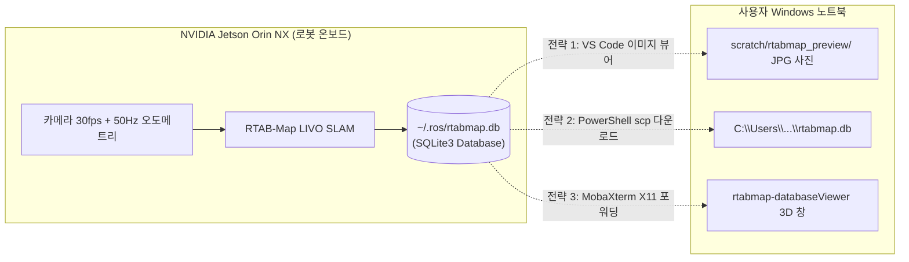

# 💻 [GUIDE] Windows 및 SSH 환경에서의 RTAB-Map 3D 맵핑 DB(`rtabmap.db`) 시각적 검증 매뉴얼

> **문서 대상**: Windows 노트북 사용자 및 원격 Jetson 운영자 (민석 - Jetson & Hardware Lead)  
> **문서 목적**: 별도의 물리적 모니터(HDMI) 연결 없이, SSH 접속 환경에서 Unitree Go2의 3D SLAM 데이터베이스(`~/.ros/rtabmap.db`) 상태, 노드 개수, 키프레임 영상 및 3D 맵을 Windows 노트북 화면에서 직접 확인하는 3대 전략을 제공합니다.

---

## 📌 목차 (Table of Contents)
1. [개요 및 데이터베이스 구조](#1-개요-및-데이터베이스-구조)
2. [전략 1: VS Code 원격 탐색기 + Python 인스펙터 (가장 추천 / GUI 불필요)](#2-전략-1-vs-code-원격-탐색기--python-인스펙터-가장-추천--gui-불필요)
3. [전략 2: Windows PowerShell SCP 다운로드 후 로컬 분석](#3-전략-2-windows-powershell-scp-다운로드-후-로컬-분석)
4. [전략 3: MobaXterm / WSLg 기반 공식 GUI `rtabmap-databaseViewer` 팝업](#4-전략-3-mobaxterm--wslg-기반-공식-gui-rtabmap-databaseviewer-팝업)
5. [데이터베이스 무결성 판정 기준](#5-데이터베이스-무결성-판정-기준)

---

## 1. 🗄️ 개요 및 데이터베이스 구조

Unitree Go2 ESCAPE-Nav 파이프라인에서 `bash scratch/bringup_all_escape_nav.sh --mapping`을 실행하면, RTAB-Map은 모든 센서 데이터(30fps RGB 전면 카메라 영상, 50Hz 고정밀 오도메트리, 3D 포인트, 루프 클로저 그래프)를 **`~/.ros/rtabmap.db` (SQLite3 기반 파일)**에 압축 저장합니다.



---

## 2. 📸 전략 1: VS Code 원격 탐색기 + Python 인스펙터 (가장 추천 / 무설치)

Windows 사용자가 VS Code Remote - SSH로 접속 중인 경우, **추가 프로그램 설치 없이 1초 만에 터미널 통계와 실제 카메라 사진을 확인**할 수 있는 가장 효율적인 방법입니다.

### 실행 방법:
```bash
cd ~/go2_ws_antarctica
python3 scratch/inspect_rtabmap_db.py
```

### 터미널 출력 예시:
```text
========================================================================
 🗺️ [RTAB-Map Database Inspector] /home/unitree/.ros/rtabmap.db
 📦 File Size: 5.29 MB
========================================================================
  • Total Mapped Keyframe Nodes : 24
  • Total Graph Links / Edges  : 0
  • Recording Duration         : 12.8 seconds (13:57:43 ~ 13:57:56)
  • Total Stored RGB Images    : 24
    📸 Exported Frame [Node 1]  -> scratch/rtabmap_preview/node_0001.jpg (1280x720)
    📸 Exported Frame [Node 13] -> scratch/rtabmap_preview/node_0013.jpg (1280x720)
    📸 Exported Frame [Node 24] -> scratch/rtabmap_preview/node_0024.jpg (1280x720)
========================================================================
 ✅ Database Health: 100% Valid & Readable via RTAB-Map SLAM Pipeline
========================================================================
```

### 사진 확인:
* VS Code 좌측 파일 탐색기에서 **`scratch/rtabmap_preview/`** 폴더를 열고 `node_0001.jpg`, `node_0024.jpg` 파일을 클릭하면, Windows 노트북 에디터 창에 실제 촬영된 고화질 사진이 즉시 열립니다.

---

## 3. 💾 전략 2: Windows PowerShell SCP 다운로드

로봇의 맵 데이터베이스 파일을 Windows 로컬 드라이브로 복사하여 영구 보관하거나 로컬 분석 툴로 열고자 할 때 사용합니다.

### Windows PowerShell / 명령 프롬프트(CMD)에서 실행:
```powershell
# Windows 터미널에서 다운로드 실행
scp unitree@192.168.123.99:~/.ros/rtabmap.db $HOME\Downloads\rtabmap_corridor.db
```

---

## 4. 🖥️ 전략 3: MobaXterm / WSLg 기반 공식 GUI `rtabmap-databaseViewer` 팝업

Jetson 본체에 모니터를 꽂지 않고, **RTAB-Map 공식 3D 그래픽 뷰어 창을 Windows 노트북 모니터에 팝업 창으로 띄우는 방법**입니다.

### A. MobaXterm 사용 시 (가장 간편):
1. Windows에서 [MobaXterm](https://mobaxterm.mobatek.net/) 무료 버전을 실행합니다.
2. `Session` ➔ `SSH` ➔ Remote host에 `192.168.123.99`, username에 `unitree` 입력 후 접속합니다. (MobaXterm은 X11 서버가 자동 내장되어 있습니다.)
3. 터미널 창에서 아래 명령어 입력:
   ```bash
   rtabmap-databaseViewer ~/.ros/rtabmap.db
   ```
4. 1~2초 후 Windows 바탕화면에 **RTAB-Map 3D Database Viewer GUI 창이 팝업**됩니다.

### B. Windows 11 WSL2 (WSLg) 사용 시:
Windows 11의 기본 터미널(WSLg)에서:
```bash
ssh -X unitree@192.168.123.99
rtabmap-databaseViewer ~/.ros/rtabmap.db
```

---

## 5. 📊 데이터베이스 무결성 판정 기준

맵 생성이 정상적으로 완료되었는지 판정하는 4대 기준:

1. **파일 크기**: `~/.ros/rtabmap.db` 크기가 **$1\text{ MB}$ 이상** (노드가 정상 누적됨).
2. **노드 수 (Total Mapped Nodes)**: 주행 시간에 비례하여 초당 약 1~2개의 노드가 생성됨 (`Rate = 2.0 Hz`).
3. **이미지 해상도**: 추출된 사진이 **$1280 \times 720$** 해상도로 깨짐 없이 렌더링됨.
4. **오도메트리 연속성**: 로봇이 복도를 이동한 경로에 따라 `pose` 좌표가 점진적으로 갱신됨.
