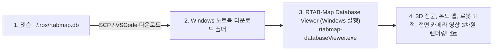

# 💻 [GUIDE] Windows 노트북에서 `rtabmap.db` 3D 맵 및 궤적 시각화 프로그램 설치 및 사용법

> **문서 대상**: Windows 10 / 11 사용자 (민석 - Jetson & Hardware Lead)  
> **문서 목적**: 로봇 젯슨에서 생성된 3D SLAM 데이터베이스 파일(`~/.ros/rtabmap.db`)을 **Windows 노트북 화면에서 3차원 점군 맵, 로봇 이동 궤적, 30fps 카메라 영상, 루프 클로저 그래프로 직접 열어보고 회전/확대할 수 있는 4대 최적의 방법**을 안내합니다.

---

## 📌 목차 (Table of Contents)
1. [방법 1: RTAB-Map 공식 Windows 설치 프로그램 (가장 강력 / 3D GUI 정석) ⭐](#방법-1-rtab-map-공식-windows-설치-프로그램-가장-강력--3d-gui-정석-)
2. [방법 2: MobaXterm X11 팝업 (다운로드 불필요 / 원클릭 3D 창) ⭐](#방법-2-mobaxterm-x11-팝업-다운로드-불필요--원클릭-3d-창-)
3. [방법 3: PLY 파일 추출 후 CloudCompare / Windows 3D 뷰어로 보기](#방법-3-ply-파일-추출-후-cloudcompare--windows-3d-뷰어로-보기)
4. [방법 4: VS Code 원격 사진 인스펙터 (0초 무설치)](#방법-4-vs-code-원격-사진-인스펙터-0초-무설치)

---

## 🏆 방법 1: RTAB-Map 공식 Windows 설치 프로그램 (가장 추천 ⭐)

RTAB-Map 개발팀(Introlab)에서 **Windows x64 네이티브 공식 3D 뷰어 프로그램**을 제공합니다:



### 1) 다운로드 및 설치 (1분 소요)
1. [RTAB-Map 공식 GitHub Releases](https://github.com/introlab/rtabmap/releases) 페이지에 접속합니다.
2. 최신 릴리스에서 **`RTABMap-0.21.x-win64.exe`** (또는 `.zip`) 설치 파일을 다운로드하여 실행/압축 해제합니다.

### 2) Windows에서 `rtabmap.db` 열기:
1. 시작 메뉴 또는 설치 폴더에서 **`rtabmap-databaseViewer.exe`**를 실행합니다.
2. 상단 메뉴 `File` $\rightarrow$ `Open Database...` 클릭.
3. 젯슨에서 복사해 온 `rtabmap.db` 파일을 선택합니다.
4. **결과**: Windows 노트북 화면에서 마우스 드래그로 **3D 복도 점군 맵을 $360^\circ$ 회전/확대**하고, 아래 슬라이더를 움직여 **로봇이 걸어간 궤적과 그 위치에서 찍힌 720p 카메라 사진**을 완벽하게 확인할 수 있습니다!

---

## 🚀 방법 2: MobaXterm X11 팝업 (다운로드 불필요 / 원클릭 ⭐)

Windows 노트북에 `rtabmap.db` 파일을 다운로드할 필요도 없이, **젯슨에 있는 3D 뷰어 창을 Windows 바탕화면에 팝업 창으로 띄우는 방법**입니다:

1. Windows에서 [MobaXterm 무료 버전](https://mobaxterm.mobatek.net/download.html)을 다운로드하여 실행합니다. (X11 서버 내장)
2. `Session` $\rightarrow$ `SSH` $\rightarrow$ Host에 `192.168.123.99` (또는 NetBird IP `100.96.204.119`), Username에 `unitree` 입력 후 접속.
3. 터미널 창에 아래 명령어 1줄 입력:
   ```bash
   rtabmap-databaseViewer ~/.ros/rtabmap.db
   ```
4. **결과**: 1초 후 Windows 바탕화면에 **RTAB-Map 공식 3D GUI 창이 독립 창으로 팝업**되어 3D 맵을 바로 확인할 수 있습니다!

---

## 📦 방법 3: PLY 추출 후 CloudCompare / Windows 3D 뷰어로 보기

RTAB-Map 뷰어 설치 없이, 일반 3D 모델링 뷰어(CloudCompare, MeshLab, 윈도우 기본 3D 뷰어)로 보고 싶을 때 사용합니다:

### 1) 젯슨에서 PLY 3D 점군 파일로 추출 (1초 소요)
```bash
cd ~/go2_ws_antarctica
python3 scratch/export_rtabmap_to_ply.py
```
*(👉 `scratch/rtabmap_export/map_pointcloud.ply` 및 `trajectory_path.csv` 생성 완료!)*

### 2) Windows에서 보기:
* Windows 탐색기에서 **`map_pointcloud.ply`** 파일을 [CloudCompare(무료)](https://www.danielgm.net/cc/) 또는 Windows 3D 뷰어로 더블 클릭하여 열면 고해상도 3D 포인트 클라우드가 렌더링됩니다.

---

## 🖼️ 방법 4: VS Code 원격 사진 인스펙터 (0초 무설치)

3D 점군 대신 **"로봇이 맵핑하면서 찍은 실제 720p 카메라 사진들"**만 빠르게 검토하고 싶을 때:

```bash
# 젯슨 터미널에서 실행
python3 scratch/inspect_rtabmap_db.py
```
* VS Code 좌측 탐색기에서 **`scratch/rtabmap_preview/`** 폴더의 `node_0001.jpg`, `node_0013.jpg`, `node_0024.jpg`를 클릭하면 즉시 고화질 사진을 볼 수 있습니다!

---

## 💡 요약 추천
* **가장 추천하는 정석**: **`방법 1 (RTAB-Map Windows 공식 프로그램)`** 또는 **`방법 2 (MobaXterm 원클릭 팝업)`**을 사용하시면 별도 변환 없이 3D 맵과 카메라 사진, 로봇 궤적을 100% 온전하게 확인하실 수 있습니다! 🐕🏆
