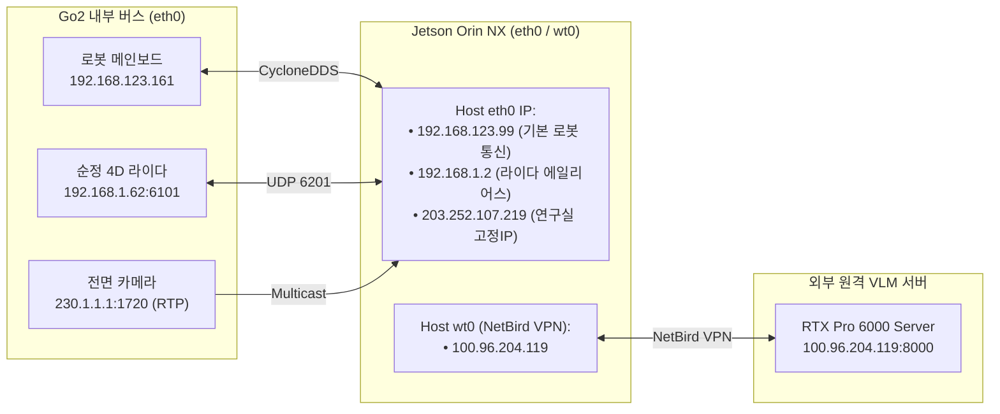

# 🌐 [Jetson Plan 01] Jetson 하드웨어 제원, 네트워크 IP 토폴로지 및 CycloneDDS 통신 아키텍처

> **문서 소유자**: **민석 (Minseok - Hardware, Sensor & Deployment Lead)**  
> **상위 총괄 문서**: [`docs/jetson_plan/README.md`](file:///home/unitree/go2_ws_antarctica/docs/jetson_plan/README.md)  
> **최종 검증 일자**: 2026-08-20  

---

## 📌 1. NVIDIA Jetson Orin NX 16GB 하드웨어 사양

| 하드웨어 항목 | 공식 제원 및 실측 사양 | 비고 |
| :--- | :--- | :--- |
| **SoC / Compute** | NVIDIA Jetson Orin NX (8-core ARM Cortex-A78AE v8.2 64-bit) | 최대 2.0 GHz 클록 |
| **GPU / AI 가속** | 1024-core NVIDIA Ampere Architecture GPU w/ 32 Tensor Cores | 최대 100 TOPS (INT8) |
| **메모리 (RAM)** | 16GB 128-bit LPDDR5 (통합 메모리 Unified Memory) | 대역폭: 102.4 GB/s |
| **스토리지 (NVMe)** | 512GB M.2 NVMe PCIe SSD | 고속 Rosbag 로깅 지원 |
| **운영체제 및 커널** | Ubuntu 20.04.6 LTS (Focal Fossa), Kernel 5.10.104-tegra | Tegra L4T JetPack 5.1.1 |
| **CUDA 및 ROS** | CUDA 11.4 / ROS 2 Foxy Fitzroy / CycloneDDS | 호스트 고유 미들웨어 스택 |

---

## 🗺️ 2. 물리 네트워크 IP 토폴로지 및 인터페이스 매핑



### 네트워크 인터페이스 설정
1. **독립 외장 L2 SDK를 사용할 때만 필요한 에일리어스 IP 바인딩**:
   ```bash
   sudo ip addr add 192.168.1.2/24 dev eth0
   ```
2. **현재 built-in DDS/RTP 경로 확인**:
   ```bash
   ip -4 route get 192.168.123.161
   ```
   CycloneDDS와 GStreamer가 eth0를 명시하므로 별도 `230.0.0.0/8` root route는 요구하지 않습니다.

---

## ⚙️ 3. CycloneDDS 공식 XML 설정 (`cyclonedds.xml`)

VPN 인터페이스(`wt0`) 및 도커 브릿지(`docker0`)로의 DDS 패킷 누출을 막고, 로봇 내부 메인보드(`192.168.123.161`)와 Jetson `eth0`를 완벽히 바인딩한 공식 설정 파일입니다:

* **파일 위치**: [`/home/unitree/go2_ws_antarctica/cyclonedds.xml`](file:///home/unitree/go2_ws_antarctica/cyclonedds.xml)

```xml
<?xml version="1.0" encoding="UTF-8" ?>
<CycloneDDS xmlns="https://cdds.io/config" xmlns:xsi="http://www.w3.org/2001/XMLSchema-instance" xsi:schemaLocation="https://cdds.io/config https://raw.githubusercontent.com/eclipse-cyclonedds/cyclonedds/master/etc/cyclonedds.xsd">
    <Domain id="any">
        <General>
            <NetworkInterfaceAddress>eth0</NetworkInterfaceAddress>
            <AllowMulticast>true</AllowMulticast>
            <MaxMessageSize>65500B</MaxMessageSize>
        </General>
        <Discovery>
            <Peers>
                <Peer address="192.168.123.161"/>
            </Peers>
            <ParticipantIndex>auto</ParticipantIndex>
        </Discovery>
        <Internal>
            <SocketReceiveBufferSize min="10MB"/>
            <Watermarks>
                <WhcHigh>500kB</WhcHigh>
            </Watermarks>
        </Internal>
    </Domain>
</CycloneDDS>
```

### 💡 핵심 파라미터 기술적 근거
1. `<NetworkInterfaceAddress>eth0</NetworkInterfaceAddress>`: 멀티 인터페이스 환경에서 NetBird VPN(`100.96.204.119`)으로 DDS 브로드캐스트가 유출되는 것을 차단하고 로봇 물리 이더넷 버스(`192.168.123.0/24`)로 통신 고정.
2. `<Peer address="192.168.123.161"/>`: Go2 메인보드 MCU와의 유니캐스트 디스커버리를 보장하여 네트워크 스위치 멀티캐스트 드랍 상황에서도 패킷 손실 방지.
3. `<SocketReceiveBufferSize min="10MB"/>`: 50Hz 고주기 센서 스트림 및 라이다 점군 버스트 수신 시 소켓 버퍼 오버플로우 방지.
