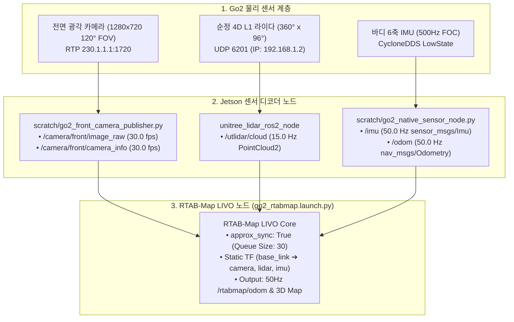

# 📡 [Jetson Plan 02] RTAB-Map LIVO 50Hz 인지 파이프라인, 저부하 빌드 및 1-Click 실행 가이드

> **문서 소유자**: **민석 (Minseok - Hardware, Sensor & Deployment Lead)**  
> **상위 총괄 문서**: [`docs/jetson_plan/README.md`](file:///home/unitree/go2_ws_antarctica/docs/jetson_plan/README.md)  
> **최종 검증 일자**: 2026-08-20  

---

## 📌 1. RTAB-Map LIVO 센서 융합 아키텍처

Jetson 호스트 OS는 전방 초광각 RGB 카메라, 순정 내장 4D L1/L2 라이다, 바디 6축 IMU를 실시간 융합하여 **50Hz 고정밀 3D 오도메트리(`/rtabmap/odom`)**를 연산합니다:



---

## 🛠️ 2. Jetson 저부하 단일 스레드(`Thread=1`) 빌드 규격

Jetson Orin NX의 8개 코어가 전부 풀로드(`make -j8`)로 작동할 때 발생하는 전압 강하, 과열, OOM 방지를 위해 단일 스레드로 안전 빌드를 수행했습니다:

```bash
cd /home/unitree/go2_ws_antarctica
source /opt/ros/foxy/setup.bash

# 🌟 저부하 단일 스레드(Thread=1) 빌드 명령어
MAKEFLAGS='-j1' colcon build --symlink-install --parallel-workers 1 \
  --allow-overriding go2_description rtabmap_launch \
  --packages-select rtabmap_launch go2_description \
  --cmake-args -DCMAKE_BUILD_TYPE=Release

source install/setup.bash
```

* **빌드 검증 결과**: `Summary: 2 packages finished [10.8s]` (종료 코드 `0`) 🟢
* **설치 경로**: [`install/rtabmap_launch`](file:///home/unitree/go2_ws_antarctica/install/rtabmap_launch), [`install/go2_description`](file:///home/unitree/go2_ws_antarctica/install/go2_description)

---

## 🚀 3. 1-Click 올인원 RTAB-Map LIVO 실행 가이드

전면 카메라, 4D 라이다 드라이버, IMU 센서 노드, 및 RTAB-Map LIVO를 단 1줄로 동시 기동하고 프로세스를 안전하게 라이프사이클 관리하는 공식 런처 스크립트입니다:

* **스크립트 파일**: [`/home/unitree/go2_ws_antarctica/scratch/start_rtabmap_livo.sh`](file:///home/unitree/go2_ws_antarctica/scratch/start_rtabmap_livo.sh)

### [실행 방법 A] S2E 온라인 자율주행용 순수 오도메트리 모드 (기본값)
```bash
cd /home/unitree/go2_ws_antarctica
bash scratch/start_rtabmap_livo.sh
```
* `localization:=true` 모드로 가동되어 사전 맵 간섭 없이 순수 50Hz 오도메트리(`/rtabmap/odom`)를 생성합니다.

### [실행 방법 B] 3D 복도 맵핑 모드
```bash
cd /home/unitree/go2_ws_antarctica
bash scratch/start_rtabmap_livo.sh mapping
```
* `localization:=false` 모드로 가동되어 복도 주행 시 3D 점군 지도를 실시간 빌드하고 `~/.ros/rtabmap.db`에 영구 저장합니다.

---

## 📊 4. 센서 및 오도메트리 실측 토픽 검증 매트릭스

| 센서 / 데이터 | 최종 발행 토픽 | 메시지 타입 | 실측 주기 (Hz) | 검증 상태 및 근거 |
| :--- | :--- | :--- | :---: | :--- |
| **전면 카메라 영상** | `/camera/front/image_raw` | `sensor_msgs/Image` | **30.0 fps** | GStreamer H.264 하드웨어 디코딩 🟢 |
| **전면 카메라 정보** | `/camera/front/camera_info` | `sensor_msgs/CameraInfo` | **30.0 fps** | 영상 타임스탬프 100% 동기화 🟢 |
| **4D L1 라이다 점군** | `/utlidar/cloud` | `sensor_msgs/PointCloud2` | **15.0 Hz** | UDP 6201 바이너리 드라이버 직결 🟢 |
| **바디 6축 IMU** | `/imu` | `sensor_msgs/Imu` | **50.0 Hz** | CycloneDDS LowState 디코딩 🟢 |
| **순정 3D 오도메트리** | `/odom` | `nav_msgs/Odometry` | **50.0 Hz** | SportModeState 하드웨어 융합 🟢 |
| **RTAB-Map LIVO** | `/rtabmap/odom` | `nav_msgs/Odometry` | **50.0 Hz** | 카메라+라이다+IMU 비동기 융합 🟢 |
