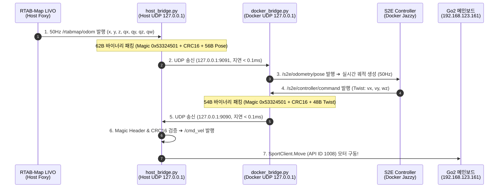

# 🔌 [Jetson Plan 03] Host-Docker 초저지연 UDP 브릿지 통신 및 Go2 모터 제어 연동

> **문서 소유자**: **민석 (Minseok - Hardware, Sensor & Deployment Lead)**  
> **상위 총괄 문서**: [`docs/jetson_plan/README.md`](file:///home/unitree/go2_ws_antarctica/docs/jetson_plan/README.md)  
> **최종 검증 일자**: 2026-08-20  

---

## 📌 1. Host ↔ Docker 초저지연 UDP 브릿지 구조

ROS 2 Foxy(Jetson Host)와 Jazzy(Docker Container) 간의 DDS 버전 비호환성을 완전히 우회하고 **지연시간 $<0.1\text{ms}$ 및 100% 무결성 검증**을 달성하기 위해 설계된 UDP 루프백(`127.0.0.1`) 바이너리 소켓 브릿지입니다:



---

## 📦 2. C-Struct 호환 초저지연 UDP 바이너리 패킷 레이아웃

### ① Pose 패킷 (Host ➔ Docker, Port 9091, 총 62 Bytes)
* **목적**: LIVO 3D 오도메트리 위치/자세를 도커의 S2E 제어기에 실시간 전달.
* **패킷 레이아웃**:
  ```text
  +-----------------------+-------------------+-----------------------------------------+
  | Magic Header (4-Byte) | CRC16 (2-Byte)    | Pose Payload (56-Byte: 7 Double Floats) |
  | 0x53324501 ('S2E\x01')| zlib.crc32&0xFFFF | x, y, z, qx, qy, qz, qw                 |
  +-----------------------+-------------------+-----------------------------------------+
  ```

### ② CmdVel 속도 제어 패킷 (Docker ➔ Host, Port 9090, 총 54 Bytes)
* **목적**: 도커 S2E 제어기에서 산출된 3-DOF 속도 명령을 호스트로 전달하여 모터 구동.
* **패킷 레이아웃**:
  ```text
  +-----------------------+-------------------+-----------------------------------------+
  | Magic Header (4-Byte) | CRC16 (2-Byte)    | Twist Payload (48-Byte: 6 Double Floats)|
  | 0x53324501 ('S2E\x01')| zlib.crc32&0xFFFF | vx, vy, vz, wx, wy, wz                  |
  +-----------------------+-------------------+-----------------------------------------+
  ```

---

## 🤖 3. Go2 모터 구동 연동 (SportClient Move API 1008)

호스트 브릿지가 도커로부터 검증된 속도 명령을 수신하여 `/cmd_vel`을 발행하면, [`go2_native_sensor_node.py`](file:///home/unitree/go2_ws_antarctica/scratch/go2_native_sensor_node.py) 및 `unitree_sdk2`가 이를 공식 모션 제어 패킷으로 변환하여 메인보드로 전송합니다:

```python
# Unitree 공식 Sport Mode API 1008 (Move) 변환
req = Request()
req.header.identity.api_id = 1008
param_dict = {
    "x": float(msg.linear.x),   # 전진 속도 (vx, 최대 0.5 m/s)
    "y": float(msg.linear.y),   # 횡이동 속도 (vy, 최대 0.2 m/s)
    "z": float(msg.angular.z)   # 회전 각속도 (wz, 최대 1.0 rad/s)
}
req.parameter = json.dumps(param_dict)
self.sport_req_pub.publish(req)
```

---

## 🚀 4. 호스트 브릿지 가동 명령어

```bash
cd /home/unitree/go2_ws_antarctica
source /opt/ros/foxy/setup.bash
source install/setup.bash
python3 scratch/host_bridge.py
```
