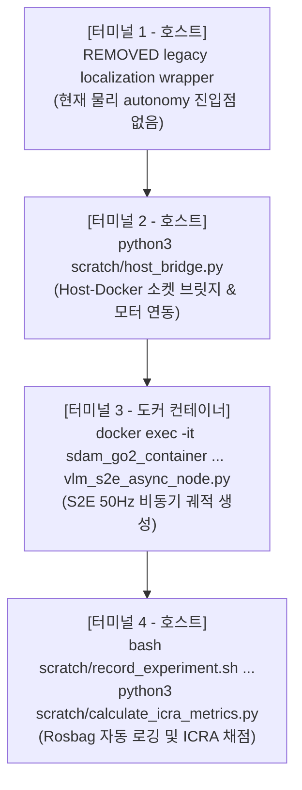

# 🏆 [Jetson Plan 04] 온보드 실증 런북, 자동 Rosbag 로깅 및 ICRA Table VIII 채점 가이드

> **역사 문서 경고 (2026-08-28)**: 아래 4-terminal autonomy 명령은 삭제된 wrapper, 존재하지 않는 S2E entrypoint와 sample evaluator를 사용하므로 실행하지 않는다. mapping은 `./run_map.sh` 또는 `./map_headless.sh`만 사용하고, 전체 실험은 [`../experiments/00_real_robot_end_to_end_master_test_plan.md`](../experiments/00_real_robot_end_to_end_master_test_plan.md)를 따른다.

> **문서 소유자**: **민석 (Minseok - Hardware, Sensor & Deployment Lead)**  
> **상위 총괄 문서**: [`docs/jetson_plan/README.md`](file:///home/unitree/go2_ws_antarctica/docs/jetson_plan/README.md)  
> **최종 검증 일자**: 2026-08-20  

---

## 📌 1. 현장 온보드 실증 4단계 가동 매뉴얼

복귀 후 한동대학교 연구동 실내 복도에서 로봇 자율주행 실증을 수행할 때 실행하는 공식 4-터미널 런북입니다:



### [1단계] RTAB-Map LIVO 가동 (Host Terminal 1)
```bash
cd /home/unitree/go2_ws_antarctica
# REMOVED: no accepted physical-autonomy entry point```

### [2단계] Host-Docker UDP 브릿지 가동 (Host Terminal 2)
```bash
cd /home/unitree/go2_ws_antarctica
source /opt/ros/foxy/setup.bash
source install/setup.bash
python3 scratch/host_bridge.py
```

### [3단계] 도커 S2E 비동기 자율주행 노드 가동 (Host Terminal 3 ➔ Docker)
```bash
docker start sdam_go2_container
docker exec -it sdam_go2_container bash -c "cd /workspace/go2_ws_antarctica/s2e-vlm-async-framework && python3 src/vlm_s2e_async_node.py"
```

### [4단계] 1-Click Rosbag 자동 로깅 및 채점 (Host Terminal 4)
```bash
# 시나리오 주행 시작 시 (자동 로깅)
bash scratch/record_experiment.sh Dead_end_room Full_ESCAPE_Nav Trial1

# 5회 주행 완료 후 (95% Wilson CI & p-value 자동 계산)
python3 scratch/calculate_icra_metrics.py
```

---

## 📊 2. ICRA 2026 Table VIII 5대 시나리오 및 6대 정량 지표

### 5대 평가 시나리오 규격
1. `Dead-end room`: 막다른 방/복도 진입 시 360도 능동 스윕 후 후방 180도 출구 탈출.
2. `Blocked goal direction`: 목표 방향 장애물 직면 시 측면 우회로 탐색 및 선회.
3. `Repeated corridor`: 시각적 유사 복도에서 Directional Memory로 과거 실패 경로 재진입 억제.
4. `Active-view recovery`: 정체 감지 시 능동 Yaw 회전으로 새 브랜치 탐색.
5. `Dynamic obstacle`: 1.2m/s 보행자 이동 시 실시간 비동기 재계획 및 감속 우회.

### 6대 정량 지표 계산 공식
* **Normalized Completion Time ($T^\dagger$)**:
  $$T_i^\dagger = S_i \min(T_i, T_{\max}) + (1 - S_i) T_{\max}$$
* **Directional Recovery Score (DRS)**:
  $$\text{DRS} = \frac{N_{\text{escaped and resumed}}}{N_{\text{true detected}}}$$
* **Failed-Branch Re-entry Rate (FBR)**:
  $$\text{FBR} = \frac{N_{\text{failed edge reentry}}}{N_{\text{opportunity}}}$$
* **Success Rate (`Succ./5`)**, **Intervention-Free Rate (`IF/5`)**, **Driving Duty Cycle (`Duty`)**

---

## 🛡️ 3. 비상 정지(E-Stop) 및 안전 수칙

1. **무선 리모컨 상시 소지**:
   - 로봇이 벽이나 사람을 향해 돌진할 경우 즉시 **`L2 + B`** 버튼을 눌러 모터를 댐핑 모드로 해제합니다.
2. **배터리 저전압 관리**:
   - 배터리가 $20\%$ 이하로 떨어지면 즉시 주행을 중단하고 충전하여 전압 강하로 인한 Jetson 급작 종료를 방지합니다.
