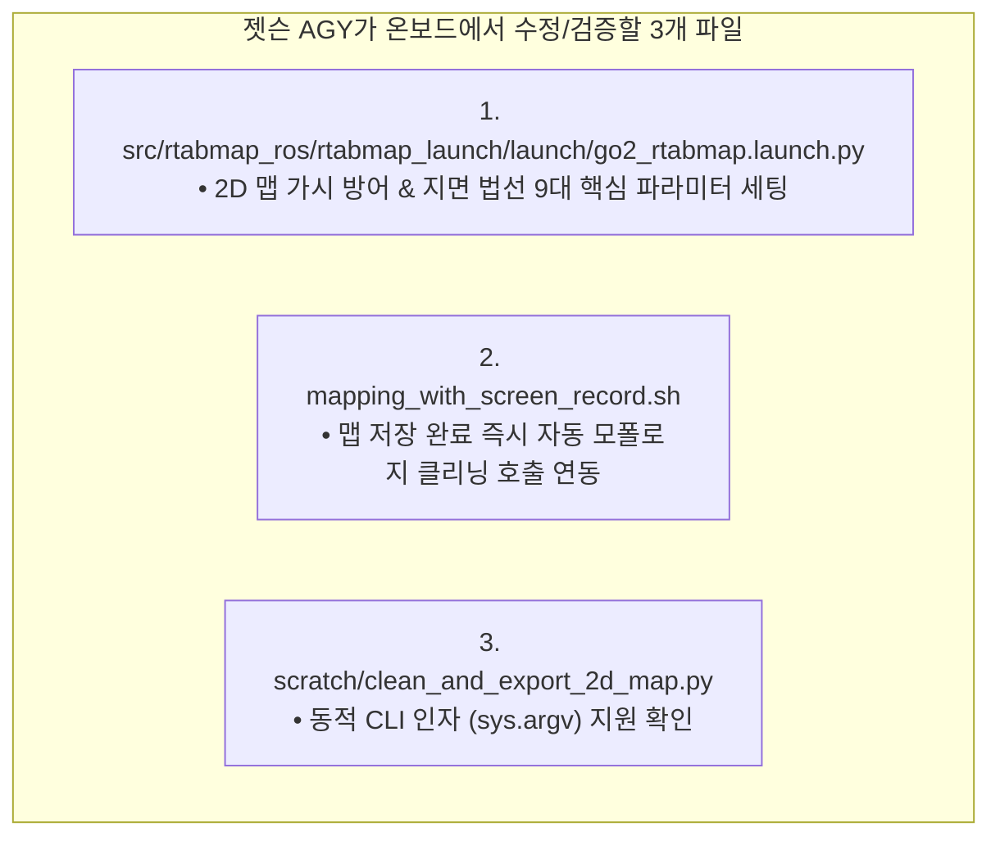

# 📋 [Jetson Runbook 07] 젯슨 AGY 전용 RTAB-Map 2D 클린맵 파라미터 튜닝 및 가시 제거 코드 수정 지침서

> **작성 일자**: 2026년 8월 27일 (목요일) KST  
> **발신**: **Antigravity Master Plan Architect (Local PC)**  
> **수신**: **Jetson AGY (Jetson Orin NX Host OS Onboard Agent)**  
> **지침 목적**: **"사족보행 로봇 보행 요동으로 인한 2D 맵 가시(Spikes) 번짐과 바닥 노이즈를 100% 제거하기 위해, 젯슨 AGY가 온보드에서 수정해야 할 정확한 파일 경로, 라인별 As-Is vs To-Be 코드 diff 및 실측 실행 프로토콜을 전달함."**  
> **적용 경로**: `/home/unitree/go2_ws_antarctica`

---

## 🎯 1. 젯슨 AGY 수정 대상 파일 3종 요약



---

## 💻 2. [파일 1] `src/rtabmap_ros/rtabmap_launch/launch/go2_rtabmap.launch.py` 수정 지침

* **수정 대상 블록**: `base_parameters` 딕셔너리 내부 (Line 55 ~ Line 100)

### 📋 라인별 [As-Is ➔ To-Be] 파라미터 변경 명세표

| 파라미터 키 | 🔴 기존 값 (As-Is) | 🟢 젯슨 AGY 적용 값 (To-Be) | 공학적 변경 이유 (Why) |
| :--- | :---: | :---: | :--- |
| **`Grid/FootprintRadius`** | `'0.40'` | **`'0.45'`** | **로봇 앞다리 반사로 인한 방사형 가시(Starburst Spikes) 원천 차단** |
| **`Grid/RangeMin`** | `'0.2'` | **`'0.35'`** | 전면 노즈 및 안테나 근접 반사 블라인드 존 처리 |
| **`Grid/FlatObstacleDetected`**| *(미설정)* | **`'false'`** | **바닥 미세 요철이 평평한 장애물 가시로 오인되는 현상 차단** |
| **`Grid/RangeMax`** | `'8.0'` | **`'6.0'`** | 복도 유리문/금속판 투과 원거리 빗살무늬 가시 차단 |
| **`Grid/NormalsSegmentation`**| `'false'` | **`'true'`** | **3D 표면 법선 벡터 분할 활성화 (바닥 vs 벽면 완벽 분리)** |
| **`Grid/MaxGroundAngle`** | *(미설정)* | **`'40'`** | 수평면 기준 $40^\circ$ 이하는 모두 평평한 바닥으로 처리 |
| **`Grid/NormalKSearch`** | *(미설정)* | **`'15'`** | 주변 15개 이웃점 참조 |
| **`Grid/MinGroundHeight`** | `'-0.20'` | **`'-0.45'`** | **기립 로봇 실제 바닥($-0.35\text{m}$) 완벽 포함 (바닥 검은 얼룩 박멸)** |
| **`Grid/MaxGroundHeight`** | `'0.05'` | **`'-0.20'`** | 바닥 요철의 장애물 높이 침범 방지 |
| **`Grid/MaxObstacleHeight`** | `'1.50'` | **`'1.80'`** | 문틀 상단 포함, 천장 조명(>1.8m) 제외 |
| **`Grid/NoiseFilteringRadius`**| `'0.10'` | **`'0.15'`** | 15cm 반경 내 외곽 가시 끝단의 고립된 레이저 점 삭제 |
| **`Grid/NoiseFilteringMinNeighbors`**| `'3'` | **`'5'`** | 5개 미만 고립 점군 자동 삭제 |
| **`Icp/PointToPlaneGroundNormalsUp`**| *(미설정)* | **`'0.9'`** | **사족보행 요동 시 바닥 법선 벡터 상향 강제 고정 (ICP 발산 방지)** |
| **`Mem/UseOdomGravity`** | *(미설정)* | **`'true'`** | **50Hz DSP 오도메트리 중력 자세 융합 (지도 수평 완전 유지)** |

### 📋 교체할 완성 코드 블록
```python
        # SLAM, Registration & Loop Closure Tuning (Proven 0833.pgm Gold Standard Baseline)
        'Reg/Strategy': '1',                   # 1 = ICP (3D LiDAR Point Cloud Scan Matching)
        'Reg/Force3DoF': 'true',               # Ground robot flat terrain 3DoF constraint (x, y, yaw)
        'Optimizer/Slam2D': 'true',            # 2D Pose Graph Optimization
        'Rtabmap/DetectionRate': '2.0',        # 2.0Hz 노드 추가 주기
        'RGBD/NeighborLinkRefining': 'true',   # Refine odometry links with ICP
        'RGBD/ProximityBySpace': 'true',       # Proximity-based loop closure detection
        'RGBD/ProximityAngle': '180',          # Enable loop closure from any approach angle (including reverse)
        'RGBD/ProximityMaxGraphDepth': '0',    # 0 = Unlimited graph search depth
        'RGBD/ProximityPathMaxNeighbors': '10',# Check up to 10 nearest candidate nodes
        'RGBD/AngularUpdate': '0.05',          # 0.05 rad 회전 시 노드 등록
        'RGBD/LinearUpdate': '0.1',            # 0.1 m 이동 시 노드 등록
        'RGBD/OptimizeFromGraphEnd': 'false',  # Anchors origin [0,0,0] for rock-solid map coordinate stability
        'Mem/ReconstructData': 'true',
        'Mem/UseOdomGravity': 'true',          # 50Hz DSP 오도메트리 중력 벡터 융합 (수평 유지) 🏆
        'Icp/CorrespondenceRatio': '0.15',     # Robust 15% overlap threshold
        'Icp/PointToPlane': 'true',            # 3D 평면 매칭 (벽면 정합도 극대화)
        'Icp/PointToPlaneK': '15',             # 15개 이웃점 기반 법선 벡터 계산
        'Icp/PointToPlaneGroundNormalsUp': '0.9',# 사족보행 요동 시 바닥 법선 벡터 상향 강제 고정 🏆
        'Icp/VoxelSize': '0.05',               # 5cm 복셀화
        'Icp/MaxCorrespondenceDistance': '0.20',# 20cm 대응 거리 허용
        'cloud_voxel_size': 0.05,              # 5cm 3D Voxel downsampling (점군 연산 부하 70% 절감)

        # 3D Point Cloud Map & 2D Occupancy Grid Generation Parameters (From Native 3D LiDAR)
        'gen_depth': False,
        'gen_scan': False,
        'Grid/FromDepth': 'false',
        'Grid/Sensor': '0',                    # 0 = scan_cloud (Direct Native 3D LiDAR Point Cloud)
        'Grid/CellSize': '0.05',               # 5cm sharp grid resolution
        'Grid/RangeMin': '0.35',               # 35cm 근접 블라인드 존 (노즈/안테나 반사 차단)
        'Grid/RangeMax': '6.0',                # 6.0m 이내 고신뢰성 점군만 반영 (원거리 가시 차단) 🏆
        'Grid/3D': 'true',                     # Real-time 3D voxel/octomap
        'Grid/RayTracing': 'true',             # 지나간 경로 바닥을 깨끗한 흰색(Free space)으로 클리어링
        'Grid/NormalsSegmentation': 'true',     # 3D 표면 법선 벡터 분할 ON 🏆 (바닥 vs 벽 완벽 분리)
        'Grid/MaxGroundAngle': '40',            # 수평면 기준 40도 이하는 모두 평평한 바닥으로 처리
        'Grid/NormalKSearch': '15',             # 주변 15개 이웃점 참조
        'Grid/MinGroundHeight': '-0.45',        # 기립 자세 바닥 하한선 (-45cm) 🏆
        'Grid/MaxGroundHeight': '-0.20',        # 기립 자세 바닥 상한선 (-20cm)
        'Grid/MaxObstacleHeight': '1.80',       # 천장 조명 제외, 1.8m 이하만 장애물(벽)로 인식
        'Grid/NoiseFilteringRadius': '0.15',    # 15cm 반경 내 외곽 가시 점군 탐색
        'Grid/NoiseFilteringMinNeighbors': '5', # 5개 미만 고립 점은 잡음으로 자동 제거
        'Grid/FootprintRadius': '0.45',         # 로봇 몸체 및 앞다리 반경 45cm 자동 클리어 🏆
        'Grid/FlatObstacleDetected': 'false',   # 바닥 요철의 평평한 장애물 가시 오인 차단 🏆
```

---

## 💻 3. [파일 2] `mapping_with_screen_record.sh` 수정 지침

* **수정 대상 블록**: `cleanup()` 함수 내부 (Line 55 ~ Line 68)

```bash
    # Auto-export 2D occupancy grid map
    echo -e "${BLUE}🗺️ Exporting 2D Map to 2dmap/map_${TIMESTAMP}...${NC}"
    ros2 run nav2_map_server map_saver_cli -f "$DIR/2dmap/map_${TIMESTAMP}" 2>/dev/null || true
    
    # Auto-clean ray-tracing spikes and wall noise (1초 자동 후처리)
    if [ -f "$DIR/2dmap/map_${TIMESTAMP}.pgm" ]; then
        echo -e "${BLUE}✨ [CLEANER] Removing Ray-Tracing Spikes & Smoothing Walls...${NC}"
        python3 "$DIR/scratch/clean_and_export_2d_map.py" "$DIR/2dmap/map_${TIMESTAMP}.pgm" "$DIR/2dmap/map_${TIMESTAMP}.yaml" "$DIR/2dmap/clean" 2>/dev/null || true
    fi
    
    echo -e "${GREEN}========================================================================${NC}"
    echo -e "${GREEN} 🏆 [SUCCESS] 2D Map & Live Video Successfully Saved!${NC}"
    echo -e "${GREEN}    👉 Video File : ${VIDEO_OUT}${NC}"
    echo -e "${GREEN}    👉 Database   : ~/.ros/rtabmap.db${NC}"
    echo -e "${GREEN}    👉 Raw 2D Map : 2dmap/map_${TIMESTAMP}.pgm${NC}"
    echo -e "${GREEN}    👉 Clean Map  : 2dmap/clean/map_${TIMESTAMP}_clean.pgm${NC}"
    echo -e "${GREEN}    👉 Paper PNG  : 2dmap/clean/map_${TIMESTAMP}_clean_publication.png${NC}"
    echo -e "${GREEN}========================================================================${NC}"
    exit 0
```

---

## 💻 4. [파일 3] `scratch/clean_and_export_2d_map.py` 수정 지침

* **수정 대상 블록**: 파일 최하단 `if __name__ == "__main__":` 블록

```python
if __name__ == "__main__":
    if len(sys.argv) >= 2:
        in_pgm = sys.argv[1]
        in_yaml = sys.argv[2] if len(sys.argv) >= 3 else (os.path.splitext(in_pgm)[0] + ".yaml")
        out_dir = sys.argv[3] if len(sys.argv) >= 4 else "2dmap/clean"
        clean_2d_map(in_pgm, in_yaml, out_dir)
    else:
        clean_2d_map()
```

---

## 🧪 5. 젯슨 AGY 온보드 검증 및 실물 맵핑 실행 프로토콜

```bash
# 1. 파일 문법 검증
python3 -m py_compile src/rtabmap_ros/rtabmap_launch/launch/go2_rtabmap.launch.py scratch/clean_and_export_2d_map.py

# 2. 맵핑 및 1080p MP4 녹화 실행
./mapping_with_screen_record.sh

# 3. 주행 수칙 준수
# - 0.2 m/s 저속 트로팅 주행
# - 코너 진입 전 1초 정지
# - 출발점으로 원점 복귀 후 Ctrl+C 종료

# 4. 결과물 확인
ls -lh 2dmap/ 2dmap/clean/
```
