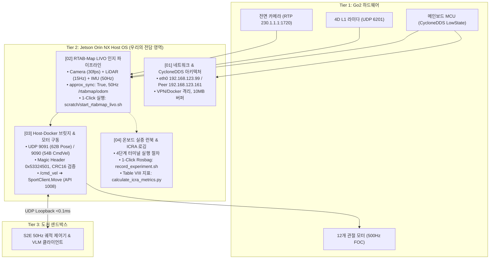

# 🐕 [Jetson Plan] Tier 2: Jetson Orin NX 호스트 OS 마스터 플랜 총괄

> **문서 소유자**: **민석 (Minseok - Hardware, Sensor & Deployment Lead)**  
> **대상 하드웨어**: NVIDIA Jetson Orin NX 16GB (8-core ARM64 / Tegra L4T)  
> **미들웨어 및 OS**: Ubuntu 20.04 LTS / ROS 2 Foxy / CUDA 11.4 / CycloneDDS  
> **논문 공식 명칭**: **`ESCAPE-Nav: Experience-Shaped Causally Aligned Perception–Execution for Asynchronous VLM Navigation` (ICRA 2026)**  
> **문서 목적**: Unitree Go2 등판 Jetson Orin NX 호스트 OS에서 구동되는 **하드웨어 인터페이스, 네트워크/DDS 바인딩, RTAB-Map LIVO 50Hz 오도메트리, Host-Docker 초저지연 브릿지, 로봇 모터 제어, 및 ICRA 실증 로깅의 전수 마스터 가이드 인덱스**입니다.

---

## 📌 1. Jetson 호스트 OS의 4대 핵심 책임 (Responsibilities)

---

## 📑 2. Jetson Plan 세부 문서 인덱스

| 문서 번호 및 제목 | 주요 내용 및 역할 | 바로가기 |
| :--- | :--- | :---: |
| **01. 하드웨어, 네트워크 및 DDS 아키텍처** | Jetson Orin NX 제원, `eth0` 고정 바인딩, `cyclonedds.xml` 규격, 라이다 IP 에일리어스(`192.168.1.2`), 카메라 멀티캐스트(`230.0.0.0/8`) | [01_문서 보기](file:///home/unitree/go2_ws_antarctica/docs/jetson_plan/01_jetson_hardware_network_and_dds_architecture.md) |
| **02. RTAB-Map LIVO 파이프라인 및 실행 가이드** | 카메라(RGB+Info 30fps), 4D 라이다(15Hz), 바디 IMU(50Hz) 센서 융합, `approx_sync` 튜닝, 저부하 단일 스레드 빌드(`-j1`), 1-Click 통합 스크립트 | [02_문서 보기](file:///home/unitree/go2_ws_antarctica/docs/jetson_plan/02_jetson_rtabmap_livo_pipeline_and_bringup.md) |
| **03. Host-Docker 브릿지 및 모터 제어 연동** | 초저지연 UDP 루프백 통신(Magic `0x53324501`, CRC16), 62B Pose 송신 및 54B CmdVel 수신, Unitree 공식 Move API(1008) 인가 메커니즘 | [03_문서 보기](file:///home/unitree/go2_ws_antarctica/docs/jetson_plan/03_jetson_host_docker_bridge_and_motor_actuation.md) |
| **04. 온보드 벤치마크 런북 및 실증 로깅** | 현장 4단계 터미널 가동 매뉴얼, 토픽 Hz 모니터링, Rosbag 자동 로깅(`record_experiment.sh`), ICRA Table VIII 6대 지표 자동 계산기 | [04_문서 보기](file:///home/unitree/go2_ws_antarctica/docs/jetson_plan/04_jetson_onboard_benchmark_and_logging_runbook.md) |
