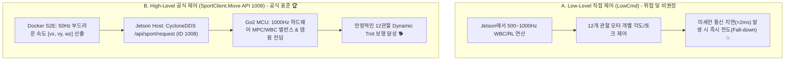

# 🕹️ [Jetson Control 01] Unitree Go2 Sport API 심층 분석, 모션 프리미티브 및 안전 리미터 명세

> **문서 소유자**: **민석 (Hardware, Sensor & Deployment Lead)**  
> **상위 총괄 문서**: [`docs/jetson_plan/control/README.md`](file:///home/unitree/go2_ws_antarctica/docs/jetson_plan/control/README.md)  
> **공식 SDK 참조**: `unitreerobotics/unitree_sdk2` & `unitreerobotics/unitree_ros2`  
> **논문 공식 명칭**: **`ESCAPE-Nav: Experience-Shaped Causally Aligned Perception–Execution for Asynchronous VLM Navigation` (ICRA 2026)**  

---

## 📌 1. 왜 High-Level Sport API (1008)인가?

4족 보행 로봇 Unitree Go2의 제어는 크게 **Low-Level 12관절 토크 제어(`LowCmd`)**와 **High-Level 3-DOF 바디 속도 제어(`SportClient.Move`)**로 나뉩니다.



ESCAPE-Nav 자율주행에서는 **공식 High-Level Sport API(1008)**를 사용하여 로봇의 동적 안정성을 보장합니다.

---

## ⚙️ 2. Unitree 공식 Sport Mode API ID 및 파라미터 규격

Unitree Go2 CycloneDDS 서비스 토픽인 `/api/sport/request` (`unitree_api/msg/Request`)로 전송되는 주요 API ID 목록입니다:

| API ID | 모드 명칭 (Function) | JSON 파라미터 (`parameter`) 규격 | 동작 설명 |
| :---: | :--- | :--- | :--- |
| **`1001`** | **Damp (착석/댐핑)** | `"{}"` | 모든 모터 토크를 풀고 바닥에 안전하게 엎드림 (E-Stop 기본 동작) |
| **`1002`** | **StandUp (기립)** | `"{}"` | 엎드린 상태에서 4발로 균형을 잡고 일어섬 |
| **`1003`** | **StandDown (착석)** | `"{}"` | 기립 상태에서 천천히 앉음 |
| **`1004`** | **Recovery (자세복구)** | `"{}"` | 로봇이 넘어졌을 때 자율적으로 뒤집혀 일어섬 |
| **`1008`** | **Move (3-DOF 주행)** | `{"x": float, "y": float, "z": float}` | $x$: 전진 속도 ($v_x$, $\text{m/s}$)<br/>$y$: 횡이동 속도 ($v_y$, $\text{m/s}$)<br/>$z$: 회전 각속도 ($\omega_z$, $\text{rad/s}$) |

---

## 🛡️ 3. 속도 리미터 및 0.5초 워치독 타이머 구현

[`scratch/host_bridge.py`](file:///C:/Users/USER/Desktop/%EC%BA%A1%EC%8A%A4%ED%86%A4/go2/scratch/host_bridge.py) 및 [`scratch/official_unitree_bridge.py`](file:///C:/Users/USER/Desktop/%EC%BA%A1%EC%8A%A4%ED%86%A4/go2/scratch/official_unitree_bridge.py)에 내장된 안전 제어 로직입니다:

```python
# 1. 안전 속도 클램핑 리미터
MAX_VEL_X = 0.35   # 최대 전진 속도 (m/s)
MIN_VEL_X = -0.35  # 최대 후진 속도 (m/s)
MAX_VEL_Y = 0.20   # 최대 횡이동 속도 (m/s)
MAX_VEL_YAW = 0.60 # 최대 회전 각속도 (rad/s)

vx = max(MIN_VEL_X, min(MAX_VEL_X, float(twist.linear.x)))
vy = max(-MAX_VEL_Y, min(MAX_VEL_Y, float(twist.linear.y)))
vyaw = max(-MAX_VEL_YAW, min(MAX_VEL_YAW, float(twist.angular.z)))

# 2. 0.5초 패킷 두절 워치독 타이머
if time.time() - last_cmd_time > 0.5:
    vx, vy, vyaw = 0.0, 0.0, 0.0 # 자동 세이프티 브레이크
```

---

## 📊 4. 50Hz SportModeState 오도메트리 피드백 매핑

로봇 메인보드는 `sportmodestate` 또는 `lf/sportmodestate` (`unitree_go/msg/SportModeState`)를 50Hz로 발행합니다:
* `msg.position[0..2]`: 시작점 기준 $(X, Y, Z)$ 3D 위치 변위
* `msg.velocity[0..2]`: 3D 선속도 $(v_x, v_y, v_z)$
* `msg.yaw_speed`: 회전 각속도 ($\omega_z$)
* `msg.imu_state.rpy[0..2]`: 롤, 피치, 요 자세 각도

이를 통해 Jetson OS는 별도의 외부 센서 없이도 50Hz 하드웨어 융합 오도메트리(`/odom`)를 실시간 복원합니다.
