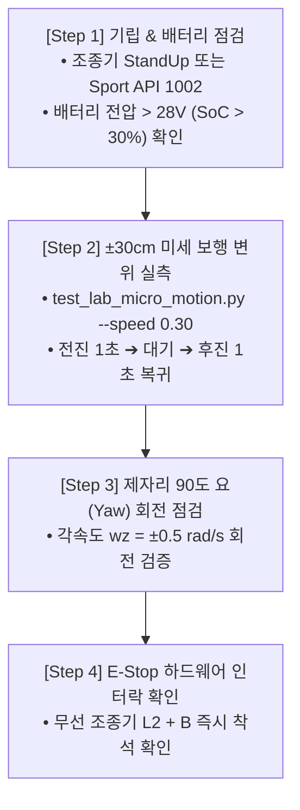

# 🛠️ [Jetson Control 02] 호스트 모터 구동 실측 검증 및 안전 SOP

> **문서 소유자**: **민석 (Hardware, Sensor & Deployment Lead)**  
> **상위 총괄 문서**: [`docs/jetson_plan/control/README.md`](file:///home/unitree/go2_ws_antarctica/docs/jetson_plan/control/README.md)  
> **실행 스크립트**: [`scratch/test_lab_micro_motion.py`](file:///C:/Users/USER/Desktop/%EC%BA%A1%EC%8A%A4%ED%86%A4/go2/scratch/test_lab_micro_motion.py)  
> **논문 공식 명칭**: **`ESCAPE-Nav: Experience-Shaped Causally Aligned Perception–Execution for Asynchronous VLM Navigation` (ICRA 2026)**  

---

## 📌 1. 현장 4단계 모터 구동 실측 검증 프로토콜

실물 로봇 현장 주행 전, 로봇의 모터와 DDS 통신이 정상인지 확인하는 **5분 현장 점검 절차**입니다:



---

## 🚀 2. 미세 보행 실측 실행 명령어 및 결과 판정

### 실행 명령어:
```bash
cd /home/unitree/go2_ws_antarctica
source /opt/ros/foxy/setup.bash
source install/setup.bash
export RMW_IMPLEMENTATION=rmw_cyclonedds_cpp
export CYCLONEDDS_URI="file:///home/unitree/go2_ws_antarctica/cyclonedds.xml"

python3 scratch/test_lab_micro_motion.py --speed 0.30 --duration 1.0
```

### 📋 판정 기준 (Pass/Fail Criteria):

| 측정 항목 | 정상 기준 (Pass) | 위험/이상 상태 (Fail) | 조치 사항 |
| :--- | :---: | :---: | :--- |
| **DDS 핸드셰이크** | $< 3.0\text{s}$ 내 연결 | $> 10\text{s}$ 타임아웃 | 메인보드 이더넷 케이블(`192.168.123.161`) 확인 |
| **배터리 잔량** | $\ge 30\%$ ($\ge 28.0\text{V}$) | $< 20\%$ ($< 26.0\text{V}$) | 즉시 충전 (저전압 시 모터 슬립 발생) |
| **전진 변위 ($\Delta x$)** | $+0.27\text{m} \sim +0.33\text{m}$ | $< +0.20\text{m}$ | 바닥 마찰력 또는 발바닥 슬립 확인 |
| **원점 복귀 오차** | $\le 0.03\text{m}$ ($3\text{cm}$) | $> 0.08\text{m}$ | 관절 캘리브레이션 재점검 |
| **Ctrl+C 비상 정지** | 즉시 $0.0\text{ m/s}$ 락 | 0.5초 이상 지연 | 프로세스 강제 종료 (`pkill -9 python3`) |

---

## 🔒 3. 현장 안전 운영 수칙 (SOP)

1. **안전 반경 확보**:
   - 테스트 시작 전 로봇 전후방 최소 $1.5\text{m}$ 이내에 장애물 및 인원이 없는지 확인합니다.
2. **무선 조종기 소지 의무화**:
   - 실험 진행자는 항상 Go2 순정 무선 조종기를 쥐고 대기하며, 오작동 시 **`L2 + B`**를 즉시 누릅니다.
3. **지상 평탄도 확인**:
   - 랩실 바닥에 전선, 물기, 미끄러운 비닐 등이 없는 평탄한 실내 복도에서 실행합니다.
