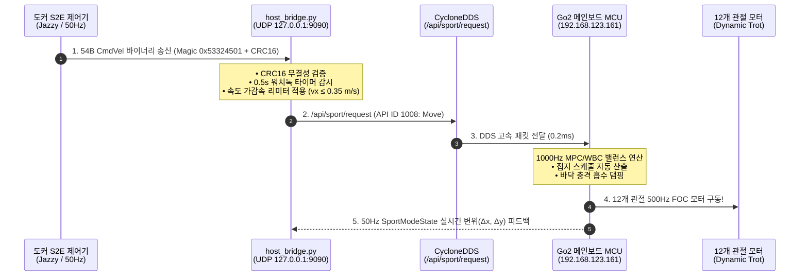

# 🐕 [Jetson Control] Tier 2: Jetson 호스트 로봇 모터 제어 총괄 가이드

> **문서 소유자**: **민석 (Hardware, Sensor & Deployment Lead)**  
> **상위 총괄 문서**: [`docs/jetson_plan/README.md`](file:///home/unitree/go2_ws_antarctica/docs/jetson_plan/README.md)  
> **대상 하드웨어**: NVIDIA Jetson Orin NX 16GB + Go2 메인보드 MCU (`192.168.123.161`)  
> **미들웨어 스택**: Ubuntu 20.04 LTS / ROS 2 Foxy / CycloneDDS / Unitree SDK2  
> **논문 공식 명칭**: **`ESCAPE-Nav: Experience-Shaped Causally Aligned Perception–Execution for Asynchronous VLM Navigation` (ICRA 2026)**  
> **문서 목적**: Jetson Orin NX 호스트 OS에서 Go2 메인보드 MCU로 인가되는 **Sport API (Move 1008) 모터 제어, 안전 인터락, 비상 정지(E-Stop), 50Hz 변위 실측 검증 프로토콜**을 총괄 정의합니다.

---

## 📌 1. Jetson 로봇 제어 아키텍처 (DDS & Hardware Layer)

---

## 📑 2. Jetson Control 세부 문서 인덱스

| 문서 번호 및 제목 | 핵심 내용 | 바로가기 |
| :--- | :--- | :---: |
| **01. Sport API 상세 분석 및 모션 프리미티브** | Unitree SDK2 API ID (Move: 1008, Damp: 1001, StandUp: 1002), JSON 파라미터 규격, 0.5초 워치독 안전 정지 타이머, 속도 가감속(Ramp) 리미터 | [01_문서 보기](file:///home/unitree/go2_ws_antarctica/docs/jetson_plan/control/01_sport_api_deep_dive_and_motion_primitives.md) |
| **02. 호스트 모터 구동 실측 검증 및 안전 SOP** | 현장 4단계 모터 구동 실측 절차 (기립 ➔ ±30cm 전후진 ➔ 90도 회전 ➔ E-Stop), `test_lab_micro_motion.py` 실행 런북, 변위 오차(<3cm) 판정 기준 | [02_문서 보기](file:///home/unitree/go2_ws_antarctica/docs/jetson_plan/control/02_host_actuation_verification_and_safety_sop.md) |

---

## 🛡️ 3. 3대 안전 가드레일 (Safety Guardrails)

1. **하드웨어 비상 정지 (Hardware E-Stop)**:
   * 현장 테스터는 무선 조종기(Remote Controller)를 항상 파지하고, 비상 시 즉시 **`L2 + B`**를 눌러 Damping 상태로 강제 착석시킵니다.
2. **0.5초 패킷 두절 워치독 (Watchdog Timer)**:
   * 도커 S2E로부터 0.5초 이상 UDP 속도 명령 패킷이 들어오지 않으면 `host_bridge.py`가 즉시 Zero-Velocity(`vx=0, vy=0, wz=0`)를 인가합니다.
3. **최대 속도 소프트웨어 하드 리미트**:
   * 전진 속도: 최대 $0.35\text{ m/s}$, 각속도: 최대 $0.60\text{ rad/s}$로 강제 클램핑됩니다.
