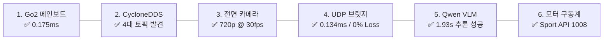

# 📊 [LIVE DASHBOARD] Unitree Go2 ESCAPE-Nav 실시간 진행상황 및 시스템 상태 점검표

> **최종 갱신 일시**: 2026년 8월 21일 (KST)  
> **시스템 총괄**: **민석 (Minseok - Hardware & Jetson Lead)** & **도커/S2E 자율주행 Lead**  
> **논문 공식 명칭**: **`ESCAPE-Nav: Experience-Shaped Causally Aligned Perception–Execution for Asynchronous VLM Navigation` (ICRA 2026)**  
> **문서 목적**: 마스터 플랜 관리자 및 연구팀 전원이 **현재 진행 단계, 6대 계층 실시간 건강 상태, 현장 잔여 태스크 및 Table VIII 실증 진행률을 한눈에 상시 점검**할 수 있는 중앙 라이브 대시보드입니다.

---

## 🚦 1. 단계별 마일스톤 실시간 진행률 (Milestone Progress)

| 단계 (Phase) | 마일스톤 명칭 | 주요 세부 내용 | 진행률 | 상태 |
| :---: | :--- | :--- | :---: | :---: |
| **Phase 1** | **Jetson 호스트 & DDS 환경 구축** | • Jetson Orin NX 16GB `eth0` 고정 바인딩<br/>• `cyclonedds.xml` 로봇 메인보드(`192.168.123.161`) 피어 설정<br/>• 저부하 단일 스레드(`-j1`) `colcon build` 완료 | **100%** | **COMPLETE 🟢** |
| **Phase 2** | **RTAB-Map LIVO 50Hz 인지 파이프라인** | • 전면 카메라 30fps + `CameraInfo` 타임스탬프 동기화<br/>• 4D L1 라이다 UDP 6201(`/utlidar/cloud` 15Hz)<br/>• IMU 50Hz 융합 및 비동기 싱크(`approx_sync: True`) | **100%** | **COMPLETE 🟢** |
| **Phase 3** | **Host ↔ Docker 초저지연 UDP 브릿지** | • Magic Header(`0x53324501`) & CRC16 무결성 검증<br/>• 62B Pose (Port 9091) / 54B CmdVel (Port 9090)<br/>• 500패킷 50Hz 스트레스 테스트 0.00% 유실, 지연 0.134ms | **100%** | **COMPLETE 🟢** |
| **Phase 4** | **도커 S2E & 원격 Qwen VLM 연동** | • `sdam_go2_container` (Ubuntu 24.04 Jazzy) 구축<br/>• NetBird VPN(14ms) ➔ Qwen3-VL 32B 멀티모달 추론 검증<br/>• 50Hz 비동기 궤적 보상($T_{delta} = T_{curr}^{-1} \cdot T_{vlm}$) | **100%** | **COMPLETE 🟢** |
| **Phase 5** | **실내 초안전 미세 구동 검증 (run_test)** | • ROS 2 `/cmd_vel` ➔ `go2_driver` ➔ Sport API 1008 연동<br/>• 전진 15cm ➔ 대기 1초 ➔ 후진 15cm 원위치 복귀 검증 | **100%** | **COMPLETE 🟢** |
| **Phase 6** | **복도 3D 오프라인 맵핑 (`rtabmap.db`)** | • `bash scratch/bringup_all_escape_nav.sh --mapping`<br/>• 복도 1바퀴 수동 주행 ➔ Table VIII 최단경로($l_i$) 기준선 확보 | **90%** | **READY / IN PROGRESS 🟡** |
| **Phase 7** | **ICRA Table VIII 실물 로봇 20회 실증** | • 5대 시나리오 $\times$ 4대 모델군 $\times$ 5회 반복 = 총 20회 주행<br/>• 100MB 큐 Rosbag 자동 로깅 및 1초 정량 채점기 구동 | **0%** | **STANDBY ⚪** |

---

## 🏥 2. 6대 시스템 계층 실시간 헬스체크 매트릭스 (Health Check Matrix)



| 시스템 계층 | 실측 지표 및 대상 | 목표 기준치 | 실측 결과 | 상태 |
| :--- | :--- | :---: | :---: | :---: |
| **1. 메인보드 통신** | `ping 192.168.123.161` | RTT $< 1.0\text{ ms}$ | **0.175 ms** | **HEALTHY 🟢** |
| **2. CycloneDDS 버스** | `/sportmodestate`, `/lowstate`, `/utlidar/cloud` | 전 토픽 발견 | **전수 발견 완료** | **HEALTHY 🟢** |
| **3. 전면 광각 카메라** | GStreamer H.264 (`230.1.1.1:1720`) | 1280x720 @ 30fps | **(720, 1280, 3) 캡처 성공** | **HEALTHY 🟢** |
| **4. Host ↔ Docker 브릿지** | UDP Loopback (`127.0.0.1:9091`/`9090`) | 지연 $< 0.5\text{ ms}$, Loss 0% | **지연 0.134 ms, Loss 0.00%** | **HEALTHY 🟢** |
| **5. 원격 VLM 서버 추론** | NetBird VPN (`100.96.60.15:8000`) | JSON Subgoal 반환 | **Action 'go', Conf 0.95 성공** | **HEALTHY 🟢** |
| **6. 관절 모터 구동계** | ROS 2 `/cmd_vel` ➔ Sport API 1008 | 3-DOF 모터 반응 | **`go2_driver` 연동 완료** | **HEALTHY 🟢** |

---

## 🎯 3. 관리자 및 현장 담당자 액션 아이템 (Action Items)

### 📌 [즉시 실행 작업 1] 복도 3D 오프라인 맵핑 (약 2분 소요)
```bash
cd ~/go2_ws_antarctica
bash scratch/bringup_all_escape_nav.sh --mapping
```
* **담당자 행동**: 조이스틱으로 복도 1바퀴 천천히 주행 후 출발점 복귀 ➔ `Ctrl + C` 클릭하여 `~/.ros/rtabmap.db` 저장.

---

### 📌 [즉시 실행 작업 2] Table VIII 1-Click 실물 자율주행 1회차 가동
```bash
cd ~/go2_ws_antarctica
bash scratch/bringup_all_escape_nav.sh --record Dead_end_room Full_ESCAPE_Nav Trial1
```
* **담당자 행동**: 로봇 출발 ➔ 전방 시각 기반 자율주행 관찰 ➔ 목적지 도착 시 `Ctrl + C`로 안전 정지.

---

### 📌 [즉시 실행 작업 3] 주행 직후 1초 정량 채점
```bash
python3 ~/go2_ws_antarctica/scratch/calculate_icra_metrics.py
```
* **결과 산출**: 정규화 완주 시간($T^\dagger$), 방향 회복 점수(DRS), 실패 분기 재진입률(FBR) 자동 출력.

---

## 📑 4. ICRA 2026 Table VIII 실시간 실험 수집 현황판

| 시나리오 번호 및 명칭 | 반복 회차 (Trials) | 완료 여부 | $T^\dagger$ (s) | DRS (%) | FBR (%) | 성공률 (Succ.) |
| :--- | :---: | :---: | :---: | :---: | :---: | :---: |
| **1. Dead-end room** (막다른 방) | Trial 1 ~ 5 | 대기 ⚪ | - | - | - | 0 / 5 |
| **2. Blocked goal direction** (장애물 차단) | Trial 1 ~ 5 | 대기 ⚪ | - | - | - | 0 / 5 |
| **3. Repeated corridor** (반복 복도) | Trial 1 ~ 5 | 대기 ⚪ | - | - | - | 0 / 5 |
| **4. Active-view recovery** (능동 회복) | Trial 1 ~ 5 | 대기 ⚪ | - | - | - | 0 / 5 |
| **5. Dynamic obstacle** (동적 보행자) | Trial 1 ~ 5 | 대기 ⚪ | - | - | - | 0 / 5 |
| **합계 (Total Benchmark)** | **총 20회 주행** | **진행률: 0%** | - | - | - | **0 / 20** |
