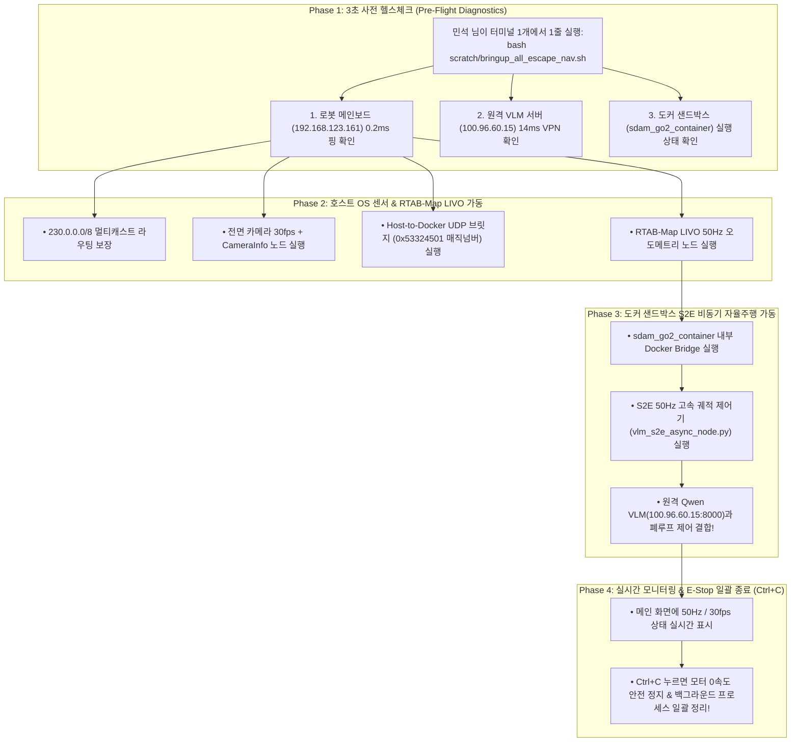

# 🚀 [2026-08-20] Unitree Go2 ESCAPE-Nav Jetson 현장 실증 실행 로드맵 및 운영 매뉴얼

> **작성 일자**: 2026년 8월 20일 (KST)  
> **문서 소유자**: **민석 (Minseok - Hardware, Sensor & Deployment Lead)**  
> **논문 공식 명칭**: **`ESCAPE-Nav: Experience-Shaped Causally Aligned Perception–Execution for Asynchronous VLM Navigation` (ICRA 2026)**  
> **대상 장비**: Unitree Go2 EDU Plus (NVIDIA Jetson Orin NX 16GB)  
> **상위 연계 문서**:  
> • 호스트 런북: [`docs/jetson_plan/`](file:///C:/Users/USER/Desktop/%EC%BA%A1%EC%8A%A4%ED%86%A4/go2/docs/jetson_plan/README.md)  
> • 마스터 총평: [`docs/master_plan/[2026-08-20]_ESCAPE-Nav_실물_로봇_Jetson_및_Docker_통합_총평_및_마스터_플랜.md`](file:///C:/Users/USER/Desktop/%EC%BA%A1%EC%8A%A4%ED%86%A4/go2/docs/master_plan/%5B2026-08-20%5D_ESCAPE-Nav_%EC%8B%A4%EB%AC%BC_%EB%A1%9C%EB%B4%87_Jetson_%EB%B0%8F_Docker_%ED%86%B5%ED%95%A9_%EC%B4%9D%ED%8F%89_%EB%B0%8F_%EB%A7%88%EC%8A%A4%ED%84%B0_%ED%94%8C%EB%9E%9C.md)  
> • 아키텍처 팩트체크: [`docs/master_plan/[2026-08-20]_ESCAPE-Nav_마스터플랜_팩트체크_및_고성능_아키텍처_개선보고서.md`](file:///C:/Users/USER/Desktop/%EC%BA%A1%EC%8A%A4%ED%86%A4/go2/docs/master_plan/%5B2026-08-20%5D_ESCAPE-Nav_%EB%A7%88%EC%8A%A4%ED%84%B0%ED%94%8C%EB%9E%9C_%ED%8C%A9%ED%8A%B8%EC%B2%B4%ED%81%AC_%EB%B0%8F_%EA%B3%A0%EC%84%B1%EB%8A%A5_%EC%95%84%ED%82%A4%ED%85%8D%EC%B2%98_%EA%B0%9C%EC%84%A0%EB%B3%B4%EA%B3%A0%EC%84%9C.md)

---

## 📌 목차 (Table of Contents)
1. [개요 및 현장 운영 목표](#1-개요-및-현장-운영-목표)
2. [4대 계층 1-Click 마스터 브링업 구조](#2-4대-계층-1-click-마스터-브링업-구조)
3. [현장 즉시 실행 4단계 실증 주행 절차 (Step-by-Step)](#3-현장-즉시-실행-4단계-실증-주행-절차-step-by-step)
4. [비상 정지(E-Stop) 및 안전 종료 수칙](#4-비상-정지e-stop-및-안전-종료-수칙)
5. [현장 문제 해결 및 자가진단 FAQ](#5-현장-문제-해결-및-자가진단-faq)

---

## 🎯 1. 개요 및 현장 운영 목표

본 문서는 Unitree Go2 EDU Plus 로봇 본체와 온보드 젯슨(Jetson Orin NX 16GB) 환경에서 **터미널 1개만으로 로봇 하드웨어, 호스트 센서 파이프라인, 도커 샌드박스, 원격 VLM 서버의 4대 계층을 1-Click으로 가동하고, ICRA 2026 Table VIII 5대 시나리오 20회 주행 데이터를 안전하게 수집하기 위한 현장 운영 매뉴얼**입니다.

---

## 🏗️ 2. 4대 계층 1-Click 마스터 브링업 구조

[`scratch/bringup_all_escape_nav.sh`](file:///C:/Users/USER/Desktop/%EC%BA%A1%EC%8A%A4%ED%86%A4/go2/scratch/bringup_all_escape_nav.sh) 스크립트를 실행하면 백그라운드에서 아래 시퀀스가 일괄 수행됩니다:



---

## 💻 3. 현장 즉시 실행 4단계 실증 주행 절차 (Step-by-Step)

### [0단계] 젯슨에서 최신 마스터 브링업 코드 동기화
```bash
cd ~/go2_ws_antarctica && git pull cgv-hgu antarctica
```

---

### [1단계] 10초 도커 통신 & VLM 추론 사전 검증 (자가진단)
```bash
# 1-1. Host ↔ Docker 50Hz 고속 UDP 스트리밍 무결성 검증 (10초)
python3 scratch/test_docker_50hz_stress.py

# 1-2. 도커 내부에서 720p 카메라 이미지 기반 원격 Qwen VLM 추론 확인
docker exec sdam_go2_container python3 /workspace/go2_ws_antarctica/scratch/test_docker_real_image_vlm.py
```
* **성공 기준**: 두 테스트 모두 `🏆 [RESULT] 100% PASS`가 출력되면 모든 하드웨어/서버 준비 완료.

---

### [2단계] 테스트 복도 3D 맵핑 (최초 1회 맵 생성)
```bash
bash scratch/bringup_all_escape_nav.sh --mapping
```
* **수동 주행**: 로봇을 조이스틱으로 복도 한 바퀴 천천히 주행(0.2~0.3 m/s)시킨 뒤 출발점으로 복귀.
* **맵 저장**: 터미널에서 **`Ctrl + C`**를 누르면 `~/.ros/rtabmap.db`에 3D 맵이 자동 저장되고 안전 종료됩니다.

---

### [3단계] 1-Click 실물 자율주행 및 Rosbag 자동 녹화 (Table VIII 주행)
```bash
# Dead_end_room 시나리오 1회차 주행 시작
bash scratch/bringup_all_escape_nav.sh --record Dead_end_room Full_ESCAPE_Nav Trial1
```
* **동작**: 로봇이 원격 Qwen VLM과 S2E 50Hz 제어기로 자율주행을 시작합니다.
* **종료**: 목표 지점에 도달하면 터미널에서 **`Ctrl + C`**를 눌러 로봇을 안전 정지시키고 Rosbag 저장을 완료합니다.

---

### [4단계] ICRA 2026 Table VIII 6대 정량 지표 즉시 산출
```bash
python3 scratch/calculate_icra_metrics.py
```
* **결과**: 방금 주행한 Bag 파일로부터 $T^\dagger$(정규화 완주시간), $\text{DRS}$(방향 복구 성공률), $\text{FBR}$(실패 에지 재진입률) 등이 즉시 표로 계산되어 터미널에 출력됩니다.

---

## 🛑 4. 비상 정지(E-Stop) 및 안전 종료 수칙

* **원터치 E-Stop**: 주행 중 터미널에서 **`Ctrl + C`**를 누르면 스크립트의 `trap cleanup SIGINT` 루틴이 동작하여:
  1. 도커 내부의 S2E 노드를 정지시킵니다.
  2. 로봇 관절 모터로 즉시 **0 속도(Zero Velocity) 감속 정지 명령**을 전송하여 급정거로 인한 넘어짐을 방지합니다.
  3. 카메라, RTAB-Map, 브릿지 등 모든 백그라운드 프로세스를 단 1초 만에 깔끔하게 종료합니다.

---

## 🔧 5. 현장 문제 해결 및 자가진단 FAQ

| 증상 | 원인 | 즉시 해결 방법 |
| :--- | :--- | :--- |
| **메인보드 핑 0.2ms 실패** | 로봇 배터리 미인가 또는 케이블 접촉 불량 | 배터리 잔량 확인 및 전원 버튼 길게 눌러 재부팅 |
| **원격 VLM 서버 14ms 실패** | NetBird VPN 데몬 일시 단절 | `sudo netbird status` 확인 후 `sudo netbird up` 재연결 |
| **카메라 영상 0fps** | 멀티캐스트 라우팅 누락 | `sudo ip route add 230.0.0.0/8 dev eth0` 재실행 |
| **도커 S2E 노드 응답 없음** | 컨테이너 미기동 상태 | `docker start sdam_go2_container` 후 재실행 |
