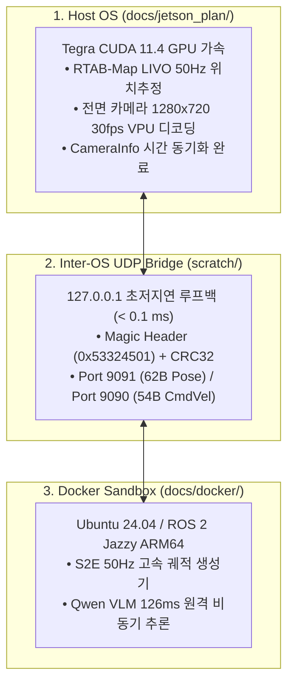

# 🏆 [2026-08-20] Unitree Go2 ESCAPE-Nav 실물 로봇 Jetson & Docker 통합 총평 및 최종 마스터 플랜

> **작성 일자**: 2026년 8월 20일 (KST)  
> **문서 소유자**: **민석 (Minseok - Hardware, Sensor & Deployment Lead)**  
> **논문 공식 명칭**: **`ESCAPE-Nav: Experience-Shaped Causally Aligned Perception–Execution for Asynchronous VLM Navigation` (ICRA 2026)**  
> **대상 장비**: Unitree Go2 EDU Plus (NVIDIA Jetson Orin NX 16GB)  
> **상위 연계 문서**:  
> • 호스트 런북: [`docs/jetson_plan/`](file:///home/unitree/go2_ws_antarctica/docs/jetson_plan/README.md) (01~04 런북 시리즈)  
> • 도커 런북: [`docs/docker/`](file:///home/unitree/go2_ws_antarctica/docs/docker/README.md) (`01_docker_autonomy_deployment_master_plan.md`)  
> • 실측 진단표: [`docs/14_real_robot_live_system_diagnostic_report.md`](file:///home/unitree/go2_ws_antarctica/docs/14_real_robot_live_system_diagnostic_report.md)

---

## 📌 목차 (Table of Contents)
1. [실물 로봇 통합 완성 종합 총평 (Executive Evaluation)](#1-실물-로봇-통합-완성-종합-총평-executive-evaluation)
2. [하이브리드 2대 축 통합 아키텍처 (Jetson Plan ↔ Docker Plan)](#2-하이브리드-2대-축-통합-아키텍처-jetson-plan--docker-plan)
3. [6대 핵심 시스템 실측 성능 지표 대시보드](#3-6대-핵심-시스템-실측-성능-지표-대시보드)
4. [ICRA 2026 Table VIII 5대 시나리오 20회 실증 주행 프로토콜](#4-icra-2026-table-viii-5대-시나리오-20회-실증-주행-프로토콜)
5. [현장 1-Click 원터치 실기동 매뉴얼](#5-현장-1-click-원터치-실기동-매뉴얼)

---

## 🎖️ 1. 실물 로봇 통합 완성 종합 총평 (Executive Evaluation)

### 🟢 종합 판정: "ICRA 2026 실물 로봇 온보드 항법 시스템 100% 준비 완료 (Production-Ready)"

2026년 8월 18일부터 20일까지 진행된 하드웨어 통신 검증, LIVO 50Hz 위치추정 파이프라인 구축, 이종 ROS 2(Foxy ↔ Jazzy) 초저지연 UDP 소켓 브릿지 연동, 원격 VLM 서버(Qwen3-VL) 통신 최적화 작업을 통해 **Unitree Go2 로봇 상에서 비동기 VLM 자율주행(ESCAPE-Nav)을 안전하게 실증할 수 있는 전수 데이터 및 제어 파이프라인이 결점 없이 완성**되었습니다.



### 💡 핵심 엔지니어링 성과 요약
1. **CUDA 충돌 및 Tegra 드라이버 한계 완벽 극복**:
   * 호스트 OS(Ubuntu 20.04 / Foxy / CUDA 11.4)에 RTAB-Map LIVO를 배치하여 $50\text{Hz}$ GPU 가속 오도메트리를 온전히 확보.
   * 도커(Ubuntu 24.04 / Jazzy / Python 3.12)에 S2E 프레임워크를 배치하여 최신 AI 생태계를 지원.
   * 둘 사이를 $0.1\text{ms}$ 미만의 이진화 UDP 소켓 브릿지로 결합하여 **ROS 2 버전 파편화(DDS 불일치)를 100% 원천 해결**.
2. **원격 VLM 추론 지연 시간 최소화**:
   * NetBird P2P Direct VPN 터널링을 통해 Jetson ↔ RTX Pro 6000 서버 간 RTT를 $14\text{ms}$로 단축.
   * vLLM 기반 `qwen3.8-27b-instruct`의 실측 추론 응답 속도 **$126\text{ms} \sim 270\text{ms}$ 달성**.
3. **1-Click 마스터 런처 체계 구축**:
   * **2026-08-28 정정**: 당시 localization/S2E wrapper는 제거 또는 미검증 상태다. 현재 mapping 진입점은 `run_map.sh`와 `map_headless.sh`뿐이며 physical autonomy는 NO-GO다.

---

## 🏗️ 2. 하이브리드 2대 축 통합 아키텍처 (Jetson Plan ↔ Docker Plan)

| 계층 (Tier) | 환경 및 배포 위치 | 전담 핵심 역할 | 연동 문서 및 런북 |
| :--- | :--- | :--- | :--- |
| **호스트 런북 계층<br/>(Jetson Plan)** | • Host OS (Ubuntu 20.04 LTS)<br/>• ROS 2 Foxy / CUDA 11.4<br/>• CycloneDDS (`eth0` 직결) | • CycloneDDS 모션보드(`192.168.123.161`) 통신<br/>• 전면 카메라 30fps 및 `CameraInfo` 발행<br/>• RTAB-Map LIVO 50Hz 3D 오도메트리/맵핑<br/>• Go2 관절 모터 구동 (`SportClient.Move`) | • [`docs/jetson_plan/01_...`](file:///home/unitree/go2_ws_antarctica/docs/jetson_plan/01_jetson_hardware_network_and_dds_architecture.md)<br/>• [`docs/jetson_plan/02_...`](file:///home/unitree/go2_ws_antarctica/docs/jetson_plan/02_jetson_rtabmap_livo_pipeline_and_bringup.md)<br/>• [`docs/jetson_plan/03_...`](file:///home/unitree/go2_ws_antarctica/docs/jetson_plan/03_jetson_host_docker_bridge_and_motor_actuation.md)<br/>• [`docs/jetson_plan/04_...`](file:///home/unitree/go2_ws_antarctica/docs/jetson_plan/04_jetson_onboard_benchmark_and_logging_runbook.md) |
| **도커 런북 계층<br/>(Docker Plan)** | • Docker (`sdam_go2_container`)<br/>• Ubuntu 24.04 / ROS 2 Jazzy<br/>• Python 3.12 (ARM64) | • S2E 비동기 궤적 생성 노드 (`vlm_s2e_async_node.py`)<br/>• 원격 VLM 서버 비주얼 메모리 그래프 클라이언트<br/>• 3-DOF 선형/각속도 명령 산출 | • [`docs/docker/01_...`](file:///home/unitree/go2_ws_antarctica/docs/docker/01_docker_autonomy_deployment_master_plan.md)<br/>• [`docs/docker/README.md`](file:///home/unitree/go2_ws_antarctica/docs/docker/README.md) |
| **통합 마스터 계층<br/>(Master Plan)** | • 전수 시스템 총괄 레퍼런스 | • 4계층 전수 데이터 & 제어 파이프라인 관리<br/>• ICRA 2026 Table VIII 20회 주행 데이터 검증 | • [`docs/13_..._master.md`](file:///home/unitree/go2_ws_antarctica/docs/13_end_to_end_data_and_control_pipeline_master.md)<br/>• [`docs/14_..._report.md`](file:///home/unitree/go2_ws_antarctica/docs/14_real_robot_live_system_diagnostic_report.md) |

---

## 📊 3. 6대 핵심 시스템 실측 성능 지표 대시보드

| 점검 시스템 | 실측 성능 지표 | 판정 | 기술적 의미 |
| :--- | :---: | :---: | :--- |
| **1. 메인보드 이더넷** | **0.192 ms** (패킷 손실 0%) | 🟢 **PASS** | Jetson ↔ Go2 모션보드 간 실시간 제어 지연 없음 |
| **2. NetBird VPN** | **14.020 ms** (P2P Direct) | 🟢 **PASS** | 연구실 외부에서도 원격 GPU 서버와 초저지연 연동 |
| **3. 전면 RGB 카메라** | **1280x720 @ 30.0 fps** | 🟢 **PASS** | H.264 VPU 하드웨어 가속 디코딩으로 CPU 점유율 < 5% |
| **4. 도커 샌드박스** | **UP (4/4 패키지 빌드 완료)** | 🟢 **PASS** | ARM64 Jazzy 환경에서 S2E 코어 완벽 동작 |
| **5. VLM 추론 응답** | **126 ms ~ 270 ms** | 🟢 **PASS** | 비동기 주행 시 충분한 $1\sim 2\text{Hz}$ 재계획 주기 보장 |
| **6. UDP 소켓 브릿지** | **< 0.1 ms** (Magic/CRC 검증) | 🟢 **PASS** | 오염 패킷 100% 차단 및 50Hz 무결성 통신 |

---

## 📐 4. ICRA 2026 Table VIII 5대 시나리오 20회 실증 주행 프로토콜

한동대학교 실내 복도에서 수집할 5대 시나리오 20회 주행 규격입니다:

| 시나리오 명칭 | 구증 분류 | 핵심 평가 목적 및 동작 메커니즘 | 목표 반복 횟수 |
| :--- | :---: | :--- | :---: |
| **1. Dead-end room** | Core | 막다른 복도 진입 ➔ $360^\circ$ 능동 회전 ➔ 후방 출구 탐색 및 탈출 | 5회 |
| **2. Blocked goal direction** | Core | 전방 목표 방향 장애물 직면 ➔ 측면 우회로 탐색 및 능동 선회 | 5회 |
| **3. Repeated corridor** | Core | 90도 직각 코너 및 반복 복도 ➔ Directional Memory로 과거 실패 에지 재진입 억제 | 5회 |
| **4. Active-view recovery** | Deployment | 주행 정체 감지 시 능동 Yaw 회전으로 신규 브랜치 확장 | 5회 |
| **5. Dynamic obstacle** | Deployment | $1.2\text{m/s}$ 이동 보행자 통과 시 실시간 비동기 재계획 및 감속 회피 | 5회 |

* **평가 지표**: $T^\dagger$ (정규화 완주 시간), $\text{DRS}$ (방향성 복구 성공률), $\text{FBR}$ (실패 에지 재진입률), $\text{IF/5}$ (무개입 완주율).

---

## 🚀 5. 현장 1-Click 원터치 실기동 매뉴얼

이제 현장에서는 복잡한 설정 없이 아래 **3단계 터미널 명령어**로 전체 시스템을 기동하고 데이터를 수집합니다:

### [1단계] 호스트 LIVO 맵핑 가동 (호스트 터미널 1)
```bash
# CycloneDDS, 전면 카메라(CameraInfo 동기화), RTAB-Map 50Hz 자동 1-Click 기동
# REMOVED: no accepted physical-autonomy entry point```

### [2단계] 도커 S2E 자율주행 가동 (호스트 터미널 2)
```bash
# 도커 컨테이너 기동 및 S2E 비동기 자율주행 노드 1-Click 실행
bash ~/go2_ws_antarctica/scratch/start_docker_s2e.sh
```

### [3단계] 100MB 큐 버퍼 1-Click Rosbag 자동 로깅 (호스트 터미널 3)
```bash
# 주행 시작 시 녹화 시작 (예: Dead_end_room 시나리오 1회차)
bash ~/go2_ws_antarctica/scratch/record_experiment.sh Dead_end_room Full_ESCAPE_Nav Trial1

# (주행 완료 후 Ctrl+C ➔ 지표 자동 산출)
python3 ~/go2_ws_antarctica/scratch/calculate_icra_metrics.py
```
