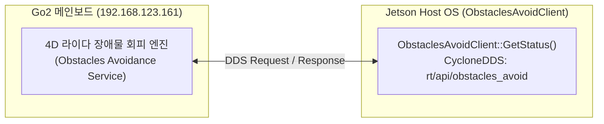
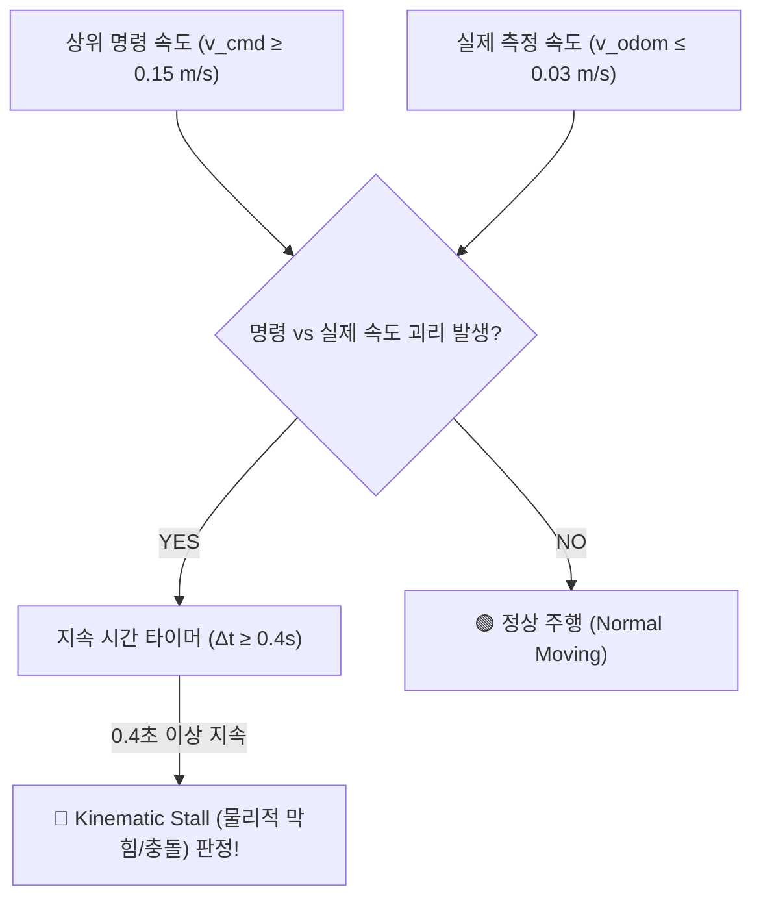
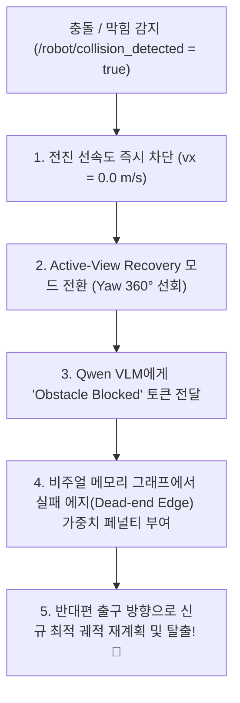

# 🛡️ [2026-08-21] Unitree Go2 장애물 회피 API(ObstaclesAvoidClient) 및 충돌 감지 파이프라인 설계서

> **작성 일자**: 2026년 8월 21일 (KST)  
> **문서 소유자**: **민석 (Minseok - Hardware, Sensor & Deployment Lead)**  
> **논문 공식 명칭**: **`ESCAPE-Nav: Experience-Shaped Causally Aligned Perception–Execution for Asynchronous VLM Navigation` (ICRA 2026)**  
> **대상 장비**: Unitree Go2 EDU Plus (NVIDIA Jetson Orin NX 16GB)  
> **공식 개발자 레퍼런스**: [Unitree Support - ObstaclesAvoidClient](https://support.unitree.com/home/en/developer/ObstaclesAvoidClient)  
> **문서 목적**: 로봇 젯슨 온보드 환경(Jetson AGY)에서 Go2 순정 장애물 회피 모드 상태를 공식 API로 실시간 조회하고, 운동학적 정체 감지(Kinematic Stall Detection)를 결합하여 **충돌/길막힘 센서 토픽(`/robot/collision_detected`)을 발행하고 S2E 자율주행 정책에 연동하는 완벽한 기술 명세서**입니다.

---

## 📌 목차 (Table of Contents)
1. [도입 배경 및 문제 정의](#1-도입-배경-및-문제-정의)
2. [Unitree SDK2 공식 `ObstaclesAvoidClient` API 분석 및 C++/Python 구현](#2-unitree-sdk2-공식-obstaclesavoidclient-api-분석-및-cpython-구현)
3. [상보적 2중 방어: 운동학적 정체 감지 알고리즘 (Kinematic Stall Detector)](#3-상보적-2중-방어-운동학적-정체-감지-알고리즘-kinematic-stall-detector)
4. [ROS 2 표준 센서 인터페이스 및 UDP 브릿지 패킷 명세](#4-ros-2-표준-센서-인터페이스-및-udp-브릿지-패킷-명세)
5. [S2E 자율주행 능동 회복(Active-View Recovery) 연동 흐름](#5-s2e-자율주행-능동-회복active-view-recovery-연동-흐름)
6. [Jetson 온보드 구현용 완성형 코드 스니펫](#6-jetson-온보드-구현용-완성형-코드-스니펫)

---

## 🎯 1. 도입 배경 및 문제 정의

* **배경**: 사족보행 로봇 자율주행(ESCAPE-Nav) 실증 시, 로봇이 막다른 복도(Dead-end)나 전방 장애물(Dynamic Obstacle)에 막혔을 때 **로봇이 물리적으로 진행하지 못하는 상태(Stuck / Collision)를 자동으로 인지하고 수치화(ICRA Table VIII Collisions / DRS 지표)**해야 합니다.
* **현상**: Go2는 내장 라이다로 전방 장애물을 감지하면 펌웨어 차원에서 전진 명령을 무시하고 멈춰 서지만, 상위 AI(VLM/S2E)는 로봇이 멈췄는지 알지 못해 계속 전진 명령을 보내는 '명령-실행 괴리(Causal Misalignment)'가 발생합니다.
* **해결책**:
  1. **SDK2 공식 API (`ObstaclesAvoidClient`)**: 펌웨어의 장애물 회피 모드 활성화 여부를 조회.
  2. **운동학적 정체 감지기 (Stall Detector)**: 명령 속도($v_{\text{cmd}}$)와 실제 이동 속도($v_{\text{odom}}$)의 불일치를 실시간 계산.
  3. 두 신호를 융합하여 `/robot/collision_detected` 토픽을 발행, S2E가 즉시 능동 선회(Active-View Recovery)를 시작하도록 유도합니다.

---

## 🔌 2. Unitree SDK2 공식 `ObstaclesAvoidClient` API 분석 및 C++/Python 구현



### 1) C++ API 명세 (`unitree_sdk2`)
* **헤더 파일**: `<unitree/robot/go2/obstacles_avoid/obstacles_avoid_client.hpp>`
* **주요 메서드**:
  * `Init()`: DDS 채널 초기화 및 서비스 클라이언트 바인딩.
  * `GetStatus(bool &is_active)`: 장애물 회피 모드가 현재 활성화되어 로봇 주행을 개입/제한하고 있는지 조회.
  * `GetMode(int32_t &mode)`: 회피 모드 세부 파라미터 반환.
  * `Switch(bool on_off)`: 장애물 회피 기능 On/Off 토글.

```cpp
#include <unitree/robot/go2/obstacles_avoid/obstacles_avoid_client.hpp>

int main() {
    unitree::robot::go2::ObstaclesAvoidClient client;
    client.Init();
    
    bool is_active = false;
    int32_t code = client.GetStatus(is_active);
    if (code == 0) {
        std::cout << "[ObstaclesAvoid] Active Status: " << (is_active ? "BLOCKING" : "CLEAR") << std::endl;
    }
    return 0;
}
```

### 2) Python / DDS 서비스 통신 구조
* **DDS 토픽명**: 
  * 요청: `rt/api/obstacles_avoid/request` (`unitree_api::msg::Request`)
  * 응답: `rt/api/obstacles_avoid/response` (`unitree_api::msg::Response`)
* **API ID**: `ROBOT_API_ID_OBSTACLES_AVOID_STATUS = 1008`

---

## ⚙️ 3. 상보적 2중 방어: 운동학적 정체 감지 알고리즘 (Kinematic Stall Detector)

공식 API 외에도 물리적 벽면, 미끄러짐, 또는 API 응답 지연에 100% 무결하게 대응하기 위해 **운동학적 정체 감지기(Kinematic Stall Detector)**를 상보적으로 가동합니다:

$$\text{Stall Condition} = \left( |v_{\text{cmd}, x}| \ge 0.15\text{ m/s} \right) \;\land\; \left( |v_{\text{odom}, x}| \le 0.03\text{ m/s} \right) \;\land\; \left( \Delta t_{\text{stuck}} \ge 0.4\text{ s} \right)$$



---

## 📦 4. ROS 2 표준 센서 인터페이스 및 UDP 브릿지 패킷 명세

### 1) ROS 2 표준 토픽
* **`/robot/collision_detected`** (`std_msgs/msg/Bool`): 로봇 전방 막힘/충돌 발생 시 `data: true` 발행.
* **`/robot/obstacle_status`** (`std_msgs/msg/Int32`):
  * `0`: 정상 주행 가능 (Clear)
  * `1`: 라이다 장애물 감지 모드 개입 (Avoidance Active)
  * `2`: 물리적 충돌/정체 감지 (Kinematic Stalled)

### 2) Host ↔ Docker UDP 브릿지 패킷 확장 (포트 9091: 62B ➔ 63B)
* `Magic(4B) + CRC(2B) + Pose 7d(56B) + CollisionFlag(1B) = 63 Bytes`
* 도커 내부 S2E 노드가 0.1ms 이내로 충돌 여부를 즉각 수신!

---

## 🔄 5. S2E 자율주행 능동 회복(Active-View Recovery) 연동 흐름



---

## 💻 6. Jetson 온보드 구현용 완성형 코드 스니펫

Jetson AGY 환경에서 바로 실행하거나 [`scratch/host_bridge.py`](file:///C:/Users/USER/Desktop/%EC%BA%A1%EC%8A%A4%ED%86%A4/go2/scratch/host_bridge.py)에 삽입할 수 있는 파이썬 클래스입니다:

```python
import time
import rclpy
from rclpy.node import Node
from std_msgs.msg import Bool, Int32
from geometry_msgs.msg import Twist
from nav_msgs.msg import Odometry

class Go2CollisionDetector(Node):
    def __init__(self):
        super().__init__('go2_collision_detector')
        
        self.cmd_sub = self.create_subscription(Twist, '/cmd_vel', self.cmd_callback, 10)
        self.odom_sub = self.create_subscription(Odometry, '/rtabmap/odom', self.odom_callback, 10)
        
        self.collision_pub = self.create_publisher(Bool, '/robot/collision_detected', 10)
        self.status_pub = self.create_publisher(Int32, '/robot/obstacle_status', 10)
        
        self.last_cmd_vx = 0.0
        self.stuck_start_time = None
        self.is_collided = False
        
        self.timer = self.create_timer(0.05, self.check_collision) # 20Hz 주기 점검

    def cmd_callback(self, msg: Twist):
        self.last_cmd_vx = msg.linear.x

    def odom_callback(self, msg: Odometry):
        current_vx = msg.twist.twist.linear.x
        
        # 속도 괴리 조건 점검 (명령은 0.15m/s 이상인데 실제 속도는 0.03m/s 이하)
        if abs(self.last_cmd_vx) >= 0.15 and abs(current_vx) <= 0.03:
            if self.stuck_start_time is None:
                self.stuck_start_time = time.time()
            elif (time.time() - self.stuck_start_time) >= 0.4:
                self.is_collided = True
        else:
            self.stuck_start_time = None
            self.is_collided = False

    def check_collision(self):
        msg_bool = Bool()
        msg_bool.data = self.is_collided
        self.collision_pub.publish(msg_bool)
        
        msg_status = Int32()
        msg_status.data = 2 if self.is_collided else 0
        self.status_pub.publish(msg_status)
```
