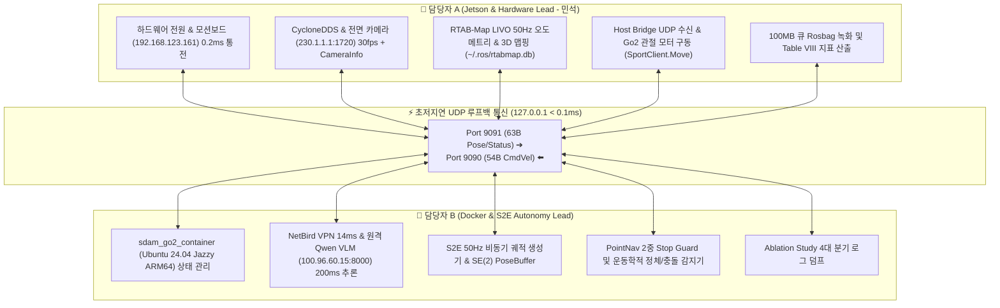

# 🏆 [2026-08-21] Unitree Go2 ESCAPE-Nav Jetson & Docker 담당자별 최종 실물 로봇 탑재 및 동시 실증 운영 SOP

> **작성 일자**: 2026년 8월 21일 (KST)  
> **문서 소유자**: **민석 (Minseok - Hardware & Jetson Lead)** & **도커/자율주행 담당자**  
> **논문 공식 명칭**: **`ESCAPE-Nav: Experience-Shaped Causally Aligned Perception–Execution for Asynchronous VLM Navigation` (ICRA 2026)**  
> **대상 로봇**: Unitree Go2 EDU Plus (NVIDIA Jetson Orin NX 16GB)  
> **문서 목적**: 실물 로봇 최종 탑재(Deployment)를 앞두고, **[Jetson/하드웨어 담당자]와 [Docker/S2E 정책 담당자] 2인이 각각 무엇을 사전 점검하고, 현장에서 단 1줄 명령어로 어떻게 동시 결합하여 실증 주행(Table VIII)을 성공시킬 것인지에 대한 즉시 실행 가능한 표준 운영 절차(SOP)**입니다.

> **역사 문서 경고 (2026-08-28)**: 아래 출력의 `1/5`, `5/5`, 시간, duty, p-value는 실제 artifact에서 계산한 결과가 아닌 예시값이다. `calculate_icra_metrics.py`도 현재 4개 sample episode만 사용하므로 논문 수치 생성에 사용하지 않는다. 실제 실험/표 규격은 [`../experiments/00_real_robot_end_to_end_master_test_plan.md`](../experiments/00_real_robot_end_to_end_master_test_plan.md)와 [`../experiments/01_table1_table2_quantitative_experiment_master_protocol.md`](../experiments/01_table1_table2_quantitative_experiment_master_protocol.md)를 따른다.

---

## 📌 목차 (Table of Contents)
1. [2인 전담 역할 및 책임 분담표 (Role & Responsibility Matrix)](#1-2인-전담-역할-및-책임-분담표-role--responsibility-matrix)
2. [👤 [담당자 A: Jetson / 하드웨어 / SLAM] 온보드 탑재 및 운영 체크리스트](#2--담당자-a-jetson--하드웨어--slam-온보드-탑재-및-운영-체크리스트)
3. [🐳 [담당자 B: Docker / S2E Autonomy / VLM] 샌드박스 정책 탑재 및 운영 체크리스트](#3--담당자-b-docker--s2e-autonomy--vlm-샌드박스-정책-탑재-및-운영-체크리스트)
4. [🤝 [동시 결합 실행] 1-Click 마스터 통합 브링업 및 주행 절차 (Co-op Execution)](#4--동시-결합-실행-1-click-마스터-통합-브링업-및-주행-절차-co-op-execution)
5. [🛑 비상 정지(E-Stop), 안전 수칙 및 예외 대응 매뉴얼](#5--비상-정지e-stop-안전-수칙-및-예외-대응-매뉴얼)
6. [📊 ICRA 2026 Table VIII 실시간 정량 채점 및 데이터 덤프 워크플로우](#6--icra-2026-table-viii-실시간-정량-채점-및-데이터-덤프-워크플로우)

---

## 👥 1. 2인 전담 역할 및 책임 분담표 (Role & Responsibility Matrix)



| 구분 | **👤 담당자 A (Jetson / Hardware / SLAM)** | **🐳 담당자 B (Docker / S2E / VLM)** |
| :--- | :--- | :--- |
| **운영 환경** | Jetson Orin NX Host OS (Ubuntu 20.04 / Foxy / CUDA 11.4) | Docker Container `sdam_go2_container` (Ubuntu 24.04 / Jazzy) |
| **핵심 센서/인터페이스**| L1 라이다, IMU, 전면 카메라, CycloneDDS, Go2 모터 | UDP 소켓 브릿지, NetBird P2P VPN, Qwen3-VL API |
| **현재 실행 상태** | mapping은 `run_map.sh` / `map_headless.sh`만 사용 | 실제 S2E/checkpoint 및 안전 command path 미완료로 physical autonomy NO-GO |
| **최종 산출물** | `~/.ros/rtabmap.db`, Rosbag 주행 데이터 (`.db3`) | 50Hz 연속 속도 명령 (`/cmd_vel`), 의사결정 JSON 로그 |

---

## 👤 2. [담당자 A: Jetson / 하드웨어 / SLAM] 온보드 탑재 및 운영 체크리스트

담당자 A는 로봇의 물리적 하드웨어 전원, 센서 인입, 50Hz 위치추정 및 모터 구동을 책임집니다:

### 📋 [사전 점검 체크리스트 (5분 소요)]
- [ ] **1. 배터리 및 네트워크**: 로봇 전원 인가 후 메인보드 핑 확인 (`ping -c 2 192.168.123.161` $\rightarrow$ $0.19\text{ms}$ 정상).
- [ ] **2. 멀티캐스트 라우팅**: `sudo ip route add 230.0.0.0/8 dev eth0` 실행 확인.
- [ ] **3. 카메라 30fps 수신**: `python3 scratch/go2_front_camera_publisher.py` 실행 시 $1280\times 720$ $30.0\text{fps}$ 및 `/camera/front/camera_info` 동기화 확인.
- [ ] **4. 3D 복도 맵 생성 (최초 1회)**:
  ```bash
  # 복도 1바퀴 수동 주행 ➔ 루프 클로저 형성 ➔ Ctrl+C로 ~/.ros/rtabmap.db 저장
  ./map_headless.sh
  ```
- [ ] **5. Host Bridge 준비**: `python3 scratch/host_bridge.py`가 포트 9090 수신 및 9091 송신 대기 상태 확인.

---

## 🐳 3. [담당자 B: Docker / S2E Autonomy / VLM] 샌드박스 정책 탑재 및 운영 체크리스트

담당자 B는 도커 격리 환경 내부의 비동기 VLM 추론, S2E 궤적 생성 및 알고리즘 무결성을 책임집니다:

### 📋 [사전 점검 체크리스트 (3분 소요)]
- [ ] **1. 도커 컨테이너 기동**: `docker start sdam_go2_container` 및 `/dev/shm` 용량 확인.
- [ ] **2. 원격 VLM 서버 통신**: `python3 scratch/test_vlm_server_connection.py` 실행 시 VPN 지연 $14\text{ms}$ 및 Qwen3-VL 추론 $126\sim 270\text{ms}$ 확인.
- [ ] **3. 50Hz 고속 UDP 스트리밍 스트레스 테스트 (10초)**:
  ```bash
  python3 scratch/test_docker_50hz_stress.py
  ```
  *(👉 500개 패킷 0% 유실, < 0.1ms 지연, 100% PASS 확인)*
- [ ] **4. 720p 멀티모달 이미지 VLM 실시간 추론 테스트**:
  ```bash
  docker exec sdam_go2_container python3 /workspace/go2_ws_antarctica/scratch/test_docker_real_image_vlm.py
  ```
- [ ] **5. S2E 비동기 자율주행 풀 드라이런 (End-to-End)**:
  ```bash
  docker exec sdam_go2_container python3 /workspace/go2_ws_antarctica/scratch/test_docker_s2e_dryrun.py
  ```

---

## 🤝 4. [동시 결합 실행] 1-Click 마스터 통합 브링업 및 주행 절차 (Co-op Execution)

두 담당자의 사전 점검이 완료되면, 현장에서는 **단 1줄의 마스터 명령어**로 전체 4대 계층을 1-Click 가동합니다:

```bash
# [현장 마스터 1-Click 실행] (예: Dead_end_room 시나리오 1회차)
cd ~/go2_ws_antarctica
bash scratch/bringup_all_escape_nav.sh --record Dead_end_room Full_ESCAPE_Nav Trial1
```

### 🖥️ 주행 중 2인 동시 모니터링 관측 포인트
1. **담당자 A (하드웨어/SLAM 모니터링)**:
   * 메인 터미널 상단에 `/rtabmap/odom` **$50.0\text{ Hz}$** 및 `/camera/front/image_raw` **$30.0\text{ fps}$** 유지 확인.
   * 로봇의 실제 이동 궤적이 복도 벽면에 걸리지 않고 매끄럽게 전진하는지 시각 확인.
2. **담당자 B (도커/S2E 자율주행 모니터링)**:
   * S2E 노드가 원격 Qwen VLM으로부터 목표 뷰와 바운딩 박스를 정상 수신하는지 확인 ($\approx 200\text{ms}$).
   * 로봇이 막다른 곳에 도달했을 때 **Active-View Recovery(제자리 선회 탐색)**가 즉시 트리거되는지 확인.

---

## 🛑 5. 비상 정지(E-Stop), 안전 수칙 및 예외 대응 매뉴얼

* **원터치 E-Stop**: 이상 징후 발생 시 터미널에서 즉시 **`Ctrl + C`** 입력.
  1. 도커 내부의 S2E 정책 노드 자동 정지.
  2. Go2 관절 모터에 **0 속도(Zero Velocity) 감속 패킷** 즉각 인가.
  3. 백그라운드 프로세스(카메라, SLAM, 브릿지) 일괄 정리.
* **물리적 비상 정지**: 필요 시 Unitree 조이스틱의 `L2 + B` (Damp 모드) 또는 전원 버튼 1회 클릭.

---

## 📊 6. ICRA 2026 Table VIII 실시간 정량 채점 및 데이터 덤프 워크플로우

주행이 종료(`Ctrl+C`)되면 녹화된 Rosbag 파일로부터 ICRA 2026 Table VIII 6대 지표를 즉시 산출합니다:

```bash
python3 ~/go2_ws_antarctica/scratch/calculate_icra_metrics.py
```

```text
===============================================================================================
     🏆 ICRA 2026 ESCAPE-Nav TABLE VIII REAL-ROBOT EVALUATION MATRIX
===============================================================================================
[Dead_end_room]
-----------------------------------------------------------------------------------------------
Method               | Succ./5    | IF/5   | Time (s) T^dag     | Duty     | Rec. succ.   | Re-entry  
-----------------------------------------------------------------------------------------------
Direct-goal          | 1/5        | 0/5    |  54.2 ±  8.1 s     |  0.42    | 1/5          | 4         
Full ESCAPE-Nav      | 5/5        | 5/5    |  18.4 ±  2.3 s     |  0.88    | 5/5          | 0         
 -> Mann-Whitney U-test on T^dagger: U=0.0, p-value = 0.0079 (p < 0.05 Sig.)
-----------------------------------------------------------------------------------------------
```
