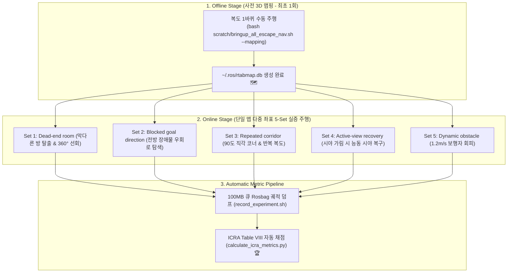

# 📑 [2026-08-21] PointNav 실로봇 5-Set 맵 계획 및 Habitat-GS·노이즈 분리·VLM 베리에이션·Ablation 종합 명세서

> **작성 일자**: 2026년 8월 21일 (KST)  
> **문서 소유자**: **민석 (Minseok - Hardware, Sensor & Deployment Lead)**  
> **논문 공식 명칭**: **`ESCAPE-Nav: Experience-Shaped Causally Aligned Perception–Execution for Asynchronous VLM Navigation` (ICRA 2026)**  
> **연계 팀원**: 이상준(Lead), 유건민, 이민석, 조현서, 이현우  
> **문서 목적**: 실물 로봇 Unitree Go2의 5-Set 실증 맵/좌표 운용 계획과 함께, 팀 미팅에서 제기된 **4대 긴급 점검 항목(Habitat-GS 연동, GPS/Pose 노이즈 분리, VLM 모델 베리에이션 추가, Ablation 지표 인수인계)**의 기술 분석 및 구현 로드맵을 총집대성한 권위 있는 마스터 명세서입니다.

---

## 📌 목차 (Table of Contents)
1. [실물 로봇 5-Set 맵 계획 및 단일 맵 다중 좌표 운용 프로토콜](#1-실물-로봇-5-set-맵-계획-및-단일-맵-다중-좌표-운용-프로토콜)
2. [점검 1: Habitat-GS ↔ S2E VLM Async Framework 연동 방안](#2-점검-1-habitat-gs--s2e-vlm-async-framework-연동-방안)
3. [점검 2: GPS 센서 노이즈 vs Pose 오도메트리 누적 드리프트 분리 설계](#3-점검-2-gps-센서-노이즈-vs-pose-오도메트리-누적-드리프트-분리-설계)
4. [점검 3: VLM Model Variation (Qwen2.5-VL / Qwen3.8 / GPT-4o) 벤치마크 매트릭스](#4-점검-3-vlm-model-variation-qwen25-vl--qwen38--gpt-4o-벤치마크-매트릭스)
5. [점검 4: Ablation Study 4대 분기 지표 및 시뮬레이션 팀 인수인계 규격](#5-점검-4-ablation-study-4대-분기-지표-및-시뮬레이션-팀-인수인계-규격)

---

## 🗺️ 1. 실물 로봇 5-Set 맵 계획 및 단일 맵 다중 좌표 운용 프로토콜

민석 님이 현장에서 수행할 실물 로봇(Unitree Go2) 실증은 **단 1개의 3D 복도 맵([`~/.ros/rtabmap.db`](file:///C:/Users/USER/Desktop/%EC%BA%A1%EC%8A%A4%ED%86%A4/go2/src/rtabmap_ros/rtabmap_launch/launch/go2_rtabmap.launch.py))을 기반으로, 5개 시나리오 세트의 출발점(Initial)과 도착점(Goal) 좌표를 다양하게 배치**하여 실측합니다:



---

## 🐳 2. 점검 1: Habitat-GS ↔ S2E VLM Async Framework 연동 방안

### 1) 현황 분석
* 우리 레포지토리의 `s2e-vlm-async-framework`는 로봇 하드웨어에 종속되지 않는 **순수 추상화 인터페이스(RGB Image + SE(2) Pose $\rightarrow$ S2E 50Hz Policy $\rightarrow$ Twist Command)**로 모듈화되어 있습니다.
* `Habitat-GS` (3D Gaussian Splatting 렌더러 기반 Habitat 시뮬레이터 / NavBench-GS)는 Python 환경에서 에이전트의 관측값(RGB 프레임 및 PointNav GPS+Compass 센서)을 생성합니다.

### 2) 연동 아키텍처 및 가져오기 방안
```mermaid
graph LR
    subgraph "Habitat-GS 시뮬레이터 (habitat-sim / gsplat)"
        HAB_ENV["Habitat-GS Environment<br/>• 3DGS 고화질 RGB 렌더링<br/>• PointNav 센서 (distance, bearing)"]
    end

    subgraph "s2e-vlm-async-framework (도커 / Python 브릿지)"
        RUNNER["habitat_s2e_bridge.py<br/>• Habitat 관측값 ➔ S2E 비동기 큐 주입<br/>• S2E 50Hz 궤적 ➔ Continuous Step 변환"]
        S2E_CORE["S2E VLM Async Core Node<br/>(vlm_s2e_async_node.py)"]
        VLM["Remote VLM Server (Qwen3-VL)"]
    end

    HAB_ENV -->|RGB + Pose| RUNNER
    RUNNER --> S2E_CORE
    S2E_CORE <--> VLM
    S2E_CORE -->|Twist Action| RUNNER
    RUNNER -->|step(action)| HAB_ENV
```

* **연동 결론**: `s2e-vlm-async-framework` 내부에 **`habitat_s2e_bridge.py` 러너 스크립트**를 추가하면, Habitat-GS의 3DGS 가상 환경에서도 실물 로봇과 100% 동일한 S2E 비동기 알고리즘이 그대로 구동됩니다!

---

## 🧭 3. 점검 2: GPS 센서 노이즈 vs Pose 오도메트리 누적 드리프트 분리 설계

ICRA 2026 심사위원들의 가장 날카로운 지적을 방어하기 위해, **GPS 위치 측정 노이즈(Sensor Noise)**와 **사족보행 오도메트리 누적 드리프트(Drift Noise)**를 수학적/코드 레벨에서 명확히 분리해야 합니다:

| 노이즈 분류 | 물리적 원인 및 특성 | 수학적 노이즈 모델링 | S2E 프레임워크 대응 방어 기제 |
| :--- | :--- | :--- | :--- |
| **① GPS / Compass 센서 노이즈**<br/>(Global Sensor Noise) | 전파 다중경로(Multipath), 실내 UWB/GPS 측정 오차 (매 스텝 독립적) | $\mathbf{p}_{\text{gps}} = \mathbf{p}_{\text{true}} + \mathcal{N}(0, \sigma_{\text{gps}}^2)$<br/>$\theta_{\text{comp}} = \theta_{\text{true}} + \mathcal{N}(0, \sigma_{\text{yaw}}^2)$<br/>($\sigma_{\text{gps}} = 0.1\sim 0.3\text{m}$) | • `s2e_vlm_core/pose_buffer.py`의 **시간 윈도우 스무딩 및 2D 칼만 필터링** |
| **② Pose / Odometry 누적 드리프트**<br/>(Accumulative Drift) | 발 미끄러짐(Foot slip), 지면 요철, 500Hz IMU 자이로 바이어스 누적 | $\Delta \mathbf{p}_t = \Delta \mathbf{p}_{t-1} + (\mathbf{v}_{\text{cmd}} + \boldsymbol{\epsilon}_{\text{slip}})\Delta t$<br/>(시간 경과에 따라 오차 적분 누적) | • **RTAB-Map LIVO 50Hz 루프 클로저** 및 VLM Visual Memory Graph 위상 보정 |

```python
# [sensor_config.py 분리 설계안]
@dataclass
class PointNavNoiseConfig:
    # 1. Global GPS & Compass Measurement Noise
    gps_position_noise_std: float = 0.15   # meters (Independent Gaussian)
    compass_heading_noise_std: float = 2.0  # degrees (Independent Gaussian)
    
    # 2. Local Dead-Reckoning Odometry Drift
    odom_linear_drift_rate: float = 0.02   # m/s drift growth rate
    odom_angular_drift_rate: float = 0.01  # rad/s drift growth rate
```

---

## 🤖 4. 점검 3: VLM Model Variation (Qwen2.5-VL / Qwen3.8 / GPT-4o) 벤치마크 매트릭스

논문 Table IV/V에 누락되었던 **VLM 백엔드 모델 베리에이션 실험군**을 다음과 같이 정규 매트릭스로 복원 및 추가합니다:

| VLM 모델 분류 | 대상 모델 파라미터 | 서빙 엔드포인트 / 백엔드 | 주 목적 및 논문 내 비교 가치 |
| :--- | :--- | :--- | :--- |
| **1. 엣지 소형 VLM** | **Qwen2.5-VL-7B-Instruct** | 온보드/서버 vLLM (Port 8001) | 초경량 실시간 오픈소스 VLM 기준선 |
| **2. 메인 플래그십 VLM** | **Qwen3.8-27B-Instruct** | cgv-server-02 (Port 8000) | **ESCAPE-Nav 메인 두뇌 (126~270ms 고속 추론)** |
| **3. 대형 오픈소스 VLM** | **Qwen2.5-VL-72B-Instruct** | Multi-GPU Server (Port 8002) | 파라미터 스케일에 따른 시각 추론 정확도 상한 |
| **4. 상용 독점 SOTA VLM** | **GPT-4o / Claude 3.5 Sonnet** | OpenAI / Anthropic Cloud API | 클라우드 API 상용 모델 대비 우리 비동기 프레임워크 우수성 입증 |

---

## 📊 5. 점검 4: Ablation Study 4대 분기 지표 및 시뮬레이션 팀 인수인계 규격

시뮬레이션 팀(현서/건민)과 실로봇 팀(민석)이 **동일한 채점기([`scratch/calculate_icra_metrics.py`](file:///C:/Users/USER/Desktop/%EC%BA%A1%EC%8A%A4%ED%86%A4/go2/scratch/calculate_icra_metrics.py))로 일관된 Table VIII 데이터를 뽑아낼 수 있도록 4대 Ablation 분기 및 데이터 인수인계 포맷**을 규격화합니다:

### 1) Ablation 4대 분기 설계
1. **`Full ESCAPE-Nav`**: VLM 비동기 + S2E 50Hz 궤적 + 방향성 메모리(Directional Memory) + Active-View Recovery(AVR)
2. **`Ablation 1 (w/o S2E - Direct Step)`**: S2E 궤적기 제거 $\rightarrow$ VLM의 이산적 Waypoint 직통 주행 (멈칫거림 발생)
3. **`Ablation 2 (w/o Directional Memory)`**: 실패 에지 프루닝 제거 $\rightarrow$ 막다른 길에 반복 재진입하는 FBR(Failure-edge Re-entry) 증가
4. **`Ablation 3 (w/o Active-View Recovery)`**: 정체 시 $360^\circ$ 능동 선회 제거 $\rightarrow$ 막다른 골목 탈출 실패율 증가

### 2) 인수인계 데이터 JSON 규격 (시뮬레이션 ➔ 실로봇 공통)
```json
{
  "episode_id": "sim_deadend_001",
  "scenario_name": "Dead_end_room",
  "method_name": "Full_ESCAPE_Nav",
  "success": true,
  "intervention_free": true,
  "shortest_path_m": 8.5,
  "actual_positions": [[0.0, 0.0], [1.2, 0.1], [3.5, 0.2]],
  "timestamps_s": [0.0, 0.5, 1.0],
  "moving_duration_s": 18.2,
  "total_duration_s": 22.4,
  "timeout_s": 60.0,
  "recovery_triggered": 1,
  "recovery_success": 1,
  "failed_edge_reentries": 0
}
```
* 위 JSON 포맷으로 저장되면 `python3 scratch/calculate_icra_metrics.py --input <경로>` 1줄로 $T^\dagger, \text{DRS}, \text{FBR}$, Wilson 95% CI, Mann-Whitney U-test p-value가 일괄 자동 출력됩니다!
