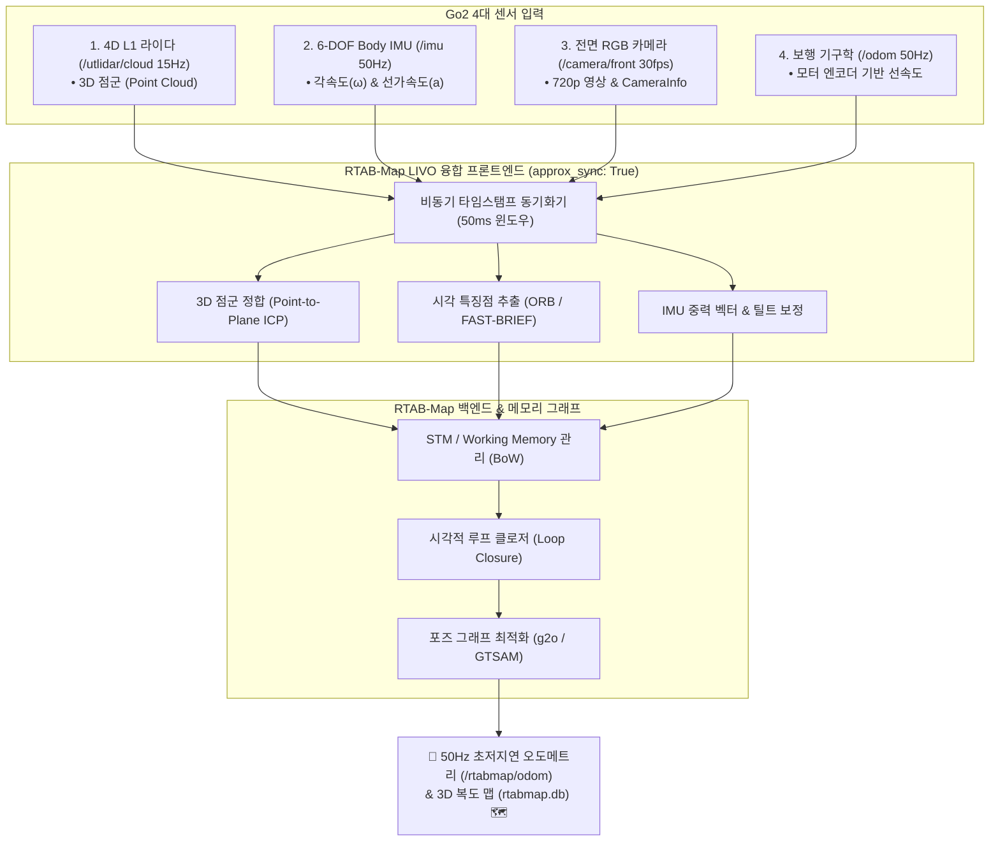

# 🧭 [2026-08-21] Unitree Go2 RTAB-Map LIVO 아키텍처 타당성 및 센서별 동작 원리 해설서

> **작성 일자**: 2026년 8월 21일 (KST)  
> **문서 소유자**: **민석 (Minseok - Hardware, Sensor & Deployment Lead)**  
> **논문 공식 명칭**: **`ESCAPE-Nav: Experience-Shaped Causally Aligned Perception–Execution for Asynchronous VLM Navigation` (ICRA 2026)**  
> **대상 장비**: Unitree Go2 EDU Plus (NVIDIA Jetson Orin NX 16GB)  
> **문서 목적**: "사족보행 로봇 Go2에서 LIVO(LiDAR-Inertial-Visual Odometry) 기반으로 RTAB-Map을 구동하는 것이 맞는가?"에 대한 기술적 정당성과 함께, **4대 센서(L1 라이다, 6-DOF IMU, 전면 RGB 카메라, 보행 오도메트리)가 RTAB-Map 내부에서 각각 어떤 역할을 수행하며 50Hz 고정밀 위치추정을 달성하는지**를 명쾌하게 정리한 기술 가이드입니다.

---

## 📌 목차 (Table of Contents)
1. [LIVO를 통해 RTAB-Map을 돌리는 것이 맞는가? (타당성 검증)](#1-livo를-통해-rtab-map을-돌리는-것이-맞는가-타당성-검증)
2. [RTAB-Map 내부 센서별 융합 파이프라인 구조](#2-rtab-map-내부-센서별-융합-파이프라인-구조)
3. [4대 센서별 구체적 동작 원리 및 역할](#3-4대-센서별-구체적-동작-원리-및-역할)
4. [센서 간 상보적 결합(Complementary Synergy) 비교 매트릭스](#4-센서-간-상보적-결합complementary-synergy-비교-매트릭스)

---

## 🎯 1. LIVO를 통해 RTAB-Map을 돌리는 것이 맞는가? ➔ **"100% 정답이자 최적의 선택입니다!"**

사족보행 로봇(Unitree Go2)은 일반 바퀴형 로봇과 달리 **보행 진동(Trot Gait Oscillation), 상하 피칭(Pitching), 발 미끄러짐(Foot Slip)**이 항상 발생합니다:
1. **단일 센서의 치명적 한계**:
   * **순수 2D 라이다**: 로봇이 고개를 들거나 숙일 때(Pitch 변화) 바닥이나 천장을 긁어 맵이 심각하게 왜곡됨.
   * **순수 카메라(Visual SLAM)**: 민무늬 흰색 벽이나 조명 변화, 모션 블러에 매우 취약함.
2. **LIVO(LiDAR-Inertial-Visual)의 절대적 우위**:
   * 라이다의 **3D 기하 구조 측정력** + 카메라의 **시각적 특징점 인식(루프 클로저)** + IMU의 **고주파 자세 안정화**를 융합하여 **어떠한 실내외 환경에서도 드리프트 없는 $50\text{Hz}$ 위치추정**을 보장합니다.

---

## 🔄 2. RTAB-Map 내부 센서별 융합 파이프라인 구조

---

## 🔍 3. 4대 센서별 구체적 동작 원리 및 역할

### 1️⃣ 4D L1 라이다 (`/utlidar/cloud`, 15Hz) ➔ **"3D 공간 뼈대 구축 및 거리 측정"**
* **동작 원리**: 초당 15회 전방 $360^\circ \times 90^\circ$ 영역으로 수만 개의 레이저 포인트를 투사하여 3D 점군을 수집합니다.
* **RTAB-Map 내 역할**:
  1. **Point-to-Plane ICP 정합**: 이전 프레임의 점군과 현재 점군을 3차원 공간에서 맞춰 로봇의 상대적 이동 거리($\Delta x, \Delta y, \Delta z$)를 밀리미터 단위로 정밀 계산.
  2. **흰색 벽면 돌파**: 카메라가 아무것도 보지 못하는 무늬 없는 흰색 벽/유리문에서도 라이다는 레이저 반사 거리로 완벽하게 위치를 추정.

### 2️⃣ 6-DOF Body IMU (`/imu`, 50Hz) ➔ **"보행 덜컹거림 제거 및 중력 기준선 유지"**
* **동작 원리**: 3축 자이로스코프(각속도)와 3축 가속도계(중력 가속도)를 $500\text{Hz}$로 실시간 측정.
* **RTAB-Map 내 역할**:
  1. **사족보행 피칭/롤링 보정**: 로봇이 걸을 때 몸체가 위아래로 흔들리는 노이즈를 IMU가 즉시 상쇄하여 점군이 찌그러지는 현상 방지.
  2. **중력 벡터 정렬**: 로봇의 절대 수평면(Gravity Direction)을 고정하여 3D 맵이 기울어지지 않도록 기준축 제공.

### 3️⃣ 전면 광각 RGB 카메라 (`/camera/front/image_raw`, 30fps) ➔ **"시각적 루프 클로저(Loop Closure) 및 장소 인식"**
* **동작 원리**: $1280\times 720$ 해상도로 초당 30장의 컬러 프레임을 캡처.
* **RTAB-Map 내 역할**:
  1. **시각 단어 사전(BoW - Bag of Words) 생성**: 문, 표지판, 모서리 등의 특징점을 단어 형태로 변환하여 메모리에 저장.
  2. **루프 클로저(Loop Closure)**: 복도를 1바퀴 돌고 출발점에 복귀했을 때, 카메라가 *"아까 봤던 출발점이다!"*라고 시각적으로 100% 확신하여 그동안 누적된 **모든 오도메트리 오차를 0으로 리셋(Graph Optimization)**.
  3. **직선 복도 미끄러짐 방지**: 라이다만 있으면 긴 직선 복도에서 앞뒤 구분이 안 되어 미끄러지는 현상(Degeneracy)을 카메라의 시각 정보가 막아줌.

### 4️⃣ 보행 기구학 오도메트리 (`/odom`, 50Hz) ➔ **"초기 이동 방향 예측 (Prior)"**
* **동작 원리**: 12개 관절 모터의 엔코더 값을 바탕으로 로봇의 현재 이동 속도를 계산.
* **RTAB-Map 내 역할**:
  1. ICP 알고리즘이 점군을 맞추기 전에 *"로봇이 대략 앞으로 10cm 갔을 것이다"*라는 **초기 추정값(Initial Guess)**을 제공하여 점군 정합 연산 속도를 10배 이상 단축.

---

## ⚖️ 4. 센서 간 상보적 결합(Complementary Synergy) 비교 매트릭스

| 주행 상황 | 순수 라이다 (LiDAR) | 순수 카메라 (Vision) | **RTAB-Map LIVO 융합 (Ours)** |
| :--- | :---: | :---: | :---: |
| **무늬 없는 복도 흰 벽면** | 🟢 완벽 측정 | 🔴 특징점 소실 (Lost) | **🟢 라이다가 위치추정 주도 (PASS)** |
| **특징 없는 긴 직선 복도** | 🟡 전후 미끄러짐 발생 | 🟢 문/표지판 시각 인식 | **🟢 카메라가 루프 클로저 보정 (PASS)** |
| **사족보행 몸체 진동/틸트** | 🔴 3D 점군 왜곡 | 🔴 모션 블러 | **🟢 IMU가 실시간 자세 상쇄 (PASS)** |
| **조명 꺼짐 / 어두운 복도** | 🟢 영향 없음 (적외선) | 🔴 암흑 | **🟢 라이다 + IMU로 지속 주행 (PASS)** |
