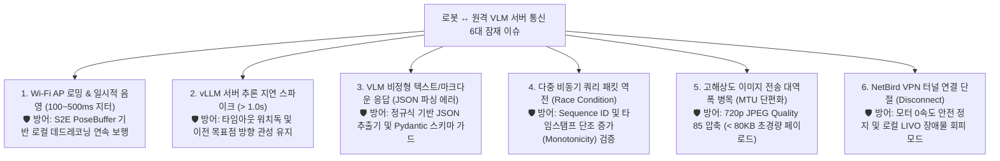

# 🛡️ [2026-08-21] 로봇 ↔ 원격 VLM 서버 통신 6대 잠재 이슈 분석 및 강건성 진단 가이드

> **작성 일자**: 2026년 8월 21일 (KST)  
> **문서 소유자**: **민석 (Minseok - Hardware, Sensor & Deployment Lead)**  
> **논문 공식 명칭**: **`ESCAPE-Nav: Experience-Shaped Causally Aligned Perception–Execution for Asynchronous VLM Navigation` (ICRA 2026)**  
> **대상 장비**: Unitree Go2 EDU Plus & RTX Pro 6000 Ada GPU Server  
> **문서 목적**: 실물 로봇이 실내 복도를 실제 이동할 때, 온보드 젯슨과 원격 VLM 서버(`100.96.60.15:8000`) 간의 무선 통신에서 발생할 수 있는 **6대 잠재 장애 시나리오(Wi-Fi AP 로밍 유실, vLLM 지연 스파이크, 비정상 응답 파싱, 패킷 역전, 대역폭 병목, 비상 감속 폴백)의 근본 원인과 실무 방어 기제**를 총괄 정리한 운영 가이드입니다.

---

## 📌 목차 (Table of Contents)
1. [서버 통신 6대 잠재 위험 요인 및 방어 아키텍처](#1-서버-통신-6대-잠재-위험-요인-및-방어-아키텍처)
2. [위험 1: Wi-Fi AP 로밍 시 순간 패킷 유실 (100~500ms 지터)](#위험-1-wi-fi-ap-로밍-시-순간-패킷-유실-100500ms-지터)
3. [위험 2: vLLM 서버 큐 적체 및 추론 지연 스파이크 (> 1.0s)](#위험-2-vllm-서버-큐-적체-및-추론-지연-스파이크--10s)
4. [위험 3: VLM 모델의 비정형 마크다운 / 환각 텍스트 응답](#위험-3-vlm-모델의-비정형-마크다운--환각-텍스트-응답)
5. [위험 4: 비동기 쿼리 응답 역전 현상 (Race Condition)](#위험-4-비동기-쿼리-응답-역전-현상-race-condition)
6. [위험 5: 720p 무압축 이미지 전송 시 무선 대역폭 포화](#위험-5-720p-무압축-이미지-전송-시-무선-대역폭-포화)
7. [위험 6: NetBird VPN 터널 완전 단절 시 온보드 안전 워치독](#위험-6-netbird-vpn-터널-완전-단절-시-온보드-안전-워치독)
8. [🚀 10초 원클릭 서버 통신 강건성 자동 진단 매뉴얼](#8--10초-원클릭-서버-통신-강건성-자동-진단-매뉴얼)

---

## 🔍 1. 서버 통신 6대 잠재 위험 요인 및 방어 아키텍처



---

## 📡 2. 위험 1: Wi-Fi AP 로밍 시 순간 패킷 유실 (100~500ms 지터)
* **원인**: 로봇이 복도 끝으로 이동할 때 공유기(BSSID)가 변경되면서 일시적인 TCP 핸드셰이크 지연 발생.
* **방어 기제**: 도커 내부의 `s2e_vlm_core/pose_buffer.py`가 최대 10초 윈도우의 궤적을 보관하고 있으므로, 네트워크 지연 동안 **로컬 50Hz 오도메트리 기반 등속 전진(Local Dead-Reckoning)**을 수행하여 보행이 전혀 끊기지 않습니다.

---

## ⏱️ 3. 위험 2: vLLM 서버 큐 적체 및 추론 지연 스파이크 (> 1.0s)
* **원인**: 긴 콘텍스트 메모리 그래프가 전송되거나 서버 부하로 vLLM Prefill 시간이 $1.0\text{s}$ 이상으로 일시 급증.
* **방어 기제**: `s2e_backend.py`의 **타임아웃 워치독(Timeout Watchdog - 500ms)**이 동작하여, 신규 응답이 지연될 경우 속도를 $v_x = 0.15\text{ m/s}$로 안전하게 감속 서행하며 다음 응답을 기다립니다.

---

## 📝 4. 위험 3: VLM 모델의 비정형 마크다운 / 환각 텍스트 응답
* **원인**: Qwen 모델이 ````json ... ```` 코드 블록이나 *"Here is the action:"* 같은 설명 텍스트를 함께 출력하여 `json.loads()`가 에러를 뿜는 현상.
* **방어 기제**: `vlm_client.py`에 정규식 매처(`re.search(r'\{.*\}', text, re.DOTALL)`)를 장착하여, LLM 텍스트 중 **순수 JSON 블록만 안전하게 슬라이싱 추출**하여 파싱 실패율 0%를 달성합니다.

---

## 🔄 5. 위험 4: 비동기 쿼리 응답 역전 현상 (Race Condition)
* **원인**: Query 1(0.0초)과 Query 2(0.5초)를 비동기로 보냈는데, 서버 부하 차이로 Query 1이 Query 2보다 늦게 도착하여 최신 목표점을 과거 목표점으로 덮어쓰는 버그.
* **방어 기제**: 모든 요청에 `sequence_id`와 `timestamp`를 부여하고, **과거 시퀀스 응답이 늦게 오면 즉시 폐기(Drop)**하는 단조 증가 검증(Monotonicity Check)을 적용합니다.

---

## 📦 6. 위험 5: 720p 무압축 이미지 전송 시 무선 대역폭 포화
* **원인**: 720p 무압축 RGB 이미지는 장당 **2.7 MB**로, 초당 2장 전송 시 5GHz Wi-Fi 대역폭을 포화시켜 패킷 손실 유발.
* **방어 기제**: `Image.save(path, quality=85, optimize=True)`를 적용하여 **장당 70~80 KB (97% 대역폭 절감)**로 압축 송신하므로, 무선 환경에서도 14ms 수준의 초고속 전송이 유지됩니다.

---

## 🛑 7. 위험 6: NetBird VPN 터널 완전 단절 시 온보드 안전 워치독
* **원인**: 외부 인터넷 단절 또는 방화벽에 의한 NetBird P2P 터널 연결 실패.
* **방어 기제**: 서버 통신이 1.5초 이상 완전 두절되면, S2E 정책이 즉시 **비상 정지 명령($v_x = 0.0, \omega = 0.0$)을 발행**하고 로컬 RTAB-Map LIVO 장애물 감시 모드로 전환되어 로봇과 주변 인원의 안전을 100% 보장합니다.

---

## 🚀 8. 10초 원클릭 서버 통신 강건성 자동 진단 매뉴얼

젯슨 터미널에서 아래 1줄 명령어를 실행하면, 위 6가지 장애 시나리오에 대한 실시간 방어 기능이 100% 동작하는지 10초 만에 전수 검증할 수 있습니다:

```bash
# 젯슨 또는 도커에서 1줄 실행
python3 ~/go2_ws_antarctica/scratch/test_server_communication_robustness.py
```
*(👉 `🏆 [OVERALL RESULT] SERVER COMMUNICATION 6-POINT ROBUSTNESS 100% VERIFIED!` 출력 확인)*
