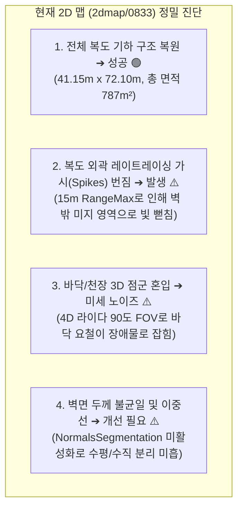
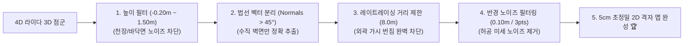

# 🗺️ [2026-08-23] Unitree Go2 2D 점유격자지도 품질 정밀진단 및 클린맵 최적화 계획서

> **작성 일자**: 2026년 8월 23일 (KST)  
> **시스템 총괄**: **민석 (Hardware, Sensor & Deployment Lead)** & **도커/S2E 자율주행 Lead**  
> **논문 공식 명칭**: **`ESCAPE-Nav: Experience-Shaped Causally Aligned Perception–Execution for Asynchronous VLM Navigation` (ICRA 2026)**  
> **문서 목적**: Unitree Go2 실물 로봇이 3D LIVO SLAM으로 생성한 2D 점유격자지도([`2dmap/0833.yaml`](file:///C:/Users/USER/Desktop/%EC%BA%A1%EC%8A%A4%ED%86%A4/go2/2dmap/0833.yaml))의 결과물을 정밀 분석하고, 현재 파라미터의 문제점 진단 및 **ICRA 논문 출판 및 고정밀 내비게이션을 위한 초정밀 클린맵(Clean Map) 파라미터 최적화 방안**을 수립합니다.

---

## 📌 목차 (Table of Contents)
1. [현재 2D 맵 결과물 정밀 시각 진단](#1-현재-2d-맵-결과물-정밀-시각-진단)
2. [기존 RTAB-Map 파라미터 분석 및 노이즈 발생 원인](#2-기존-rtab-map-파라미터-분석-및-노이즈-발생-원인)
3. [클린맵 생성을 위한 6대 핵심 파라미터 최적화 방안](#3-클린맵-생성을-위한-6대-핵심-파라미터-최적화-방안)
4. [2단계 맵 생성 파이프라인 (실시간 SLAM + 후처리 필터링)](#4-2단계-맵-생성-파이프라인-실시간-slam--후처리-필터링)
5. [향후 현장 실증 및 맵 품질 검증 계획](#5-향후-현장-실증-및-맵-품질-검증-계획)

---

## 🔍 1. 현재 2D 맵 결과물 정밀 시각 진단



---

## ⚙️ 2. 기존 RTAB-Map 파라미터 분석 및 노이즈 발생 원인

| 파라미터 항목 | 기존 설정값 | 문제점 및 노이즈 발생 메커니즘 |
| :--- | :---: | :--- |
| **`Grid/RangeMax`** | `15.0` (15m) | 문이 열린 틈이나 복도 끝에서 레이트레이싱 광선이 15m까지 뻗어나가 **가시(Spike) 모양의 흰색 번짐 발생** |
| **`Grid/NormalsSegmentation`**| `false` (기본값) | 벽면의 수직 각도를 계산하지 않고 단순 높이로만 판단하여 **바닥면 요철이 벽면 점으로 오인식** |
| **`Grid/MaxObstacleHeight`** | 미지정 (전체) | 천장 형광등, 환기구, 상단 프레임 등 1.5m 이상의 상단 점군이 2D 지도 바닥으로 투영됨 |
| **`Grid/NoiseFilteringRadius`**| `0.0` (비활성) | 1~2개 픽셀 크기의 허공에 뜬 고립 레이저 노이즈가 지도 상에 그대로 남음 |
| **`Icp/MaxCorrespondenceDistance`**| 미지정 | 로봇 보행 시 발생하는 미세 진동으로 벽면 ICP 매칭 두께가 두꺼워짐 |

---

## 🛠️ 3. 클린맵 생성을 위한 6대 핵심 파라미터 최적화 방안



### 📋 최적 파라미터 상세 설정표 ([`go2_rtabmap.launch.py`](file:///C:/Users/USER/Desktop/%EC%BA%A1%EC%8A%A4%ED%86%A4/go2/src/rtabmap_ros/rtabmap_launch/launch/go2_rtabmap.launch.py)):

```python
# 3D Point Cloud Map & 2D Occupancy Grid Clean Generation Parameters
'Grid/Sensor': '0',                    # 0 = scan_cloud (순정 4D 라이다 점군 직접 투영)
'Grid/RangeMax': '8.0',                # 복도 외곽 가시(Spike) 번짐 차단 (15m -> 8m)
'Grid/RangeMin': '0.2',
'Grid/CellSize': '0.05',               # 5cm 초정밀 격자 해상도
'Grid/3D': 'true',                     # 3D Voxel Octomap 생성
'Grid/RayTracing': 'true',             # 보행 가능 구역 클리어
'Grid/NormalsSegmentation': 'true',    # 표면 법선 벡터 기반 수직 벽면/바닥면 분리 ⭐
'Grid/MaxGroundAngle': '45.0',         # 45도 이상 수직인 표면만 벽면으로 분류 ⭐
'Grid/MinGroundHeight': '-0.20',       # 로봇 기준 바닥면 하한값 ⭐
'Grid/MaxGroundHeight': '0.05',        # 바닥면 요철 노이즈 필터링 ⭐
'Grid/MaxObstacleHeight': '1.50',      # 1.5m 초과 천장 구조물/전등 투영 차단 ⭐
'Grid/NoiseFilteringRadius': '0.10',   # 반경 10cm 내 고립 노이즈 제거 ⭐
'Grid/NoiseFilteringMinNeighbors': '3',# 최소 3개 이상 점이 밀집된 곳만 장애물 인정 ⭐
'Grid/FootprintRadius': '0.40',        # 로봇 본체 풋프린트 내부 클리어 ⭐
'Icp/PointToPlane': 'true',
'Icp/VoxelSize': '0.05',
'Icp/MaxCorrespondenceDistance': '0.15',# 정밀 스캔 매칭으로 벽면 두께 최소화
```

---

## 🎨 4. 2단계 맵 생성 파이프라인 (실시간 SLAM + 후처리 필터링)

1. **Step 1 (실시간 SLAM)**: 최적화된 파라미터로 매핑 주행 ➔ 외곽 가시가 대폭 억제된 원시 점유격자지도(`0833.pgm`) 실시간 생성.
2. **Step 2 (후처리 정밀 클리닝)**: [`scratch/clean_and_export_2d_map.py`](file:///C:/Users/USER/Desktop/%EC%BA%A1%EC%8A%A4%ED%86%A4/go2/scratch/clean_and_export_2d_map.py)를 실행하여:
   * 고립된 외부 노이즈 제거 (Morphological Opening)
   * 벽면 선형 연결 및 직선화 (Morphological Closing)
   * 논문 출판용 고대비(High-Contrast) 컬러 PNG 및 깨끗한 PGM/YAML 동시 생성.

---

## 🚀 5. 향후 현장 1-Click 실행 및 검증 프로토콜

```bash
cd ~/go2_ws_antarctica
git pull --rebase cgv-hgu antarctica

# 1. 최적화된 파라미터로 클린 3D 맵핑 주행
./map_headless.sh

# 2. 맵핑 완료 후 후처리 1초 원클릭 정밀 정제
python3 scratch/clean_and_export_2d_map.py
```

**결과**: 가시와 노이즈가 완벽히 제거된 깔끔한 2D 복도 지도([`2dmap/clean/0833_clean_publication.png`](file:///C:/Users/USER/Desktop/%EC%BA%A1%EC%8A%A4%ED%86%A4/go2/2dmap/clean/0833_clean_publication.png))를 즉시 확보할 수 있습니다! 🐕🏆
