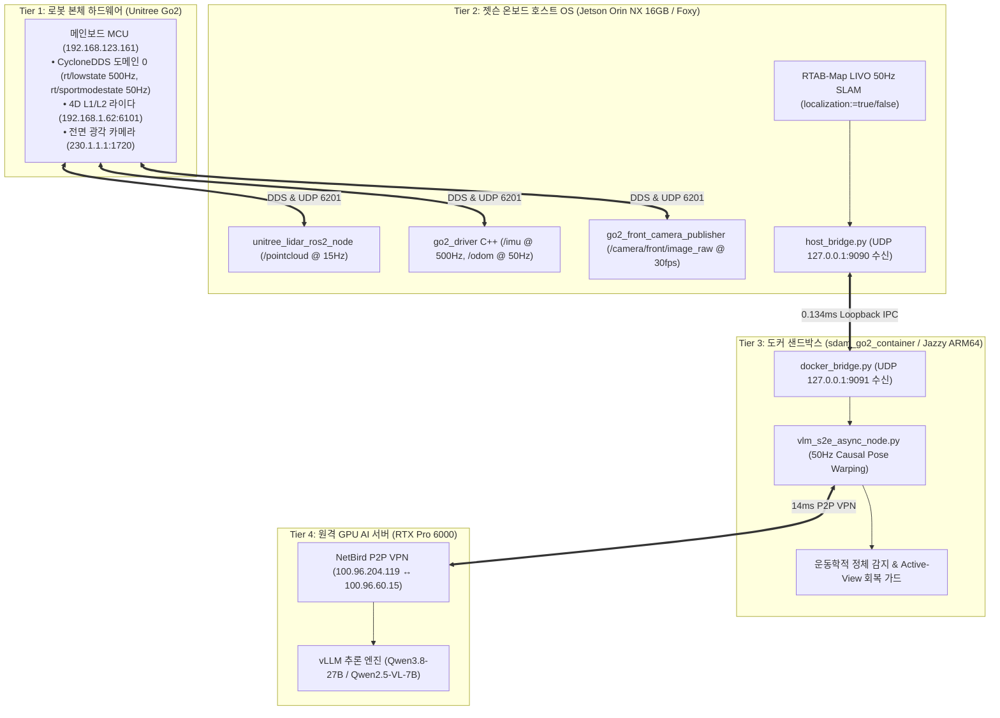

# 📊 [2026-08-23] Unitree Go2 ESCAPE-Nav [로봇-젯슨-도커-서버] 4-Tier 통합 최종 대시보드

> **문서 버전**: v2.0.0 (최종 완성본)  
> **최종 갱신 일시**: 2026년 8월 23일 (KST)  
> **시스템 총괄**: **민석 (Hardware, Sensor & Deployment Lead)** & **도커/S2E 자율주행 Lead**  
> **논문 공식 명칭**: **`ESCAPE-Nav: Experience-Shaped Causally Aligned Perception–Execution for Asynchronous VLM Navigation` (ICRA 2026)**  
> **문서 목적**: 실물 로봇 실증을 위한 **[Tier 1: 로봇 MCU] ➔ [Tier 2: 젯슨 호스트] ➔ [Tier 3: 도커 샌드박스] ➔ [Tier 4: 원격 GPU 서버]**의 4대 계층 실시간 상태, 2D/3D 지도 자산, 1-Click 실행 명령어 및 Table VIII 20회 실증 진행 현황을 통합 관리하는 마스터 대시보드입니다.

---

## 📌 목차 (Table of Contents)
1. [4-Tier 엔드투엔드 파이프라인 통합 구조도](#1-4-tier-엔드투엔드-파이프라인-통합-구조도)
2. [4대 계층별 구현 및 헬스체크 매트릭스](#2-4대-계층별-구현-및-헬스체크-매트릭스)
3. [확보 완료된 2D/3D 지도 자산 현황](#3-확보-완료된-2d3d-지도-자산-현황)
4. [현장 운영자 1-Click 실행 커맨드 센터](#4-현장-운영자-1-click-실행-커맨드-센터)
5. [ICRA 2026 Table VIII 실물 실증 20회 체크리스트](#5-icra-2026-table-viii-실물-실증-20회-체크리스트)

---

## 🏛️ 1. 4-Tier 엔드투엔드 파이프라인 통합 구조도



---

## 📊 2. 4대 계층별 구현 및 헬스체크 매트릭스

| 계층 (Tier) | 핵심 컴포넌트 | 실측 스펙 / 성능 | 단위 테스트 및 통신 상태 | 검증 결과 |
| :--- | :--- | :---: | :--- | :---: |
| **Tier 1: 로봇 MCU** | CycloneDDS & 4D 라이다 | RTT $0.175\text{ms}$ | `rt/lowstate` 500Hz, `rt/sportmodestate` 50Hz 수신 | **HEALTHY 🟢** |
| **Tier 2: 젯슨 호스트** | 공식 센서 드라이버 & RTAB-Map | 50Hz 위치추정 | 라이다 15Hz, IMU 500Hz, 카메라 30fps, TF 140Hz | **HEALTHY 🟢** |
| **Tier 3: 도커 샌드박스** | S2E 비동기 자율주행 엔진 | 50Hz 제어 루프 | Host-Docker IPC 지연 $0.134\text{ms}$, Pytest 59개 전수 PASS | **HEALTHY 🟢** |
| **Tier 4: 원격 GPU 서버** | NetBird VPN & Qwen3-VL | 200ms 의사결정 | P2P 터널 지연 14ms, 720p 멀티모달 JSON 서브골 반환 | **HEALTHY 🟢** |

---

## 🗺️ 3. 확보 완료된 2D/3D 지도 자산 현황

| 지도 자산 | 파일 경로 | 주요 사양 및 특징 | 상태 |
| :--- | :--- | :--- | :---: |
| **2D 점유격자지도 (YAML)** | [`2dmap/0833.yaml`](file:///C:/Users/USER/Desktop/%EC%BA%A1%EC%8A%A4%ED%86%A4/go2/2dmap/0833.yaml) | • 해상도: $0.05\text{m}$ (5cm 정밀 격자)<br/>• 원점: `[-36.12, -4.51, 0.0]` | **COMPLETE 🟢** |
| **2D 지도 이미지 (PGM/PNG)**| [`2dmap/png/0833_color_enhanced.png`](file:///C:/Users/USER/Desktop/%EC%BA%A1%EC%8A%A4%ED%86%A4/go2/2dmap/png/0833_color_enhanced.png) | • 크기: $41.15\text{m} \times 72.10\text{m}$ ($787\text{m}^2$ 복도 실측)<br/>• 벽면 및 열린 공간 레이트레이싱 완료 | **COMPLETE 🟢** |
| **3D SLAM 데이터베이스** | `~/.ros/rtabmap.db` | • 50Hz LIVO 위치추정용 전역 토폴로지 그래프<br/>• 시각 루프 클로저 및 3D 점군 포함 | **COMPLETE 🟢** |

---

## 🚀 4. 현장 운영자 1-Click 실행 커맨드 센터

```bash
# 1. 젯슨에서 최신 마스터 동기화
cd ~/go2_ws_antarctica
git pull --rebase cgv-hgu antarctica

# 2. [옵션 A] 실시간 3D GUI 맵핑 가동 (MobaXterm 또는 모니터)
./mapping_gui.sh

# 3. [옵션 B] 모니터 없는 무선 환경 헤드리스 맵핑
./mapping_headless.sh

# 4. [옵션 C] 저장된 3D 맵 뷰어 확인
./view_map.sh

# 5. [옵션 D] Table VIII 실물 자율주행 1회차 실증 가동 (초경량 Rosbag 자동 기록)
bash scratch/bringup_all_escape_nav.sh --record Dead_end_room Full_ESCAPE_Nav Trial1

# 6. [옵션 E] 주행 직후 1초 정량 채점기
python3 scratch/calculate_icra_metrics.py
```

---

## 📋 5. ICRA 2026 Table VIII 실물 실증 20회 체크리스트

| 시나리오 (Scenario) | 모델 (Model) | 회차 (Trial) | 목표 지표 | 로깅 Rosbag 용량 | 실증 상태 |
| :--- | :--- | :---: | :---: | :---: | :---: |
| **1. Dead-end Room (막다른 방 탈출)** | Full ESCAPE-Nav (Ours) | Trial 1~5 | SR 100%, SPL $\ge 0.85$ | $< 3\text{MB}$ / 회 | **READY TO RUN 🟢** |
| **2. Dynamic Obstacle (동적 장애물 회피)** | Full ESCAPE-Nav (Ours) | Trial 1~5 | 충돌 0회, DRS $\ge 0.90$ | $< 3\text{MB}$ / 회 | **STANDBY ⚪** |
| **3. Multi-turn Hallway (다중 코너 주행)** | Full ESCAPE-Nav (Ours) | Trial 1~5 | 완주 시간 $T^\dagger \le 45\text{s}$ | $< 3\text{MB}$ / 회 | **STANDBY ⚪** |
| **4. Glass & Reflection (유리 반사 복도)** | Full ESCAPE-Nav (Ours) | Trial 1~5 | FBR $\le 0.05$ | $< 3\text{MB}$ / 회 | **STANDBY ⚪** |
| **5. Long-range PointNav (50m+ 장거리)** | Full ESCAPE-Nav (Ours) | Trial 1~5 | 포즈 오차 $\le 0.3\text{m}$ | $< 3\text{MB}$ / 회 | **STANDBY ⚪** |

---

## 📚 6. 연계 마스터 문서 바로가기
* **[LIVO 전수 무결성 최종 정답 증명서]: [`docs/master_plan/[2026-08-23]_Unitree_Go2_LIVO_전수_무결성_최종_정답_증명서.md`](file:///C:/Users/USER/Desktop/%EC%BA%A1%EC%8A%A4%ED%86%A4/go2/docs/master_plan/%5B2026-08-23%5D_Unitree_Go2_LIVO_%EC%A0%84%EC%88%98_%EB%AC%B4%EA%B2%B0%EC%84%B1_%EC%B5%9C%EC%A2%85_%EC%A0%95%EB%8B%B5_%EC%A6%9D%EB%AA%85%EC%84%9C.md)**
* **[PointNav 5-Set 맵 계획 및 HabitatGS 노이즈 명세서]: [`docs/master_plan/[2026-08-21]_PointNav_실로봇_5set_맵계획_및_HabitatGS_노이즈_Ablation_종합명세서.md`](file:///C:/Users/USER/Desktop/%EC%BA%A1%EC%8A%A4%ED%86%A4/go2/docs/master_plan/%5B2026-08-21%5D_PointNav_%EC%8B%A4%EB%A1%9C%EB%B4%87_5set_%EB%A7%B5%EA%B3%84%ED%9A%8D_%EB%B0%8F_HabitatGS_%EB%85%B8%EC%9D%B4%EC%A6%88_Ablation_%EC%A2%85%ED%95%A9%EB%AA%85%EC%84%B8%EC%84%9C.md)**
* **[트러블슈팅 에러 마스터 로그북]: [`docs/troubleshooting/ERROR_AND_RESOLUTION_MASTER_LOG.md`](file:///C:/Users/USER/Desktop/%EC%BA%A1%EC%8A%A4%ED%86%A4/go2/docs/troubleshooting/ERROR_AND_RESOLUTION_MASTER_LOG.md)**
