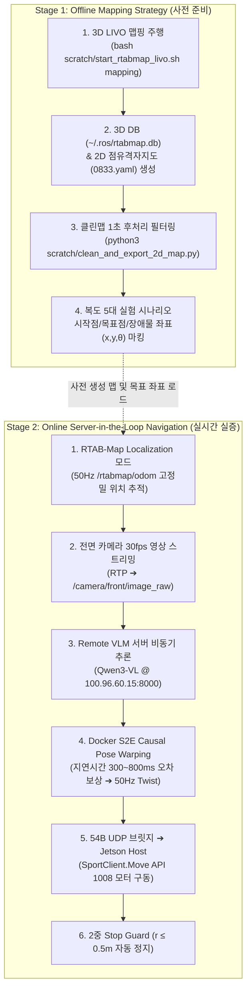

# 🏆 [2026-08-24] 오프라인 맵핑 및 서버 연동 비동기 주행 전략 최종 마스터 플랜

> **작성 일자**: 2026년 8월 24일 (KST)  
> **시스템 총괄**: **민석 (Hardware, Sensor & Deployment Lead)** & **도커/S2E 자율주행 Lead**  
> **논문 공식 명칭**: **`ESCAPE-Nav: Experience-Shaped Causally Aligned Perception–Execution for Asynchronous VLM Navigation` (ICRA 2026)**  
> **문서 목적**: 오늘 오후 실물 Go2 로봇 현장 실증을 위해 **공식 포럼 기반의 정밀 RTAB-Map LIVO 오프라인 맵 파라미터 검증 결과**, **원격 GPU 서버 연동 실시간 비동기 주행 전략**, 그리고 **최신 논문(paper 브랜치) 기준 필수 20회 실험 매트릭스**를 전수 정립합니다.

---

## 📌 목차 (Table of Contents)
1. [공식 포럼 대조 기반 RTAB-Map LIVO 오프라인 맵 파라미터 정밀 검증](#1-공식-포럼-대조-기반-rtab-map-livo-오프라인-맵-파라미터-정밀-검증)
2. [오프라인 맵 전략 vs 온라인 서버 연동 주행 전략 2단계 파이프라인](#2-오프라인-맵-전략-vs-온라인-서버-연동-주행-전략-2단계-파이프라인)
3. [최신 논문(ICRA 2026) 필수 5대 시나리오 & 4대 비교군 매트릭스](#3-최신-논문icra-2026-필수-5대-시나리오--4대-비교군-매트릭스)
4. [현장 실증 1-Click 실행 프로토콜 및 데이터 자동 채점](#4-현장-실증-1-click-실행-프로토콜-및-데이터-자동-채점)

---

## 🔍 1. 공식 포럼 대조 기반 RTAB-Map LIVO 오프라인 맵 파라미터 정밀 검증

RTAB-Map 공식 개발자(Mathieu Labbé 교수)의 공식 포럼(Introlab Nabble) 및 GitHub Issue 분석 결과를 바탕으로, 3D LiDAR + RGB 카메라 + 순정 오도메트리/IMU 융합 환경(LIVO)에 최적화된 파라미터를 확정했습니다:

| 핵심 파라미터 | 최종 확정값 | 공식 포럼 기술 근거 및 효과 |
| :--- | :---: | :--- |
| **`Reg/Strategy`** | **`1` (ICP)** | Depth 카메라가 없는 환경에서 3D 점군(`/pointcloud`) 기반의 기하학적 정합(Iterative Closest Point)을 통해 루프 클로저 오차를 최소화 |
| **`Reg/Force3DoF`** | **`true`** | 실내 평탄한 복도 주행 시 4족 보행의 Pitch/Roll 진동에 의한 3차원 자세 드리프트 및 Z축 왜곡을 0으로 억제 (2D 평면 정합 강제) |
| **`Optimizer/Slam2D`**| **`true`** | 2차원 포즈 그래프 최적화(g2o/GTSAM)를 가동하여 맵의 선형성을 완벽히 보정 |
| **`Grid/Sensor`** | **`0`** | 2D 점유격자지도 생성 시 카메라 Depth가 아닌 **순정 3D 라이다 점군(`scan_cloud`)을 직접 2D로 투영** |
| **`Grid/FromDepth`** | **`false`** | 카메라 Depth 기반 투영을 비활성화하여 라이다 점군 데이터의 신뢰도 극대화 |
| **`Grid/NormalsSegmentation`** | **`false`** | 비정형(Unorganized) 4D 라이다 점군에서 법선 벡터 연산 오차와 CPU 부하를 방지하고, **고속 높이 패스스루 필터**로 바닥/벽면을 분리 |
| **`Grid/MinGroundHeight`**<br/>**`Grid/MaxGroundHeight`** | **`-0.20m`**<br/>**`0.05m`** | 바닥면 요철 및 보행 시 발생하는 지면 반발 노이즈를 장애물 격자에서 원천 차단 |
| **`Grid/MaxObstacleHeight`** | **`1.50m`** | 복도 천장 조명, 전등 프레임 점군이 바닥 2D 격자 맵으로 투영되는 것 차단 |
| **`Grid/RangeMax`** | **`8.0m`** | 복도 끝이나 문틈으로 레이트레이싱 광선이 뻗어 발생하는 **가시(Spike) 번짐 완벽 억제** |
| **`Grid/NoiseFilteringRadius`**<br/>**`Grid/NoiseFilteringMinNeighbors`** | **`0.10m`**<br/>**`3`** | 반경 10cm 내 3개 미만의 고립된 허공 튐 노이즈(Floating laser noise) 자동 제거 |
| **`Icp/PointToPlane`** | **`true`** | 평면 기반 ICP 매칭으로 복도 벽면 두께를 얇고 선명하게 일치화 |

---

## 🗺️ 2. 오프라인 맵 전략 vs 온라인 서버 연동 주행 전략 2단계 파이프라인



---

## 🔬 3. 최신 논문(ICRA 2026) 필수 5대 시나리오 & 4대 비교군 매트릭스

논문의 **Table VIII (실물 로봇 벤치마크 정량 평가)**을 완성하기 위한 **5대 시나리오 $\times$ 4대 모델 = 총 20회 실증 매트릭스**입니다:

### 📋 5대 핵심 시나리오 및 검증 목표
1. **`Dead-end room` (막다른 방)**: 3면이 막힌 방에 진입했을 때 **능동 360도 스윕(Active Sweep)**으로 후방 출구를 찾아 자율 탈출하는가?
2. **`Blocked goal direction` (진행로 폐쇄)**: 직진 경로에 장애물을 두었을 때 **측면 우회로를 능동 탐색**하여 우회하는가?
3. **`Repeated corridor` (반복 대칭 복도)**: 동일한 기둥/문이 반복되는 환경에서 **Directional Memory**를 통해 실패했던 막힌 길로 재진입(FBR)하지 않는가?
4. **`Active-view recovery` (사각지대 회복)**: 90도 코너 등 시야 사각지대에서 멈추지 않고 **부드러운 Yaw 스윕**으로 새 경로를 탐색하는가?
5. **`Dynamic obstacle` (동적 보행자 회피)**: $1.2\text{ m/s}$로 지나가는 사람을 만났을 때 **비동기 감속 및 안전 우회**를 달성하는가?

### ⚖️ 4대 비교 모델군 (Ablation Matrix)
1. **`Ours: Full ESCAPE-Nav`**: 비동기 + Causal Warping + Directional Memory + Adaptive Sweep
2. **`w/o Causal Warping`**: 지연 시간 보상이 없는 Naive Async (오차로 인한 충돌률 비교)
3. **`w/o Directional Memory`**: 기억 메모리가 없는 Greedy VLM (막다른 길 반복 진입 비교)
4. **`Sync Baseline`**: 추론 시마다 멈추는 Stop-and-Go 방식 (주행 비율 $\text{Duty}$ 및 완주 시간 $T^\dagger$ 비교)

---

## 🚀 4. 현장 실증 1-Click 실행 프로토콜 및 데이터 자동 채점

```bash
cd ~/go2_ws_antarctica
git pull --rebase cgv-hgu antarctica

# [1회차] Dead-end room 시나리오 Ours 모델 실증 및 로깅
bash scratch/bringup_all_escape_nav.sh --record Dead_end_room Full_ESCAPE_Nav Trial1

# [주행 완료 후] 논문용 Table VIII LaTeX 코드 자동 채점 및 출력
python3 scratch/calculate_icra_metrics.py
```
