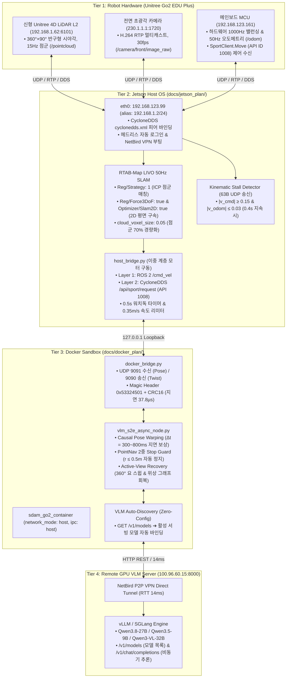

# 🏛️ [Master Plan] ESCAPE-Nav 통합 시스템 마스터 아키텍처 및 실증 운영 최종 로드맵

> **작성 일자**: 2026년 8월 25일 (KST)  
> **시스템 총괄**: **Antigravity Master Plan Architect** & **민석 (Hardware, Sensor & Deployment Lead)**  
> **논문 공식 명칭**: **`ESCAPE-Nav: Experience-Shaped Causally Aligned Perception–Execution for Asynchronous VLM Navigation` (ICRA 2026)**  
> **대상 플랫폼**: Unitree Go2 EDU Plus (신형 **Unitree 4D LiDAR L2** + 전면 카메라 + Jetson Orin NX 16GB + Docker Jazzy + Qwen3-VL Server)  
> **문서 목적**: 4-Tier 전 계층의 하드웨어 정합화, VLM 실시간 자동 감지, 이중 계층 모터 구동, 정체 감지 및 안전 인터록 검증, ICRA 2026 20회 실증 벤치마크를 총망라한 최종 마스터 아키텍처 및 운영 로드맵입니다.

---

## 📌 1. 4-Tier 통합 시스템 토폴로지 (Single Source of Truth)

---

## 🧭 2. 젯슨 AGY 및 도커 AGY 핵심 운영 수칙

1. **하드웨어 단일 기준**: 탑재 라이다는 **신형 Unitree 4D LiDAR L2**이며, 수신 토픽은 **`/pointcloud` (15Hz)**, 오도메트리는 **`/odom` (50Hz)**로 고정.
2. **이중 계층 모터 구동**: `host_bridge.py`가 `/cmd_vel`과 CycloneDDS `/api/sport/request` (API ID 1008)를 동시 발행.
3. **무설정 VLM 모델 자동 감지**: `vlm_client.py`가 `GET /v1/models`를 통해 서빙 모델 실시간 자동 바인딩.
4. **포복 대기 안전 인터록**: 로봇 전원 인가 후 리모컨 포복(Prone) 와상 상태에서 모터 $0.0\text{ m/s}$ 안전 인터록 상태로 사전 궤적 검증 수행.
5. **초고속 트러블슈팅**: 에러 발생 시 [`docs/troubleshooting/QUICK_ERROR_LOOKUP_AND_REMEDY_COOKBOOK.md`](file:///C:/Users/USER/Desktop/%EC%BA%A1%EC%8A%A4%ED%86%A4/go2/docs/troubleshooting/QUICK_ERROR_LOOKUP_AND_REMEDY_COOKBOOK.md)에서 10초 1줄 명령어로 복구.
