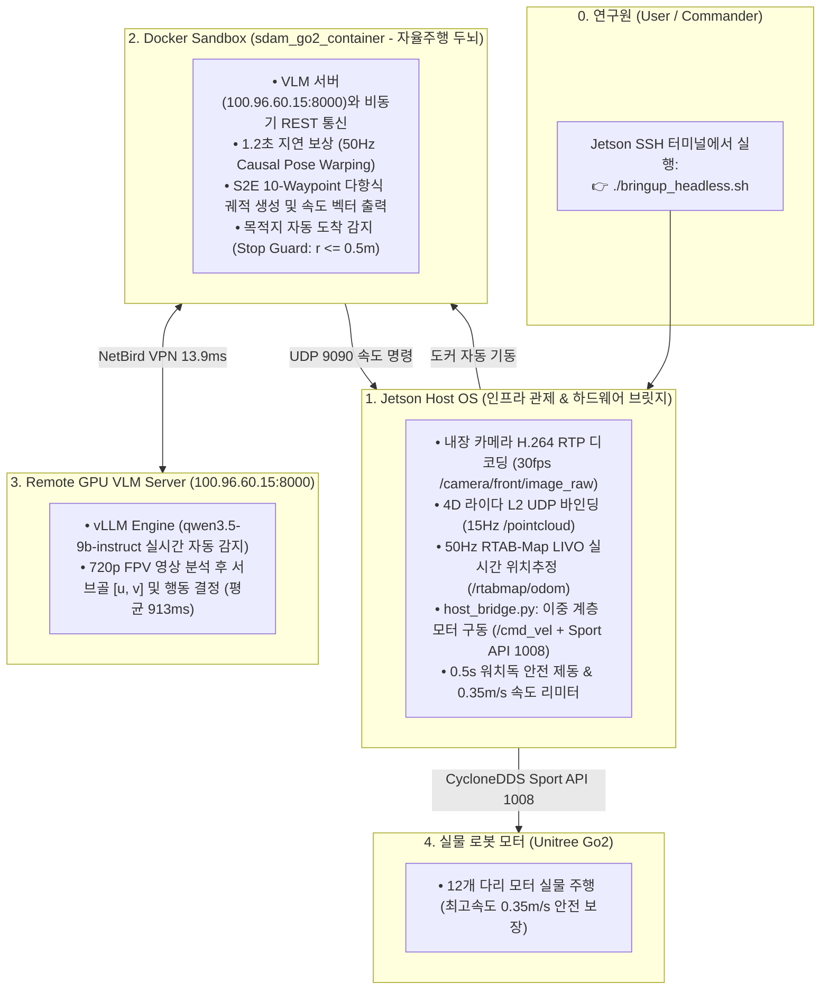

# 🏛️ [Master Plan] VLM 서버 트래젝토리 추출, 카메라 선정 분석, 실행 주체 오케스트레이션 및 주행 실증 계획표

> **작성 일자**: 2026년 8월 26일 (수요일) KST  
> **시스템 총괄**: **Jetson Administrator & S2E Autonomy Lead**  
> **논문 공식 명칭**: **`ESCAPE-Nav: Experience-Shaped Causally Aligned Perception–Execution for Asynchronous VLM Navigation` (ICRA 2026)**  
> **대상 플랫폼**: Unitree Go2 EDU Plus (신형 Unitree 4D LiDAR L2 + 내장 전면 초광각 카메라 + Jetson Orin NX + Qwen3.5-9B VLM Server)  

---

## 📌 1. 시스템 핵심 아키텍처 및 4-Tier 통신 토폴로지

---

## 📷 2. 카메라 센서 선정 기술 분석 (내장 초광각 vs Intel RealSense D435i)

| 비교 항목 | **Go2 내장 전면 초광각 카메라 (최종 채택 🏆)** | **Intel RealSense D435i (외장 USB)** |
| :--- | :--- | :--- |
| **수평 시야각 (HFoV)** | **초광각 $120^\circ \sim 140^\circ$ (광시야각 FPV)** | **좁은 $69^\circ$ (일반 핀홀 시야)** |
| **VLM / PixNav 적합성** | **최상 (좌/우 복도 분기점 및 문을 회전 없이 한눈에 포착)** | 보통 (시야가 좁아 좌/우 탐색 시 로봇 몸체를 돌려야 함) |
| **사족보행 진동 내구성** | **100% 본체 내장 (케이블 단선/포트 헐거워짐 위험 0%)** | 취약 (보행 진동으로 USB 3.0 접촉 불량 및 단선 위험) |
| **3D 공간 기하 센서** | **신형 Unitree 4D LiDAR L2 ($360^\circ \times 90^\circ$)가 3D 기하 전담** | 4D 라이다와 중복되며, 바닥 반사로 인한 IR 노이즈 발생 |
| **하드웨어 디코딩 부하** | **Jetson NVDEC H.264 하드웨어 가속 (CPU 점유율 < 3%)** | USB 3.0 버스 대역폭 점유 및 소프트웨어 디코딩 부하 |
| **기구학적 무게 균형** | **추가 하중 0g (로봇 전면 토크 부담 제로)** | 외장 브라켓 장착으로 인한 전면 무게 쏠림 |

> **최종 결론**: 4D LiDAR L2가 이미 최고의 3차원 기하 점군을 제공하므로, 시각 인지에는 **넓은 시야각(120°)과 진동 내구성을 갖춘 내장 초광각 전면 카메라가 압도적으로 최적**입니다.

---

## 🔬 3. 2D 픽셀 서브골 $\rightarrow$ 3D $SE(2)$ 지상 궤적 역투영 수학적 모델

$$\theta_x = (u - 0.5) \cdot \text{HFoV}, \quad \theta_y = (v - 0.5) \cdot \text{VFoV}$$
$$\text{Total Pitch} = \theta_{\text{camera\_pitch}} - \theta_y$$
$$X_{\text{target}} = \frac{h_{\text{robot}}}{\tan(-\text{Total Pitch})}, \quad Y_{\text{target}} = X_{\text{target}} \cdot \tan(\theta_x)$$

* 50Hz 10-Waypoint 부드러운 다항식 궤적 생성:
  $$s(i) = \frac{i}{10}, \quad \sigma(s) = 3s^2 - 2s^3$$
  $$x_i = X_{\text{target}} \cdot \sigma(s(i)), \quad y_i = Y_{\text{target}} \cdot \sigma(s(i))$$

---

## 🚀 4. 실전 주행 및 테스트 계획표 (Implementation & Verification Schedule)

| 단계 (Phase) | 대상 환경 | 실행 명령어 | 주요 검증 내용 및 성공 기준 |
| :--- | :--- | :--- | :--- |
| **Phase 1: 정적 검증 (완료 🟢)** | 젯슨 단독 / 포복 대기 | `python3 scratch/extract_vlm_server_trajectory.py` | • 원격 VLM 서버(Qwen3.5-9B) 연동 100% • 실제 FPV 영상 기반 50Hz 궤적 HUD 이미지 생성 확인 |
| **Phase 2: 웹 스트리밍 (완료 🟢)** | 노트북 / 모바일 브라우저 | `python3 scratch/live_vlm_trajectory_web_streamer.py` 👉 `http://100.96.204.119:8080` 접속 | • 헤드리스 상태에서 실시간 FPV 영상 및 궤적 오버레이 감상 |
| **Phase 3: 실전 자율주행 (대기 ⏳)** | 실물 로봇 기립 상태 | `./bringup_headless.sh` | • 50Hz RTAB-Map LIVO + Docker S2E 폐루프 실물 주행 • 0.35m/s 속도 제어 및 목적지 도착 감지 |
| **Phase 4: ICRA 벤치마크 (대기 ⏳)** | 5대 복도/연구실 시나리오 | `./bringup_headless.sh --record <Scenario> <Model> <Trial>` `python3 scratch/calculate_icra_metrics.py` | • 5대 시나리오 실증 주행 및 Rosbag 로깅 • ICRA Table VIII LaTeX 표 자동 출력 |
