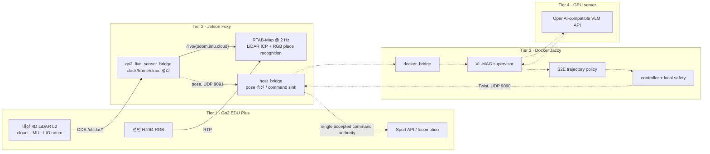

# [2026-08-27] Robot–Jetson–Docker–Server 4-Tier 실측 감사 및 ICRA 2027 실로봇 실험 프로토콜

> 기준 시각: 2026-08-27 15:43 KST  
> 대상: Unitree Go2 EDU Plus, 내장 Unitree 4D LiDAR L2, Jetson Orin NX 16 GB, Ubuntu 20.04/ROS 2 Foxy, Docker ROS 2 Jazzy, 원격 VLM 서버  
> 판정 원칙: 실제 런타임과 현재 소스가 과거 문서의 “완성/100%” 표현보다 우선한다.  
> 안전 상태: 이 감사에서는 자율주행 노드와 모터 브리지를 시작하거나 이동 명령을 발행하지 않았다.

> **2026-08-28 실측 개정**: planar 3DoF run `20260828_113542_planar3dof_headless`는 raw Z span 0.0335 m, sampled map Z span 0.0175 m, Type-2 closure 9개로 Z 안정성은 통과했다. 그러나 Type-1 global closure는 0개이고 wrapper status 141로 최종 optimized graph가 저장되지 않아 golden map은 미통과다. 또한 현재 HEAD `3dc0da70e569054004a2ff0fe07223457e05f19c`에서 `e2e_node/controller_node`는 여전히 `ros_mock_runtime`을 호출하고 실제 `s2e.onnx`가 없으므로 physical autonomy NO-GO는 유지한다. 전체 최신 실행 순서는 [`../experiments/00_real_robot_end_to_end_master_test_plan.md`](../experiments/00_real_robot_end_to_end_master_test_plan.md)를 따른다.

## 1. 한 줄 결론

현재 시스템은 **Tier 1 로봇 센서 → Tier 2 Jetson LIO/RTAB-Map 매핑**과 **Tier 4 서버 접속**까지는 실측되었지만, **Tier 3 S2E/VL-MAG와 실로봇 제어를 잇는 폐루프는 실행 불가**다. 따라서 지금 가능한 것은 맵핑·정적 센서 검증이고, 논문용 자율주행은 아래 안전/구현 게이트를 닫은 뒤 진행해야 한다.

2026-08-27 두 번째 2D 지도는 첫 지도보다 좋아졌지만, 그것은 전역 시각 루프 폐쇄가 아니라 **5개의 LiDAR 공간 근접 폐쇄(type 2)**와 neighbor-link ICP 비활성화의 효과다. 당시 4DoF graph에는 약 6.452 m의 z 발산이 있었다. 2026-08-28 3DoF는 이 수직 발산을 제거했지만 global visual loop와 정상 종료 저장이 남았으므로 아직 **“golden map 완성”으로 주장할 수 없다.**

또한 현재 날짜와 공식 일정을 기준으로 대상은 “ICRA 2026”이 아니라 **ICRA 2027**로 정리해야 한다. 공식 논문 마감은 **2026-09-15 23:59 PST**이며, 전체 원고는 참고문헌을 포함해 8쪽이다.

## 2. 이번 감사의 증거

### 2.1 로컬 구현 및 실측

- 워크스페이스 브랜치/커밋: `antarctica` / `c977dee555ad396aab1483eecccd6631737abe8c`
- 로봇 메인보드: `192.168.123.161`, ping 평균 약 0.195 ms
- 내장 L2 DDS 입력 확인:
  - `/utlidar/cloud_deskewed`: `sensor_msgs/PointCloud2`, 실제 표본 10,410 points, frame `odom`
  - `/utlidar/imu`: `sensor_msgs/Imu`, frame `utlidar_imu`
  - `/utlidar/robot_odom`: `nav_msgs/Odometry`, `odom → base_link`
- Jetson: 15 GiB RAM 중 약 10 GiB available, NVMe 약 388 GiB available
- Docker 컨테이너 `sdam_go2_container`:
  - 실행 중이나 실제 프로세스는 `tail -f /dev/null` 하나
  - 이미지: `arm64v8/ros:jazzy-ros-base`
  - host network 사용
  - 현재 브링업이 호출하는 `s2e-vlm-async-framework/src/vlm_s2e_async_node.py`는 없음
  - `/models/s2e/S2E/s2e.onnx` 없음
- 원격 서버 `100.96.60.15`:
  - ping 평균 약 16.4 ms
  - `/v1/models` 응답 성공
  - 열거된 모델: `qwen3.5-9b-instruct`
  - 16:46 KST 재검사에서 host와 Docker 모두 `/v1/models` 성공
  - Docker text 요청은 `action=stop` JSON을 반환
  - 보관된 실제 Go2 RGB frame에서 `office chair`를 식별해 image payload 수용 확인
  - live camera, 전체 VL-MAG schema, 지연 분포 및 navigation 품질은 미검증

### 2.2 최신 논문 저장소

2026-08-27 원격 확인값은 다음과 같다.

- `main`: `fc336569a9a521ecd395925f41014bbcc9265c26`
- `paper`: `f301e860fe70755036c39a0e58506100b3dd4be8`

현재 Jetson 워크스페이스는 두 최신 원격 브랜치와 동일한 실행 기준이 아니다. 특히 최신 `paper` 브랜치의 [Go2 deployment status](https://github.com/CGV-HGU/s2e-vlm-async-framework/blob/f301e860fe70755036c39a0e58506100b3dd4be8/docs/go2_jetson_pc_tutorial.md)는 Go2/Foxy/Jetson 배치를 **future integration target**으로 명시하고, 현재 Foxy/Jazzy 컨테이너는 typed-message rehearsal까지만 허용하며 physical motion을 비활성화하라고 한다.

최신 실험 기준은 [ICRA 2027 실험 프로토콜](https://github.com/CGV-HGU/s2e-vlm-async-framework/blob/f301e860fe70755036c39a0e58506100b3dd4be8/paper/EXPERIMENT_PROTOCOL_KO.md)과 [실험 체크리스트](https://github.com/CGV-HGU/s2e-vlm-async-framework/blob/f301e860fe70755036c39a0e58506100b3dd4be8/docs/paper_experiment_checklist.md)다.

## 3. 실제 4-Tier 데이터·제어 경로



실선은 오늘까지 실측된 센서/매핑 경로다. 점선은 목표 아키텍처이며 현재 end-to-end로 검증되지 않았다.

## 4. 계층별 준비도 판정

| 계층 | 확인된 것 | 남은 핵심 문제 | 판정 |
|---|---|---|---|
| Tier 1 Robot | Go2와 내장 L2 DDS topic 도달, 실제 cloud/IMU/odom 표본 수신 | 제어 권한·E-stop·장애물 안전 회로의 독립 검증 없음 | 센서 PASS / 자율제어 NO-GO |
| Tier 2 Jetson | `/utlidar/* → /livo/* → RTAB-Map`, 3DoF Z 안정, Type-2 closure 9개 | Type-1 global loop, 정상 종료 저장, camera calibration, localization acceptance | 매핑 PARTIAL |
| Tier 3 Docker | Jazzy package/executable과 mock graph 존재 | 현재 container runtime 미가동, node가 mock runtime 호출, S2E ONNX 없음 | FAIL |
| Tier 4 Server | 네트워크, `/v1/models`, text JSON, 보관 Go2 RGB 1장 vision 응답 | live frame, 전체 navigation schema, latency/retry/failure 검증 없음 | 정적 API PARTIAL |
| 전체 폐루프 | 설계 문서와 일부 bridge 코드 존재 | 최신 VL-MAG/S2E, provenance, safety, logging이 하나의 run으로 닫히지 않음 | NO-GO |

## 5. 과거 4-Tier 문서에서 교정할 사항

### 5.1 “RTAB-Map 50 Hz”가 아니다

- `/livo/odom`은 원시 LIO pose stream이다.
- RTAB-Map의 `Rtabmap/DetectionRate`는 현재 2 Hz다.
- RTAB-Map map correction을 50 Hz odometry에 합성할 수는 있지만, 그것은 “RTAB-Map이 50 Hz로 graph update”한다는 뜻이 아니다.

### 5.2 현재 카메라는 visual odometry가 아니다

Go2 내장 카메라는 monocular RGB이고 metric depth/stereo가 없다. 현재 구성에서 카메라는 ORB 기반 visual words와 place candidate를 제공하고, 실제 기하 검증은 LiDAR ICP가 한다. 정확한 표현은 다음이다.

> **Unitree L2 LIO odometry + 3D LiDAR ICP mapping + monocular RGB place recognition**

따라서 현재 시스템을 “LiDAR + IMU + visual odometry가 모두 metric pose를 만드는 LIVO”라고 쓰면 과장이다.

### 5.3 `localization:=true`는 pure odometry가 아니다

현재 launch에서 이 값은 `Mem/IncrementalMemory=false`, `Mem/InitWMWithAllNodes=true`로 기존 RTAB-Map DB를 불러와 localization한다. 과거 문서의 “사전 지도 개입 차단용 pure odometry mode” 설명은 반대다.

논문에서는 다음 중 하나를 명시적으로 선택해야 한다.

1. **Map-assisted deployment**: 사전 RTAB map은 state estimation/시작점 정렬에만 사용하고 정책 입력은 RGB+relative goal+odometry로 제한한다.
2. **Map-free policy with external evaluator pose**: 온라인 정책은 LIO만 사용하고, 독립 ground truth를 평가에만 사용한다.

현재 논문은 mapping/localization을 대체한다고 주장하지 않으므로 1번이 현실적이다. 다만 “real-robot 전체가 no-prior-map”이라고 쓰면 안 된다.

### 5.4 과거 “20회” 계획은 최신 paper 규격과 다르다

최신 논문 표는 하나의 고정 map에서 `P`개의 start–goal pair를 사전 고정하고, **Direct-goal과 Full ESCAPE-Nav를 각 pair에서 각각 5회** 수행한다.

```text
main paired trials = P pairs × 2 methods × 5 repetitions
```

논문 import 예시의 denominator가 25이므로 `P=5`를 채택하면 **25회/method, 총 50회**다. Active-view recovery와 dynamic obstacle은 Full-only deployment validation으로 별도 수행하며 paired 우월성 근거로 섞지 않는다.

### 5.5 현재 evaluator는 실제 데이터 평가기가 아니다

로컬 `scratch/calculate_icra_metrics.py`는 rosbag을 읽지 않고 코드 안의 sample episode를 계산한다. 실행 결과를 논문 표에 넣으면 안 된다. 최신 paper 브랜치의 provenance-checked import/metric pipeline에 맞춘 실제 artifact가 필요하다.

### 5.6 현재 recorder topic도 현 구성과 불일치한다

기존 recorder는 `/rtabmap/odom`과 `/odom`을 기록하지만, 현재 RTAB launch는 외부 `/livo/odom`을 소비하며 별도 `/rtabmap/odom`을 제공하지 않는다. 또한 VL-MAG decision identity, capture/apply pose, rejection reason, exact VLM input image와 intervention event가 없다.

매핑 중 recorder는 사용자 요청대로 계속 꺼 두어도 된다. **논문 실험을 시작할 때만** 별도의 provenance recorder를 명시적으로 켜야 한다.

## 6. 오늘 지도 결과의 논문상 위치

지도 자산은 [`2dmap/2026-08-27/`](../../2dmap/2026-08-27/)에 보존했다.

| 항목 | 첫 지도 | 두 번째 지도 |
|---|---:|---:|
| RTAB nodes | 402 | 563 |
| 전역 시각 loop(type 1) | 0 | 0 |
| 공간 근접 closure(type 2) | 0 | 5 |
| 거절된 visual 후보 | 확인 불가 | 83 |
| PGM 크기 | 544×450 | 532×504 |
| 관찰 | neighbor ICP 영향으로 휨 | 벽 연속성과 2D 형상 개선 |

두 번째 주행의 raw LIO z 범위는 약 0.0212 m인데 RTAB map pose z 범위는 약 6.452 m다. 이 때문에 paper deployment용 fixed map을 선택하기 전에 아래 인프라 A/B를 먼저 해야 한다.

| Map config | 목적 | 합격 기준 예시 |
|---|---|---|
| 현재 4DoF ICP | 비평면/경사 대응 가능성 확인 | z error와 wall tilt가 independent reference 이내 |
| 실내 planar 3DoF | 단층 평면 주행 안정화 | endpoint drift, wall straightness, repeat localization 향상 |

기존 4DoF launch는 경사 코스 비교 자료로만 보존하고, `map_headless.sh`가 평면 campaign의 run별 evidence를 저장한다. 2026-08-28 물리 주행에서 3DoF Z 안정성은 통과했지만 Type-1 global loop와 정상 종료 저장이 미완료이므로 deployment DB는 아직 고정하지 않는다.

이 A/B는 ESCAPE-Nav의 알고리즘 ablation이 아니라 **평가 장비를 고정하기 위한 infrastructure qualification**이다. 더 좋은 설정 하나를 결과를 보기 전에 고정하고 모든 방법에 동일하게 사용한다.

RTAB-Map loop closure와 VL-MAG directional memory도 서로 다른 기능이다.

- RTAB-Map closure: metric pose graph를 보정하는 localization/mapping 기능
- VL-MAG memory: `deadlock_entry`, `escape_success` 등 action outcome을 다음 관측/branch 선택에 반영하는 논문 기여

RTAB loop 로그를 VL-MAG recovery 증거로 세면 안 된다.

## 7. ICRA 2027에서 실로봇의 역할

최신 paper 브랜치의 evidence hierarchy는 다음과 같다.

1. Primary: HM3D/Habitat-GS에서 same-backend RQ1–RQ3 paired mechanism 평가
2. Secondary: ObjectNav transfer, localization degradation, VLM backbone, NavBench-GS
3. Deployment validation: Unitree Go2

Go2 실험만으로 논문의 핵심 mechanism claim 전체를 입증하려 하지 않는다. 실로봇에서는 “실제 센서·지연·네트워크·보행 진동 속에서도 고정된 시스템이 동작하는가”를 보이는 것이 목적이다.

### 논문이 직접 답해야 할 세 질문

1. Adaptive observation이 같은 view/yaw budget의 fixed schedule보다 branch selection을 개선하는가?
2. Representation-aware async가 Sync의 stop-and-go와 naive Async의 stale application을 동시에 줄이는가?
3. Acknowledged directional outcome graph가 flat history/blacklist/undirected memory보다 deadlock 재진입과 oscillation을 줄이는가?

Go2에서는 세 질문의 실제 배치 가능성을 보여 주되, 주 통계 근거는 simulator paired evaluation에 둔다.

## 8. 권장 Go2 실험 설계

### 8.1 사전 등록할 고정 pair

`P=5`를 권장한다. 모든 pair는 실제 결과를 보기 전에 map coordinate, 시작 yaw, goal radius, timeout, 장애물 배치를 고정한다.

| Pair | 정적 경로 특성 | 검증 포인트 |
|---|---|---|
| P1 | 직선 복도 | 기본 tracking과 latency |
| P2 | 90° L-turn | local subgoal과 camera FOV |
| P3 | T-junction/goal-aligned blocked bearing | 실행 가능한 branch 선택 |
| P4 | 유사 문이 반복되는 복도 | 잘못된 branch 재선택 억제 |
| P5 | 다중 코너 장거리 | 장시간 async, map/localization 안정성 |

Main paired 조건:

- `Direct-goal`: VLM과 active observation/memory를 실제로 우회하는 동일 frozen backend
- `Full ESCAPE-Nav`: 고정된 최종 시스템
- 각 pair에서 각 method 5회
- pair 내 실행 순서는 AB/BA를 교대로 배치하거나 사전 생성한 balanced order 사용
- 배터리 구간, 조명, 사람 통행, 시작 자세를 함께 기록
- intervention 발생 trial은 success로 남기지 않고 intervention과 failure를 모두 기록

### 8.2 Full-only deployment trial

다음은 paired superiority 표에 합치지 않는다.

- Active-view recovery: 출구가 초기 카메라 FOV 밖인 dead-end
- Dynamic obstacle: 먼저 무인 rolling obstacle/dummy로 검증하고, 사람 참여는 기관 안전·윤리 절차 확인 후 수행
- Burst latency/drop/out-of-order: 실제 네트워크를 불안정하게 만들기보다 기록된 decision trace에 deterministic delay를 주입해 재현

각 조건은 적어도 5회 반복하고 성공 수/전체 수와 모든 failure video를 그대로 공개한다. 표본 수가 작으므로 강한 통계적 우월성보다 deployment 범위 확인으로 해석한다.

## 9. 고정할 지표와 판정 규칙

### 9.1 논문 main real-robot table

| 지표 | 정의 |
|---|---|
| SR | 1.0 m goal radius 내 도달한 trial 수 / 전체 trial 수 |
| Intv. | 사람/안전 개입 횟수 per run; 개입 trial은 failure 처리 |
| Time | 실패·충돌·timeout에 공통 `T_max`를 부여한 `T†` |
| Rec. | original-goal pursuit를 재개한 recovery / triggered recovery |
| Lat. | request dispatch부터 response parse 완료까지 VLM end-to-end latency |
| Duty | 실제 base motion 시간 / episode wall time |
| Yield | completed VLM response 중 admission을 통과해 backend에 적용된 비율 |

정규화 시간은 다음과 같다.

```text
T† = S·min(T, T_max) + (1-S)·T_max
```

### 9.2 반드시 raw log에 남길 진단값

- failed-edge re-entry 수와 opportunity 수
- collision, near-miss, minimum clearance, intervention reason
- path length와 독립 ground truth 기반 endpoint error
- RTAB global/proximity closure 및 map-correction timestamp
- raw LIO pose와 RTAB map pose의 x/y/yaw/z drift
- VLM submit/complete/apply/reject identity와 reason
- observation-time pose, apply-time pose, translation/yaw delta
- exact input image hash, prompt/schema/model/config hash
- controller command rate, command age, watchdog stop latency
- Jetson CPU/RAM/temperature/power, server latency, packet drop

SPL은 독립 shortest path를 신뢰성 있게 계산할 수 있을 때 diagnostic으로 보존할 수 있으나, 현재 real-robot main table을 임의로 바꾸지는 않는다.

### 9.3 통계

- 모든 method 비교는 동일 pair에 대한 paired design
- SR은 성공 수/전체 수를 반드시 함께 표기
- 실로봇 결과는 point estimate와 raw denominator 중심으로 보고
- 가능하면 pair 단위 bootstrap interval을 보조로 제공하되, `n=25/method`에서 작은 차이를 일반화하지 않음
- trial 제외는 결과 확인 전 정의한 hardware/system fault에만 허용하고 exclusion log 공개
- 실패·E-stop·timeout을 삭제하지 않음

SPL의 표준 정의와 navigation task/metric 구분은 Anderson et al.의 평가 권고를 따른다.

## 10. Ground truth와 공정성

RTAB-Map이 정책 localization에 사용된다면 같은 RTAB pose를 평가 정답으로 사용하지 않는다. 다음 우선순위를 권장한다.

1. motion capture 또는 정밀 total station
2. 사전 측량한 AprilTag/UWB anchor와 overhead video의 결합
3. 최소한 측량된 start/goal marker, 독립 overhead camera, 수동 경로 audit

모든 method는 동일한 다음 조건을 공유해야 한다.

- frozen map/DB와 localization 파라미터
- camera intrinsics/extrinsics
- S2E checkpoint와 controller gain/speed limit
- VLM endpoint/model, prompt/schema, temperature
- goal, timeout, success radius와 장애물 배치
- network condition 또는 동일한 replay delay trace

실행 중에 한 method만 파라미터를 고치면 그 campaign은 다시 시작한다.

## 11. 논문용 artifact 구조

```text
experiments/real_robot_icra2027/<campaign_id>/
├── campaign_manifest.json
├── preregistered_pairs.yaml
├── run_order.csv
└── <pair_id>/<method>/<rep_id>/
    ├── run_manifest.json
    ├── config_snapshot.yaml
    ├── software_hardware_versions.txt
    ├── exact_vlm_inputs/
    ├── real_robot_events.jsonl
    ├── vlm_timing.jsonl
    ├── trajectory.csv
    ├── localization.csv
    ├── command_watchdog.csv
    ├── operator_video.mp4
    ├── rosbag2/
    ├── result.json
    └── SHA256SUMS
```

`run_manifest.json`에는 최소한 다음을 넣는다.

- workspace, main, paper commit SHA
- Docker image digest
- S2E checkpoint SHA-256
- VLM model ID와 endpoint identity
- RTAB DB/config SHA-256
- camera/L2 calibration version
- pair/method/repetition/run-order identity
- operator, battery band, light condition, start/end time
- stop reason과 exclusion 여부

영상 전체를 raw ROS image로 저장할 필요는 없다. 대신 **VLM에 실제 전송한 exact frame/JPEG**, timing/event log, 별도 H.264 operator video를 반드시 보존한다.

## 12. 자율주행 전 필수 안전·구현 게이트

아래가 모두 닫히기 전에는 로봇을 걷게 하는 4-Tier launch를 실행하지 않는다.

- [ ] 최신 `paper/main` 중 하나를 기준으로 Jetson 배치 commit을 명시적으로 고정
- [ ] 브링업이 존재하는 ROS package executable을 호출하도록 변경
- [ ] native S2E checkpoint 확보, hash 고정, 실제 11-frame inference 검증
- [ ] VLM request에 실제 image/multi-view가 포함되고 strict schema가 검증됨
- [x] 보관된 실제 Go2 RGB 1장으로 서버의 image payload 수용 확인
- [ ] live camera와 전체 navigation schema로 vision behavior 재검증
- [ ] 실측 camera intrinsics/distortion/extrinsics 적용
- [ ] planar 3DoF Type-1/정상 종료/반복성 통과 후 deployment DB 하나 고정
- [ ] Docker 기본 mock을 fail-closed로 제거하고 real/mock provenance 표시
- [ ] 단일 command authority만 MCU에 명령; 중복 `/cmd_vel`/Sport API 경로 제거
- [ ] legacy 무검증 UDP packet 수용 제거, sequence/timestamp/TTL 추가
- [ ] shutdown 순서에서 actuator가 살아 있는 동안 zero command와 ACK를 확인
- [ ] 독립 local watchdog, obstacle clearance guard, geofence와 speed cap 검증
- [ ] remote VLM/VPN 장애 시 Jetson이 서버와 무관하게 zero/hold 수행
- [ ] 실제 로봇을 움직이지 않는 command-sink test와 fault injection PASS
- [ ] 로봇을 고정/들어 올린 상태에서 command path·E-stop·watchdog PASS
- [ ] 통제 구역, spotter, 물리 리모컨 E-stop, run abort 기준 확보
- [ ] 실제 artifact에서 최신 paper metric/import pipeline이 complete=true를 생성

현재는 여러 항목이 미완료이므로 최종 판정은 **physical autonomy NO-GO**다.

## 13. 권장 실행 순서

### Phase A — 지도/센서 자격 검증

1. 3DoF 정상 종료와 Type-1 global loop를 해결하고 3회 반복성 검증
2. camera calibration 수행
3. 고정 DB와 5개 pair 좌표/yaw를 사전 등록
4. 같은 위치에서 반복 localization 분산과 loop correction jump 측정

### Phase B — 무구동 4-Tier 검증

1. 최신 VL-MAG/S2E를 Jetson/Docker topology에 배치
2. command sink를 motor 대신 audit logger로 연결
3. camera → VLM → decision → S2E → controller → sink 전체 provenance 확인
4. timeout, server loss, malformed result, stale result, odom loss fault injection

### Phase C — 제한된 저속 안전 검증

1. E-stop operator와 spotter 배치
2. 직선·정지·짧은 회전부터 단계별 acceptance
3. speed/clearance/watchdog 기준을 넘으면 즉시 abort
4. 최소 10회 연속 safe-stop 성공 후 navigation trial 진입

### Phase D — Main paired campaign

1. frozen P=5 pair와 balanced order 사용
2. Direct-goal/Full 각 pair 5회, 총 50회
3. 당일 중간 결과로 parameter를 바꾸지 않음
4. 모든 failure와 intervention 포함해 import artifact 생성

### Phase E — Full-only deployment campaign

Active-view recovery, rolling obstacle, 승인된 dynamic trial을 main paired 결과와 분리해 수행한다.

## 14. ICRA 2027 제출 일정 영향

공식 ICRA 2027 안내 기준:

- 논문 마감: 2026-09-15 23:59 PST
- 8쪽 전체 제한: 본문, 표, 감사, 참고문헌 포함
- supplementary document 경로 없음; optional video만 가능
- video: 최대 20 MB, 180초, 최소 480p/20 fps, progressive
- double-anonymous review
- 논문에 생성형 AI가 만든 내용을 사용하는 경우 정책에 맞는 disclosure 확인 필요

현재 기준 약 19일밖에 남지 않았고 physical autonomy는 NO-GO다. 따라서 우선순위는 다음과 같다.

1. 48시간 안에 최신 paper 코드와 Jetson 배치 경계를 하나로 고정
2. 무구동 4-Tier와 safety gate를 먼저 닫음
3. fixed pair와 logging/import를 dry-run으로 검증
4. main 50회보다 앞서 최소 pilot를 수행하되 pilot 결과는 final campaign과 분리
5. final campaign 도중 tuning이 발생하면 해당 campaign을 폐기하고 새 version으로 재시작

시간 안에 safety와 provenance가 닫히지 않으면 실로봇 표를 축소하거나 deployment qualitative evidence로 제한하는 편이, 근거 없는 수치나 위험한 주행보다 학술적으로 타당하다.

## 15. 지금 주장 가능한 것과 불가능한 것

| 주장 | 현재 상태 |
|---|---|
| Go2 내장 L2 cloud/IMU/LIO odom을 Foxy에서 수신 | 가능 |
| LIO + LiDAR ICP + RGB place recognition으로 2D map 생성 | 가능 |
| 두 번째 주행에서 공간 근접 closure 5개와 2D 개선 관찰 | 가능 |
| 전역 visual loop closure가 지도를 개선 | 불가: type-1 closure 0개 |
| 정확한 3D map | 불가: z 발산 |
| RTAB-Map 50 Hz graph SLAM | 불가: map update 2 Hz |
| camera가 metric visual odometry 제공 | 불가 |
| 4-Tier full autonomy 완성 | 불가 |
| Qwen server 접속과 model enumeration | 가능 |
| 현재 server가 보관 Go2 RGB image payload를 처리 | 가능: 단일 frame API 확인 |
| 현재 server/model의 live vision navigation 품질 | 불가: 전체 경로 미검증 |
| ICRA real-robot quantitative result | 불가: 실제 campaign 없음 |

## 16. 참조

- [ICRA 2027 Call for Papers](https://2027.ieee-icra.org/contribute/call-for-icra-2027-papers-now-accepting-submissions/)
- [최신 ESCAPE-Nav paper 브랜치 실험 프로토콜](https://github.com/CGV-HGU/s2e-vlm-async-framework/blob/f301e860fe70755036c39a0e58506100b3dd4be8/paper/EXPERIMENT_PROTOCOL_KO.md)
- [최신 paper experiment checklist](https://github.com/CGV-HGU/s2e-vlm-async-framework/blob/f301e860fe70755036c39a0e58506100b3dd4be8/docs/paper_experiment_checklist.md)
- [Anderson et al., On Evaluation of Embodied Navigation Agents](https://arxiv.org/abs/1807.06757)
- [He et al., From Seeing to Experiencing / S2E](https://arxiv.org/abs/2507.22028)
- [Unitree 공식 L2 SDK2](https://github.com/unitreerobotics/unilidar_sdk2)
- [RTAB-Map 공식 API 설명](https://github.com/introlab/rtabmap/blob/master/doxygen/mainpage.md)
- [IEEE RAS reproducible robotics guidance](https://www.ieee-ras.org/publications/ram/information-for-authors/reproducible-articles-r-articles-short-replication-articles-r-articles-reply-articles/): ICRA의 별도 제출 요건은 아니지만 hardware/software identifier, raw data, confidence/statistical provenance를 설계하는 참고 기준으로 사용
- [오늘 지도 manifest](../../2dmap/2026-08-27/MANIFEST.md)
- [RTAB-Map 런타임 진단 및 루프 로그](../troubleshooting/06_rtabmap_livo_2026-08-27_runtime_diagnosis_and_loop_closure_log.md)
