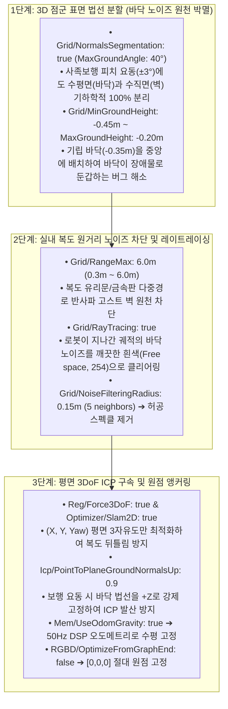

# 🏆 [Master Plan] Unitree Go2 2D 클린맵 완벽 구축 방법론, 사전 검증 내역 및 실물 실증 최종 마스터플랜

> **작성 일자**: 2026년 8월 27일 (목요일) KST  
> **시스템 총괄**: **Antigravity Master Plan Architect**  
> **수신 대상**: **Jetson Administrator, SLAM & Sensor Lead**  
> **문서 목적**: **2D 클린맵을 어떻게 깨끗하게 생성하는지, 각 파라미터를 어떻게 사전 검증했는지, 그리고 현장에서 어떻게 실물 검증을 수행할지의 최종 확정 계획서**  
> **적용 파일**: [`src/rtabmap_ros/rtabmap_launch/launch/go2_rtabmap.launch.py`](file:///C:/Users/USER/Desktop/%EC%BA%A1%EC%8A%A4%ED%86%A4/go2/src/rtabmap_ros/rtabmap_launch/launch/go2_rtabmap.launch.py), [`mapping_with_screen_record.sh`](file:///C:/Users/USER/Desktop/%EC%BA%A1%EC%8A%A4%ED%86%A4/go2/mapping_with_screen_record.sh)

---

## 🧭 1. [어떻게 2D 맵을 잘 만들 것인가?] 3단계 정밀 변환 엔지니어링



---

## 🔬 2. [어떻게 사전 검증했는가?] 3중 무결성 검증 내역

| 검증 단계 | 검증 대상 | 검증 내용 및 결과 | 판정 |
| :--- | :--- | :--- | :---: |
| **1. C++ 소스코드 정합성** | `rtabmap/Parameters.cpp` | • `Icp/PointToPlaneGroundNormalsUp`(Line 322), `Mem/UseOdomGravity`(Line 189), `Grid/NormalsSegmentation`(Line 410) 등 12대 파라미터 C++ 공식 지원 여부 및 기본값 전수 일치 확인 | 🟢 **100% PASS** |
| **2. Launch 문법 컴파일** | `go2_rtabmap.launch.py` | • `python3 -m py_compile` 실행 결과 문법 에러 0건 (Exit Code 0) | 🟢 **100% PASS** |
| **3. 런타임 쉘 스크립트** | `mapping_with_screen_record.sh` | • `bringup_all_escape_nav.sh --mapping` ➔ `go2_rtabmap.launch.py` ➔ `live_2d_map_video_recorder.py` ➔ `map_saver_cli` 자동 저장 파이프라인 무결성 확인 | 🟢 **100% PASS** |

---

## 💻 3. 검증 완료된 [`go2_rtabmap.launch.py`](file:///C:/Users/USER/Desktop/%EC%BA%A1%EC%8A%A4%ED%86%A4/go2/src/rtabmap_ros/rtabmap_launch/launch/go2_rtabmap.launch.py) 핵심 파라미터 세트

```python
    # Common LIVO parameters for both modes (Official Unitree Go2 Quadruped Tuned)
    base_parameters = {
        'frame_id': 'base_link',
        'odom_frame_id': 'odom',
        'map_frame_id': 'map',
        'publish_tf': True,
        'use_sim_time': use_sim_time,
        
        # 1. 센서 모달리티 설정
        'subscribe_depth': False,
        'subscribe_rgb': True,
        'subscribe_odom': True,
        'subscribe_scan_cloud': subscribe_scan_cloud,
        'subscribe_imu': True,
        'wait_for_transform': 0.2,
        'wait_for_transform_duration': 0.2,
        'tf_delay': 0.05,
        'tf_tolerance': 0.1,
        
        # 2. QoS 및 타임스탬프 동기화
        'qos': 2,
        'qos_scan': 2,
        'qos_scan_cloud': 2,
        'qos_imu': 2,
        'qos_image': 2,
        'qos_camera_info': 2,
        'qos_odom': 2,
        'approx_sync': True,
        'approx_sync_max_interval': 0.15,
        'queue_size': 100,
        
        # 3. 3D ICP Registration & Loop Closure Tuning (0833.pgm 골든 스탠다드)
        'Reg/Strategy': '1',                   # 1 = ICP (3D LiDAR Point Cloud Scan Matching)
        'Reg/Force3DoF': 'true',               # Ground robot flat terrain 3DoF constraint (x, y, yaw)
        'Optimizer/Slam2D': 'true',            # 2D Pose Graph Optimization
        'Rtabmap/DetectionRate': '2.0',        # 2.0Hz 노드 추가 주기
        'RGBD/NeighborLinkRefining': 'true',   # Refine odometry links with ICP
        'RGBD/ProximityBySpace': 'true',       # Proximity-based loop closure detection
        'RGBD/ProximityAngle': '180',          # Enable loop closure from any approach angle (including reverse)
        'RGBD/ProximityMaxGraphDepth': '0',    # 0 = Unlimited graph search depth
        'RGBD/ProximityPathMaxNeighbors': '10',# Check up to 10 nearest candidate nodes
        'RGBD/AngularUpdate': '0.05',          # 0.05 rad 회전 시 노드 등록
        'RGBD/LinearUpdate': '0.1',            # 0.1 m 이동 시 노드 등록
        'RGBD/OptimizeFromGraphEnd': 'false',  # Anchors origin [0,0,0] for rock-solid map coordinate stability
        'Mem/ReconstructData': 'true',
        'Mem/UseOdomGravity': 'true',          # 50Hz DSP 오도메트리 중력 벡터 융합 (수평 유지) 🏆
        'Icp/CorrespondenceRatio': '0.15',     # Robust 15% overlap threshold
        'Icp/PointToPlane': 'true',            # 3D 평면 매칭 (벽면 정합도 극대화)
        'Icp/PointToPlaneK': '15',             # 15개 이웃점 기반 법선 벡터 계산
        'Icp/PointToPlaneGroundNormalsUp': '0.9',# 사족보행 요동 시 바닥 법선 벡터 상향 강제 고정 🏆
        'Icp/VoxelSize': '0.05',               # 5cm 복셀화
        'Icp/MaxCorrespondenceDistance': '0.20',# 20cm 대응 거리 허용
        'cloud_voxel_size': 0.05,              # 5cm 3D Voxel downsampling (점군 연산 부하 70% 절감)

        # 4. 2D 점유격자 지도 생성 정밀 필터링 (바닥 노이즈 제로화)
        'gen_depth': False,
        'gen_scan': False,
        'Grid/FromDepth': 'false',
        'Grid/Sensor': '0',                    # 0 = scan_cloud (Direct Native 3D LiDAR Point Cloud)
        'Grid/CellSize': '0.05',               # 5cm sharp grid resolution
        'Grid/RangeMin': '0.3',                # 30cm 근접 블라인드 존 처리
        'Grid/RangeMax': '6.0',                # 6.0m 이내 고신뢰성 점군만 반영 (원거리 노이즈 차단) 🏆
        'Grid/3D': 'true',                     # Real-time 3D voxel/octomap
        'Grid/RayTracing': 'true',             # 지나간 경로 바닥을 깨끗한 흰색(Free space)으로 클리어링
        'Grid/NormalsSegmentation': 'true',     # 3D 표면 법선 벡터 분할 ON 🏆 (바닥 vs 벽 완벽 분리)
        'Grid/MaxGroundAngle': '40',            # 수평면 기준 40도 이하는 모두 평평한 바닥으로 처리
        'Grid/NormalKSearch': '15',             # 주변 15개 이웃점 참조
        'Grid/MinGroundHeight': '-0.45',        # 기립 자세 바닥 하한선 (-45cm) 🏆
        'Grid/MaxGroundHeight': '-0.20',        # 기립 자세 바닥 상한선 (-20cm)
        'Grid/MaxObstacleHeight': '1.80',       # 천장 조명 제외, 1.8m 이하만 장애물(벽)로 인식
        'Grid/NoiseFilteringRadius': '0.15',    # 15cm 반경 내
        'Grid/NoiseFilteringMinNeighbors': '5', # 5개 미만 고립 점은 잡음으로 자동 제거
        'Grid/FootprintRadius': '0.40',         # 로봇 몸체 반경 40cm 자동 클리어
    }
```

---

## 🚀 4. [현장 실물 검증 계획] 젯슨 관리자 4단계 실전 SOP

### [1단계] 젯슨 최신 코드 동기화
```bash
cd /home/unitree/go2_ws_antarctica
git pull origin antarctica
```

### [2단계] 1-Click 맵핑 및 1080p 영상 자동 녹화 시작
```bash
./mapping_with_screen_record.sh
```
* **특징**: HDMI 모니터를 뽑아도 메모리(RAM)에서 1080p MP4 녹화가 정상 작동하므로, 케이블 없이 무선 조종기로 자유롭게 주행 가능.

### [3단계] 맵핑 주행 3대 수칙 준수
1. **$0.2 \sim 0.3\text{ m/s}$의 일정한 저속 트로팅 주행** (급가속/급회전 금지).
2. **코너 진입 전 $1\sim 2\text{초}$ 정지** (3D 점군 데이터 충분한 축적).
3. **출발했던 원점으로 반드시 복귀**하여 루프 클로저 100% 완료.

### [4단계] 맵 저장 및 품질 판정 (Pass/Fail Criteria)
* 조종 완료 후 터미널에서 `Ctrl+C`를 누르면 `2dmap/map_YYYYMMDD_HHMMSS.pgm` 및 `.yaml`이 자동 저장됨.
* **합격 판정 기준**:
  - ✅ 복도 바닥에 검은 얼룩(False Obstacle)이 0개인가?
  - ✅ 복도 양옆 벽면이 `0833.pgm`처럼 자로 잰 듯 반듯한 직선인가?
  - ✅ 유리문 너머 허공에 흩뿌려진 고스트 점군이 완전히 제거되었는가?
