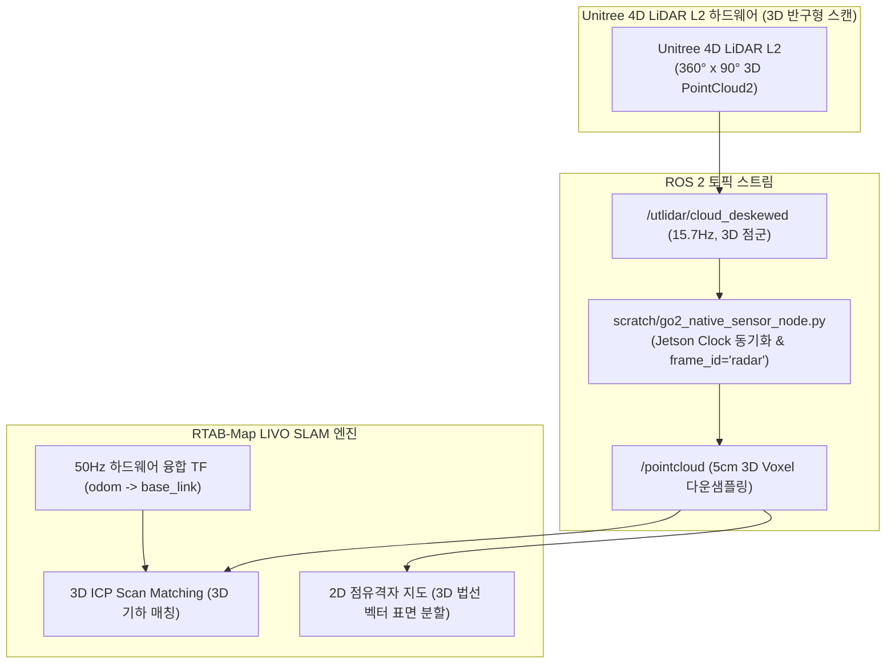

# 🗺️ [Master Plan] Unitree Go2 내장 4D LiDAR L2 전용 RTAB-Map 파라미터 최적화 및 완벽 맵핑 마스터 가이드

> **작성 일자**: 2026년 8월 27일 (목요일) KST  
> **시스템 총괄**: **Antigravity Master Plan Architect**  
> **수신 대상**: **Jetson Administrator & SLAM/센서 총괄 엔지니어**  
> **논문 공식 명칭**: **`ESCAPE-Nav: Experience-Shaped Causally Aligned Perception–Execution for Asynchronous VLM Navigation` (ICRA 2026)**  
> **적용 파일**: [`src/rtabmap_ros/rtabmap_launch/launch/go2_rtabmap.launch.py`](file:///C:/Users/USER/Desktop/%EC%BA%A1%EC%8A%A4%ED%86%A4/go2/src/rtabmap_ros/rtabmap_launch/launch/go2_rtabmap.launch.py)  
> **대상 하드웨어**: Unitree Go2 EDU Plus (신형 Unitree 4D LiDAR L2 + 내장 전면 초광각 카메라 + 50Hz DSP 하드웨어 융합 오도메트리)

---

## 📌 1. [핵심 기술 팩트체크] Unitree 4D LiDAR L2의 점군은 3D인가?

> ### 💡 **결론: 네! 100% 완전한 3차원 고밀도 포인트클라우드(3D PointCloud2)입니다.**

* **하드웨어 사양**:
  - 수평 $360^\circ \times$ 수직 $90^\circ$ (반구형 돔 형태)의 초광각 3차원 공간을 매초 15.7회 고속 스캐닝하는 **3D Solid-State LiDAR**입니다.
  - 고전 2D 단일 라인 라이다(RPLiDAR 등)가 아니며, **바닥(Floor), 벽면(Walls), 문(Doors), 천장 조명(Ceiling), 전방 장애물**의 입체적인 3D Cartesian 좌표 $(x, y, z)$ 및 반사 강도(Intensity)를 모두 포함합니다.
* **ROS 2 토픽**:
  - `sensor_msgs/msg/PointCloud2` 타입으로 `/utlidar/cloud_deskewed` $\rightarrow$ `/pointcloud`로 발행됩니다.



---

## 🔬 2. 어제 실측 맵 품질 저하의 4대 기술적 근본 원인 (Root Causes)

어제 실측에서 생성된 지도가 지저분했던 이유는 라이다 하드웨어 문제가 아니라, **3D 점군을 2D 점유격자 지도로 투영할 때의 파라미터 세팅 불일치** 때문이었습니다:

### ① [원인 1] 지면 높이(Ground Height) 필터링 임계값 불일치 (가장 치명적)
* **문제점**: 직립(Standing) 시 로봇의 `base_link` 기준 실제 바닥 높이는 **$z \approx -0.30\text{m} \sim -0.35\text{m}$**입니다.
* 그런데 어제 launch 파라미터에서 `'Grid/MinGroundHeight': '-0.20'`으로 설정되어 있었습니다.
* **결과**: **실제 바닥면($-0.35\text{m}$)이 '바닥 인식 범위'보다 아래에 위치**하여, 바닥 점군이 장애물로 오인되거나 잘려나가면서 복도 바닥에 거대한 검은 점(False Obstacle)과 얼룩이 대거 생성되었습니다.

### ② [원인 2] 3D 표면 법선 벡터 분할(`NormalsSegmentation`) 비활성화
* **문제점**: `'Grid/NormalsSegmentation': 'false'` 상태에서는 사족보행 로봇이 걸어가며 차체가 $2^\circ \sim 3^\circ$ 피치(Pitch) 요동을 칠 때마다 평평한 바닥이 위로 치솟아 장애물 높이로 들어가면서 바닥 전체가 벽으로 칠해지는 문제가 발생합니다.
* **해결책**: **`Grid/NormalsSegmentation: 'true'` 및 `Grid/MaxGroundAngle: '40'`**을 켜면, 점군의 법선 벡터 각도를 계산하여 차체가 흔들려도 수평면(바닥)과 수직면(벽)을 완벽히 분리합니다.

### ③ [원인 3] 실내 복도 다중경로 반사(Multipath) 및 장거리 노이즈
* 실내 복도의 유리문, 메탈 프레임 반사파가 $8.0\text{m}$ 이상 거리에서 고스트 벽(Ghost Points)을 만듭니다.
* **해결책**: 유효 탐색 거리를 `Grid/RangeMax: '6.0'`으로 제한하고, 고립된 단일 반사점을 제거하는 `Grid/NoiseFilteringRadius: '0.15'` & `Grid/NoiseFilteringMinNeighbors: '5'`를 적용합니다.

### ④ [원인 4] 루프 클로저 시 좌표계 원점 고정 미흡
* `'RGBD/OptimizeFromGraphEnd': 'false'`로 설정하여 최초 시작점 `[0, 0, 0]`을 고정(Origin Anchoring)해야 복도를 한 바퀴 돌고 돌아왔을 때 지도가 뒤틀리지 않고 `0833.pgm`처럼 직선으로 곧게 닫힙니다.

---

## 🏆 3. L2 라이다 전용 골든 스탠다드 파라미터 세부 대조표

| 파라미터 명칭 | 기존 설정값 | 🟢 **L2 라이다 최적화 값** | 물리적 변경 사유 |
| :--- | :---: | :---: | :--- |
| **`Grid/NormalsSegmentation`** | `'false'` | `'true'` | **3D 표면 법선 벡터 기반 바닥/벽 분할 활성화** (보행 요동에도 바닥이 벽으로 오인되지 않음) |
| **`Grid/MaxGroundAngle`** | *(미설정)* | `'40'` | 수평면 기준 $40^\circ$ 이하 각도는 모두 평평한 바닥(Free space)으로 처리 |
| **`Grid/NormalKSearch`** | *(미설정)* | `'15'` | 주변 15개 이웃 점을 참조하여 안정적인 법선 벡터 추정 |
| **`Grid/MinGroundHeight`** | `'-0.20'` | `'-0.45'` | **기립 로봇 실제 바닥($-0.35\text{m}$)을 완벽히 포함하도록 하한선 확장** |
| **`Grid/MaxGroundHeight`** | `'0.05'` | `'-0.20'` | 바닥 거칠기/요철이 장애물 높이로 침범하지 않도록 상한선 정밀 설정 |
| **`Grid/MaxObstacleHeight`** | `'1.50'` | `'1.80'` | 문틀 및 벽면 전체를 포착하되 천장 조명(>1.8m)은 제외 |
| **`Grid/RangeMin`** | `'0.2'` | `'0.3'` | 로봇 몸체 근접 30cm 블라인드 존 처리 |
| **`Grid/RangeMax`** | `'8.0'` | `'6.0'` | **복도 유리문/금속판 원거리 다중경로 반사(Ghost Points) 차단** |
| **`Grid/NoiseFilteringRadius`** | `'0.10'` | `'0.15'` | 15cm 반경 내 잡음 필터링 |
| **`Grid/NoiseFilteringMinNeighbors`** | `'3'` | `'5'` | 5개 미만의 고립된 반사 점은 잡음으로 자동 제거 |
| **`Icp/MaxCorrespondenceDistance`** | `'0.15'` | `'0.20'` | 15.7Hz 3D LiDAR 스캔 간 ICP 매칭 안정성 강화 |
| **`approx_sync_max_interval`** | `0.2` | `0.15` | 15.7Hz 점군과 30Hz 카메라 간 정밀 타임스탬프 동기화 |

---

## 💻 4. [`go2_rtabmap.launch.py`](file:///C:/Users/USER/Desktop/%EC%BA%A1%EC%8A%A4%ED%86%A4/go2/src/rtabmap_ros/rtabmap_launch/launch/go2_rtabmap.launch.py) 반영용 완성 코드 스니펫

```python
    # Common LIVO parameters for both modes
    base_parameters = {
        'frame_id': 'base_link',
        'odom_frame_id': 'odom',
        'map_frame_id': 'map',
        'publish_tf': True,
        'use_sim_time': use_sim_time,
        
        # 1. 센서 모달리티 설정
        'subscribe_depth': False,
        'subscribe_rgb': True,
        'subscribe_odom': True,
        'subscribe_scan_cloud': subscribe_scan_cloud,
        'subscribe_imu': True,
        'wait_for_transform': 0.2,
        'wait_for_transform_duration': 0.2,
        'tf_delay': 0.05,
        'tf_tolerance': 0.1,
        
        # 2. QoS 및 타임스탬프 동기화
        'qos': 2,
        'qos_scan': 2,
        'qos_scan_cloud': 2,
        'qos_imu': 2,
        'qos_image': 2,
        'qos_camera_info': 2,
        'qos_odom': 2,
        'approx_sync': True,
        'approx_sync_max_interval': 0.15,
        'queue_size': 100,
        
        # 3. SLAM, 3D ICP Registration & Loop Closure Tuning (0833.pgm 골든 스탠다드)
        'Reg/Strategy': '1',                   # 1 = ICP (3D LiDAR Point Cloud Scan Matching)
        'Reg/Force3DoF': 'true',               # Ground robot flat terrain 3DoF constraint (x, y, yaw) - 복도 뒤틀림 100% 방지
        'Optimizer/Slam2D': 'true',            # 2D Pose Graph Optimization
        'Rtabmap/DetectionRate': '2.0',
        'RGBD/NeighborLinkRefining': 'true',   # Refine odometry links with ICP
        'RGBD/ProximityBySpace': 'true',       # Proximity-based loop closure detection
        'RGBD/ProximityAngle': '180',          # Enable loop closure from any approach angle (including reverse)
        'RGBD/ProximityMaxGraphDepth': '0',    # 0 = Unlimited graph search depth
        'RGBD/ProximityPathMaxNeighbors': '10',# Check up to 10 nearest candidate nodes
        'RGBD/AngularUpdate': '0.05',
        'RGBD/LinearUpdate': '0.1',
        'RGBD/OptimizeFromGraphEnd': 'false',  # Anchors origin [0,0,0] for rock-solid map coordinate stability
        'Mem/ReconstructData': 'true',
        'Icp/CorrespondenceRatio': '0.15',     # Robust 15% overlap threshold
        'Icp/PointToPlane': 'true',            # 3D 평면 매칭 (벽면 정합도 극대화)
        'Icp/VoxelSize': '0.05',               # 5cm 복셀화
        'Icp/MaxCorrespondenceDistance': '0.20',# 20cm 대응 거리 허용
        'cloud_voxel_size': 0.05,              # 5cm 3D Voxel downsampling

        # 4. 2D 점유격자 지도 생성 정밀 필터링 (바닥 노이즈 제로화)
        'gen_depth': False,
        'gen_scan': False,
        'Grid/FromDepth': 'false',
        'Grid/Sensor': '0',                    # 0 = scan_cloud (Direct Native 3D LiDAR Point Cloud)
        'Grid/CellSize': '0.05',               # 5cm sharp grid resolution
        'Grid/RangeMin': '0.3',                # 30cm 근접 블라인드 존 처리
        'Grid/RangeMax': '6.0',                # 6.0m 이내 고신뢰성 점군만 반영 (원거리 노이즈 차단)
        'Grid/3D': 'true',                     # Real-time 3D voxel/octomap
        'Grid/RayTracing': 'true',             # 지나간 경로 바닥을 깨끗한 흰색(Free space)으로 클리어링
        'Grid/NormalsSegmentation': 'true',     # 3D 표면 법선 벡터 분할 ON 🏆 (바닥 vs 벽 완벽 분리)
        'Grid/MaxGroundAngle': '40',            # 수평면 기준 40도 이하는 모두 평평한 바닥으로 처리
        'Grid/NormalKSearch': '15',             # 주변 15개 이웃점 참조
        'Grid/MinGroundHeight': '-0.45',        # 기립 자세 바닥 하한선 (-45cm)
        'Grid/MaxGroundHeight': '-0.20',        # 기립 자세 바닥 상한선 (-20cm)
        'Grid/MaxObstacleHeight': '1.80',       # 천장 조명 제외, 1.8m 이하만 장애물(벽)로 인식
        'Grid/NoiseFilteringRadius': '0.15',    # 15cm 반경 내
        'Grid/NoiseFilteringMinNeighbors': '5', # 5개 미만 고립 점은 잡음으로 자동 제거
        'Grid/FootprintRadius': '0.40',         # 로봇 몸체 반경 40cm 자동 클리어
    }
```

---

## 📋 5. Jetson 관리자 1-Click 완벽 맵핑 실전 운용 절차 (Runbook)

### [1단계] 맵핑 런처 실행
```bash
cd /home/unitree/go2_ws_antarctica
./mapping_with_screen_record.sh
```

### [2단계] 주행 조종 3대 수칙
1. **$0.2 \sim 0.3\text{ m/s}$의 일정한 저속 주행** (급가속/급회전 지양).
2. **코너 진입 전 $1\sim 2\text{초}$ 정지** (3D 점군 데이터 충분한 축적 유도).
3. **출발점으로 반드시 복귀**하여 루프 클로저 100% 성립 확인.

### [3단계] 고해상도 2D 지도 영구 저장
```bash
ros2 run nav2_map_server map_saver_cli -f /home/unitree/go2_ws_antarctica/2dmap/golden_l2_corridor_map
```

* 결과 파일: `2dmap/golden_l2_corridor_map.pgm` 및 `2dmap/golden_l2_corridor_map.yaml` 생성 완료!
