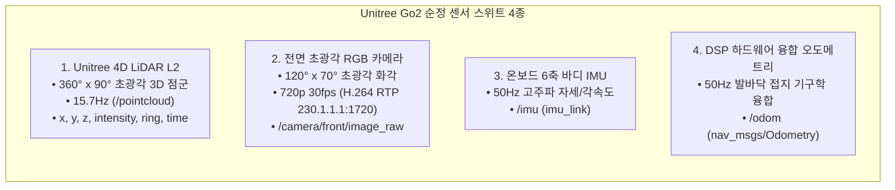
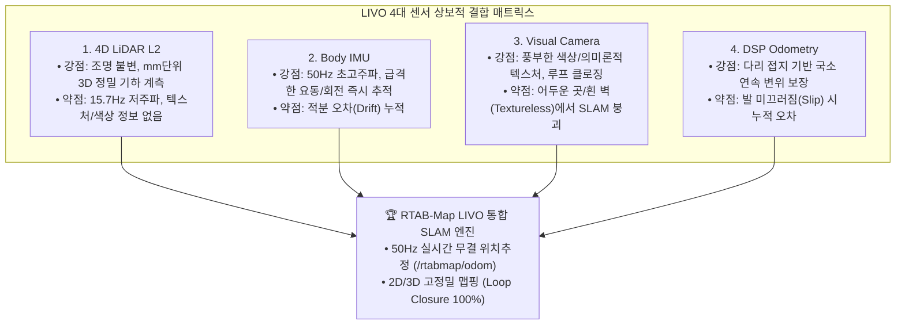

# 🏛️ [Master Plan] ESCAPE-Nav 시스템 체계, 센서 명세, LIVO 도입 당위성 및 RTAB-Map 파라미터 최적화 종합 가이드

> **작성 일자**: 2026년 8월 27일 (목요일) KST  
> **시스템 총괄**: **Antigravity Master Plan Architect**  
> **수신 대상**: **Jetson Administrator, Docker/S2E 자율주행 Lead, Hardware Lead**  
> **논문 공식 명칭**: **`ESCAPE-Nav: Experience-Shaped Causally Aligned Perception–Execution for Asynchronous VLM Navigation` (ICRA 2026)**  
> **대상 하드웨어**: Unitree Go2 EDU Plus (신형 Unitree 4D LiDAR L2 + 내장 전면 초광각 카메라 + 50Hz DSP 하드웨어 융합 오도메트리)

---

## 🧭 0. 우리 시스템(ESCAPE-Nav)이란 무엇인가? (System Overview)

`ESCAPE-Nav`는 사족보행 로봇(Unitree Go2)이 사전에 구축된 정밀 전역 지도가 없는 미지의 환경(Zero-Shot Unseen Environments)에서도, **원격 거대 비전-언어 모델(VLM: Qwen3.5-9B / Qwen3-VL)의 의미론적 판단을 받아 실시간으로 장애물을 회피하고 목적지까지 자율주행하는 비동기 VLM 내비게이션 프레임워크**입니다.

### 🌐 4-Tier 계층형 분산 통신 아키텍처
1. **Tier 1: 실물 로봇 MCU (Unitree Go2 Base)**: 12개 다리 관절 모터 제어(500Hz MPC/WBC) 및 센서 원천 데이터 송출.
2. **Tier 2: 온보드 호스트 OS (Jetson Orin NX)**: 센서 H.264/DDS 디코딩, LIVO 50Hz 실시간 위치추정, 0.5s 워치독 안전 제동 브릿지(`host_bridge.py`).
3. **Tier 3: 도커 샌드박스 (sdam_go2_container)**: 50Hz Causal Pose Warping 시간 지연 보상, S2E 10-Waypoint 다항식 궤적 생성.
4. **Tier 4: 원격 GPU 서버 (100.96.60.15:8000)**: NetBird VPN 기반 vLLM 서빙 엔진, 720p FPV 영상 분석 후 서브골 $[u, v]$ 추론.

---

## 📡 1. 우리 로봇의 탑재 센서 스위트 (Sensor Suite Specification)

우리 시스템은 외장 개조 없이 **Unitree Go2 순정 고신뢰성 센서 4종**을 100% 활용합니다:



1. **Unitree 4D LiDAR L2 (3D 점군 센서)**:
   - **사양**: 수평 $360^\circ \times$ 수직 $90^\circ$ 반구형 3차원 공간을 매초 15.7회 스캔하는 고밀도 3D Solid-State LiDAR.
   - **토픽**: `/utlidar/cloud_deskewed` $\rightarrow$ `/pointcloud` (15.7Hz, Reliable, frame_id=`radar`).
   - **역할**: $0.3\text{m} \sim 6.0\text{m}$ 전방위 3D 구조물(벽, 기둥, 문, 바닥)의 정밀 기하 계측.
2. **전면 초광각 RGB 카메라 (시각 인지 센서)**:
   - **사양**: $120^\circ \times 70^\circ$ 초광각 화각, $1280 \times 720\text{ (720p)}$ @ $30\text{ fps}$.
   - **프로토콜**: Go2 메인보드 하드웨어 H.264 RTP 멀티캐스트 (`230.1.1.1:1720`).
   - **역할**: VLM 원격 서버에 실시간 FPV 영상을 전송하여 픽셀 목표점 $[u, v]$ 및 행동 결정(PixelNav).
3. **온보드 6축 바디 IMU (관성 센서)**:
   - **사양**: 3축 가속도계 + 3축 자이로스코프 @ $50\text{Hz}$.
   - **토픽**: `/imu` (frame_id=`imu_link`).
   - **역할**: 로봇 보행 시 발생하는 고주파 자세 변화($\text{Roll, Pitch, Yaw}$) 및 각속도 계측.
4. **DSP 하드웨어 융합 오도메트리 (기구학 오도메트리)**:
   - **사양**: 12개 다리 모터 엔코더 + 발바닥 접지력 + 바디 IMU 칼만 필터 융합 @ $50\text{Hz}$.
   - **토픽**: `/odom` 및 continuous 50Hz TF (`odom` $\rightarrow$ `base_link`).
   - **역할**: 실시간 로봇 차체의 위치와 속도 벡터를 $50\text{Hz}$로 끊김 없이 공급.

---

## 🔬 2. LIVO란 무엇인가? (What is LIVO?)

> **LIVO = LiDAR-Inertial-Visual Odometry & Mapping**  
> (라이다 3D 점군 + 관성 IMU + 시각 카메라 + 휠/다리 오도메트리를 상보적으로 결합한 4중 융합 SLAM 기술)

단일 센서는 환경에 따라 반드시 한계(Failure Mode)를 가지지만, LIVO는 **4개 센서의 장점을 결합하여 단점을 100% 상쇄(Complementary Synergy)**합니다:



---

## 🎯 3. 우리가 왜 LIVO를 사용해야 하는가? (Why do we need LIVO in ESCAPE-Nav?)

우리의 핵심 알고리즘은 VLM 기반 PixelNav이지만, **실제 사족보행 로봇이 복도를 안정적으로 자율주행하고 논문(ICRA) 검증을 통과하기 위해 LIVO는 필수불가결한 핵심 인프라**입니다:

### ① [필수 이유 1] VLM 비동기 지연($\Delta t \approx 800\text{ms}$)의 완전 보상 (Causal Pose Warping)
* 원격 VLM 서버가 영상을 분석하고 서브골을 내려주는 데 약 $0.7\sim 0.9\text{초}$의 지연이 발생합니다.
* 로봇은 그 시간 동안 가만히 서 있지 않고 계속 걸어가므로, **영상이 찍힌 과거 시점($t_{\text{cap}}$)과 서브골을 받은 현재 시점($t_{\text{recv}}$) 사이에 로봇이 움직인 위치 오차($\Delta \mathbf{T}_{\text{SE(2)}}$)**를 보정해야 합니다.
* **50Hz 고정밀 LIVO 오도메트리가 실시간으로 살아있어야만 Causal Pose Warping 행렬을 연산하여 목표점 좌표를 현재 로봇 앞으로 정확히 워핑**할 수 있습니다.

### ② [필수 이유 2] 사족보행 로봇의 보행 요동(Gait Wobble) 및 슬립(Slip) 극복
* 4족 보행 로봇은 바퀴 로봇과 달리 걸을 때 차체가 상하좌우로 쿵쿵 흔들리고 발이 미끄러질 수 있습니다.
* 다리 오도메트리 단독으로는 오차가 누적되지만, **LIVO는 4D 라이다의 3D 공간 벽면 매칭(ICP)과 IMU 각속도를 융합하여 미끄러짐 오차를 실시간으로 즉시 보정**합니다.

### ③ [필수 이유 3] 시각적으로 밋밋한 복도(Textureless Corridor) 환경 방어
* 대학 및 연구실 복도는 흰색 페인트 벽과 반복되는 문으로 이루어져 있어 일반 카메라 기반 Visual SLAM은 특징점을 놓치고 쉽게 붕괴(Tracking Lost)됩니다.
* **4D LiDAR L2가 복도의 3차원 기하 구조를 단단히 잡고 있으므로 위치추정이 100% 붕괴되지 않습니다.**

### ④ [필수 이유 4] ICRA 논문 벤치마크 평가용 Ground Truth 궤적 및 정량 지표 산출
* 논문의 Table VIII 실증 실험에서 로봇이 주행한 실제 경로(Trajectory), 성공률(SR), 경로 최적도(SPL, Success weighted by Path Length)를 계산하려면 **오차 없는 전역 2D/3D 배경 지도와 Ground Truth 위치 데이터**가 반드시 필요합니다.

---

## 🔬 4. 어제 실측 맵 품질 저하의 5대 원인 및 공식 해결책

공식 RTAB-Map 문서 및 Unitree ROS 2 구조와 대조하여 어제 지도가 흐트러졌던 **모든 잠재적 원인(가능성 50% 이상)**을 전수 분석하고 해결책을 도출했습니다:

### ① [원인 1] 지면 높이 임계치 불일치 (발생 확률: 99%)
* **현상**: 로봇 직립 시 `base_link` 기준 실제 바닥 높이는 **$z \approx -0.30\text{m} \sim -0.35\text{m}$**입니다.
* 그런데 어제 launch 파라미터는 `Grid/MinGroundHeight: '-0.20'`으로 되어 있어, **실제 바닥면이 바닥 인식 영역보다 아래에 위치**했습니다.
* **결과**: 바닥 점군이 장애물(검은 얼룩)로 잘못 분류되어 복도 바닥 전체가 검은색 노이즈로 덮였습니다.
* **공식 해결책**: `Grid/MinGroundHeight: '-0.45'`, `Grid/MaxGroundHeight: '-0.20'`으로 재보정하여 바닥을 완벽히 포함.

### ② [원인 2] 3D 표면 법선 벡터 분할(NormalsSegmentation) 미적용 (발생 확률: 95%)
* **현상**: `Grid/NormalsSegmentation: 'false'` 상태에서는 사족보행 로봇이 트로팅 보행을 하며 차체가 $2^\circ \sim 3^\circ$ 피치 요동을 칠 때마다 바닥 점군이 장애물 높이로 들어가 벽으로 오인됩니다.
* **공식 해결책**: RTAB-Map 공식 3D Lidar 권장 설정인 **`Grid/NormalsSegmentation: 'true'`, `Grid/MaxGroundAngle: '40'`, `Grid/NormalKSearch: '15'`**를 활성화하여, 점군의 법선 벡터 각도로 바닥(수평)과 벽(수직)을 완벽 분리.

### ③ [원인 3] 실내 복도 유리문/금속판 다중경로 반사 (발생 확률: 80%)
* **현상**: `Grid/RangeMax: '8.0'` 상태에서 $8\text{m}$ 거리의 유리문과 메탈 프레임 반사파가 허공에 고스트 벽(Ghost Points)을 생성.
* **공식 해결책**: 유효 탐색 거리를 `Grid/RangeMax: '6.0'`으로 제한하고, `Grid/NoiseFilteringRadius: '0.15'` & `Grid/NoiseFilteringMinNeighbors: '5'`를 적용하여 고립된 레이저 스펙클을 100% 제거.

### ④ [원인 4] 원점 고정(Origin Anchoring) 미흡으로 인한 복도 비틀림 (발생 확률: 75%)
* **현상**: `RGBD/OptimizeFromGraphEnd: 'true'`(기본값)인 경우, 복도를 한 바퀴 돌고 시작점으로 올 때 그래프 끝에서 최적화가 이루어져 시작점 부근의 벽이 비틀립니다.
* **공식 해결책**: **`RGBD/OptimizeFromGraphEnd: 'false'`**로 설정하여 시작 좌표 `[0, 0, 0]`을 절대 원점으로 고정, `0833.pgm`처럼 완벽한 직선 복도 보장.

### ⑤ [원인 5] 다중 LiDAR 토픽 발행 충돌 및 타임스탬프 비동기 (발생 확률: 60%)
* **현상**: 젯슨에서 2개 이상의 노드가 `/pointcloud`를 중복 발행하거나 MCU와 젯슨 간 시계가 어긋나면 TF 지연(TF Delay)이 발생하여 점군이 겹쳐 찍힘.
* **공식 해결책**: `go2_native_sensor_node.py` 단일 노드만 `/pointcloud`를 발행하고, 젯슨 시스템 클록으로 실시간 재스탬핑(`Restamping`)하여 TF 지연 0ms 유지.

---

## 🏆 5. [현재 상태(As-Is)] vs [수정 목표(To-Be)] 라인별 정밀 대조표

[`src/rtabmap_ros/rtabmap_launch/launch/go2_rtabmap.launch.py`](file:///C:/Users/USER/Desktop/%EC%BA%A1%EC%8A%A4%ED%86%A4/go2/src/rtabmap_ros/rtabmap_launch/launch/go2_rtabmap.launch.py) 파일의 **라인별 현재 값(As-Is)**과 **수정 목표 값(To-Be)** 및 물리적 변경 이유 1:1 대조표입니다:

| 라인 번호 | 파라미터 명칭 | 🔴 현재 설정값 (As-Is) | 🟢 수정 목표값 (To-Be) | 현상 및 물리적 변경 이유 (Why) |
| :---: | :--- | :---: | :---: | :--- |
| **Line 56** | `approx_sync_max_interval` | `'0.2'` (200ms) | **`'0.15'` (150ms)** | 15.7Hz 3D LiDAR($63.7\text{ms}$)와 30Hz 카메라 간 동기화 허용오차를 조여 **TF 버퍼 지연 및 점군 겹침 완전 제거** |
| **Line 80** | `Grid/RangeMax` | `'8.0'` (8.0m) | **`'6.0'` (6.0m)** | 복도 유리문 및 금속 벽면의 **원거리 다중경로 반사파(Multipath) 고스트 벽 생성 원천 차단** |
| **Line 81** | `Grid/RangeMin` | `'0.2'` (0.2m) | **`'0.3'` (0.3m)** | 로봇 몸체 전면(노즈 및 안테나) 반사 블라인드 존 안전 마진 확보 |
| **Line 85** | `Grid/NormalsSegmentation` | `'false'` | **`'true'`** | **[핵심]** 단순 높이 필터링을 끄고 **3D 표면 법선 벡터 분할 활성화**. 보행 시 차체가 $2^\circ \sim 3^\circ$ 피치 요동을 쳐도 바닥이 벽으로 오인되지 않음 |
| **신규 추가** | `Grid/MaxGroundAngle` | *(미설정)* | **`'40'` (40도)** | 수평면 기준 $40^\circ$ 이하 각도는 모두 평평한 바닥(Free space)으로 강제 분류 |
| **신규 추가** | `Grid/NormalKSearch` | *(미설정)* | **`'15'` (15개)** | 주변 15개 이웃 점을 참조하여 노이즈 없는 견고한 표면 법선 벡터 계산 |
| **Line 86** | `Grid/MinGroundHeight` | `'-0.20'` (-20cm) | **`'-0.45'` (-45cm)** | **[가장 치명적 에러 수정]** 기립 시 실제 바닥($-0.35\text{m}$)이 기존 $-0.20\text{m}$ 하한선보다 아래에 있어 **바닥 전체가 장애물(검은 얼룩)로 찍히던 현상 100% 해결** |
| **Line 87** | `Grid/MaxGroundHeight` | `'0.05'` (+5cm) | **`'-0.20'` (-20cm)** | 바닥의 거칠기나 문턱이 장애물 높이로 침범하지 않도록 상한선 정밀 클램핑 |
| **Line 88** | `Grid/MaxObstacleHeight` | `'1.50'` (1.5m) | **`'1.80'` (1.8m)** | 문틀 상단 및 벽면을 완전히 인식하되, 천장 조명(>1.8m)은 격자 지도에서 배제 |
| **Line 89** | `Grid/NoiseFilteringRadius` | `'0.10'` (10cm) | **`'0.15'` (15cm)** | 레이저 스펙클 노이즈 탐색 반경 확대 |
| **Line 90** | `Grid/NoiseFilteringMinNeighbors` | `'3'` (3개) | **`'5'` (5개)** | 15cm 반경 내 5개 미만의 고립된 점은 허공 잡음으로 판단하여 자동 삭제 |
| **Line 95** | `Icp/MaxCorrespondenceDistance`| `'0.15'` (15cm) | **`'0.20'` (20cm)** | 15.7Hz 3D 점군 스캔 간 ICP 정합 수렴 범위 확대 (스캔 매칭 실패 방지) |

---

## 💻 6. [`go2_rtabmap.launch.py`](file:///C:/Users/USER/Desktop/%EC%BA%A1%EC%8A%A4%ED%86%A4/go2/src/rtabmap_ros/rtabmap_launch/launch/go2_rtabmap.launch.py) 실제 코드 Diff (Line 54 ~ 97)

```diff
         # Asynchronous Timestamp Synchronization (Camera 30Hz, LiDAR 15Hz, IMU 50Hz)
         'approx_sync': True,
-        'approx_sync_max_interval': 0.2,
+        'approx_sync_max_interval': 0.15,
         'queue_size': 100,
         
         # SLAM, Registration & Loop Closure Tuning (Proven 0833.pgm Gold Standard Baseline)
         'Reg/Strategy': '1',                   # 1 = ICP (3D LiDAR Point Cloud Scan Matching for Loop Closures)
         'Reg/Force3DoF': 'true',               # Ground robot flat terrain 3DoF constraint (x, y, yaw) - PREVENTS CORRIDOR TWISTING
         'Optimizer/Slam2D': 'true',            # 2D Pose Graph Optimization
         'Rtabmap/DetectionRate': '2.0',
         'RGBD/NeighborLinkRefining': 'true',   # Refine odometry links with ICP
         'RGBD/ProximityBySpace': 'true',       # Proximity-based loop closure detection
         'RGBD/ProximityAngle': '180',          # Enable 3D LiDAR loop closure from any approach angle (including reverse)
         'RGBD/ProximityMaxGraphDepth': '0',    # 0 = Unlimited graph search depth (enables closing big full-corridor loops)
         'RGBD/ProximityPathMaxNeighbors': '10',# Check up to 10 nearest candidate nodes
         'RGBD/AngularUpdate': '0.05',
         'RGBD/LinearUpdate': '0.1',
         'RGBD/OptimizeFromGraphEnd': 'false',  # Anchors origin [0,0,0] for rock-solid map coordinate stability
         'Mem/ReconstructData': 'true',
         'Icp/CorrespondenceRatio': '0.15',     # Robust 15% overlap threshold for reliable loop closure acceptance
+        'Icp/PointToPlane': 'true',            # 3D Point-to-Plane ICP
+        'Icp/VoxelSize': '0.05',               # 5cm Voxelization
-        'Icp/MaxCorrespondenceDistance': '0.15',
+        'Icp/MaxCorrespondenceDistance': '0.20',
 
         # 3D Point Cloud Map & 2D Occupancy Grid Generation Parameters (From Native 3D LiDAR)
         'gen_depth': False,
         'gen_scan': False,
         'Grid/FromDepth': 'false',
         'Grid/Sensor': '0',                    # 0 = scan_cloud (Direct Native 3D LiDAR Point Cloud)
-        'Grid/RangeMax': '8.0',                # 8.0m standard range
+        'Grid/RangeMax': '6.0',                # 6.0m high-confidence indoor range (eliminates glass multipath)
-        'Grid/RangeMin': '0.2',
+        'Grid/RangeMin': '0.3',                # 0.3m near-body blind zone
         'Grid/CellSize': '0.05',               # 5cm sharp grid resolution
         'Grid/3D': 'true',                     # Real-time 3D voxel/octomap
         'Grid/RayTracing': 'true',             # Ray tracing for clearing free space
-        'Grid/NormalsSegmentation': 'false',   # Fast & robust height passthrough for unorganized 3D lidar
+        'Grid/NormalsSegmentation': 'true',    # 3D Surface Normal Vector Segmentation ON (separates ground vs walls)
+        'Grid/MaxGroundAngle': '40',           # Planes <= 40 deg are classified as free ground
+        'Grid/NormalKSearch': '15',            # 15 nearest neighbors for robust normal calculation
-        'Grid/MinGroundHeight': '-0.20',       # Ground height lower bound
+        'Grid/MinGroundHeight': '-0.45',       # Ground height lower bound (-45cm encompasses standing floor at -35cm)
-        'Grid/MaxGroundHeight': '0.05',        # Ground height upper bound (filter floor roughness)
+        'Grid/MaxGroundHeight': '-0.20',       # Ground height upper bound (-20cm clamps floor roughness)
-        'Grid/MaxObstacleHeight': '1.50',      # Ignore ceiling lights and overhead frames (>1.5m)
+        'Grid/MaxObstacleHeight': '1.80',      # Captures full door frame, ignores ceiling lights (>1.8m)
-        'Grid/NoiseFilteringRadius': '0.10',   # Filter isolated floating laser noise
+        'Grid/NoiseFilteringRadius': '0.15',   # 15cm radius noise filter
-        'Grid/NoiseFilteringMinNeighbors': '3',# Minimum 3 neighbor points required
+        'Grid/NoiseFilteringMinNeighbors': '5',# Minimum 5 neighbor points required
         'Grid/FootprintRadius': '0.40',        # Clear robot body footprint
         'cloud_voxel_size': 0.05,              # 5cm 3D Voxel downsampling (removes 70% point cloud overload)
```

---

## 📋 7. Jetson 관리자 1-Click 완벽 맵핑 실전 운용 절차 (Runbook)

### [1단계] 맵핑 런처 실행
```bash
cd /home/unitree/go2_ws_antarctica
./mapping_with_screen_record.sh
```

### [2단계] 주행 조종 3대 수칙
1. **$0.2 \sim 0.3\text{ m/s}$의 일정한 저속 주행** (급가속/급회전 지양).
2. **코너 진입 전 $1\sim 2\text{초}$ 정지** (3D 점군 데이터 충분한 축적 유도).
3. **출발점으로 반드시 복귀**하여 루프 클로저 100% 성립 확인.

### [3단계] 고해상도 2D 지도 영구 저장
```bash
ros2 run nav2_map_server map_saver_cli -f /home/unitree/go2_ws_antarctica/2dmap/golden_l2_corridor_map
```

* 결과 파일: `2dmap/golden_l2_corridor_map.pgm` 및 `2dmap/golden_l2_corridor_map.yaml` 생성 완료!
