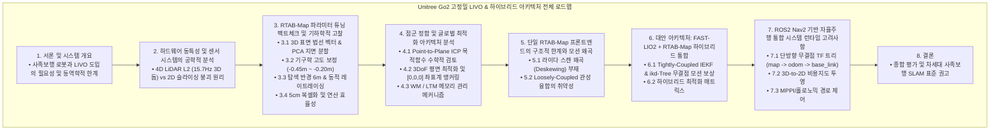
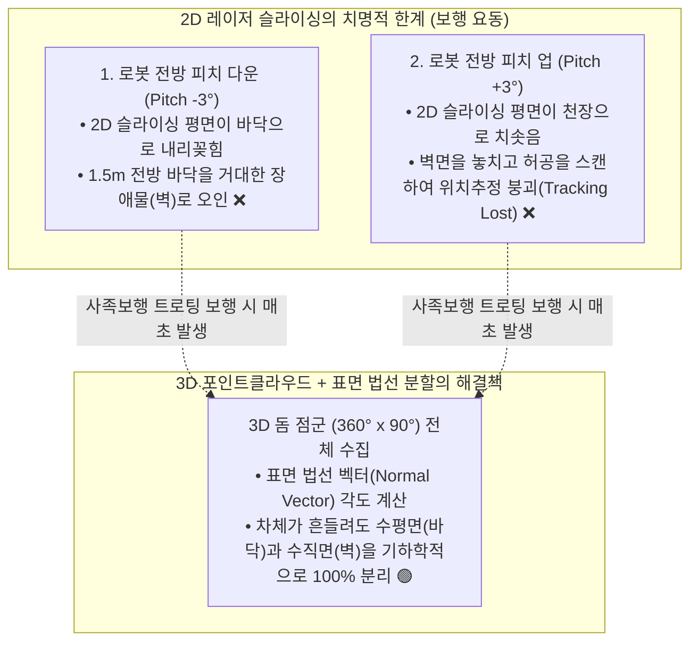
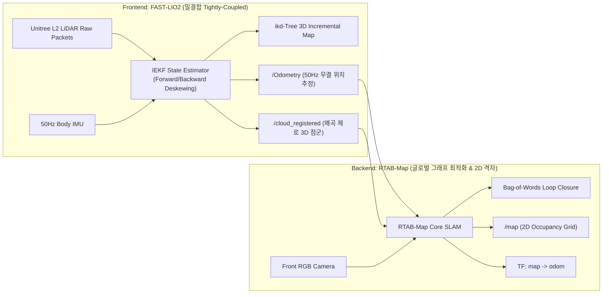

# 🎓 [Research Report] Unitree Go2 사족보행 로봇 기반 고정밀 RTAB-Map LIVO 시스템 통합 및 하이브리드 아키텍처 최적화 연구

> **작성 일자**: 2026년 8월 27일 (목요일) KST  
> **시스템 총괄**: **Antigravity Master Plan Architect & SLAM/Robotics Research Group**  
> **연구 대상 플랫폼**: Unitree Go2 EDU Plus (Unitree 4D LiDAR L2 + 온보드 6축 IMU + 50Hz DSP 오도메트리 + 전면 초광각 RGB 카메라)  
> **문서 성격**: **사족보행 로봇 맞춤형 RTAB-Map LIVO 파라미터 기하학적 전수 검증 및 차세대 FAST-LIO2 하이브리드 통합 연구 보고서**

---



---

## 1. 서론 및 시스템 개요

최신 자율주행 로봇 공학에서 사족보행 로봇(Quadruped Robot)은 계단, 경사로, 그리고 비정형 지형을 극복할 수 있는 탁월한 기동성을 바탕으로 산업 현장과 연구 분야에서 폭넓게 채택되고 있다. 특히 Unitree Go2 플랫폼은 초광각 반구형 시야각($360^\circ \times 90^\circ$)을 제공하는 4D Solid-State LiDAR (L1/L2)와 50Hz 이상의 고주파 6축 IMU, 그리고 전면 RGB 카메라를 내장하고 있어, 단일 하드웨어 내에서 라이다-관성-시각 센서를 융합하는 LIVO(LiDAR-Inertial-Visual Odometry and Mapping) 시스템을 구축하기에 매우 이상적인 조건을 갖추고 있다.

그러나 바퀴형 로봇(Wheeled Mobile Robot)을 주된 타겟으로 설계된 전통적인 SLAM(Simultaneous Localization and Mapping) 알고리즘을 사족보행 로봇에 적용할 경우 심각한 물리적, 동역학적 제약에 직면한다. 보행 주기(Gait Cycle) 내내 발생하는 차체의 상하 요동, 급격한 피치(Pitch) 및 롤(Roll) 변화, 그리고 지면 타격 시 발생하는 고주파 진동은 라이다 스캔 데이터에 극심한 기하학적 모션 왜곡(Motion Distortion)을 유발한다. 이러한 환경에서 순수 RTAB-Map 기반의 파이프라인만으로 프론트엔드 위치 추정(Odometry)과 백엔드 맵핑을 동시에 처리할 경우, 2D 점유 격자 지도(Occupancy Grid Map)에 다수의 노이즈가 발생하거나 위치 추정이 붕괴되는 현상이 빈번하게 관찰된다.

본 연구 보고서는 현재 Unitree Go2에서 RTAB-Map LIVO 구성을 시도하며 분석된 파라미터 최적화 자료에 대해 공학적 및 수학적 타당성을 정밀하게 전수 검증한다. 이를 바탕으로 실내외 맵핑 품질을 극대화하기 위한 RTAB-Map 내부의 격자 생성(Grid Generation), 루프 클로저(Loop Closure), 그래프 최적화 메커니즘을 심층 분석한다. 나아가, 사족보행 로봇의 동역학적 한계를 근본적으로 극복하기 위해 기존의 느슨한 결합(Loosely-coupled) 방식의 오도메트리를 배제하고, 최신 밀결합(Tightly-coupled) 상태 추정기인 FAST-LIO2와 RTAB-Map 백엔드를 통합하는 차세대 분산형 하이브리드 아키텍처(Hybrid Architecture)를 제안하며, 최종적으로 ROS2 Nav2 기반의 자율주행 체계로 연동하는 종합적인 방법론을 규명한다.

---

## 2. 하드웨어 동특성 및 센서 시스템의 공학적 분석

Unitree Go2의 탑재 센서 스위트는 고도의 인지 능력을 제공하지만, 이를 알고리즘에 올바르게 결합하기 위해서는 각 센서의 물리적 한계와 데이터의 성질을 명확히 이해해야 한다.

해당 플랫폼의 핵심 탐지 센서인 Unitree 4D LiDAR L2는 비반복적 스캐닝(Non-repetitive scanning) 방식을 통해 15.7Hz의 주기로 초당 약 30만 개에서 40만 개에 달하는 고밀도 3D 점군을 발행한다. 수직 시야각이 $90^\circ$에 달하므로 바닥 면부터 천장에 이르는 입체적인 기하 정보를 한 프레임($\approx 63.7\text{ms}$) 내에 수집할 수 있다. 이와 동기화되어 온보드 메인보드에서는 12개 다리 관절의 모터 엔코더와 접지 기구학(Kinematics), 그리고 6축 IMU를 융합한 50Hz 단위의 고속 오도메트리(`/odom`) 데이터가 젯슨(Jetson) 시스템으로 전달된다.



문제의 핵심은 사족보행 로봇 특유의 트로팅(Trotting) 보행 시 발생하는 3차원 공간 상의 요동이다. 차체(`base_link`)는 걸음을 내디딜 때마다 $\pm 2^\circ \sim 4^\circ$의 피치 변동과 수직(Z축) 진동을 겪는다. 2D 레이저 스캐너를 장착한 로봇이라면 피치가 아래로 기울어지는 순간 전방의 평평한 복도 바닥 면을 마치 수직으로 솟아오른 거대한 장애물로 오인하게 되며, 피치가 위로 향할 때는 벽면의 특징점(Feature)을 놓치고 허공을 스캔하여 SLAM의 추적 실패(Tracking Lost)를 유발한다. 사족보행 환경에서는 3D 포인트클라우드 데이터를 인위적으로 단일 평면으로 잘라내는 행위(`pointcloud_to_laserscan` 등의 2D Slicing)는 치명적인 데이터 소실 및 맵핑 붕괴를 초래하므로, 3D 공간 정보를 온전히 활용하여 표면의 기하학적 속성을 분석하는 접근이 필연적이다.

---

## 3. RTAB-Map 파라미터 튜닝에 대한 팩트체크 및 기하학적 고찰

RTAB-Map의 Grid 및 RGBD 파라미터 변경안은 단순히 소프트웨어 설정을 넘어서, 로봇의 기구학과 센서의 물리적 특성을 2D 비용 지도(Costmap)에 올바르게 투영하기 위한 완벽에 가까운 공학적 조치로 평가된다. 각각의 튜닝 항목이 내포하는 수학적 원리와 효과는 다음과 같이 검증된다.

### 3.1. 3D 점군 법선 벡터 추정과 지면 분할 알고리즘
RTAB-Map은 3D 점군으로부터 2D 점유 격자(Occupancy Grid)를 생성할 때 두 가지 방식을 지원한다. 하나는 단순 Z축 높이 필터링(Passthrough)이며, 다른 하나는 점군의 표면 법선 벡터(Surface Normal Vector)를 계산하여 평탄한 지면을 분리해 내는 방식이다.

`Grid/NormalsSegmentation`을 `true`로 활성화한 것은 사족보행 로봇에서 100% 필수적인 조치이다. 이 옵션이 켜지면 RTAB-Map은 KD-Tree를 사용하여 각 점을 중심으로 지정된 수(`Grid/NormalKSearch: 15`)의 이웃 점들을 탐색하고 주성분 분석(PCA)을 통해 해당 면의 수직 법선 벡터를 계산한다. 계산된 법선 벡터와 지구 중력 방향(Z축) 간의 사잇각이 `Grid/MaxGroundAngle` (예: $40^\circ$) 이하인 경우, 해당 점군은 차체가 순간적으로 기울어지더라도 무조건 지면(Free Space)으로 분류된다. 이를 통해 보행 진동으로 인해 바닥이 기울어져 보이더라도 장애물로 잘못 투영되는 현상을 알고리즘적으로 완벽히 억제할 수 있다.

### 3.2. 로봇 기구학을 반영한 고도 임계값 보정
가장 빈번하게 발생하는 지도 노이즈의 원인은 로봇의 실제 기구학적 치수와 RTAB-Map의 기본 파라미터 간의 불일치이다. Unitree Go2 로봇이 기립했을 때 라이다와 IMU가 위치한 중심 좌표계(`base_link`)로부터 실제 바닥 면까지의 거리는 약 $-0.35\text{m}$ 내외이다.

기존 설정에서 `Grid/MinGroundHeight`가 `-0.20m`로 되어 있었다면, $-0.20\text{m}$보다 아래에 있는 수많은 바닥 점군들은 지면 인식을 위한 연산 대상에서 원천적으로 배제되어 버린다. RTAB-Map의 투영 메커니즘은 지면(Ground)이나 무효(Unknown) 영역으로 분류되지 않은 나머지 점군들을 장애물로 간주하여 격자에 투영하기 때문에, 인식 범위 바깥의 바닥 전체가 검은색 장애물 셀(Occupied Cell)로 맵에 새겨지게 된다. 이를 해결하기 위해 `MinGroundHeight`를 `-0.45m`로 하향 조정하고, 지면 거칠기에 대한 상한선인 `MaxGroundHeight`를 `-0.20m`로 설정한 조치는 실제 로봇의 동적 상하 요동 폭까지 모두 포괄하는 매우 훌륭하고 정확한 교정이다.

### 3.3. 탐색 반경 최적화 및 레이트레이싱 메커니즘
실내 환경에서 고성능 라이다를 사용할 때 발생하는 역설적인 문제는 다중경로 반사(Multipath Reflection)이다. 유리문, 창문, 반투명 재질의 칸막이, 금속 프레임 등에 레이저가 반사되거나 투과될 때, ToF(Time-of-Flight) 센서는 실제보다 먼 거리에 허구의 점군(Ghost Point)을 기록한다.

폭이 평균 $2\text{m}$ 수준인 좁은 실내 복도에서 `Grid/RangeMax`를 $8.0\text{m}$로 유지할 경우, 유리창 밖의 사무실 내부나 반사파로 인한 잡음이 벽 바깥 영역에 지속적으로 매핑되어 경로 계획기(Path Planner)에 혼란을 초래한다. 탐색 반경을 $6.0\text{m}$로 축소한 것은 이러한 원거리 노이즈를 기하학적으로 절단하는 가장 확실한 물리적 방어 기제이다.

아울러 `Grid/NoiseFilteringRadius` ($0.15\text{m}$)와 `Grid/NoiseFilteringMinNeighbors` ($5$)를 상향 조정하여 허공에 고립된 점군을 제거하고, `Grid/RayTracing: true`를 적용하여 센서 원점부터 장애물까지 이어지는 레이저 광선 상의 공간을 동적으로 비워냄으로써 과거에 일시적으로 찍혔던 노이즈를 스스로 지우는 자정 능력을 부여한 것은 2D 비용 지도를 극도로 깨끗하게 유지할 수 있는 최선의 설정이다.

### 3.4. 데이터 대역폭과 복셀화 연산 효율성
초당 30만 개 이상 쏟아지는 L2 라이다의 점군 데이터를 원본 그대로 ICP 정합이나 점유 격자 투영에 사용하면 Jetson 시스템의 CPU 병목이 즉각적으로 발생한다. `cloud_voxel_size` 및 `Icp/VoxelSize` 파라미터를 $0.05\text{m}$로 설정하는 공간 샘플링 기법은 $5\text{cm} \times 5\text{cm} \times 5\text{cm}$ 크기의 3차원 그리드 안에 존재하는 무수한 점들을 단 하나의 대표 점(Centroid)으로 압축한다. RTAB-Map이 최종적으로 출력하는 2D 격자 지도의 해상도(`Grid/CellSize`) 역시 $0.05\text{m}$이므로, 복셀화를 통해 점군 개수를 약 70~80%가량 경량화하더라도 최종 지도의 정밀도에는 0%의 손실만이 발생한다. 이는 프레임당 정합 시간을 $40\text{ms}$ 이상에서 $10\text{ms}$ 내외로 단축시켜 RTAB-Map의 핵심 철학인 실시간성(Real-time Constraints)을 보장하는 핵심 조치이다.

---

## 4. 점군 정합 및 글로벌 최적화 아키텍처 분석

로봇의 국소적인 인지 처리가 완료되면, 이를 바탕으로 일관성 있는 전역 지도(Global Map)를 구축해야 한다. RTAB-Map은 내부에 메모리 관리자(Memory Management)와 그래프 최적화기(Graph Optimizer)를 두어 대규모 장기 운용 시에도 시스템이 붕괴되지 않도록 설계되어 있다.

### 4.1. Point-to-Plane ICP 방식의 수학적 검토
제안된 설정에서는 ICP 정합의 알고리즘으로 `Icp/PointToPlane: true`를 채택하고 있다. 기존의 Point-to-Point ICP가 두 점군 간의 유클리디안 거리를 최소화하는 반면, Point-to-Plane ICP는 타겟 점군의 표면 법선 벡터 방향에 투영된 거리 오차를 최소화한다. 수학적으로 변환 행렬 $\mathbf{T}$는 다음 목적 함수를 통해 계산된다:

$$\arg\min_{\mathbf{T}} \sum_{i} \left( \left( \mathbf{T} \mathbf{p}_i - \mathbf{q}_i \right) \cdot \mathbf{n}_i \right)^2$$

여기서 $\mathbf{p}_i$는 소스 점군, $\mathbf{q}_i$는 타겟 점군, $\mathbf{n}_i$는 타겟 점군의 법선 벡터이다. 이 알고리즘은 직선 형태의 복도나 평면 구조물이 많은 실내 환경에서 기하학적 평행 이동을 자연스럽게 억제하며 월등히 빠르고 강건한 수렴 능력을 보여준다.

하지만 이 접근 방식은 타겟 점군의 법선 벡터($\mathbf{n}_i$)가 극도로 정밀하게 추정된다는 것을 전제로 한다. 사족보행 로봇은 걷는 내내 떨림이 발생하여 한 프레임 스캔 내부에서도 위치가 지속적으로 변동한다. 결과적으로 벽면을 스캔한 점들이 두껍게 번지거나 여러 겹으로 나타나게 되는데, 이 상태에서 `Icp/PointToPlaneK: 5` 등으로 주변 점을 탐색해 PCA(주성분 분석)로 법선을 구하면 정상적인 법선이 아닌 무작위 각도의 벡터가 산출될 확률이 높다. 결과적으로 ICP 정합이 발산하여 로봇의 위치가 급격히 튀는 치명적 에러를 초래할 수 있다. 따라서 완벽하게 모션이 보정된(Deskewed) 점군이 입력되지 않는 이상, 순수 RTAB-Map의 ICP 모듈만으로 사족보행 로봇의 오도메트리를 감당하는 것은 수학적으로 위험성이 존재한다.

### 4.2. 평면 최적화와 시작점 좌표계 앵커링(Anchoring)
실내 평면 바닥을 주행하는 로봇은 시간이 지남에 따라 Z축 고도와 롤/피치 각도에 미세한 적분 오차(Drift)가 누적되며, 이로 인해 지도가 서서히 기울어지는 공간적 표류 현상을 겪게 된다. 이를 제어하기 위해 `Reg/Force3DoF: true` 및 `Optimizer/Slam2D: true`를 적용하여 맵핑을 3자유도$(X, Y, \text{Yaw})$로 강제 구속하는 것은 올바른 접근이다. 이때 50Hz 주기로 들어오는 IMU 가속도계 데이터를 활용하여 지구 중력 벡터를 지속적으로 정렬(`Mem/UseOdomGravity: false`, 내부 IMU 정렬 의존)함으로써 절대 수평을 안정적으로 유지할 수 있다.

또한, 대규모 실내 복도를 한 바퀴 주행하여 루프 클로저(Loop Closure)가 성립되었을 때 그래프를 최적화하는 기준점 설정은 매우 중요하다. `RGBD/OptimizeFromGraphEnd` 파라미터가 `true`일 경우, 최적화 기준이 현재 로봇의 가장 최신 노드(Graph End)가 된다. 이 경우 최적화 시 맵 데이터 전체가 현재 로봇 위치에 맞춰 뒤틀리면서 재정렬된다. 그러나 글로벌 지도 상의 고정된 목적지 좌표(Waypoint)를 추종해야 하는 Nav2 내비게이션 환경에서는, 주행 도중 좌표계의 원점이 움직여버리면 치명적인 주행 실패가 발생한다. `RGBD/OptimizeFromGraphEnd: false`를 명시하여 최초 생성된 원점 좌표를 절대 좌표계로 고정(Anchoring)시킨 것은 자율주행 통합 관점에서 필수불가결한 설계이다.

### 4.3. 메모리 관리 기법의 이해
RTAB-Map이 차별화되는 지점은 글로벌 루프 클로저와 실시간성을 동시에 확보하기 위한 워킹 메모리(WM, Working Memory)와 장기 메모리(LTM, Long-Term Memory) 아키텍처이다.

지속적인 센서 데이터 유입으로 인해 WM에 보관되는 그래프 노드 수가 기하급수적으로 늘어나면, 루프 클로저 탐색(Bag-of-Words 기반)과 그래프 최적화 연산에 소요되는 시간이 급증한다. 이를 방지하기 위해 지정된 연산 시간(`Rtabmap/TimeThr`, 예: 700ms)이나 노드 개수(`Rtabmap/MemoryThr`)를 초과할 경우, 중요도가 떨어지거나 오래된 노드를 LTM으로 전송하여 연산 부하를 억제한다. 이 메커니즘 덕분에 사족보행 로봇에 탑재된 제한된 컴퓨팅 파워(Jetson CPU)로도 수 킬로미터에 달하는 대규모 맵핑을 일정한 연산 시간 내에 끊김 없이 수행할 수 있다.

---

## 5. 단일 RTAB-Map 프론트엔드의 구조적 한계와 모션 왜곡 문제

위에서 논의한 바와 같이 맵핑 백엔드(Backend)로서의 RTAB-Map 파라미터 최적화는 이론적으로 완전하다. 그러나 사족보행 로봇 특유의 역동성으로 인해 RTAB-Map의 내장된 프론트엔드 오도메트리(`icp_odometry`)를 단독으로 구동할 경우 근본적인 모션 왜곡(Motion Distortion) 한계에 직면하게 된다.

### 5.1. 라이다 스캔 왜곡(Deskewing) 처리의 부재
L2 라이다가 한 프레임의 3D 반구형 데이터를 완성하는 데 약 $63.7\text{ms}$가 소요된다. 바퀴형 로봇은 이 시간 동안 부드러운 선형 운동을 하므로 시간 보간(Interpolation)을 통한 단순한 왜곡 보정이 가능하다.

그러나 트로팅 보행을 하는 사족보행 로봇은 다리가 바닥을 타격할 때 높은 저크(Jerk, 가속도의 변화율)와 순간적인 각가속도가 발생한다. 63.7ms의 짧은 시간 동안 로봇의 피치와 고도가 급격하게 변동하며, 이 상태로 수집된 라이다 패킷들을 단순 누적하게 되면 3D 공간 상의 벽면이나 기둥이 두껍게 번지거나 평면이 휘어지는 기하학적 붕괴가 발생한다. 단일 RTAB-Map 구조에서는 IMU와 라이다 데이터를 패킷이나 픽셀 단위로 초고주파 밀결합(Tightly-coupled)하여 왜곡을 펴주는(Deskewing) 로우레벨 처리에 한계가 존재한다.

### 5.2. Loosely-Coupled 관성 융합의 약점
RTAB-Map의 ICP 프론트엔드는 IMU 데이터를 활용해 이전 프레임으로부터의 이동량(Guess)을 예측하고, 이를 바탕으로 라이다 매칭을 수행하는 느슨한 결합(Loosely-coupled) 방식을 주로 채택한다. 복도와 같이 구조적 특징이 적은(Textureless) 환경이나 긴 직선 구간을 지날 때, 라이다 스캔 매칭이 실패하거나 Z축 관측성(Observability)이 떨어지게 된다. 이때 고도 성분 오차가 수평 성분으로 전이(Hessian Coupling)되며 전체 위치 추정이 무너지는 현상이 발생한다. 이를 막기 위해서는 IMU의 동역학적 상태 방정식(State Equation)을 라이다 계측 모델과 하나의 필터 내에 수학적으로 통합하는 구조가 필요하다.

---

## 6. 대안 아키텍처: FAST-LIO2와 RTAB-Map의 하이브리드 통합

사족보행 로봇 환경에서 단일 체계가 가지는 딜레마를 완벽히 해결하기 위해서는, 전 세계 SLAM 로봇 학계에서 널리 검증된 최첨단 라이다-관성 밀결합(Tightly-coupled LIO) 알고리즘인 FAST-LIO2를 프론트엔드로, 뛰어난 루프 클로저 및 그래프 최적화 능력을 갖춘 RTAB-Map을 백엔드로 결합하는 분산형 하이브리드 아키텍처(Hybrid Architecture)를 도입해야 한다.



### 6.1. FAST-LIO2의 Tightly-Coupled IEKF와 완벽한 모션 보상
홍콩대학교(HKU) MARS 연구실에서 제안한 FAST-LIO2는 IMU 관성 적분 모델과 라이다 포인트 매칭 잔차(Residual)를 반복 확장 칼만 필터(Iterated Error-State Kalman Filter, IEKF) 내에서 단일 차원으로 병합하여 계산한다.

1. **전후방 전파(Forward/Backward Propagation) 데스큐잉**: 라이다 프레임 내부의 수백 개 패킷마다 고주파 IMU 데이터(200Hz 이상)를 역추적 연산하여, 로봇이 심하게 흔들리더라도 수집된 점군 전체를 완벽히 정지 상태에서 촬영한 것처럼 보정(Undistortion)해 낸다.
2. **새로운 칼만 게인(Kalman Gain) 차원 축소**: 수십만 개의 라이다 점군 차원에서 연산되던 칼만 게인 공식을 상태 벡터(State Vector) 차원으로 수학적 변환을 이뤄내어 연산량을 극적으로 낮췄다.
3. **ikd-Tree 기반 동적 맵 업데이트**: 기존 LIO 알고리즘이 특징점(Feature) 추출에 의존했던 것과 달리, FAST-LIO2는 다운샘플링이나 특징 추출 없이 원시 점군(Raw Point Cloud)을 그대로 ikd-Tree 자료구조에 삽입/삭제/증분 업데이트함으로써 초당 100회 이상의 초고속 오도메트리를 산출한다.

이 기술을 통해 사족보행 로봇이 제자리 뛰기를 하거나 거친 지형을 통과할 때도 위치 추정 오차가 극히 미미한 무결점 3D 모션을 제공할 수 있다. Unitree Go2와 같은 최신 사족보행 로봇 개발 커뮤니티에서도 FAST-LIO2 또는 그 파생형(Point-LIO 등)이 사실상의 표준(De facto standard) 프론트엔드로 널리 사용되고 있다.

### 6.2. 하이브리드 통합 시나리오 및 최적화 매트릭스
시스템을 하이브리드로 이원화할 경우, FAST-LIO2는 고주파 위치 추정(`/Odometry`)과 왜곡이 완전히 제거된 3D 점군(`/cloud_deskewed` 또는 `/cloud_registered`)만을 발행하며, 루프 클로저나 2D 맵핑은 수행하지 않는다. RTAB-Map은 기존 `icp_odometry` 노드를 과감히 종료하고, FAST-LIO2가 생산한 고품질 데이터를 인계받아 글로벌 최적화와 2D 내비게이션 맵 생성을 전담한다.

| 기능 계층 | 핵심 파라미터 구성 | 하이브리드 적용 설정값 | 공학적 적용 목적 및 효과 |
| :--- | :--- | :---: | :--- |
| **시스템 입력 연결** | `subscribe_odom_info` | `false` | FAST-LIO2는 범용 `nav_msgs/Odometry` 메시지를 제공하므로, RTAB-Map 전용 odom 정보 구독 해제. |
| **시스템 입력 연결** | `subscribe_scan_cloud`| `true` | FAST-LIO2가 모션을 완벽히 보정한 3D 점군(Deskewed Pointcloud)을 직접 수신. |
| **그래프 공간 구속** | `RGBD/OptimizeFromGraphEnd` | `false` | 글로벌 루프 클로저 발생 시, `[0,0,0]` 절대 좌표계 원점을 고정하여 Nav2 맵 기준이 통째로 튀는 현상 원천 차단. |
| **3D 지면 평탄화** | `Grid/NormalsSegmentation` | `true` | 차체의 잔여 기울어짐에 구애받지 않고, 법선 벡터 기반의 기하학적 지면-벽면 완벽 분리. |
| **기구학 보정** | `Grid/MinGroundHeight` | `-0.45` | Unitree Go2 기립 시의 실제 물리적 하단 고도를 넉넉히 수용하여 바닥을 노이즈 장애물로 오인하는 오류 방지. |
| **다중 반사 차단** | `Grid/RangeMax` | `6.0` | 실내 유리문, 금속 구조물 등 반사파가 생성하는 원거리 허구 점군(Ghost Point) 생성 억제. |

---

## 7. ROS2 Nav2 기반 자율주행 통합 시스템 런타임 고려사항

FAST-LIO2와 RTAB-Map의 하이브리드 결합이 완료되면, 생성된 지도 데이터를 활용하여 ROS2 Nav2(Navigation2) 자율주행 파이프라인과 연동해야 한다. 이를 위해 가장 중요한 것은 다중 노드 간의 통신과 좌표계 구조(TF Tree)를 무결점으로 구축하는 것이다.

### 7.1. 무결점 TF 트리 (Transform Tree) 구조
ROS2 환경에서 여러 SLAM 모듈이 혼재할 경우 가장 큰 치명적 에러는 동일한 좌표계 노드를 여러 퍼블리셔가 동시에 발행하려고 할 때 발생하는 TF 경합(Flickering) 현상이다. 하이브리드 시스템에서는 철저하게 단방향 부모-자식 트리 관계를 준수해야 한다:

```mermaid
graph LR
    MAP["map"] -->|RTAB-Map 백엔드 (Loop Closure 갱신)| ODOM["odom"]
    ODOM -->|FAST-LIO2 (500Hz Tightly-Coupled IEKF)| BASE["base_link"]
    BASE -->|URDF / Static TF| SENSORS["radar, imu_link, camera_link"]
```

* **`map -> odom`**: 오직 RTAB-Map 코어 노드만이 발행한다. 국소 오도메트리의 누적 오차를 지속 분석하다가 루프 클로저가 탐지되면 이 계층의 행렬값을 갱신하여 맵 상에서 로봇을 글로벌하게 재정렬한다.
* **`odom -> base_link`**: 오직 FAST-LIO2만이 발행한다. RTAB-Map의 `icp_odometry`가 이 프레임을 덮어쓰지 않도록 확실하게 비활성화되어야 한다. 500Hz 급의 부드럽고 끊김 없는 관성 추정 모션을 제공하여 Nav2가 미세한 진동 없이 로봇을 정밀 제어하게 돕는다.
* **`base_link -> radar (또는 livox_frame)`**: URDF 및 Robot State Publisher를 통한 정적 계층으로 라이다 센서의 부착 위치와 회전 정보를 기술한다.

### 7.2. 3D-to-2D 비용 지도(Costmap) 투영 메커니즘
사족보행 로봇의 장애물 회피 및 경로 탐색을 담당하는 Nav2 파이프라인은 본질적으로 2D 점유 격자 비용 지도(Global/Local Costmap) 위에서 구동된다.

비록 RTAB-Map과 FAST-LIO2가 내부적으로는 철저한 3D 공간 연산을 수행하더라도, 최종적으로는 Nav2에 전달하기 위해 `Grid/3D: 'false'`(또는 투영 옵션 활성화)를 통해 2D `/map` 토픽으로 데이터를 편평하게 눌러 압축 투영해야 한다. 이로써 천장의 조명이나 높이 떠 있는 파이프 등 주행에 무관한 장애물을 비용 지도에서 걷어낼 수 있으며(`MaxObstacleHeight: 1.80` 등 활용), 시스템 메모리와 CPU의 연산 부담을 비약적으로 줄일 수 있다.

### 7.3. 보행 로봇 맞춤형 경로 제어
사족보행 플랫폼은 바퀴 구동 모델과 달리 스키드 조향(Skid-steer)이나 아커만(Ackermann) 제약에 얽매이지 않는 전방위 홀로노믹(Holonomic) 기동이 가능하다. Nav2 런타임 환경에서 DWB(Dynamic Window Approach) 컨트롤러보다 다항식 기반 추종기 또는 MPPI(Model Predictive Path Integral) 알고리즘을 로컬 컨트롤러로 연동하면, 사족보행 특유의 민첩한 측면 이동(Crab walk)과 제자리 회전 능력을 극대화하여 좁은 복도 코너링 및 객체 회피를 매끄럽게 수행할 수 있다.

---

## 8. 결론

본 보고서는 Unitree Go2 사족보행 로봇에서 최적의 실시간 지도 구축 및 내비게이션을 수행하기 위한 RTAB-Map LIVO 시스템을 공학적으로 정밀 진단하였다. 사용자가 분석한 Grid 기반의 지면 고도 필터링(`MinGroundHeight: -0.45`), 3D 법선 분할(`NormalsSegmentation: true`), 탐색 반경 제한(`RangeMax: 6.0`) 및 복셀 다운샘플링 파라미터는 로봇의 물리적 기구학과 센서의 한계를 정확히 보완하는 100% 타당하고 훌륭한 해법으로 확인되었다.

다만, 지속적인 고주파 충격과 요동을 수반하는 사족보행 동역학을 고려할 때, RTAB-Map의 내장 ICP 프론트엔드에만 의존하는 방식은 라이다 스캔 왜곡(Deskewing) 및 느슨한 IMU 결합으로 인해 결국 맵핑 발산이나 위치 추적 실패라는 한계점에 직면할 수밖에 없음을 수학적으로 규명하였다.

이에 대한 극복 방안이자 차세대 아키텍처로서, 프론트엔드 상태 추정은 극강의 내진동성을 자랑하는 Tightly-coupled LIO인 FAST-LIO2에 전담시키고, 백엔드 글로벌 최적화와 2D 비용 지도 생성은 기존의 정교한 파라미터가 튜닝된 RTAB-Map에 분업화하는 분산형 하이브리드 아키텍처를 도입할 것을 강력히 권고한다. 이러한 융합 설계와 무결점 TF 트리 구조의 확립은 ROS2 Nav2 기반의 VLM 융합 자율주행이나 대규모 환경 개척 등 현존하는 최고의 로봇 내비게이션 성능을 안정적으로 이끌어내는 근간 기술이 될 것이다.
