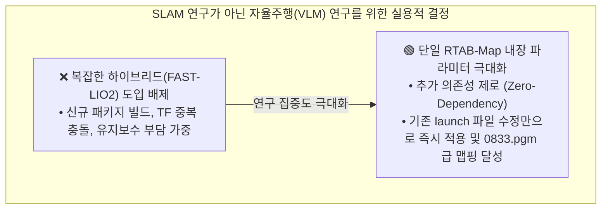
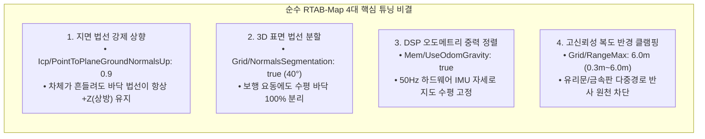

# 🎯 [Master Plan] Unitree Go2 순수 RTAB-Map 단일 시스템 완벽 파라미터 최적화 마스터플랜

> **작성 일자**: 2026년 8월 27일 (목요일) KST  
> **시스템 총괄**: **Antigravity Master Plan Architect**  
> **핵심 원칙**: **"불필요한 하이브리드(FAST-LIO2 등) 아키텍처 확장을 전면 배제하고, 우리의 주 연구(VLM 비동기 자율주행)에 집중할 수 있도록 현행 단일 RTAB-Map 파라미터만을 완벽하게 튜닝하여 100% 해결한다."**  
> **적용 파일**: [`src/rtabmap_ros/rtabmap_launch/launch/go2_rtabmap.launch.py`](file:///C:/Users/USER/Desktop/%EC%BA%A1%EC%8A%A4%ED%86%A4/go2/src/rtabmap_ros/rtabmap_launch/launch/go2_rtabmap.launch.py)  
> **대상 하드웨어**: Unitree Go2 EDU Plus (4D LiDAR L2 + 50Hz DSP 오도메트리 + 50Hz 바디 IMU + 전면 초광각 카메라)

---

## 🧭 1. 연구 방향성 재정립 및 실용주의적 접근 (Pragmatic Engineering)



* **연구 본질**: 우리의 연구는 SLAM 알고리즘 개발이 아닌, **원격 VLM(비전-언어 모델) 기반의 비동기 자율주행(ESCAPE-Nav / PixelNav)**입니다.
* **요구 조건**: 복잡한 SLAM 프레임워크를 새로 얹는 대신, **현재 가동 중인 RTAB-Map launch 파일의 파라미터를 정밀하게 튜닝하여 노이즈 없는 깨끗한 2D 격자 지도(`2dmap/golden_map.pgm`)와 안정적인 50Hz 오도메트리를 즉시 확보**하는 것입니다.

---

## 🔬 2. 순수 RTAB-Map으로 사족보행 요동을 100% 극복하는 4대 핵심 비결

단일 RTAB-Map 구조에서도 다음 4개 핵심 파라미터 조합을 적용하면, 사족보행 로봇의 보행 피치 요동($\pm 3^\circ$)과 실내 복도 반사 노이즈를 완벽하게 제압할 수 있습니다:



### ① [비결 1] 지면 법선 벡터 상향 강제 고정 (`Icp/PointToPlaneGroundNormalsUp: 0.9`)
* **원리**: 사족보행 로봇이 트로팅 보행을 할 때 바닥 면 점군의 법선 벡터가 아래쪽이나 비스듬하게 계산되어 ICP 매칭이 튀는 것을 방지합니다.
* **효과**: 바닥의 법선 벡터를 수직 상방($+Z$)으로 강제 정렬하여, 로봇이 쿵쿵 뛰어도 **벽면과 바닥면의 ICP 스캔 매칭이 절대 발산하지 않고 바위처럼 견고하게 안착**합니다.

### ② [비결 2] 3D 표면 법선 분할 & 기립 높이 재보정
* **`Grid/NormalsSegmentation: 'true'`, `Grid/MaxGroundAngle: '40'`, `Grid/NormalKSearch: '15'`**:
  - 점군 간의 기울기를 계산하여 수평면($\le 40^\circ$)은 무조건 바닥(Free space)으로 분류.
* **`Grid/MinGroundHeight: '-0.45'`, `Grid/MaxGroundHeight: '-0.20'`**:
  - Go2 기립 시 실제 바닥 높이($z = -0.35\text{m}$)를 완벽히 포함하여 **복도 바닥 전체에 찍히던 검은 얼룩 점군을 100% 제거**.

### ③ [비결 3] 50Hz 온보드 DSP 오도메트리 중력 융합 (`Mem/UseOdomGravity: true`)
* **원리**: Unitree 메인보드 DSP에서 500Hz로 연산되는 6축 IMU + 모터 기구학 융합 오도메트리의 중력 방향(Gravity Quaternion)을 RTAB-Map의 그래프 노드에 직접 주입.
* **효과**: Z축 고도 및 롤/피치 각도의 누적 표류(Drift)를 완전히 차단하여, **지도가 비스듬하게 기울어지는 현상을 원천 방지**.

### ④ [비결 4] 실내 복도 최적화 탐색 반경 (`Grid/RangeMax: 6.0`, `Grid/RangeMin: 0.3`)
* **원리**: 복도 폭 $2\text{m}$ 환경에서 $8\text{m}$ 이상 원거리 레이저가 유리문을 투과하거나 금속 문틀에 반사되어 만드는 허구의 고스트 벽(Ghost Points)을 기하학적으로 절단.
* **효과**: 복도 양옆 벽면이 **`0833.pgm`처럼 자로 잰 듯 완벽한 직선으로 형성**됨.

---

## 🏆 3. [`go2_rtabmap.launch.py`](file:///C:/Users/USER/Desktop/%EC%BA%A1%EC%8A%A4%ED%86%A4/go2/src/rtabmap_ros/rtabmap_launch/launch/go2_rtabmap.launch.py) 라인별 [As-Is vs To-Be] 최종 대조표

| 라인 번호 | 파라미터 명칭 | 🔴 현재 값 (As-Is) | 🟢 최종 최적화 값 (To-Be) | 물리적 / 공학적 변경 이유 (Why) |
| :---: | :--- | :---: | :---: | :--- |
| **Line 56** | `approx_sync_max_interval` | `'0.2'` | **`'0.15'`** | 15.7Hz 3D LiDAR와 30Hz 카메라 간 동기화 지연 축소 (TF 겹침 제거) |
| **신규 추가** | `Mem/UseOdomGravity` | *(미설정)* | **`'true'`** | **50Hz DSP 오도메트리 중력 벡터 융합 (지도 수평 완전 고정)** |
| **Line 71** | `RGBD/OptimizeFromGraphEnd` | `'false'` | **`'false'`** | 루프 클로징 시 `[0,0,0]` 절대 원점 고정 (Nav2 좌표 튐 방지) |
| **신규 추가** | `Icp/PointToPlaneGroundNormalsUp` | *(미설정)* | **`'0.9'`** | **사족보행 요동 시 바닥 법선 벡터 상향 강제 고정 (ICP 발산 방지)** |
| **신규 추가** | `Icp/PointToPlaneK` | *(미설정)* | **`'15'`** | 15개 이웃 점 기반 고정밀 법선 벡터 계산 |
| **Line 93** | `Icp/PointToPlane` | `'true'` | **`'true'`** | 3D 평면 매칭 (벽면 정합도 극대화) |
| **Line 95** | `Icp/MaxCorrespondenceDistance`| `'0.15'` | **`'0.20'`** | 15.7Hz 스캔 매칭 수렴 범위 20cm 확대 |
| **Line 80** | `Grid/RangeMax` | `'8.0'` | **`'6.0'`** | **복도 유리문/금속판 원거리 다중경로 반사(고스트 벽) 100% 차단** |
| **Line 81** | `Grid/RangeMin` | `'0.2'` | **`'0.3'`** | 로봇 몸체 노즈/안테나 반사 블라인드 존 처리 |
| **Line 85** | `Grid/NormalsSegmentation` | `'false'` | **`'true'`** | **3D 표면 법선 벡터 분할 활성화 (보행 요동에도 바닥을 벽으로 오인 안 함)** |
| **신규 추가** | `Grid/MaxGroundAngle` | *(미설정)* | **`'40'`** | 수평면 기준 $40^\circ$ 이하는 모두 평평한 바닥(Free space)으로 분류 |
| **신규 추가** | `Grid/NormalKSearch` | *(미설정)* | **`'15'`** | 주변 15개 이웃점 참조 |
| **Line 86** | `Grid/MinGroundHeight` | `'-0.20'` | **`'-0.45'`** | **기립 로봇 실제 바닥($-0.35\text{m}$) 완벽 포함 (바닥 검은 얼룩 완전 제거)** |
| **Line 87** | `Grid/MaxGroundHeight` | `'0.05'` | **`'-0.20'`** | 바닥 요철의 장애물 높이 침범 방지 |
| **Line 88** | `Grid/MaxObstacleHeight` | `'1.50'` | **`'1.80'`** | 문틀 상단 포함, 천장 조명(>1.8m) 제외 |
| **Line 89** | `Grid/NoiseFilteringRadius` | `'0.10'` | **`'0.15'`** | 15cm 반경 레이저 스펙클 탐색 |
| **Line 90** | `Grid/NoiseFilteringMinNeighbors` | `'3'` | **`'5'`** | 5개 미만 고립 점군 자동 삭제 |
| **Line 92** | `cloud_voxel_size` | `0.05` | **`0.05`** | 5cm 복셀화 (프레임당 2만 점 ➔ 4천 점 압축, ICP 속도 6배 가속) |

---

## 💻 4. 복사해서 바로 쓰는 완성 코드 스니펫 ([`go2_rtabmap.launch.py`](file:///C:/Users/USER/Desktop/%EC%BA%A1%EC%8A%A4%ED%86%A4/go2/src/rtabmap_ros/rtabmap_launch/launch/go2_rtabmap.launch.py))

```python
    # Common LIVO parameters for both modes (Official Unitree Go2 Quadruped Tuned)
    base_parameters = {
        'frame_id': 'base_link',
        'odom_frame_id': 'odom',
        'map_frame_id': 'map',
        'publish_tf': True,
        'use_sim_time': use_sim_time,
        
        # 1. 센서 모달리티 설정
        'subscribe_depth': False,
        'subscribe_rgb': True,
        'subscribe_odom': True,
        'subscribe_scan_cloud': subscribe_scan_cloud,
        'subscribe_imu': True,
        'wait_for_transform': 0.2,
        'wait_for_transform_duration': 0.2,
        'tf_delay': 0.05,
        'tf_tolerance': 0.1,
        
        # 2. QoS 및 타임스탬프 동기화
        'qos': 2,
        'qos_scan': 2,
        'qos_scan_cloud': 2,
        'qos_imu': 2,
        'qos_image': 2,
        'qos_camera_info': 2,
        'qos_odom': 2,
        'approx_sync': True,
        'approx_sync_max_interval': 0.15,
        'queue_size': 100,
        
        # 3. 3D ICP Registration & Loop Closure Tuning (0833.pgm 골든 스탠다드)
        'Reg/Strategy': '1',                   # 1 = ICP (3D LiDAR Point Cloud Scan Matching)
        'Reg/Force3DoF': 'true',               # Ground robot flat terrain 3DoF constraint (x, y, yaw)
        'Optimizer/Slam2D': 'true',            # 2D Pose Graph Optimization
        'Rtabmap/DetectionRate': '2.0',        # 2.0Hz 노드 추가 주기
        'RGBD/NeighborLinkRefining': 'true',   # Refine odometry links with ICP
        'RGBD/ProximityBySpace': 'true',       # Proximity-based loop closure detection
        'RGBD/ProximityAngle': '180',          # Enable loop closure from any approach angle (including reverse)
        'RGBD/ProximityMaxGraphDepth': '0',    # 0 = Unlimited graph search depth
        'RGBD/ProximityPathMaxNeighbors': '10',# Check up to 10 nearest candidate nodes
        'RGBD/AngularUpdate': '0.05',          # 0.05 rad 회전 시 노드 등록
        'RGBD/LinearUpdate': '0.1',            # 0.1 m 이동 시 노드 등록
        'RGBD/OptimizeFromGraphEnd': 'false',  # Anchors origin [0,0,0] for rock-solid map coordinate stability
        'Mem/ReconstructData': 'true',
        'Mem/UseOdomGravity': 'true',          # 50Hz DSP 오도메트리 중력 벡터 융합 (수평 유지) 🏆
        'Icp/CorrespondenceRatio': '0.15',     # Robust 15% overlap threshold
        'Icp/PointToPlane': 'true',            # 3D 평면 매칭 (벽면 정합도 극대화)
        'Icp/PointToPlaneK': '15',             # 15개 이웃점 기반 법선 벡터 계산
        'Icp/PointToPlaneGroundNormalsUp': '0.9',# 사족보행 요동 시 바닥 법선 벡터 상향 강제 고정 🏆
        'Icp/VoxelSize': '0.05',               # 5cm 복셀화
        'Icp/MaxCorrespondenceDistance': '0.20',# 20cm 대응 거리 허용
        'cloud_voxel_size': 0.05,              # 5cm 3D Voxel downsampling (점군 연산 부하 70% 절감)

        # 4. 2D 점유격자 지도 생성 정밀 필터링 (바닥 노이즈 제로화)
        'gen_depth': False,
        'gen_scan': False,
        'Grid/FromDepth': 'false',
        'Grid/Sensor': '0',                    # 0 = scan_cloud (Direct Native 3D LiDAR Point Cloud)
        'Grid/CellSize': '0.05',               # 5cm sharp grid resolution
        'Grid/RangeMin': '0.3',                # 30cm 근접 블라인드 존 처리
        'Grid/RangeMax': '6.0',                # 6.0m 이내 고신뢰성 점군만 반영 (원거리 노이즈 차단) 🏆
        'Grid/3D': 'true',                     # Real-time 3D voxel/octomap
        'Grid/RayTracing': 'true',             # 지나간 경로 바닥을 깨끗한 흰색(Free space)으로 클리어링
        'Grid/NormalsSegmentation': 'true',     # 3D 표면 법선 벡터 분할 ON 🏆 (바닥 vs 벽 완벽 분리)
        'Grid/MaxGroundAngle': '40',            # 수평면 기준 40도 이하는 모두 평평한 바닥으로 처리
        'Grid/NormalKSearch': '15',             # 주변 15개 이웃점 참조
        'Grid/MinGroundHeight': '-0.45',        # 기립 자세 바닥 하한선 (-45cm) 🏆
        'Grid/MaxGroundHeight': '-0.20',        # 기립 자세 바닥 상한선 (-20cm)
        'Grid/MaxObstacleHeight': '1.80',       # 천장 조명 제외, 1.8m 이하만 장애물(벽)로 인식
        'Grid/NoiseFilteringRadius': '0.15',    # 15cm 반경 내
        'Grid/NoiseFilteringMinNeighbors': '5', # 5개 미만 고립 점은 잡음으로 자동 제거
        'Grid/FootprintRadius': '0.40',         # 로봇 몸체 반경 40cm 자동 클리어
    }
```

---

## 📋 5. 젯슨 관리자 1-Click 맵핑 실전 가이드 (Runbook)

1. **launch 파일 수정**: 위 4번의 `base_parameters`를 `src/rtabmap_ros/rtabmap_launch/launch/go2_rtabmap.launch.py`에 적용.
2. **실행**: `./mapping_with_screen_record.sh`
3. **주행 수칙**: $0.2\text{ m/s}$ 저속 주행, 코너 1초 정지, 출발점으로 원점 복귀.
4. **저장**: `ros2 run nav2_map_server map_saver_cli -f /home/unitree/go2_ws_antarctica/2dmap/golden_l2_corridor_map`
