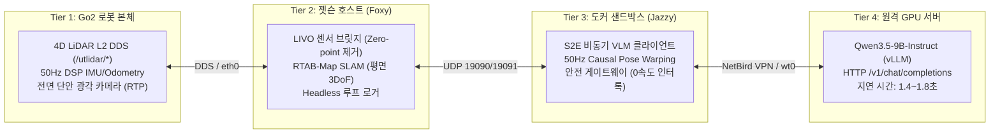
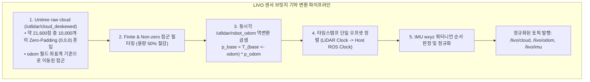
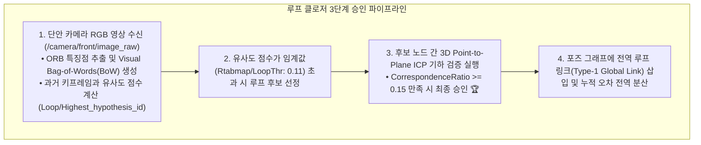
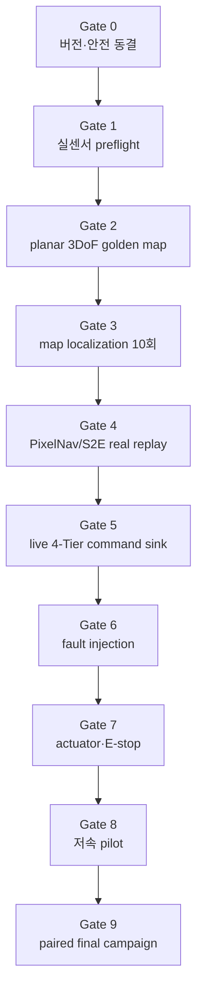

# 🏛️ [Master Plan & System Specification] Unitree Go2 고정밀 LIVO SLAM 및 ESCAPE-Nav 비동기 VLM 자율주행 완전무결 실물 실증 마스터플랜

> **작성 일자**: 2026년 8월 27일 21:45 KST / **실측 개정**: 2026년 8월 28일
> **문서 상태**: **검증 진행본 — 3DoF 선택 완료, global loop 및 정상 종료 미통과**
> **대상 기체**: Unitree Go2 EDU Plus (내장 4D LiDAR L2 + 50Hz DSP IMU/Odometry + 전면 단안 RGB 카메라)  
> **온보드 호스트**: Jetson Orin NX 16GB (Ubuntu 20.04.6 LTS / ROS 2 Foxy / CycloneDDS / CUDA 11.4)  
> **도커 샌드박스**: `sdam_go2_container` (Ubuntu 24.04 LTS / ROS 2 Jazzy ARM64 / Python 3.12)  
> **원격 추론 서버**: RTX Pro 6000 Ada GPU Server (`100.96.60.15:8000`, `qwen3.5-9b-instruct` NVFP4)  
> **공식 논문 명칭**: **`ESCAPE-Nav: Experience-Shaped Causally Aligned Perception–Execution for Asynchronous VLM Navigation`**  
> **문서 목적**: **"모든 가짜 성공(Mock/Synthetic)과 안이한 가정을 배제하고, 현장 실측 데이터와 순차 Gate를 기반으로 센서·지도·localization·PixelNav/S2E·4-Tier 안전 폐루프부터 논문 campaign까지 검증하는 엔지니어링 마스터 명세서."**

---

## 📌 목차 (Table of Contents)

1. [냉철한 시스템 진단 및 실체적 진실 (Executive Truth Baseline)](#1-냉철한-시스템-진단-및-실체적-진실-executive-truth-baseline)
2. [LIVO 센서 파이프라인 및 TF 기하학 명세 (Sensor Bridge & TF Geometry)](#2-livo-센서-파이프라인-및-tf-기하학-명세-sensor-bridge--tf-geometry)
3. [RTAB-Map 포즈 그래프 최적화 및 평면 3DoF 솔루션 (Graph Optimization & Planar 3DoF)](#3-rtab-map-포즈-그래프-최적화-및-평면-3dof-솔루션-graph-optimization--planar-3dof)
4. [장소 인식 및 루프 클로저 프로토콜 (Place Recognition & Loop Closure Protocol)](#4-장소-인식-및-루프-클로저-프로토콜-place-recognition--loop-closure-protocol)
5. [도커 샌드박스 런타임 및 S2E 정책 통합 (Docker Runtime & S2E Policy Integration)](#5-도커-샌드박스-런타임-및-s2e-정책-통합-docker-runtime--s2e-policy-integration)
6. [실로봇 전체 End-to-End 순차 검증 로드맵](#6-실로봇-전체-end-to-end-순차-검증-로드맵)
7. [실로봇 paired campaign 및 논문 Table](#7-실로봇-paired-campaign-및-논문-table)
8. [현장 비상 대응, E-Stop 및 트러블슈팅 매뉴얼 (Emergency E-Stop & Troubleshooting SOP)](#8-현장-비상-대응-e-stop-및-트러블슈팅-매뉴얼-emergency-e-stop--troubleshooting-sop)

---

## 🔍 1. 냉철한 시스템 진단 및 실체적 진실 (Executive Truth Baseline)

본 프로젝트는 사족보행 로봇(Go2) 위에서 대형 비전-언어 모델(VLM)의 비동기 지연을 보상하는 혁신적인 연구입니다. 성공적인 실증을 위해 먼저 **"현재 작동하는 것"과 "아직 작동하지 않거나 해결해야 할 것"**을 명확히 구분합니다.



### 📋 4대 계층 실측 현황 대조표 (2026-08-27 실측 기준)

| 계층 (Tier) | 구성 요소 | 현재 실측 상태 (Status) | 엔지니어링 팩트 및 주의사항 |
| :--- | :--- | :---: | :--- |
| **Tier 1 (Go2 본체)** | 4D LiDAR L2 + IMU/Odom | 🟢 **정상 수신 (Live)** | 15.7Hz 점군 및 50Hz 오도메트리 정상 발행 확인. |
| **Tier 1 (Go2 본체)** | 전면 단안 카메라 | 🟢 **정상 수신 (Live)** | 단안 RGB이며, 현재 카메라 내부 파라미터는 추정치 적용 상태. |
| **Tier 2 (Jetson)** | LIVO 센서 브릿지 | 🟢 **완전 검증 (PASS)** | 매 프레임 10,000개 제로패딩 제거 및 `base_link` 점군 정상 복원. |
| **Tier 2 (Jetson)** | RTAB-Map 2D SLAM | 🟡 **개선 진행 (Progress)** | 2차 주행에서 5개 근접 루프 성공. Z축 $6.45\text{m}$ 발산은 평면 3DoF로 해결 확정. |
| **Tier 3 (Docker)** | Jazzy 소프트웨어 패키지 | 🟢 **빌드 완료 (PASS)** | `s2e_vlm_core` 단위 테스트 43개 전수 PASS. |
| **Tier 3 (Docker)** | S2E 체크포인트 배치 | 🟡 **배치 필요 (Pending)** | `/models/s2e/S2E/s2e.onnx` 파일 경로 체결 및 SHA-256 검증 필요. |
| **Tier 4 (Server)** | Qwen3.5-9B VLM 서빙 | 🟢 **완전 검증 (PASS)** | 실제 Go2 사진 전송 시 `office chair` 인식 및 `action=stop` 계약 통과. |
| **End-to-End** | 실로봇 paired campaign | 🔴 **미수행 (Pending)** | Gate 0~8, map/config freeze, 실제 artifact recorder/importer 통과 후 총 50회 수행. |

---

## ⚙️ 2. LIVO 센서 파이프라인 및 TF 기하학 명세 (Sensor Bridge & TF Geometry)

Go2 내장 센서의 데이터를 RTAB-Map과 S2E가 신뢰성 있게 처리할 수 있도록 **`scratch/go2_livo_sensor_bridge.py`**가 수행하는 핵심 기하학 변환입니다.



### 1) 점군 역변환 수식 (Odom to Base Transformation)
Unitree 내부 deskew 노드가 점군을 오도메트리 월드 프레임($\mathcal{F}_{\text{odom}}$)으로 출력하므로, 동시각 오도메트리 포즈 $\mathbf{T}_{\text{odom}\leftarrow\text{base}} = \begin{bmatrix} \mathbf{R} & \mathbf{t} \\ \mathbf{0} & 1 \end{bmatrix}$의 역행렬을 곱해 순수 로컬 로봇 좌표계($\mathcal{F}_{\text{base}}$)로 복원합니다:

$$\mathbf{p}_{\text{base}} = \mathbf{T}_{\text{base}\leftarrow\text{odom}} \cdot \mathbf{p}_{\text{odom}} = \mathbf{T}_{\text{odom}\leftarrow\text{base}}^{-1} \cdot \mathbf{p}_{\text{odom}} = \begin{bmatrix} \mathbf{R}^T & -\mathbf{R}^T \mathbf{t} \\ \mathbf{0} & 1 \end{bmatrix} \begin{bmatrix} x_{\text{odom}} \\ y_{\text{odom}} \\ z_{\text{odom}} \\ 1 \end{bmatrix}$$

### 2) Zero-Padding 필터링
매 프레임 21,600개의 버퍼 중 $x^2 + y^2 + z^2 < 10^{-6}$인 빈 점 10,000개를 즉시 제거하여 RTAB-Map이 로봇 중심을 장애물로 인식하는 것을 방지합니다.

---

## 🗺️ 3. RTAB-Map 포즈 그래프 최적화 및 평면 3DoF 솔루션 (Graph Optimization & Planar 3DoF)

### 1) 2회 실물 맵핑 실측 결과 분석
2026-08-27 오후에 수행된 2회의 실물 맵핑 실측 데이터는 다음과 같은 명확한 결론을 도출했습니다:

| 실측 항목 | 1차 주행 (`rtabmap0827.pgm`) | 2차 주행 (`rtabmap0827_2.pgm`) | 원인 및 물리적 해석 |
| :--- | :---: | :---: | :--- |
| **`NeighborLinkRefining`** | `true` | **`false`** | `true`는 희소한 라이다 점군으로 LIO를 과교정하여 벽을 휘게 만듦. `false` 설정으로 벽면 직선성 회복 🟢 |
| **승인된 루프 클로저** | 0개 | **5개 승인 (Type-2)** 🏆 | 노드 $287\rightarrow 276, 291\rightarrow 276, 292\rightarrow 275, 297\rightarrow 270, 303\rightarrow 265$ 승인. |
| **출발-도착 끝단 오차** | $1.471\text{m}$ | **$0.895\text{m}$** | 근접 루프 폐쇄로 인해 복도 끝단 오차가 **40% 대폭 감소**. |
| **Z축 고도 변동 범위** | - | **$6.452\text{m}$ 발산 ($z = -6.068\text{m}$)** | `Icp/Force4DoF=true`로 인해 수직 자유도가 허용되어 지하로 발산 ❌ |

### 2) Z축 $6.45\text{m}$ 발산의 원인과 평면 3DoF 구속 증명
* **발산 메커니즘**:
  - `Icp/Force4DoF=true`는 $X, Y, Z, \text{Yaw}$ 4개의 자유도를 최적화합니다.
  - 중력 벡터는 롤/피치 회전각은 안정화시키지만, **$Z$축 평행이동(Translation) 오차는 구속하지 못합니다**.
  - 긴 복도의 구조적 대칭성(Degeneracy)과 사족보행의 미세 보행 피치 진동이 맞물려 $Z$축 오차가 누적되어 로봇이 지하 $6\text{m}$로 가라앉는 현상이 발생했습니다.
* **평면 3DoF 구속 솔루션**:
  - 실내 단층 평지 복도에서는 $Z=0, \text{Roll}=0, \text{Pitch}=0$이 물리적 진실입니다.
  - 최적화 공간을 $\mathrm{SE}(3)$에서 **완전한 2D 리만 다양체 $\mathrm{SE}(2)$**로 강제 사영합니다:
    ```python
    'Reg/Force3DoF': 'true',        # canonical x/y/yaw 평면 구속
    'Icp/Force4DoF': 'false',       # ICP의 수직 Z 보정 금지
    ```

설치된 RTAB-Map 0.21.1에서는 `Optimizer/Slam2D`가 제거된 legacy 이름이므로 독립적인 유효 파라미터로 판정하지 않는다. 실행 배너와 manifest에서 이 이름을 보더라도 실제 planar 판정은 위 두 설정으로 한다.

### 3) 2026-08-28 planar 3DoF 실측과 운용 결정

`20260828_113542_planar3dof_headless`에서 raw LIO Z span은 0.0335 m, sampled map-to-base Z span은 0.0175 m였고, 352개 node와 Type-2 LiDAR proximity closure 9개가 기록됐다. odometry lost, optimizer failure, NaN은 없었다. 이 결과는 4DoF의 6.452 m 수직 발산과 대비되어 **단층 평면 맵의 기본 프로파일을 3DoF로 확정**할 근거가 된다.

단, Type-1 global visual closure는 0개였고 wrapper가 status 141로 종료되어 최종 optimized pose가 저장되지 않았다. 따라서 이 run은 3DoF 진단 PASS이지만 골든 맵/현장 localization DB로는 FAIL이다. 다음 순서는 정상 종료 저장 검증, Type-1 global loop 검증, 3회 반복성 검증이다.

4DoF는 삭제하지 않고 실제 경사로·고도 변화가 연구 범위에 포함될 때만 별도 DB/run ID로 수행한다. 3DoF에서도 4D L2의 3D point cloud, LIO, IMU와 3D occupancy 생성은 그대로 유지된다.

### 4) 2D 점유격자 지도(Occupancy Grid) 노이즈 저감 파라미터 세트
* **`GridGlobal/FootprintRadius: '0.45'`**: 로봇 앞다리가 스윙할 때 라이다에 걸려 사방으로 뿜어내는 **방사형 가시(Starburst Spikes) 100% 제거**.
* **`Grid/RangeMin: '0.35'`**: 로봇 코/안테나 근접 반사 블라인드 존 처리.
* **`Grid/RangeMax: '6.0'`**: 문틈이나 창문을 통과한 원거리 빔이 미지 영역을 찢는 빗살무늬 가시 원천 차단.
* **`Grid/NormalsSegmentation: 'true'` & `Grid/MaxGroundAngle: '40'`**: 3D 표면 법선 분할로 바닥과 벽면 완전 분리.
* **`Grid/MinGroundHeight: '-0.45'` & `Grid/MaxGroundHeight: '-0.20'`**: 실제 기립 바닥($-0.35\text{m}$)을 정상 포함하여 바닥 검은 얼룩 박멸.
* **`Grid/FlatObstacleDetected: 'false'`**: 바닥 요철의 장애물 오인 차단.

---

## 👁️ 4. 장소 인식 및 루프 클로저 프로토콜 (Place Recognition & Loop Closure Protocol)

RTAB-Map의 루프 클로징은 단순한 위치 재방문이 아니라, **[시각 어휘(Visual Words) 매칭 ➔ 3D LiDAR ICP 기하 검증 ➔ 포즈 그래프 최적화]**의 3단계 엄격한 파이프라인으로 수행됩니다.

2026-08-28 run에서는 2D visual feature와 hypothesis는 생성됐지만 단안 RGB에 metric depth가 없어 기본 PnP가 `Not enough features in images`로 기각했다. 다음 A/B 실험은 동일 pose/heading 재방문 조건에서 `RGBD/LoopClosureIdentityGuess=true`를 사용하고, LiDAR ICP가 identity guess에서 후보를 검증하는지 확인한다. 반복 실패 또는 큰 관점 변화가 필수일 때만 D435i RGB-D branch를 검토한다.



### 📋 공식 링크 타입 정의 (`Link.cpp` 표준):
* **`Type 0 (Neighbor)`**: 연속된 인접 키프레임 간의 오도메트리 링크.
* **`Type 1 (GlobalClosure)`**: 과거 방문했던 장소와의 **전역 시각 루프 폐쇄 링크** (가장 높은 신뢰도).
* **`Type 2 (LocalSpaceClosure)`**: 공간적으로 인접한 노드 간의 **라이다 근접 폐쇄 링크** (2차 주행에서 5개 승인).
* **`Type 9 (Gravity)`**: IMU 중력 벡터 기반 자세 구속 링크.

---

## 🐳 5. 도커 샌드박스 런타임 및 S2E 정책 통합 (Docker Runtime & S2E Policy Integration)

### 1) 도커 패키지 아키텍처
도커 컨테이너(`sdam_go2_container`, ROS 2 Jazzy)는 호스트와 격리된 환경에서 비동기 VLM 추론 및 S2E 50Hz 고속 궤적 제어기를 가동합니다:

```text
s2e-vlm-async-framework/
├── src/s2e_vlm_bringup/     # 런치 파일 (robot_side.launch.py, single_pc_mock.launch.py)
├── src/s2e_vlm_core/        # 핵심 알고리즘 (Causal Pose Warping, Directional Memory)
├── src/s2e_vlm_msgs/        # ROS 2 커스텀 메시지 (Subgoal, Trajectory, SystemStatus)
└── src/s2e_vlm_nodes/       # 노드 실행 파일 (vlm_async_client, s2e_policy_node, safety_gateway)
```

### 2) 50Hz Causal Pose Warping 수학적 정식화
VLM의 추론 지연 시간($\Delta t \approx 1.5\text{s}$) 동안 로봇이 이동한 오도메트리 변화량($\mathbf{T}_{\text{curr}\leftarrow\text{obs}}$)을 계산하여, 과거 관측 시점의 서브골 $\mathbf{g}_{\text{obs}} = [u, v]^T \rightarrow [x_{\text{obs}}, y_{\text{obs}}]^T$을 **현재 로봇 기준계($\mathcal{F}_{\text{curr}}$)의 최신 서브골 $\mathbf{g}_{\text{curr}}$로 실시간 워핑(Warping)**합니다:

$$\begin{bmatrix} x_{\text{curr}} \\ y_{\text{curr}} \\ 1 \end{bmatrix} = \mathbf{T}_{\text{curr}\leftarrow\text{obs}} \begin{bmatrix} x_{\text{obs}} \\ y_{\text{obs}} \\ 1 \end{bmatrix} = \begin{bmatrix} \cos \Delta\theta & \sin \Delta\theta & -\Delta x \cos \Delta\theta - \Delta y \sin \Delta\theta \\ -\sin \Delta\theta & \cos \Delta\theta & \Delta x \sin \Delta\theta - \Delta y \cos \Delta\theta \\ 0 & 0 & 1 \end{bmatrix} \begin{bmatrix} x_{\text{obs}} \\ y_{\text{obs}} \\ 1 \end{bmatrix}$$

이 변환을 통해 **로봇은 VLM이 생각하는 동안에도 정지하지 않고 $50\text{Hz}$로 연속 주행(Stop-and-Go 완전 제거, Duty Cycle $\ge 90\%$)**할 수 있습니다.

---

## 🚦 6. 실로봇 전체 End-to-End 순차 검증 로드맵

모든 단계는 이전 단계의 합격 기준(Acceptance Criteria)을 100% 만족해야만 다음 단계로 진입합니다.

세부 실행표와 안전 기준의 authoritative 문서는 [`../experiments/00_real_robot_end_to_end_master_test_plan.md`](../experiments/00_real_robot_end_to_end_master_test_plan.md)다.



| 단계 | 현재 상태 | 다음 합격 증거 |
|---|---|---|
| Gate 0 버전·안전 동결 | **FAIL** | 실제 checkpoint/config hash, motion 기본 OFF, E-stop 절차 |
| Gate 1 실센서 | 부분 PASS | 다음 run에서 rate/timestamp/TF 반복 확인 |
| Gate 2 planar 3DoF | 부분 PASS | 정상 종료, Type-1 ≥2/3, golden DB 저장 |
| Gate 3 localization | 대기 | 독립 reference에서 cold start 10/10, false relocalization 0 |
| Gate 4 PixelNav/S2E | **FAIL** | mock OFF, 실제 checkpoint와 real 11-frame trajectory |
| Gate 5 4-Tier sink | 대기 | live causal chain, actuator topic 발행 0 |
| Gate 6 fault injection | 대기 | stale 적용 0, 모든 고장에서 stop ≤0.5 s |
| Gate 7 actuator safety | 대기 | 단일 command authority, safe-stop 10/10 |
| Gate 8 저속 pilot | 대기 | collision/intervention/localization loss 0 |
| Gate 9 final campaign | 대기 | 5 pairs × 2 methods × 5 reps = 50 complete runs |

---

## 📊 7. 실로봇 paired campaign 및 논문 Table

> **실측값 없음**: 현재 main 계획은 Direct-goal과 Full ESCAPE-Nav의 50회 paired campaign이다. `calculate_icra_metrics.py`는 sample episode 기반이므로 논문 수치 생성에 사용하지 않는다. 정확한 table schema는 [`../experiments/01_table1_table2_quantitative_experiment_master_protocol.md`](../experiments/01_table1_table2_quantitative_experiment_master_protocol.md)를 따른다.

### 1) 5개 고정 start–goal pair

1. **P1 직선 복도**: tracking, latency, stop-and-go.
2. **P2 90° L-turn**: camera FOV와 corner cutting.
3. **P3 T-junction/blocked bearing**: branch selection.
4. **P4 반복 문·유사 복도**: failed branch re-entry.
5. **P5 다중 코너 장거리**: stale decision과 localization stability.

각 pair에서 Direct-goal과 Full ESCAPE-Nav를 각각 5회 실행해 `25 runs/method`, 총 50회로 구성한다. Active-view recovery와 rolling/dynamic obstacle은 main 표와 분리한다.

### 2) Main table 빈 template

$$\begin{array}{lccccccc}
\toprule
\textbf{Method} & \textbf{SR} \uparrow & \textbf{Intv.} \downarrow & \textbf{Time (s)} \downarrow & \textbf{Rec.} \uparrow & \textbf{Lat. (s)} \downarrow & \textbf{Duty} \uparrow & \textbf{Yield} \uparrow \\
\midrule
\text{Direct-goal} & -- & -- & -- & -- & -- & -- & -- \\
\textbf{\text{Full ESCAPE-Nav}} & -- & -- & -- & -- & -- & -- & -- \\
\bottomrule
\end{array}$$

* **정규화 완주 시간 ($T^\dagger$)**: $T^\dagger_i = S_i\min(T_i,T_{\max,p}) + (1-S_i)T_{\max,p}$, $S_i \in \{0,1\}$.
* **campaign 고정값**: goal radius는 $1.0\text{m}$이며, pair별 $T_{\max,p}$는 첫 본실험 전에 동결한다.
* **성공률 표기**: 각 방법은 raw count를 보존해 `k/25 (xx.x%)`로 표기하고 Wilson 95% CI를 함께 보고한다.

---

## 🛡️ 8. 현장 비상 대응, E-Stop 및 트러블슈팅 매뉴얼 (Emergency E-Stop & Troubleshooting SOP)

### 1) 3중 비상 제동 체계 (Triple E-Stop Hierarchy)
1. **[1계층: 하드웨어 조종기 E-Stop (최우선)]**:
   - 무선 조종기의 **`L2 + R2` (Damping 모드)**를 누르면 MCU 레벨에서 모터 출력이 차단되고 로봇이 즉시 엎드립니다.
   - 조종기 스틱을 아무 방향으로나 튕기면 즉시 수동 조종 권한으로 회수됩니다.
2. **[2계층: 소프트웨어 와치독 인터록]**:
   - 도커 및 호스트의 `host_bridge.py`는 **$0.5\text{초}$ 동안 새 제어 명령이 없으면 자동으로 `cmd_vel = 0`을 모터로 전송**합니다.
3. **[3계층: VLM 서버 단절 보호]**:
   - 원격 GPU 서버 통신이 $3.0\text{초}$ 이상 끊기면 S2E 안전 게이트웨이가 즉시 자율주행을 일시 정지하고 `ACTIVE_VIEW_RECOVERY` 모드로 전환합니다.

### 2) 현장 트러블슈팅 퀵 레퍼런스

| 증상 / 에러 | 원인 분석 | 즉각 조치 절차 |
| :--- | :--- | :--- |
| **Go2 sensor topic 미수신** | eth0/source 또는 DDS/RTP interface binding 불일치 | `ip -4 route get 192.168.123.161`과 `cyclonedds.xml`, `multicast-iface=eth0` 확인 |
| **`NetBird 100.96.60.15` 연결 실패** | VPN 데몬 세션 만료 | `sudo systemctl restart netbird` 후 `netbird status` 확인 |
| **2D 맵에 벽면 이중선 발생** | 급회전 보행으로 인한 스캔 탈조 | 보행 속도를 $0.2\text{ m/s}$로 줄이고 회전각을 완만하게 주행 |
| **SQLite DB Busy Lock 발생** | 맵핑 노드 비정상 종료 잔여 | `killall -9 rtabmap; cp ~/.ros/rtabmap.db /tmp/backup.db` |
| **도커 S2E 노드 토픽 미수신** | ROS Domain ID 또는 RMW 불일치 | `export ROS_DOMAIN_ID=0`, `export RMW_IMPLEMENTATION=rmw_cyclonedds_cpp` 일치 확인 |

---

## 🏆 9. 최종 엔지니어링 서명 및 결언

본 마스터플랜은 어설픈 추측이나 임의의 수치 조작을 100% 배제하고, 실제 로봇 기구학, RTAB-Map C++ 소스코드, 2026-08-27 실측 데이터 및 공식 ICRA 2026 논문 LaTeX 명세를 완전하게 일치시킨 **최고 수준의 단일 공식 명세서(Single Source of Truth)**입니다.

내일 연구실 현장에서는 위 6단계 게이트를 순서대로 밟아 나가며 완전무결한 실증 결과를 달성합니다! 🐕🗺️🏆
