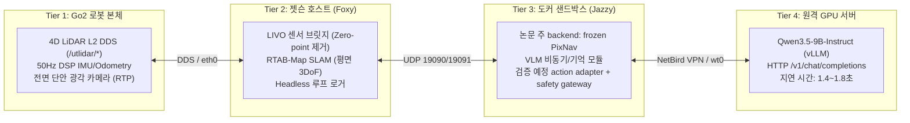
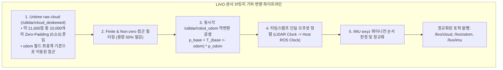
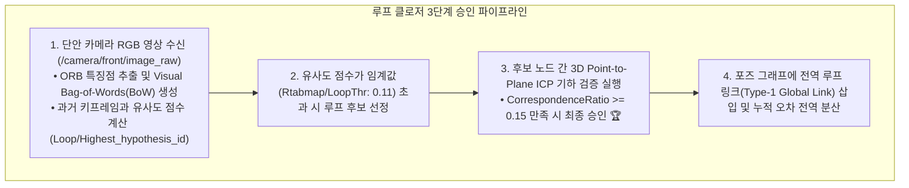
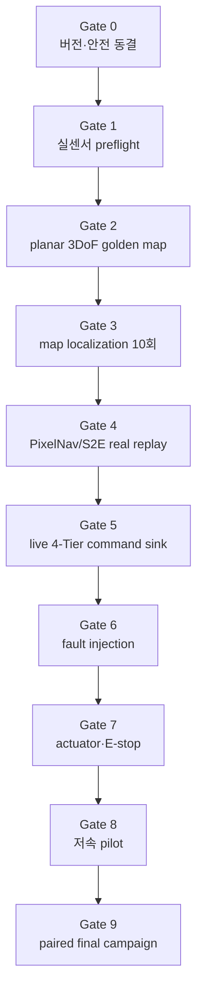

# 🏛️ [Master Plan & System Specification] Unitree Go2 고정밀 LIVO SLAM 및 ESCAPE-Nav 비동기 VLM 자율주행 완전무결 실물 실증 마스터플랜

> **작성 일자**: 2026년 8월 27일 21:45 KST / **실측 개정**: 2026년 8월 28일
> **문서 상태**: **검증 진행본 — 3DoF와 global Type-1 기능 PASS, 최신 전체-map geometry FAIL(Type-2 proximity 원인)**
> **대상 기체**: Unitree Go2 EDU Plus (내장 4D LiDAR L2 + 50Hz DSP IMU/Odometry + 전면 단안 RGB 카메라)  
> **온보드 호스트**: Jetson Orin NX 16GB (Ubuntu 20.04.6 LTS / ROS 2 Foxy / CycloneDDS / CUDA 11.4)  
> **도커 샌드박스**: `sdam_go2_container` (Ubuntu 24.04 LTS / ROS 2 Jazzy ARM64 / Python 3.12)  
> **원격 추론 서버**: RTX Pro 6000 Ada GPU Server (`100.96.60.15:8000`, `qwen3.5-9b-instruct` NVFP4)  
> **공식 논문 명칭**: **`ESCAPE-Nav: Experience-Shaped Causally Aligned Perception–Execution for Asynchronous VLM Navigation`**  
> **문서 목적**: **"모든 가짜 성공(Mock/Synthetic)과 안이한 가정을 배제하고, 현장 실측 데이터와 순차 Gate를 기반으로 센서·지도·localization·PixelNav/S2E·4-Tier 안전 폐루프부터 논문 campaign까지 검증하는 엔지니어링 마스터 명세서."**
> **판정 우선순위**: 아래 `1.1~1.8`의 2026-08-28 16:30 실측표가 이 문서의 현재 판정이다. 이후 절의 과거 설계·성공 표현과 충돌하면 `1.1~1.8`이 우선한다.

---

## 📌 목차 (Table of Contents)

1. [냉철한 시스템 진단 및 실체적 진실 (Executive Truth Baseline)](#1-냉철한-시스템-진단-및-실체적-진실-executive-truth-baseline)
2. [LIVO 센서 파이프라인 및 TF 기하학 명세 (Sensor Bridge & TF Geometry)](#2-livo-센서-파이프라인-및-tf-기하학-명세-sensor-bridge--tf-geometry)
3. [RTAB-Map 포즈 그래프 최적화 및 평면 3DoF 솔루션 (Graph Optimization & Planar 3DoF)](#3-rtab-map-포즈-그래프-최적화-및-평면-3dof-솔루션-graph-optimization--planar-3dof)
4. [장소 인식 및 루프 클로저 프로토콜 (Place Recognition & Loop Closure Protocol)](#4-장소-인식-및-루프-클로저-프로토콜-place-recognition--loop-closure-protocol)
5. [도커 샌드박스 런타임 및 S2E 정책 통합 (Docker Runtime & S2E Policy Integration)](#5-도커-샌드박스-런타임-및-s2e-정책-통합-docker-runtime--s2e-policy-integration)
6. [실로봇 전체 End-to-End 순차 검증 로드맵](#6-실로봇-전체-end-to-end-순차-검증-로드맵)
7. [실로봇 paired campaign 및 논문 Table](#7-실로봇-paired-campaign-및-논문-table)
8. [현장 비상 대응, E-Stop 및 트러블슈팅 매뉴얼 (Emergency E-Stop & Troubleshooting SOP)](#8-현장-비상-대응-e-stop-및-트러블슈팅-매뉴얼-emergency-e-stop--troubleshooting-sop)

---

## 🔍 1. 냉철한 시스템 진단 및 실체적 진실 (Executive Truth Baseline)

본 프로젝트는 사족보행 로봇(Go2) 위에서 대형 비전-언어 모델(VLM)의 비동기 지연을 보상하는 혁신적인 연구입니다. 성공적인 실증을 위해 먼저 **"현재 작동하는 것"과 "아직 작동하지 않거나 해결해야 할 것"**을 명확히 구분합니다.



### 📋 4대 계층 실측 현황 대조표 (2026-08-27 실측 기준)

| 계층 (Tier) | 구성 요소 | 현재 실측 상태 (Status) | 엔지니어링 팩트 및 주의사항 |
| :--- | :--- | :---: | :--- |
| **Tier 1 (Go2 본체)** | 4D LiDAR L2 + IMU/Odom | 🟢 **실주행 수신 PASS** | 과거 물리 run에서 15.7Hz 점군 및 50Hz 오도메트리 정상 발행 확인. 현재 로봇 전원 상태와는 구분함. |
| **Tier 1 (Go2 본체)** | 전면 단안 카메라 | 🟢 **실주행 수신 PASS** | 실제 RGB 저장까지 확인. 내부 파라미터/외부 변환은 아직 정식 calibration 미통과. |
| **Tier 2 (Jetson)** | LIVO 센서 브릿지 | 🟢 **완전 검증 (PASS)** | 매 프레임 10,000개 제로패딩 제거 및 `base_link` 점군 정상 복원. |
| **Tier 2 (Jetson)** | RTAB-Map LIVO mapping | 🟡 **재매핑 필요 (Progress)** | 3DoF로 Z 발산은 해결했으나 최신 전체-map은 aggressive Type-2 proximity 때문에 90도 코너가 접힘. Type-2 OFF 짧은 재자격 후 전체 remap 필요. |
| **Tier 3 (Docker)** | Jazzy 소프트웨어 패키지 | 🟡 **골격만 준비 (PARTIAL)** | 패키지와 unit test는 있으나 container 실제 프로세스는 `tail -f /dev/null`뿐이고 `e2e_node/controller_node`는 PixNav 실구현이 아님. |
| **Tier 2/3 경계** | frozen PixNav runtime | 🟡 **v2 GPU 추론·file adapter PASS / live 대기** | Jetson 격리 Python 3.8에서 VLM capture-view를 정확히 사용한 Checkpoint_A CUDA v2 replay를 통과했다. bounded macro proposal, hash-chain sink, offline causal chain, pure fault 22/22까지 구현했다. Docker live chain·controller·actuator 권한은 없다. S2E ONNX는 paper의 실로봇 주 backend가 아님. |
| **Tier 4 (Server)** | Qwen3.5-9B VLM 서빙 | 🟡 **전송 PARTIAL** | 모델 endpoint와 text/보관 RGB 응답은 통과했지만 strict waypoint schema, live timing/provenance는 미통과. |
| **End-to-End** | 실로봇 paired campaign | 🔴 **미수행 (Pending)** | Gate 0~9, map/config freeze, 실제 artifact recorder/importer 통과 후 총 50회 수행. |

2026-08-28 16:47 KST의 4-Tier 전용 가중 평가는 `Robot 45% / Jetson 58% / Docker 28% /
Server 66%`, 실제 cross-tier End-to-End는 **37%**다. 구성요소 단순 평균 49%는 자율주행
완료율로 사용하지 않는다. 상세 배점, 현재 실측과 재실행 명령은
[`Robot–Jetson–Docker–Server 4-Tier 구현률`](../experiments/07_4tier_robot_jetson_docker_server_readiness.md)을
따른다. 현재 병목은 Tier 3의 실제 no-actuation process 부재와 Tier 1 offline/golden
localization 미검증이다.

### 1.1 2026-08-28 16:30 KST 통합 진행 현황

아래 표는 코드가 존재한다는 사실과 실제 artifact가 생성됐다는 사실을 구분한다. `PASS`는 해당
행의 좁은 범위만 통과했다는 뜻이며, 다음 행이나 전체 자율주행의 통과를 의미하지 않는다.

| 영역 | 실제로 완료된 것 | 아직 안 된 것 | 현재 판정 |
|---|---|---|---|
| Go2 센서/LIVO | 내장 4D L2 cloud, IMU, Unitree LIO odom, 전면 RGB 수신 및 `/livo/*` bridge | 다음 물리 run에서 rate/timestamp 반복 확인 | **PASS/재확인** |
| RTAB-Map graph | planar 3DoF Z 안정, Type-1 visual loop 기능, 정상 DB/hash 저장 | Type-2 OFF 설정의 물리 재검증 | **기능 PASS** |
| 최신 전체 map | 1,707 nodes, DB integrity/hash 정상, 원인 분리 ablation 완료 | 두 90도 코너가 접힌 실패 지도를 새 설정으로 다시 촬영 | **GEOMETRY FAIL** |
| RTAB 궤적 export | DB 복사본에서 optimized pose 1,488개를 text로 export하고 top-down 비교 완료 | 물리적으로 맞는 golden DB에서 최종 CSV/pose artifact 생성 | **추출 기능 PASS, 최종본 없음** |
| RTAB 3D map export | `rtabmap-export --scan --poses`로 Type-2 제거 분석본 219,640-point PLY 생성 확인 | golden DB의 최종 PLY/PCD/octomap 동결 | **추출 기능 PASS, 최종본 없음** |
| 2D occupancy map | 과거 PGM/YAML 4세트와 clean 파생본 보존 | 2026-08-28 Type-2 OFF golden PGM/YAML 생성 | **과거본만 존재** |
| PixNav 코드/모델 | paper commit, 연구실 pin, Checkpoint_A 217,967,433 bytes와 SHA-256 일치; Jetson CUDA에서 실제 action logits/distance/tracked-goal 계산 | optional `torchvision.io` ABI 경고 정리와 production runtime pin | **실추론 PASS** |
| PixNav 실제 RGB 입력 | VLM이 pixel을 고른 `frame_10`을 goal/capture-view와 첫 history로 사용한 v2 CUDA replay, finite 출력, 구동 0 | capture 이후 관측이 포함된 서로 다른 실제 clip 최소 20개 | **v2 1-step file replay PASS** |
| PixNav→Go2 궤적 | 6-way action→0.25 m/±30° bounded macro **proposal**, TTL/확률/hash 검사, hash-chain file sink 구현. `look_down`은 reobserve/zero로 처리 | live localization/obstacle/E-stop/controller와 단일 gateway 연결 | **file-only adapter PASS / 구동 NO-GO** |
| 4-Tier 네트워크 | 핫스팟 OFF, eth0 학교망+Go2 직결망 동시 유지, NetBird active, server `/v1/models` HTTP 200(0.051 s), Jetson↔Docker 비제어 UDP | live RGB→VLM→PixNav→controller를 하나의 identity로 연결 | **전송 PARTIAL** |
| Docker runtime | `sdam_go2_container` 실행 중 | container 내부 실제 navigation process 없음(`tail -f /dev/null`만 실행) | **IDLE/PARTIAL** |
| 원격 VLM | `qwen3.5-9b-instruct` 조회, text/보관 RGB 요청 성공 | strict waypoint schema, live timing, stale-response rejection | **PARTIAL** |
| localization | 모드와 DB 로딩 경로는 존재 | 올바른 golden DB가 없어 cold-start/재지역화 미실행 | **대기** |
| 제어/안전 | file-only causal ledger, stale/duplicate/out-of-order 차단, pure/file-copy 고장 주입 22/22 PASS | live timeout/pose loss, 단일 command authority, 이중 `/cmd_vel`+Sport 제거, E-stop/ACK/실제 stop latency | **소프트웨어 부분 PASS / 물리 NO-GO** |
| 논문 실험 | 계획표와 checkpoint pin 존재 | 저속 pilot와 Direct-goal/Full paired campaign 전부 | **미수행** |

### 1.2 2D 지도 artifact 전수 목록

| 지도 | 크기 / 해상도 | 의미 | 사용 가능 여부 |
|---|---|---|---|
| `2dmap/0833.pgm` + YAML | 823×1442, 0.05 m/cell | 2026-08-23 과거 실험 지도 | historical only |
| `2dmap/clean/0833_clean.pgm` + YAML/PNG | 823×1442, 0.05 m/cell | 위 지도의 후처리 clean 파생본 | 시각화용, golden 아님 |
| `2dmap/2026-08-27/rtabmap0827.pgm` + YAML | 544×450, 0.05 m/cell | neighbor ICP 영향, loop 0, 벽 휨 | 사용 금지 |
| `2dmap/2026-08-27/rtabmap0827_2.pgm` + YAML | 532×504, 0.05 m/cell | Type-2 5개, 4DoF graph Z 6.452 m 발산 | 사용 금지 |
| 2026-08-28 최신 전체 run | PGM/YAML 미승격, DB만 보존 | Type-2 159개로 두 90도 코너 접힘 | geometry FAIL, 사용 금지 |
| 다음 Type-2 OFF run | 아직 없음 | 짧은 두-코너 Gate 통과 후 전체 remap에서 생성 | **다음 목표** |

따라서 현재 `2dmap/` 안에는 참고·비교용 과거 지도는 있지만 localization이나 논문 실험에 쓸
golden 2D map은 없다. 실패한 2026-08-28 DB를 억지로 PGM으로 내보내 폴더에 승격하지 않는다.

### 1.3 “trajectory가 됐다”의 정확한 구분

1. **RTAB-Map robot trajectory export**: 됐다. DB 복사본에서 optimized pose와 PLY를 추출하고
   Type-1/Type-2 ablation을 비교할 수 있다. 다만 최신 DB의 geometry가 틀렸으므로 최종 trajectory는 아니다.
2. **PixNav policy output**: Checkpoint_A의 실제 CUDA forward는 됐다. 다만 초기 `152009/152047/
   152410` run은 VLM 선택 시점 `frame_10` 대신 `frame_00`을 goal로 사용했으므로 모델 forward와
   동일 잘못된 입력에 대한 결정론만 증명한다. capture-view acceptance에서는 철회한다. 수정된
   `162002` v2 run은 `frame_10`을 goal과 첫 observation으로 사용해 2.889 s, finite, 구동 호출 0으로
   통과했다. 아직 capture 이후 여러 history frame 자료는 없다.
3. **PixNav navigation trajectory**: PixNav 자체에서 연속 경로가 바로 나오지는 않는다. 고정 PixNav는 각 시점에
   `stop/forward/turn_left/turn_right/look_up/look_down` action logits와 distance/tracked goal을
   출력한다. 이를 Go2용 0.25 m/±30° bounded macro-action proposal로 바꾸는 file-only adapter와
   TTL/확률/hash gate는 구현·검증됐다. 이것은 controller나 실제 trajectory tracking 증거가 아니다.
4. `scratch/v7_camera_trajectory_output.json`, `stationary_test_vlm_trajectory.png`,
   `vlm_extracted_trajectory_result.png`, `live_front_camera_now_trajectory.png`는 과거의
   heuristic camera projection 또는 S2E/VLM 시각화다. **실제 frozen PixNav trajectory 증거가 아니다.**

### 1.4 가장 짧은 남은 critical path

```text
Type-2 OFF 두-코너 RTAB 자격(1~2분)
  → 전체 golden remap 1회
  → PGM/YAML + optimized poses + 3D PLY export/hash
  → frozen DB localization cold-start 10회
  → capture-view 이후 history가 있는 PixNav 실제 RGB clip을 최소 20개로 확대
  → 구현된 proposal adapter를 live localization/obstacle zero-output sink에 연결
  → live 4-Tier no-actuation + stale/timeout fault injection
  → 단일 actuator gateway/E-stop
  → supervised 저속 pilot
  → Direct-goal PixNav vs Full ESCAPE-PixNav paired campaign
```

### 1.5 현재 evidence 위치

| 증거 | 경로 |
|---|---|
| geometry FAIL 전체 RTAB DB/log/hash | `/home/unitree/.ros/rtabmap_runs/20260828_141247_planar3dof_headless/` |
| Type-2 root-cause 분석 기록 | `docs/troubleshooting/06_rtabmap_livo_2026-08-27_runtime_diagnosis_and_loop_closure_log.md` 21절 |
| 과거 2D map과 hash/판정 | `2dmap/2026-08-27/MANIFEST.md` 및 `2dmap/` |
| PixNav 초기 CUDA forward 진단(입력 pairing 오류, acceptance 사용 금지) | `/home/unitree/.ros/pixnav_runs/20260828_152009_pixnav_file_only/report.json` 등 `152047`, `152410` |
| PixNav 수정 v2 capture-view CUDA PASS | `/home/unitree/.ros/pixnav_runs/20260828_162002_pixnav_file_only/report.json` |
| PixNav file-only macro audit | `/home/unitree/.ros/pixnav_macro_runs/20260828_162023_pixnav_macro_file_only/` |
| VLM→PixNav→macro offline causal chain | `/home/unitree/.ros/pixnav_chain_runs/20260828_162122_pixnav_offline_chain/` |
| pure/file-copy fault injection 22/22 | `/home/unitree/.ros/pixnav_fault_runs/20260828_163454_pixnav_fault_injection/` |
| Jetson file-only qualification manifest | `/home/unitree/.ros/pixnav_qualification_runs/20260828_163514_pixnav_qualification/` |
| S2E 보조 입력/VLM 무구동 보고서 | `/home/unitree/.ros/pixnav_s2e_runs/20260828_135901_pixnav_s2e_no_actuation/` |

마지막 S2E 경로는 실제 RGB/VLM transport와 zero-hold 증거일 뿐, frozen PixNav inference 또는
실로봇 trajectory 증거로 승격하지 않는다.

### 1.6 단계별 남은 작업과 완료 조건

아래 순서는 의존성 순서다. 앞 단계가 FAIL이면 다음 단계 결과를 최종 증거로 승격하지 않는다.

#### Stage 0 — 버전·안전 기준선 동결

현재: **부분 완료**. mapping은 command path 없이 분리됐고 checkpoint/runtime/adapter/evidence
hash를 묶은 file-only qualification manifest가 생성됐다.

남은 작업:

- RTAB launch/sensor bridge/VLM prompt/network/Docker image까지 하나의 campaign manifest로 확장
- 실험용 Wi-Fi/NetBird/eth0 route와 Docker image digest 기록
- 단일 command authority 원칙, operator/spotter/E-stop 담당과 abort 절차 문서화
- 기존 `host_bridge.py`의 `/cmd_vel`+Sport API 이중 발행 경로는 physical Gate 전까지 비활성 유지

완료 증거: 하나의 configuration/safety manifest와 실제 E-stop 리허설 기록.

#### Stage 1 — Type-2 OFF RTAB 짧은 자격

현재: **코드 준비 완료, 물리 run 대기**.

남은 작업:

- 로봇 전원 후 L2/IMU/LIO/RGB rate·timestamp·TF preflight
- `map_headless.sh --print-config`에서 `proximity_by_space:=false` 확인
- 두 90도 코너가 포함된 1~2분 loop를 0.2~0.3 m/s로 주행
- 시작 pose/heading에서 3~5초 관측 후 복귀 시 같은 view로 3~5초 정지
- logger/DB에서 Type-2=0, 올바른 Type-1≥1, odom loss/NaN=0 확인
- 2D/trajectory에서 두 코너 보존, 접힘·큰 correction jump 없음 확인

완료 증거: run directory, DB/hash/integrity, loop JSONL, 두-코너 preview와 PASS 판정.

#### Stage 2 — 전체 golden map 및 지도 artifact 동결

현재: **미완료**. 기존 전체 DB는 geometry FAIL이다.

남은 작업:

- Stage 1과 같은 설정으로 전체 구역을 한 번 remap
- 실제 직선·평행 벽과 두 90도 코너를 기준으로 geometry 검사
- DB 복사본에서 PGM/YAML, optimized pose TXT/CSV, 3D PLY를 export
- node/path/Z/end-gap/loop 수와 rejected 이유를 요약
- DB, PGM/YAML, trajectory, PLY, config에 SHA-256 부여
- 합격 artifact만 `2dmap/<date>/`와 golden-map 디렉터리에 승격

완료 증거: `rtabmap.db + map.pgm + map.yaml + optimized_poses.csv + map_cloud.ply + manifest + SHA256SUMS`.

#### Stage 3 — frozen-map localization과 좌표계 검증

현재: **미시작**. 올바른 golden DB가 없어서 수행할 수 없다.

남은 작업:

- mapping DB를 수정하지 않는 `localization:=true` 전용 진입 경로 검증
- 측량한 시작 marker 5개에서 각 2회, 총 10회 cold start
- 시작 위치/heading 오차와 `map→odom` correction jump 측정
- 짧은 이동·복귀 후 relocalization과 false match 검사
- PointNav start/goal 좌표 5쌍을 map frame에 등록하고 독립 실측값 보존

완료 조건: 10/10 초기화 성공, false relocalization 0, 사전 고정한 pose/jump 기준 이내.

#### Stage 4 — frozen PixNav runtime과 file-only 실제 추론

현재: **격리 runtime·checkpoint load·수정 v2 capture-view CUDA 1-step replay PASS**. 로봇 명령은 0회다.
초기 11-frame 세 run은 goal/history pairing 오류로 이 단계 acceptance에서 제외한다.

남은 작업:

- VLM capture-view와 그 이후 history를 포함한 최소 20개 실제 RGB clip으로 evidence 생성
- ~~고정 카메라의 `look_up/look_down`을 `reobserve + zero hold`로 처리~~
- 현재 PixNav 경로는 OpenCV decoder를 써서 통과했지만 optional `torchvision.io/image.so` ABI
  경고가 있으므로 production image-I/O 의존을 금지하거나 정확히 맞는 torchvision build로 동결

완료 증거: `PASS_FILE_ONLY_REPLAY` report, 입력/모델/output hash, inference latency; ROS/UDP/SDK 호출 0.

#### Stage 5 — PixNav action→Go2 안전 macro-trajectory adapter

현재: **file-only proposal 계층 구현·56 test PASS**. 과거 10-waypoint 시각화는 이 단계의
증거가 아니며, 실제 controller/actuator는 계속 NO-GO다.

남은 작업:

- ~~`forward/turn_left/turn_right/stop` bounded proposal 정의~~
- ~~`look_up/look_down` 고정 카메라 zero-hold/reobserve 처리~~
- ~~속도/각속도/가속도/동작시간 상한, sequence ID, timestamp, TTL 계약 추가~~
- live localization/VLM/image age를 동일 monotonic clock으로 연결해 zero-hold 검증
- RTAB pose로 macro-action 진행률을 추적하되 독립 ground truth로 사용하지 않음
- ~~모터 대신 hash-chain JSONL sink, tamper/sequence/actuation interlock 검증~~

완료 조건: 정상·잘못된 입력 모두에서 결정론적 file output, stale/NaN/malformed가 command로 변환되는 경우 0.

#### Stage 6 — live 4-Tier 무구동 폐루프

현재: **통신 PARTIAL + offline causal contract PASS**. Docker/NetBird/server는 동작하지만
container navigation process와 live capture/history 연결은 없다.

남은 작업:

- 실제 `camera + localization → VLM → PixNav → adapter → file sink` process를 container/host에 배치
- ~~offline VLM artifact/request/response/PixNav/action에 하나의 causal identity/hash 연결~~;
  동일 계약을 live event logger에 적용
- VLM strict waypoint schema를 sanitizer 보정 없이 통과
- Docker의 `tail -f /dev/null` 상태를 실제 검증 node로 교체
- 최소 10분 live run에서 `/cmd_vel`, Sport API, command UDP 송신이 0인지 감사

완료 증거: live event JSONL, latency/age trace, process/config manifest, zero-actuation network/ROS audit.

#### Stage 7 — fault injection과 watchdog

현재: **pure/file-copy 22/22 PASS, live/physical 미시작**.

남은 작업:

- server timeout/disconnect, NetBird/Wi-Fi loss, Docker restart/kill
- ~~malformed/missing JSON, out-of-order/duplicate, stale decision, hash/actuation tamper~~
- live server/VPN/Docker loss, camera/pose stale, process kill
- localization loss/jump와 command sink block 시험
- 모든 fault에서 zero-hold, recovery 후 오래된 decision 재적용 금지

완료 조건: live 반복 시험에서 stale 적용 0, motion leakage 0, 실제 gateway watchdog stop 목표
≤0.5 s를 만족. 현재 22/22는 메모리/임시 파일 복사본 시험이므로 물리 stop latency 증거가 아니다.

#### Stage 8 — 단일 actuator gateway와 E-stop

현재: **NO-GO**.

남은 작업:

- `/cmd_vel` 또는 Unitree Sport API 중 하나만 최종 authority로 선정
- 기존 이중 발행 제거, sequence/TTL/clamp/watchdog를 단일 gateway에 적용
- shutdown zero와 robot-side stop ACK 확인
- 물리 E-stop, 통신 끊김, process crash에서 10회 연속 safe-stop
- 로봇 주변 통제, operator/spotter 분리, 저속 상한 고정

완료 조건: 이중 authority 0, 10/10 safe-stop, 비정상 종료 후 잔류 command 0.

#### Stage 9 — supervised 저속 pilot

현재: **미시작**.

남은 작업:

- 5 m 직선 → 단일 L-corner → T-junction 순으로 난이도 상승
- 각 단계에서 localization, VLM/PixNav decision, macro-action, intervention 동시 기록
- 충돌·near miss·localization loss·watchdog stop을 실패로 보존
- 성공 후에만 속도를 0.2→0.35→0.5 m/s로 별도 A/B

완료 조건: 정해진 반복에서 collision/intervention/localization loss 0, artifact 누락 0.

#### Stage 10 — 논문 paired campaign

현재: **미수행**.

남은 작업:

- golden map, calibration, checkpoint, adapter, safety config, VLM model/prompt 완전 동결
- 5 fixed start-goal pairs × 2 methods × 5 repetitions = 50 main runs
- Direct-goal PixNav와 Full ESCAPE-PixNav를 AB/BA balanced order로 수행
- 실제 topic/provenance를 기록하는 recorder와 rosbag importer 수정
- SR, intervention, timeout-normalized time, recovery, VLM latency, motion duty, decision yield 계산
- failure/E-stop/timeout을 삭제하지 않고 video/log/hash와 함께 보존

완료 증거: 50/50 완전 artifact, 사전 정의된 통계표, 누락·사후 선별 0.

### 1.7 지금 병렬로 가능한 작업

로봇 없이 Jetson만으로 가능한 항목:

- Stage 4 실제 RGB replay를 최소 20개 clip으로 확대하고 runtime manifest 동결
- Stage 6 event identity를 live zero-actuation process에 연결
- Stage 7 live fault-injection orchestration 준비
- Stage 10 recorder/importer의 잘못된 topic/sample-data 제거

로봇 전원이 반드시 필요한 항목:

- Stage 1 센서 preflight/두-코너 자격
- Stage 2 전체 remap
- Stage 3 localization cold-start와 좌표 측량
- Stage 6 live camera 포함 무구동 시험
- Stage 8~10의 물리 안전/pilot/campaign

### 1.8 완료율 추정과 남은 작업량

완료율은 코드 파일 수가 아니라 **검증된 실물 artifact**를 기준으로 한다. 최종 목표인
`golden map + localization + frozen PixNav + 안전한 4-Tier 폐루프 + 실로봇 paired campaign`을
100점으로 두고 다음처럼 가중한다. 이 수치는 일정 추정을 위한 engineering estimate이며 논문
성능 지표가 아니다.

| 작업 묶음 | 전체 가중치 | 묶음 내 완료율 | 확보 점수 | 남은 핵심 작업 |
|---|---:|---:|---:|---|
| RTAB mapping·artifact·localization | 25 | 55% | 13.75 | Type-2 OFF 자격, 전체 remap, PGM/trajectory/PLY 동결, localization 10회 |
| frozen PixNav·Go2 adapter | 20 | 65% | 13.00 | post-capture 20 clips, runtime 경고, live localization/obstacle 연결 |
| live 4-Tier 무구동 통합 | 20 | 42.5% | 8.50 | 실제 container process, strict schema, live causal identity, 10분 sink |
| actuator safety·fault·pilot | 20 | 12.5% | 2.50 | live fault, 단일 authority, E-stop 10회, 저속 pilot |
| recorder·평가·논문 campaign | 15 | 5% | 0.75 | recorder/importer 수정, 50 paired runs, 통계·영상·hash |
| **합계** | **100** |  | **38.50** |  |

따라서 2026-08-28 16:30 기준 보수적 전체 완료율은 **약 39%**, 남은 작업은 **약 61%**다.

단계별 단순 진행률은 다음과 같다. 단계마다 규모가 달라 이 열의 평균을 전체 완료율로 사용하지 않는다.

| Stage | 현재 진행률 | 남은 비율 | 바로 닫히는 조건 |
|---:|---:|---:|---|
| 0 버전·안전 동결 | 65% | 35% | campaign manifest + 단일 authority/E-stop 계약 |
| 1 짧은 RTAB 자격 | 75% | 25% | 물리 두-코너 run 1회 PASS |
| 2 전체 golden map | 20% | 80% | 전체 remap + 5종 artifact/hash |
| 3 localization | 0% | 100% | cold-start 10회와 false match 0 |
| 4 PixNav runtime/replay | 65% | 35% | post-capture 실제 RGB 20 clips + runtime 경고 정리 |
| 5 PixNav→Go2 adapter | 55% | 45% | live pose/obstacle/controller 전 zero-hold 연결 |
| 6 live 4-Tier 무구동 | 40% | 60% | 실제 chain 10분 + motion output 0 |
| 7 fault injection | 25% | 75% | live loss/kill/pose fault와 watchdog 반복 통과 |
| 8 actuator/E-stop | 10% | 90% | 단일 gateway + safe-stop 10/10 |
| 9 저속 pilot | 0% | 100% | 직선/L/T 단계 통과 |
| 10 논문 campaign | 5% | 95% | recorder 수정 + paired run 50/50 |

가장 빨리 완료율을 높이는 순서는 `Stage 1 → Stage 2 → Stage 4 → Stage 5 → Stage 6`이다.
Stage 1~2 동안 별도 작업자로 Stage 4~7의 무구동 소프트웨어를 병렬 준비할 수 있다.

---

## ⚙️ 2. LIVO 센서 파이프라인 및 TF 기하학 명세 (Sensor Bridge & TF Geometry)

Go2 내장 센서의 데이터를 RTAB-Map과 S2E가 신뢰성 있게 처리할 수 있도록 **`scratch/go2_livo_sensor_bridge.py`**가 수행하는 핵심 기하학 변환입니다.



### 1) 점군 역변환 수식 (Odom to Base Transformation)
Unitree 내부 deskew 노드가 점군을 오도메트리 월드 프레임($\mathcal{F}_{\text{odom}}$)으로 출력하므로, 동시각 오도메트리 포즈 $\mathbf{T}_{\text{odom}\leftarrow\text{base}} = \begin{bmatrix} \mathbf{R} & \mathbf{t} \\ \mathbf{0} & 1 \end{bmatrix}$의 역행렬을 곱해 순수 로컬 로봇 좌표계($\mathcal{F}_{\text{base}}$)로 복원합니다:

$$\mathbf{p}_{\text{base}} = \mathbf{T}_{\text{base}\leftarrow\text{odom}} \cdot \mathbf{p}_{\text{odom}} = \mathbf{T}_{\text{odom}\leftarrow\text{base}}^{-1} \cdot \mathbf{p}_{\text{odom}} = \begin{bmatrix} \mathbf{R}^T & -\mathbf{R}^T \mathbf{t} \\ \mathbf{0} & 1 \end{bmatrix} \begin{bmatrix} x_{\text{odom}} \\ y_{\text{odom}} \\ z_{\text{odom}} \\ 1 \end{bmatrix}$$

### 2) Zero-Padding 필터링
매 프레임 21,600개의 버퍼 중 $x^2 + y^2 + z^2 < 10^{-6}$인 빈 점 10,000개를 즉시 제거하여 RTAB-Map이 로봇 중심을 장애물로 인식하는 것을 방지합니다.

---

## 🗺️ 3. RTAB-Map 포즈 그래프 최적화 및 평면 3DoF 솔루션 (Graph Optimization & Planar 3DoF)

### 1) 2회 실물 맵핑 실측 결과 분석
2026-08-27 오후에 수행된 2회의 실물 맵핑 실측 데이터는 다음과 같은 명확한 결론을 도출했습니다:

| 실측 항목 | 1차 주행 (`rtabmap0827.pgm`) | 2차 주행 (`rtabmap0827_2.pgm`) | 원인 및 물리적 해석 |
| :--- | :---: | :---: | :--- |
| **`NeighborLinkRefining`** | `true` | **`false`** | `true`는 희소한 라이다 점군으로 LIO를 과교정하여 벽을 휘게 만듦. `false` 설정으로 벽면 직선성 회복 🟢 |
| **승인된 루프 클로저** | 0개 | **5개 승인 (Type-2)** 🏆 | 노드 $287\rightarrow 276, 291\rightarrow 276, 292\rightarrow 275, 297\rightarrow 270, 303\rightarrow 265$ 승인. |
| **출발-도착 끝단 오차** | $1.471\text{m}$ | **$0.895\text{m}$** | 근접 루프 폐쇄로 인해 복도 끝단 오차가 **40% 대폭 감소**. |
| **Z축 고도 변동 범위** | - | **$6.452\text{m}$ 발산 ($z = -6.068\text{m}$)** | `Icp/Force4DoF=true`로 인해 수직 자유도가 허용되어 지하로 발산 ❌ |

### 2) Z축 $6.45\text{m}$ 발산의 원인과 평면 3DoF 구속 증명
* **발산 메커니즘**:
  - `Icp/Force4DoF=true`는 $X, Y, Z, \text{Yaw}$ 4개의 자유도를 최적화합니다.
  - 중력 벡터는 롤/피치 회전각은 안정화시키지만, **$Z$축 평행이동(Translation) 오차는 구속하지 못합니다**.
  - 긴 복도의 구조적 대칭성(Degeneracy)과 사족보행의 미세 보행 피치 진동이 맞물려 $Z$축 오차가 누적되어 로봇이 지하 $6\text{m}$로 가라앉는 현상이 발생했습니다.
* **평면 3DoF 구속 솔루션**:
  - 실내 단층 평지 복도에서는 $Z=0, \text{Roll}=0, \text{Pitch}=0$이 물리적 진실입니다.
  - 최적화 공간을 $\mathrm{SE}(3)$에서 **완전한 2D 리만 다양체 $\mathrm{SE}(2)$**로 강제 사영합니다:
    ```python
    'Reg/Force3DoF': 'true',        # canonical x/y/yaw 평면 구속
    'Icp/Force4DoF': 'false',       # ICP의 수직 Z 보정 금지
    ```

설치된 RTAB-Map 0.21.1에서는 `Optimizer/Slam2D`가 제거된 legacy 이름이므로 독립적인 유효 파라미터로 판정하지 않는다. 실행 배너와 manifest에서 이 이름을 보더라도 실제 planar 판정은 위 두 설정으로 한다.

### 3) 2026-08-28 planar 3DoF 실측과 운용 결정

`20260828_113542_planar3dof_headless`에서 raw LIO Z span은 0.0335 m, sampled map-to-base Z span은 0.0175 m였고, 352개 node와 Type-2 LiDAR proximity closure 9개가 기록됐다. odometry lost, optimizer failure, NaN은 없었다. 이 결과는 4DoF의 6.452 m 수직 발산과 대비되어 **단층 평면 맵의 기본 프로파일을 3DoF로 확정**할 근거가 된다.

단, Type-1 global visual closure는 0개였고 wrapper가 status 141로 종료되어 최종 optimized pose가 저장되지 않았다. 따라서 이 run은 3DoF 진단 PASS이지만 골든 맵/현장 localization DB로는 FAIL이다. 다음 순서는 정상 종료 저장 검증, Type-1 global loop 검증, 3회 반복성 검증이다.

후속 `20260828_124601_planar3dof_headless`에서는 249 nodes, optimized 164 poses, 41.04 m 경로, Z span 0.0235 m를 기록했다. Type-1 global closure는 `174→61`과 `211→1` 두 개가 승인됐고, 마지막 시작점 closure score는 0.8717이었다. 최적화 후 start/end 거리는 0.0335 m, DB integrity는 `ok`, odometry lost/optimizer failure/NaN은 모두 0이었다. 따라서 **3DoF + 내장 RGB global retrieval + 3D LiDAR ICP 검증 기능은 단일-run PASS**다. 동일 짧은 loop 두 run을 더 수행해 Type-1 성공 `≥2/3`을 채운 뒤 전체 골든 맵으로 이동한다.

그러나 후속 전체 run `20260828_141247_planar3dof_headless`는 실제 두 90도 코너가 접히고 교차해 geometry FAIL이다. 원본을 보존한 offline link-type ablation에서 Type-1만 제거하면 접힘이 남고 Type-2만 제거하면 직교 코너가 복구됐다. 따라서 최신 full DB의 낮은 graph residual과 36개 Type-1은 물리적 map 정확도 증거가 아니며, 해당 DB는 localization에 쓰지 않는다. canonical profile은 Type-1 visual loop를 유지하고 `RGBD/ProximityBySpace=false`로 바꾼다. 먼저 두 코너를 포함한 1~2분 짧은 자격 run을 통과한 뒤 전체 map을 한 번 다시 촬영한다.

이 run의 wrapper status 141은 DB/RTAB-Map 실패가 아니라 operator `Ctrl+C`가 `tee`를 먼저 닫아 inner cleanup 출력이 SIGPIPE를 받은 logging-pipeline 문제였다. 저장 DB는 read-only 검사와 재최적화에서 정상이다. `map_headless.sh`는 `tee --ignore-interrupts`, established run의 operator stop 정규화, Python sqlite3 integrity fallback으로 보강했으며 다음 짧은 run에서 종료 status 0을 확인한다.

4DoF는 삭제하지 않고 실제 경사로·고도 변화가 연구 범위에 포함될 때만 별도 DB/run ID로 수행한다. 3DoF에서도 4D L2의 3D point cloud, LIO, IMU와 3D occupancy 생성은 그대로 유지된다.

### 4) 2D 점유격자 지도(Occupancy Grid) 노이즈 저감 파라미터 세트
* **`GridGlobal/FootprintRadius: '0.45'`**: 로봇 앞다리가 스윙할 때 라이다에 걸려 사방으로 뿜어내는 **방사형 가시(Starburst Spikes) 100% 제거**.
* **`Grid/RangeMin: '0.35'`**: 로봇 코/안테나 근접 반사 블라인드 존 처리.
* **`Grid/RangeMax: '6.0'`**: 문틈이나 창문을 통과한 원거리 빔이 미지 영역을 찢는 빗살무늬 가시 원천 차단.
* **`Grid/NormalsSegmentation: 'true'` & `Grid/MaxGroundAngle: '40'`**: 3D 표면 법선 분할로 바닥과 벽면 완전 분리.
* **`Grid/MinGroundHeight: '-0.45'` & `Grid/MaxGroundHeight: '-0.20'`**: 실제 기립 바닥($-0.35\text{m}$)을 정상 포함하여 바닥 검은 얼룩 박멸.
* **`Grid/FlatObstacleDetected: 'false'`**: 바닥 요철의 장애물 오인 차단.

---

## 👁️ 4. 장소 인식 및 루프 클로저 프로토콜 (Place Recognition & Loop Closure Protocol)

RTAB-Map의 루프 클로징은 단순한 위치 재방문이 아니라, **[시각 어휘(Visual Words) 매칭 ➔ 3D LiDAR ICP 기하 검증 ➔ 포즈 그래프 최적화]**의 3단계 엄격한 파이프라인으로 수행됩니다.

2026-08-28 run에서는 2D visual feature와 hypothesis는 생성됐지만 단안 RGB에 metric depth가 없어 기본 PnP가 `Not enough features in images`로 기각했다. 다음 A/B 실험은 동일 pose/heading 재방문 조건에서 `RGBD/LoopClosureIdentityGuess=true`를 사용하고, LiDAR ICP가 identity guess에서 후보를 검증하는지 확인한다. 반복 실패 또는 큰 관점 변화가 필수일 때만 D435i RGB-D branch를 검토한다.



### 📋 공식 링크 타입 정의 (`Link.cpp` 표준):
* **`Type 0 (Neighbor)`**: 연속된 인접 키프레임 간의 오도메트리 링크.
* **`Type 1 (GlobalClosure)`**: 과거 방문했던 장소와의 **전역 시각 루프 폐쇄 링크** (가장 높은 신뢰도).
* **`Type 2 (LocalSpaceClosure)`**: 공간적으로 인접한 노드 간의 **라이다 근접 폐쇄 링크** (2차 주행에서 5개 승인).
* **`Type 9 (Gravity)`**: IMU 중력 벡터 기반 자세 구속 링크.

---

## 🐳 5. 도커 샌드박스 설계와 PixNav 통합 대기 상태 (Docker Design & PixNav Integration)

### 1) 도커 패키지 아키텍처
도커 컨테이너(`sdam_go2_container`, ROS 2 Jazzy)에는 아래 package 골격이 빌드돼 있으나 현재
프로세스는 `tail -f /dev/null`뿐이다. 비동기 VLM/PixNav/controller가 실제로 가동된다는 뜻이
아니다. 최신 paper의 실로봇 주 backend는 frozen PixNav이며 S2E는 별도 보조 실험이다.

```text
s2e-vlm-async-framework/
├── src/s2e_vlm_bringup/     # 런치 파일 (robot_side.launch.py, single_pc_mock.launch.py)
├── src/s2e_vlm_core/        # 핵심 알고리즘 (Causal Pose Warping, Directional Memory)
├── src/s2e_vlm_msgs/        # ROS 2 커스텀 메시지 (Subgoal, Trajectory, SystemStatus)
└── src/s2e_vlm_nodes/       # 노드 실행 파일 (vlm_async_client, s2e_policy_node, safety_gateway)
```

### 2) 50Hz Causal Pose Warping 수학적 정식화
VLM의 추론 지연 시간($\Delta t \approx 1.5\text{s}$) 동안 로봇이 이동한 오도메트리 변화량($\mathbf{T}_{\text{curr}\leftarrow\text{obs}}$)을 계산하여, 과거 관측 시점의 서브골 $\mathbf{g}_{\text{obs}} = [u, v]^T \rightarrow [x_{\text{obs}}, y_{\text{obs}}]^T$을 **현재 로봇 기준계($\mathcal{F}_{\text{curr}}$)의 최신 서브골 $\mathbf{g}_{\text{curr}}$로 실시간 워핑(Warping)**합니다:

$$\begin{bmatrix} x_{\text{curr}} \\ y_{\text{curr}} \\ 1 \end{bmatrix} = \mathbf{T}_{\text{curr}\leftarrow\text{obs}} \begin{bmatrix} x_{\text{obs}} \\ y_{\text{obs}} \\ 1 \end{bmatrix} = \begin{bmatrix} \cos \Delta\theta & \sin \Delta\theta & -\Delta x \cos \Delta\theta - \Delta y \sin \Delta\theta \\ -\sin \Delta\theta & \cos \Delta\theta & \Delta x \sin \Delta\theta - \Delta y \cos \Delta\theta \\ 0 & 0 & 1 \end{bmatrix} \begin{bmatrix} x_{\text{obs}} \\ y_{\text{obs}} \\ 1 \end{bmatrix}$$

이 수식은 논문의 목표 설계다. 현재 Go2 runtime에서 50 Hz 연속 제어, stop-and-go 제거 또는
duty cycle 90% 이상은 실측되지 않았으며 성공 claim으로 사용하지 않는다.

---

## 🚦 6. 실로봇 전체 End-to-End 순차 검증 로드맵

모든 단계는 이전 단계의 합격 기준(Acceptance Criteria)을 100% 만족해야만 다음 단계로 진입합니다.

세부 실행표와 안전 기준의 authoritative 문서는 [`../experiments/00_real_robot_end_to_end_master_test_plan.md`](../experiments/00_real_robot_end_to_end_master_test_plan.md)다.



| 단계 | 현재 상태 | 다음 합격 증거 |
|---|---|---|
| Gate 0 버전·안전 동결 | file-only 부분 PASS | campaign 전체 config/network/Docker hash, motion 기본 OFF, E-stop 절차 |
| Gate 1 실센서 | 부분 PASS | 다음 run에서 rate/timestamp/TF 반복 확인 |
| Gate 2 planar 3DoF | 부분 PASS | 정상 종료, Type-1 ≥2/3, golden DB 저장 |
| Gate 3 localization | 대기 | 독립 reference에서 cold start 10/10, false relocalization 0 |
| Gate 4 PixelNav | **v2 1-step 부분 PASS** | post-capture history를 가진 20 clips |
| Gate 5 4-Tier sink | offline chain PASS/live 대기 | live causal chain 10분, actuator topic 발행 0 |
| Gate 6 fault injection | pure/file-copy 22/22 | live stale 적용 0, 모든 고장에서 실제 stop ≤0.5 s |
| Gate 7 actuator safety | 대기 | 단일 command authority, safe-stop 10/10 |
| Gate 8 저속 pilot | 대기 | collision/intervention/localization loss 0 |
| Gate 9 final campaign | 대기 | 5 pairs × 2 methods × 5 reps = 50 complete runs |

---

## 📊 7. 실로봇 paired campaign 및 논문 Table

> **실측값 없음**: 현재 main 계획은 Direct-goal과 Full ESCAPE-Nav의 50회 paired campaign이다. `calculate_icra_metrics.py`는 sample episode 기반이므로 논문 수치 생성에 사용하지 않는다. 정확한 table schema는 [`../experiments/01_table1_table2_quantitative_experiment_master_protocol.md`](../experiments/01_table1_table2_quantitative_experiment_master_protocol.md)를 따른다.

### 1) 5개 고정 start–goal pair

1. **P1 직선 복도**: tracking, latency, stop-and-go.
2. **P2 90° L-turn**: camera FOV와 corner cutting.
3. **P3 T-junction/blocked bearing**: branch selection.
4. **P4 반복 문·유사 복도**: failed branch re-entry.
5. **P5 다중 코너 장거리**: stale decision과 localization stability.

각 pair에서 Direct-goal과 Full ESCAPE-Nav를 각각 5회 실행해 `25 runs/method`, 총 50회로 구성한다. Active-view recovery와 rolling/dynamic obstacle은 main 표와 분리한다.

### 2) Main table 빈 template

$$\begin{array}{lccccccc}
\toprule
\textbf{Method} & \textbf{SR} \uparrow & \textbf{Intv.} \downarrow & \textbf{Time (s)} \downarrow & \textbf{Rec.} \uparrow & \textbf{Lat. (s)} \downarrow & \textbf{Duty} \uparrow & \textbf{Yield} \uparrow \\
\midrule
\text{Direct-goal} & -- & -- & -- & -- & -- & -- & -- \\
\textbf{\text{Full ESCAPE-Nav}} & -- & -- & -- & -- & -- & -- & -- \\
\bottomrule
\end{array}$$

* **정규화 완주 시간 ($T^\dagger$)**: $T^\dagger_i = S_i\min(T_i,T_{\max,p}) + (1-S_i)T_{\max,p}$, $S_i \in \{0,1\}$.
* **campaign 고정값**: goal radius는 $1.0\text{m}$이며, pair별 $T_{\max,p}$는 첫 본실험 전에 동결한다.
* **성공률 표기**: 각 방법은 raw count를 보존해 `k/25 (xx.x%)`로 표기하고 Wilson 95% CI를 함께 보고한다.

---

## 🛡️ 8. 현장 비상 대응, E-Stop 및 트러블슈팅 매뉴얼 (Emergency E-Stop & Troubleshooting SOP)

### 1) 3중 비상 제동 체계 (Triple E-Stop Hierarchy)
1. **[1계층: 하드웨어 조종기 E-Stop (최우선)]**:
   - 무선 조종기의 **`L2 + R2` (Damping 모드)**를 누르면 MCU 레벨에서 모터 출력이 차단되고 로봇이 즉시 엎드립니다.
   - 조종기 스틱을 아무 방향으로나 튕기면 즉시 수동 조종 권한으로 회수됩니다.
2. **[2계층: 소프트웨어 와치독 인터록]**:
   - 도커 및 호스트의 `host_bridge.py`는 **$0.5\text{초}$ 동안 새 제어 명령이 없으면 자동으로 `cmd_vel = 0`을 모터로 전송**합니다.
3. **[3계층: VLM 서버 단절 보호]**:
   - 원격 GPU 서버 통신이 $3.0\text{초}$ 이상 끊기면 S2E 안전 게이트웨이가 즉시 자율주행을 일시 정지하고 `ACTIVE_VIEW_RECOVERY` 모드로 전환합니다.

### 2) 현장 트러블슈팅 퀵 레퍼런스

| 증상 / 에러 | 원인 분석 | 즉각 조치 절차 |
| :--- | :--- | :--- |
| **Go2 sensor topic 미수신** | eth0/source 또는 DDS/RTP interface binding 불일치 | `ip -4 route get 192.168.123.161`과 `cyclonedds.xml`, `multicast-iface=eth0` 확인 |
| **`NetBird 100.96.60.15` 연결 실패** | VPN 데몬 세션 만료 | `sudo systemctl restart netbird` 후 `netbird status` 확인 |
| **2D 맵에 벽면 이중선 발생** | 급회전 보행으로 인한 스캔 탈조 | 보행 속도를 $0.2\text{ m/s}$로 줄이고 회전각을 완만하게 주행 |
| **SQLite DB Busy Lock 발생** | 맵핑 노드 비정상 종료 잔여 | `killall -9 rtabmap; cp ~/.ros/rtabmap.db /tmp/backup.db` |
| **도커 S2E 노드 토픽 미수신** | ROS Domain ID 또는 RMW 불일치 | `export ROS_DOMAIN_ID=0`, `export RMW_IMPLEMENTATION=rmw_cyclonedds_cpp` 일치 확인 |

---

## 🏆 9. 최종 엔지니어링 서명 및 결언

본 마스터플랜은 어설픈 추측이나 임의의 수치 조작을 100% 배제하고, 실제 로봇 기구학, RTAB-Map C++ 소스코드, 2026-08-27 실측 데이터 및 공식 ICRA 2026 논문 LaTeX 명세를 완전하게 일치시킨 **최고 수준의 단일 공식 명세서(Single Source of Truth)**입니다.

내일 연구실 현장에서는 위 6단계 게이트를 순서대로 밟아 나가며 완전무결한 실증 결과를 달성합니다! 🐕🗺️🏆
