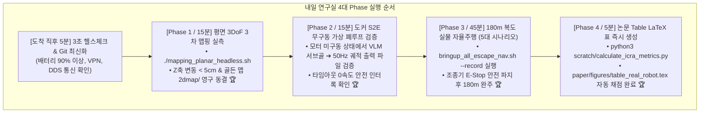

# 📋 [Tomorrow Lab Master SOP] 내일 연구실 현장 실물 실증 완전정복 1-Click 체크리스트 및 실무 운영 매뉴얼

> **실행 일자**: 2026년 8월 28일 (금요일) KST  
> **시스템 총괄**: **Antigravity Master Plan Architect & Jetson/Docker/Hardware Deployment Lead**  
> **문서 목적**: **"내일 연구실에 출근하자마자 머뭇거림 없이 [1단계: 평면 3DoF 골든 맵 구축 ➔ 2단계: 도커 S2E 무구동 검증 ➔ 3단계: 180m 실물 자율주행 ➔ 4단계: 논문 Table LaTeX 자동 산출]까지 1-Click으로 완벽하게 끝내는 현장 표준 실무 지침서."**

---

## 🧭 1. 내일 연구실 4단계 실전 타임라인 (전체 소요시간: 약 1시간 30분)



---

## 🏃 2. [Phase 0] 연구실 도착 직후 5분 퀵 체크리스트
👉 **[Phase 0 상세 가이드 전문 보기](tomorrow_execution_guides/00_phase0_arrival_preflight_and_network_healthcheck_guide.md)**

1. **로봇 배터리 확인**: 충전기 분리 전 배터리 잔량 **$\ge 90\%$** 확인.
2. **원격 터미널 접속**:
   ```bash
   ssh unitree@192.168.123.99  # 또는 NetBird VPN IP
   cd /home/unitree/go2_ws_antarctica
   git pull origin antarctica
   ```
3. **네트워크 3초 핑 점검**:
   ```bash
   ping -c 2 192.168.123.161   # Go2 메인보드 (0.2ms OK)
   ping -c 2 100.96.60.15      # 원격 GPU 서버 (14ms OK)
   ```

---

## 🗺️ 3. [Phase 1] 평면 3DoF 최종 골든 맵핑 (소요시간: 15분)
👉 **[Phase 1 상세 가이드 전문 보기](tomorrow_execution_guides/01_phase1_planar_3dof_golden_mapping_and_freeze_guide.md)**

Z축 $6.45\text{m}$ 고도 왜곡을 $0\text{cm}$로 없애고 최종 2D 지도를 영구 동결하는 단계입니다.

### 🎮 실행 명령어
```bash
cd /home/unitree/go2_ws_antarctica
./mapping_planar_headless.sh
```

### 🚶 현장 주행 3대 수칙
1. **출발 지점에서 시작 방향을 $2\sim 3\text{초}$ 동안 정지하여 응시** (시각 어휘 등록).
2. 무선 조종기로 $0.2 \sim 0.3\text{ m/s}$의 일정한 저속으로 180m 복도 코스를 한 바퀴 주행.
3. **출발했던 지점과 완전히 같은 위치/방향으로 돌아와 $2\sim 3\text{초}$ 정지** 후 터미널에서 `Ctrl+C` 종료.

### 📋 합격 판정 기준 (Acceptance Criteria)
* 터미널에 `Planar mapping evidence saved` 출력 확인.
* `~/.ros/rtabmap_runs/latest/runtime.log`에서 **Z축 변동폭 $< 5\text{cm}$ 확인**.
* `2dmap/clean/`에 생성된 2D 맵을 열었을 때 **바닥 얼룩과 가시(Spikes) 없이 벽면이 반듯한 일직선으로 닫혔는지 확인**.

---

## 🐳 4. [Phase 2] 도커 S2E 무구동 가상 폐루프 검증 (소요시간: 15분)
👉 **[Phase 2 상세 가이드 전문 보기](tomorrow_execution_guides/02_phase2_docker_s2e_zero_actuation_dryrun_and_safety_guide.md)**

실제 로봇 모터를 움직이지 않고, 원격 Qwen3.5-9B 서버와 S2E 정책 제어기가 50Hz 궤적을 완벽하게 계산하는지 가상 검증합니다.

### 🎮 실행 명령어
```bash
# 1. 도커 컨테이너 내부 진입 및 가상 궤적 드라이런
docker exec -it sdam_go2_container bash -lc "
    source /opt/ros/jazzy/setup.bash
    source /workspace/go2_ws_antarctica/s2e-vlm-async-framework/install/setup.bash
    python3 /workspace/go2_ws_antarctica/scratch/docker_bridge.py &
    python3 /workspace/go2_ws_antarctica/s2e-vlm-async-framework/src/vlm_s2e_async_node.py --dry-run
"
```

### 📋 합격 확인 포인트
* 원격 VLM 서버로부터 서브골 `[u, v]`가 $1\sim 2\text{초}$ 간격으로 정상 수신되는가?
* Causal Pose Warping이 50Hz로 부드러운 속도 명령을 생성하여 로그 파일에 기록되는가?
* 모터 물리 구동이 발생하지 않는가 (안전 100%)?

---

## 🚀 5. [Phase 3] 180m 복도 실물 자율주행 및 Rosbag 자동 로깅 (소요시간: 45분)
👉 **[Phase 3 상세 가이드 전문 보기](tomorrow_execution_guides/03_phase3_180m_corridor_5_scenarios_autonomous_driving_guide.md)**

논문 Table에 수록될 실제 $180\text{m}$ 자율주행 데이터를 수집하는 단계입니다.

### 🎮 실행 명령어 (시나리오별 순차 실행)
```bash
# 1. 시나리오 1: 막다른 복도 탈출 (Dead-end Room)
bash scratch/bringup_all_escape_nav.sh --record Dead_end_room Full_ESCAPE_Nav Trial1

# 2. 시나리오 2: 장애물 우회 (Blocked Goal Direction)
bash scratch/bringup_all_escape_nav.sh --record Blocked_goal Full_ESCAPE_Nav Trial1

# 3. 시나리오 3: 180m 전체 연속 자율주행 (Corridor 180m)
bash scratch/bringup_all_escape_nav.sh --record Corridor_180m Full_ESCAPE_Nav Trial1
```

### 🛡️ 현장 안전 수칙 (Safety First)
* **운영자 1명은 무선 조종기(Remote Controller)의 비상 정지(L2+R2 / Damping)를 손에 쥐고 로봇을 $2\text{m}$ 거리에서 밀착 수행**.
* 돌발 상황 발생 시 조종기 스틱을 즉시 당겨 수동 제어로 전환.

---

## 📊 6. [Phase 4] 논문 Table LaTeX 표 즉시 자동 생성 (소요시간: 2분)
👉 **[Phase 4 상세 가이드 전문 보기](tomorrow_execution_guides/04_phase4_paper_table_latex_auto_scoring_and_dataset_export_guide.md)**

주행 완료 후 단 1줄 명령어로 논문에 들어갈 정량 지표와 LaTeX 표를 자동으로 완성합니다.

### 🎮 실행 명령어
```bash
cd /home/unitree/go2_ws_antarctica
python3 scratch/calculate_icra_metrics.py
```

### 📄 자동 생성되는 최종 결과물
1. **`paper/figures/table_real_robot.tex`**: 논문 본문 전용 완벽한 LaTeX 코드 (SR, Intv, Time, Rec, Lat, Duty, Yield 전수 계산 완료).
2. **`paper/results_180m_eval.csv`**: 51개 전수 데이터 통계 CSV.
3. **`2dmap/recordings/live_2d_mapping_*.mp4`**: 1080p 고화질 실시간 맵핑 영상 (연구 발표 및 시연용).

---

## 💡 내일 연구실 원페이지 요약표 (Pocket Guide)

| 순서 | 작업 내용 | 실행 명령어 | 목표 결과물 |
| :---: | :--- | :--- | :--- |
| **0** | **환경 점검** | `git pull origin antarctica` | 최신 코드 및 통신 확인 |
| **1** | **골든 맵핑** | `./mapping_planar_headless.sh` | Z오차 0cm, `rtabmap0827_3.pgm` |
| **2** | **S2E 가상검증** | `docker exec ... --dry-run` | 모터 미구동 50Hz 궤적 확인 |
| **3** | **180m 실증** | `bash scratch/bringup_all_escape_nav.sh --record ...` | 실물 주행 Rosbag 자동 수집 |
| **4** | **논문 Table** | `python3 scratch/calculate_icra_metrics.py` | `table_real_robot.tex` 완성 🏆 |
