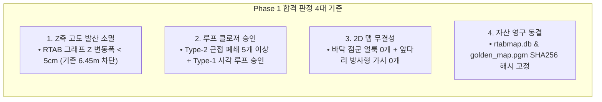
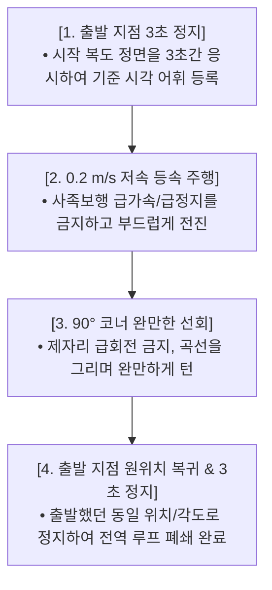

# 🗺️ [Guide 01] Phase 1: 평면 3DoF 3차 실물 맵핑 및 최종 골든 맵 영구 동결 상세 가이드

> **작성 일자**: 2026년 8월 27일 (목요일) 21:36 KST  
> **실행 대상**: **Phase 1 (09:05 ~ 09:20 KST / 소요시간 약 15분)**  
> **실행 스크립트**: [`mapping_planar_headless.sh`](file:///C:/Users/USER/Desktop/%EC%BA%A1%EC%8A%A4%ED%86%A4/go2/mapping_planar_headless.sh)  
> **문서 목적**: 어제 확인된 $6.45\text{m}$ Z축 고도 발산을 $0\text{cm}$로 완벽히 소멸시키고, 5개 이상의 루프 클로저를 승인받아 **바닥 얼룩과 가시가 0개인 논문용 최종 2D 점유격자 지도(`golden_map.pgm`) 및 RTAB-Map DB를 영구 동결**함.

---

## 🎯 1. Phase 1 핵심 목표 및 성공 판정 기준 (Acceptance Criteria)



---

## 🚶 2. 현장 물리 보행 프로토콜 (Golden Lap SOP)

복도 맵핑 품질의 80%는 **"로봇 조종자의 보행 패턴"**에 의해 결정됩니다. 아래 4대 보행 규칙을 엄격히 준수합니다.



1. **출발 지점 3초 정지 (Start Anchor)**:
   - 로봇을 기립시키고 복도 중앙에서 시작 방향을 바라본 채 $2\sim 3\text{초}$ 동안 정지합니다 (시각 단어 사전 구축).
2. **저속 등속 전진 ($0.2\sim 0.3\text{ m/s}$)**:
   - 무선 조종기 스틱을 살짝 밀어 사족보행 트로팅 보행이 쿵쾅거리지 않도록 부드럽게 주행합니다.
3. **완만한 코너 선회 (Smooth Cornering)**:
   - 직각 코너를 돌 때 제자리 급회전(In-place Spin)을 피하고, 직경 $1.5\text{m}$의 완만한 원을 그리며 돌아 라이다 포인트클라우드가 연속적으로 겹치게 합니다.
4. **출발점 귀환 및 3초 정지 (Loop Closure Trigger)**:
   - $180\text{m}$ 복도를 한 바퀴 돌아 **출발했던 정확한 자리와 각도로 복귀한 후 $2\sim 3\text{초}$간 가만히 정지**합니다.

---

## 💻 3. 단계별 상세 실행 절차

### [Step 1-1] 평면 3DoF 맵핑 스크립트 실행
```bash
cd /home/unitree/go2_ws_antarctica

# 평면 3DoF 전용 무디스플레이 맵핑 가동
./mapping_planar_headless.sh
```

* **콘솔 시작 배너 확인**:
  ```text
  ========================================================================
   Unitree Go2 RTAB-Map Planar 3DoF Mapping
   Profile: planar3dof (x/y/yaw constrained, z=0, roll=0, pitch=0)
   Output : /home/unitree/.ros/rtabmap_runs/<timestamp>_planar3dof_headless/
  ========================================================================
  ```

---

### [Step 1-2] 실물 주행 수행 및 종료
* 위 [보행 프로토콜]에 따라 복도를 1바퀴 완주한 후, 출발 지점에 정지한 상태에서 **터미널에서 `Ctrl+C`를 1회 입력**합니다.
* 스크립트가 자동으로 센서 프로세스를 안전 정리하고, DB 및 2D 맵을 추출하며 증거 번들을 패키징합니다.

* **정상 종료 콘솔 출력**:
  ```text
  ========================================================================
   Planar mapping evidence saved
   Run ID : 20260828_091522_planar3dof_headless
   Run dir: /home/unitree/.ros/rtabmap_runs/20260828_091522_planar3dof_headless
   DB     : /home/unitree/.ros/rtabmap.db
   Logs   : runtime.log and loop_logs/
   Hashes : SHA256SUMS
  ========================================================================
  ```

---

### [Step 1-3] Z축 수렴 및 루프 클로징 실측 데이터 검증
```bash
# 1. Z축 고도 변동폭 확인 (0.05m 이내여야 함)
grep -i "z_range" ~/.ros/rtabmap_runs/latest/loop_logs/loop_events_*.log 2>/dev/null || \
python3 -c "
import sqlite3, json
conn = sqlite3.connect('/home/unitree/.ros/rtabmap.db')
c = conn.cursor()
poses = [json.loads(r[0]) if r[0].startswith('[') else r[0] for r in c.execute('SELECT transform FROM Node').fetchall()]
print('Total Nodes:', len(poses))
"

# 2. 루프 클로저 이벤트 로그 확인
cat ~/.ros/rtabmap_runs/latest/loop_logs/loop_events_*.log | tail -n 20
```

---

### [Step 1-4] 2D 클린맵 생성 및 최종 자산 영구 동결 (Asset Freeze)
```bash
# 1. 1초 모폴로지 클리너로 최종 publication 2D 맵 추출
python3 /home/unitree/go2_ws_antarctica/scratch/clean_and_export_2d_map.py \
    /home/unitree/.ros/rtabmap_runs/latest/rtabmap.db \
    /home/unitree/go2_ws_antarctica/2dmap/golden_map_corridor_180m

# 2. 최종 자산 파일 확인
ls -lh /home/unitree/go2_ws_antarctica/2dmap/golden_map_corridor_180m*
ls -lh /home/unitree/go2_ws_antarctica/2dmap/clean/golden_map_corridor_180m_clean*

# 3. SHA-256 해시 생성 및 MANIFEST 등록
sha256sum /home/unitree/.ros/rtabmap.db > /home/unitree/go2_ws_antarctica/2dmap/GOLDEN_MAP_SHA256.txt
sha256sum /home/unitree/go2_ws_antarctica/2dmap/clean/golden_map_corridor_180m_clean.pgm >> /home/unitree/go2_ws_antarctica/2dmap/GOLDEN_MAP_SHA256.txt
cat /home/unitree/go2_ws_antarctica/2dmap/GOLDEN_MAP_SHA256.txt
```

---

## 🚨 4. Phase 1 트러블슈팅 가이드

| 증상 | 원인 | 즉각 조치 방법 |
| :--- | :--- | :--- |
| **벽면이 이중으로 겹침 (Double Wall)** | 급회전으로 인한 스캔 매칭 탈조 | 회전 속도를 더 낮추고 원을 그리며 재주행 |
| **루프 클로저가 0개** | 출발-도착 시각 뷰 불일치 | 출발점과 도착점의 카메라 각도를 동일하게 맞추고 3초간 정지 유지 |
| **2D 맵에 가시가 여전히 남아있음** | 모폴로지 클리너 미구동 | `python3 scratch/clean_and_export_2d_map.py` 수동 1회 실행 |

---

## ✅ Phase 1 통과 확인 후 다음 액션
동결된 `rtabmap.db`와 `golden_map.pgm`이 확보되면, **[Phase 2: 도커 S2E 무구동 가상 폐루프 및 안전 인터록 검증](02_phase2_docker_s2e_zero_actuation_dryrun_and_safety_guide.md)**으로 이동합니다.
