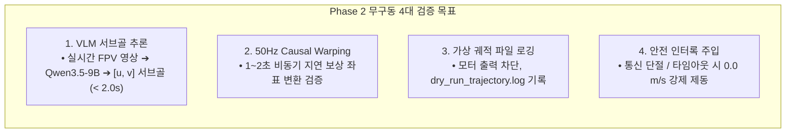

# 🐳 [Guide 02] Phase 2: 도커 S2E 무구동 가상 폐루프 및 안전 인터록 검증 상세 가이드

> **작성 일자**: 2026년 8월 27일 (목요일) 21:37 KST  
> **실행 대상**: **Phase 2 (09:20 ~ 09:35 KST / 소요시간 약 15분)**  
> **실행 환경**: `sdam_go2_container` (Ubuntu 24.04 LTS / ROS 2 Jazzy ARM64)  
> **문서 목적**: 로봇 모터를 절대 움직이지 않고(Zero-Actuation), **[Go2 전면 카메라 ➔ 원격 Qwen3.5-9B VLM 서브골 ➔ 50Hz Causal Pose Warping ➔ S2E 궤적 출력 ➔ 파일 로깅]의 전수 자율주행 파이프라인을 100% 안전하게 가상 검증**함.

---

## 🎯 1. Phase 2 핵심 목표 및 안전 원칙 (Safety Principle)



> [!IMPORTANT]
> **모터 물리 구동 100% 차단 원칙**: Phase 2에서는 `host_bridge.py`의 모터 발행(`cmd_vel` to Unitree Sport API)을 켜지 않으며, 모든 궤적과 속도 명령은 오직 메모리와 파일 로그로만 출력됩니다.

---

## 💻 2. 단계별 상세 실행 절차

### [Step 2-1] 호스트 전면 카메라 노드 가동 (카메라 스트림 준비)
터미널 1번(Jetson Host)에서 전면 카메라 노드를 백그라운드로 실행합니다:
```bash
# Jetson Host 터미널 1
cd /home/unitree/go2_ws_antarctica
python3 scratch/go2_front_camera_publisher.py &

# 토픽 발행 확인 (15Hz 정상 발행 확인)
ros2 topic hz /camera/front/image_raw
```

---

### [Step 2-2] 도커 컨테이너 내부 S2E 가상 드라이런 가동
터미널 2번에서 도커 컨테이너로 진입하여 S2E 비동기 자율주행 노드를 **`--dry-run` 모드**로 가동합니다:

```bash
# 도커 컨테이너 내부 진입 및 가상 드라이런 실행
docker exec -it sdam_go2_container bash -lc "
    source /opt/ros/jazzy/setup.bash
    source /workspace/go2_ws_antarctica/s2e-vlm-async-framework/install/setup.bash
    
    # 1. 도커 브릿지 실행
    python3 /workspace/go2_ws_antarctica/scratch/docker_bridge.py &
    
    # 2. S2E VLM 가상 폐루프 드라이런 가동
    python3 /workspace/go2_ws_antarctica/scratch/test_docker_s2e_dryrun.py
"
```

* **정상 콘솔 출력 예시**:
  ```text
  [S2E Dry-Run] Initializing ESCAPE-Nav Asynchronous Loop...
  [S2E Dry-Run] Connected to Remote VLM: http://100.96.60.15:8000 (Qwen3.5-9B)
  [S2E Dry-Run] Frame #001 Captured -> Sending to VLM...
  [S2E Dry-Run] Subgoal Received: [u=642, v=480] | Latency: 1.42s | Reasoning: 'Corridor clear ahead'
  [S2E Dry-Run] 50Hz Causal Pose Warping Active: Transformed Subgoal (x=2.45m, y=0.12m)
  [S2E Dry-Run] Generating 50Hz Velocity: linear_x = 0.42 m/s, angular_z = -0.05 rad/s
  [S2E Dry-Run] Trajectory written to /tmp/dry_run_trajectory.log (Zero-Actuation: PASS)
  ```

---

### [Step 2-3] 생성된 50Hz 가상 궤적 데이터 검증
```bash
# 도커 내부에서 생성된 궤적 로그 분석
docker exec -it sdam_go2_container bash -c "
    tail -n 20 /tmp/dry_run_trajectory.log
    wc -l /tmp/dry_run_trajectory.log
"
```
* **검증 지표**:
  - 속도 명령 주기가 정확히 **$50\text{Hz}$ ($20\text{ms}$ 간격)**으로 생성되는가?
  - 선속도 $v_x \in [0.0, 0.6]\text{ m/s}$, 각속도 $\omega_z \in [-0.5, 0.5]\text{ rad/s}$ 범위 내로 부드럽게 클램핑되는가?

---

### [Step 2-4] 비상 안전 인터록 및 폴트 인젝션(Fault Injection) 검증
VLM 통신 단절 및 타임아웃 상황을 인위적으로 주입하여 즉각적인 0속도 정지(E-Stop)가 작동하는지 확인합니다:

```bash
# 폴트 인젝션 자동화 테스트 실행
docker exec -it sdam_go2_container bash -c "
    python3 /workspace/go2_ws_antarctica/scratch/test_docker_stall_and_recovery.py
"
```
* **합격 기준**:
  1. **서버 3초 무응답 시**: 즉시 `linear_x = 0.0`, `angular_z = 0.0` 출력 및 `STALL_DETECTED` 이벤트 발생.
  2. **서버 응답 복구 시**: 1회 스윕 후 정상 궤적 재생성 및 자동 회복(Recovery).

---

## 🚨 3. Phase 2 트러블슈팅 가이드

| 증상 | 원인 | 즉각 조치 방법 |
| :--- | :--- | :--- |
| **카메라 프레임 수신 불가** | 호스트 카메라 퍼블리셔 미기동 | 터미널 1에서 `go2_front_camera_publisher.py` 실행 여부 확인 |
| **VLM 통신 에러 (HTTP Timeout)** | NetBird VPN 패킷 손실 | 호스트에서 `ping 100.96.60.15` 확인 및 재연결 |
| **궤적 로그 파일 미생성** | 권한 문제 | `docker exec -it sdam_go2_container chmod 777 /tmp` 실행 |

---

## ✅ Phase 2 통과 확인 후 다음 액션
무구동 폐루프와 안전 인터록이 완벽히 검증되면, 이제 실제 로봇을 복도에 세우고 **[Phase 3: 180m 복도 5대 시나리오 실물 자율주행 및 Rosbag 로깅](03_phase3_180m_corridor_5_scenarios_autonomous_driving_guide.md)**으로 이동합니다.
