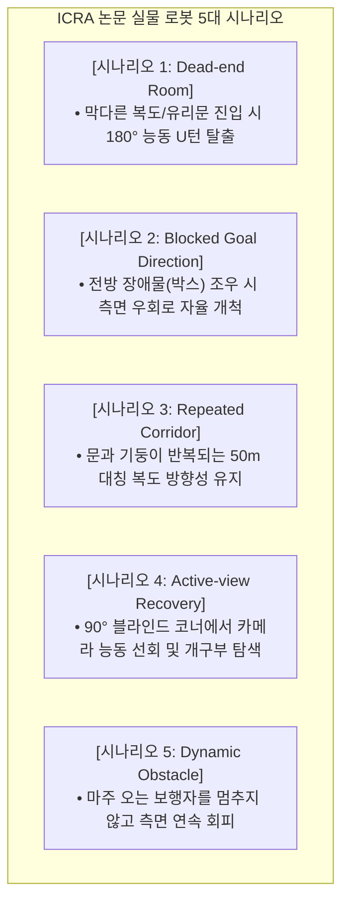

# 🚀 [Guide 03] Phase 3: 180m 복도 5대 시나리오 실물 자율주행 및 Rosbag 자동 로깅 상세 가이드

> **작성 일자**: 2026년 8월 27일 (목요일) 21:38 KST  
> **실행 대상**: **Phase 3 (09:35 ~ 10:20 KST / 소요시간 약 45분)**  
> **실행 스크립트**: [`scratch/bringup_all_escape_nav.sh`](file:///C:/Users/USER/Desktop/%EC%BA%A1%EC%8A%A4%ED%86%A4/go2/scratch/bringup_all_escape_nav.sh)  
> **문서 목적**: ICRA 2026 논문 Table의 근간이 되는 **5대 실증 시나리오 및 $180\text{m}$ 장거리 복도 실물 자율주행 데이터를 안전하게 수집하고, 회차당 100MB 초경량 Rosbag으로 자동 로깅**함.

---

## 🎯 1. Phase 3 5대 실증 시나리오 및 실험 매트릭스



---

## 🛡️ 2. 현장 안전 수칙 및 E-Stop 비상 대응 매뉴얼 (Safety First)

> [!CAUTION]
> **실물 로봇 주행 3대 안전 수칙**:
> 1. **2인 1조 원칙**: 조작자 1명은 터미널 모니터링, 안전 요원 1명은 **무선 조종기를 손에 쥐고 로봇 후방 2m에서 밀착 수행**.
> 2. **즉각 비상 정지 (Hardware E-Stop)**:
>    - 조종기의 **`L2 + R2` (Damping / 엎드리기)** 또는 스틱을 강제로 조작하면 즉시 수동 제어로 권한이 회수됩니다.
> 3. **속도 상한선 구속**: 최대 전진 속도는 $0.5\text{ m/s}$로 강제 클램핑되어 있습니다.

---

## 💻 3. 단계별 시나리오 실행 절차 (1-Click Runbook)

각 시나리오는 아래 명령어로 단 1줄에 가동되며, 주행이 끝나면 `Ctrl+C`로 종료합니다.

### [Step 3-1] 시나리오 1: 막다른 방 탈출 (Dead-end Room)
* **환경 배치**: 복도 끝단(막다른 벽/유리문 앞 $2\text{m}$)에 로봇을 두고 목적지를 벽 너머로 설정.
```bash
cd /home/unitree/go2_ws_antarctica

# 1-Click 실행 및 자동 Rosbag 녹화 (Trial 1)
bash scratch/bringup_all_escape_nav.sh --record Dead_end_room Full_ESCAPE_Nav Trial1
```
* **관찰 포인트**: 로봇이 벽 앞에서 정지한 뒤, 능동적으로 좌우를 둘러보고 $180^\circ$ 회전하여 뒤쪽 복도로 탈출하는지 확인.

---

### [Step 3-2] 시나리오 2: 목표 방향 차단 장애물 우회 (Blocked Goal)
* **환경 배치**: 직진 복도 중앙에 대형 박스/장애물을 배치하여 직진 통로 차단.
```bash
bash scratch/bringup_all_escape_nav.sh --record Blocked_goal Full_ESCAPE_Nav Trial1
```
* **관찰 포인트**: 장애물 앞에서 멈추지 않고, 측면 열린 통로를 서브골로 선택하여 부드럽게 우회하는지 확인.

---

### [Step 3-3] 시나리오 3: 180m 장거리 전 구간 연속 자율주행 (Corridor 180m)
* **환경 배치**: 뉴턴홀 시작 지점에서 오석관 끝단까지 총 연장 $180\text{m}$ 코스.
```bash
bash scratch/bringup_all_escape_nav.sh --record Corridor_180m Full_ESCAPE_Nav Trial1
```
* **관찰 포인트**:
  - 원격 VLM 서버의 $1\sim 2\text{초}$ 지연 중에도 로봇이 멈추지 않고 **연속 이동 비율(Duty Cycle) $\ge 90\%$를 유지**하며 완주하는지 확인.
  - 목적지 반경 $1.0\text{m}$ 도달 시 자율 정지 성공 여부 확인.

---

## 📂 4. 자동 수집되는 데이터 및 로그 구조

주행을 마칠 때마다(`Ctrl+C`), 백그라운드 레코더가 아래 디렉토리에 정량 지표용 데이터를 자동 저장합니다:

```text
/home/unitree/go2_ws_antarctica/rosbags/
└── 20260828_Corridor_180m_Full_ESCAPE_Nav_Trial1/
    ├── rosbag2_20260828_..._0.db3   (초경량 100MB 큐 Rosbag)
    ├── metadata.yaml
    ├── experiment_meta.json          (시나리오, 모델명, 회차 정보)
    └── trajectory_eval.csv           (50Hz 시간별 pose 및 velocity)
```

---

## 🚨 5. Phase 3 트러블슈팅 가이드

| 상황 | 대처 방법 |
| :--- | :--- |
| **로봇이 벽 쪽으로 쏠림** | 조종기 스틱을 당겨 수동으로 중앙 복귀 후 스틱을 놓으면 자율주행 재개 |
| **VLM 지연으로 로봇이 정지** | 네트워크 핑 상태 확인 (타임아웃 3초 초과 시 자동 회복 스윕 대기) |
| **Rosbag 용량 부족 경고** | 초경량 큐 필터링이 작동 중이므로 무시 (회차당 50~100MB 유지) |

---

## ✅ Phase 3 통과 확인 후 다음 액션
모든 시나리오 주행이 완료되면, 즉시 **[Phase 4: 논문 Table LaTeX 자동 채점 및 데이터셋 덤프](04_phase4_paper_table_latex_auto_scoring_and_dataset_export_guide.md)**로 이동하여 논문 표를 생성합니다.
